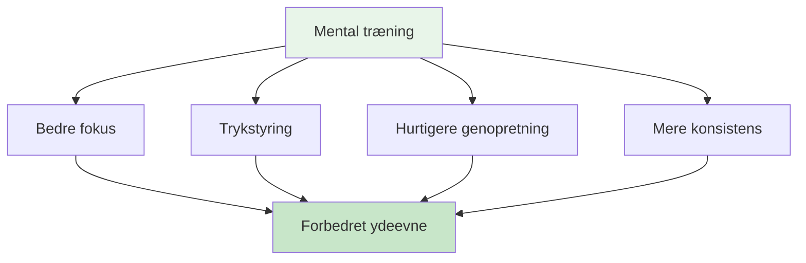

# Mental rejse for begyndere

## Velkommen til din mentale spilrejse

Uanset om du er en spiller, der ønsker at forbedre dit mentale spil, eller en træner, der ønsker at introducere mental træning til dit hold, vil denne guide hjælpe dig med at tage de første skridt ind i sportspsykologiens verden inden for petanque.

::: tip Hvem er dette til?
- **Spillere**, der ønsker at forstå det mentale spil
- **Trænere** introducerer mental træning til deres hold
- **Klubber** arrangerer workshops i mentale spil
- **Enhver** nysgerrig på psykologien bag petanque
:::

## Hurtig adgang

| Ressource | Formål | Adgang |
|----------|---------|--------|
| **Kom godt i gang** | Introduktion til mentale spilkoncepter | [Læs nedenfor](#hvorfor-mental-træning-er-vigtigt) |
| **Sessionsguide** | Komplet 2-3 timers workshopguide for facilitatorer | [Se guide](/da/mental-rejse/sessionsguide) |
| **Materialer** | Deltagervejledninger, slides og arbejdsark | [Se materialer](/da/guides/mental-journey/materialer) |
| **Relaterede vejledninger** | Avancerede formater | [Workshop](/da/guides/workshop/) • [Træningslejr](/da/guides/training-camp/) |

## Hvorfor mental træning er vigtig

På alle niveauer af petanque påvirker din hjerne din præstation. Men de fleste spillere fokuserer 90% på teknik og kun 10% på mentale færdigheder. Denne guide hjælper dig med at finde balance i den ligning.

## Hvad du vil lære

### For spillere

**Kernekoncepter:**
1. **Zonen** - Forståelse af flowtilstande og hvordan man får adgang til dem
2. **Den indre kritiker** - At genkende og håndtere negativ selvsnak
3. **Presrespons** - Hvorfor du spiller anderledes i konkurrencer
4. **Skiftet** - Fra at tænke til at handle

**Praktiske færdigheder:**
- Simpel rutine før indtagelse
- 3-åndedræts nulstillingsteknik
- Protokol til fejlretning
- Fokusankre til konkurrence

### For trænere/guider

**Sådan faciliterer du:**
1. Skaber psykologisk tryghed
2. Ledelse af gruppediskussioner
3. Forbinder teori med praksis
4. Håndtering af forskellige personligheder

**Sessionsstruktur:**
- Workshopformat på 2-3 timer
- Diskussionsspørgsmål og øvelser
- Materialer til download
- Opfølgningsaktiviteter

## Kom godt i gang

### Mulighed 1: Selvstudium (for spillere)

**Uge 1: Forståelse af det grundlæggende**
1. Læs modulet [Zonen](/da/education/mental-game/the-zone/)
2. Prøv 3-åndedræts-nulstillingsteknikken
3. Læg mærke til, hvornår du er i &quot;teknisk tilstand&quot; versus &quot;flowtilstand&quot;

**Uge 2: Opbygning af bevidsthed**
1. Læs modulet [Mental styrke](/da/education/mental-game/mental-strength/)
2. Identificér dine indre kritikmønstre
3. Øv neutral observation efter fejl

**Uge 3: Skab struktur**
1. Læs [Mindfulness](/da/education/mental-game/mindfulness/) modulet
2. Start med 5-minutters daglig træning
3. Udvikl en simpel rutine før indtagelse

**Uge 4: Integration**
1. Brug din rutine i praksis
2. Spor mental præstation i [Dagbogsskabelon](/da/guides/templates/diary-template)
3. Sæt mentale spilmål ved hjælp af [Målskabelon](/da/guides/templates/goal-template)

### Mulighed 2: Gruppeworkshop (for trænere)

**Udfør en 2-3 timers session:**

Brug vores omfattende [Sessionsguide](/da/guides/mental-journey/sessionsguide), som inkluderer:
- Komplet sessionsstruktur
- Diskussionsprompter
- Gruppeøvelser
- Materialer til download

**Hvad du skal bruge:**
- 6-12 deltagere
- Stille rum med siddepladser i en cirkel
- Whiteboard eller flipchart
- Lærred eller projektor til deling af materialer
- 2-3 timers uafbrudt tid

## De tre søjler i mental træning

### 1. Bevidsthed
**Hvad det er:** At bemærke dine tanker, følelser og mønstre

**Hvorfor det er vigtigt:** Du kan ikke ændre det, du ikke bemærker

**Sådan udvikler du:**
- Daglig mindfulness-øvelse (5-10 minutter)
- Refleksion efter kampen
- At føre en træningsdagbog

### 2. Accept
**Hvad det er:** At tillade tanker og følelser uden at dømme

**Hvorfor det er vigtigt:** At bekæmpe din indre oplevelse skaber spændinger

**Sådan udvikler du:**
- Neutral observationspraksis
- Indre coach vs. indre kritiker arbejde
- At give slip på perfektionismen

### 3. Handling
**Hvad det er:** Valg af nyttige svar på trods af vanskelige tanker

**Hvorfor det er vigtigt:** Mental træning handler om at præstere godt på trods af nervøsitet

**Sådan udvikler du:**
- Rutiner før optagelse
- Nulstil protokoller
- Tryksimulering i træning

## Almindelige spørgsmål

### &quot;Jeg er ikke god nok til at bekymre mig om mental træning&quot;
Mental træning hjælper på alle niveauer. Faktisk opbygger man bedre vaner ved at starte tidligt. Man behøver ikke at være en elite for at drage fordel af at forstå sit sind.

### &quot;Er det ikke bare at &#39;tænke positivt&#39;?&quot;
Nej. Mental træning handler om at præstere godt på trods af negative tanker, ikke om at eliminere dem. Det er praktiske færdigheder, ikke positiv tænkning.

### &quot;Hvor lang tid tager det at se resultater?&quot;
Nogle teknikker (som 3-åndedræts-nulstillingen) virker med det samme. Dyberegående ændringer (som vedvarende flowtilstande) tager 2-3 måneders øvelse.

### &quot;Har jeg brug for en sportspsykolog?&quot;
Ikke nødvendigvis. Denne guide giver praktiske værktøjer, du kan bruge med det samme. Professionel hjælp er værdifuld ved dyberegående problemer, men de fleste spillere kan starte på egen hånd.

### &quot;Vil dette hjælpe min teknik?&quot;
Mental træning erstatter ikke teknisk øvelse. Men det hjælper dig med at få adgang til din teknik konsekvent, især under pres.

## Tilgængelige ressourcer

### For spillere
- [Uddannelsesmoduler](/da/education/) - 8 omfattende guider
- [Målskabelon](/da/guides/templates/goal-template) - Strukturer din udvikling
- [Skabelon til dagbog](/da/guides/templates/diary-template) - Følg dine fremskridt
- [Casestudier](/da/articles/) - Virkelige eksempler

### For trænere/guider
- [Sessionsguide](/da/guides/mental-journey/sessionsguide) - Komplet 2-3 timers workshop
- [Materialer til undervisere](/da/guides/mental-journey/materialer) - Digitale guider og slides
- [Workshopguide](/da/guides/workshop/) - Avanceret 3-4 timers format
- [Træningslejrguide](/da/guides/training-camp/) - Weekendprogram

## Næste trin

### For individuelle spillere
1. **Start med bevidsthed** - Læs [Zonen](/da/education/mental-game/the-zone/)
2. **Prøv én teknik** - Brug 3-åndedræts-nulstillingen i denne uge
3. **Spor din oplevelse** - Bemærk, hvilke ændringer der sker
4. **Udbyg gradvist** - Tilføj én ny færdighed om ugen

### For trænere/grupper
1. **Gennemgå sessionsguiden** - Forstå strukturen
2. **Download materialer** - Få udleverede ark og slides
3. **Planlæg en session** - Blok 2-3 timer
4. **Forbered dig** - Læs facilitatorens noter
5. **Afhold workshoppen** - Følg guiden

## Støtte

**Spørgsmål om at komme i gang?**
- E-mail: [patrik.wiik@gmail.com](mailto:patrik.wiik@gmail.com)
- Se [Casestudier](/da/articles/) for eksempler
- Deltag i diskussionerne i din klub

---

::: tip Klar til at begynde?
**Spillere:** Start med modulet [Zonen](/da/education/mental-game/the-zone/)

**Trænere:** Gå til [Sessionsguide](/da/guides/mental-journey/sessionsguide)

**Download materialer:** Besøg [Facilitatormaterialer](/da/guides/mental-journey/materialer)
:::

