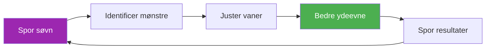

# Skabelon til søvntracker

> &quot;Den spiller, der sov bedre, vinder oftest.&quot;

Spor dine søvnmønstre og korreler dem med præstation for at optimere restitutionen.

::: tip Hvorfor spore søvn?
**Søvn er det førende værktøj til restitution.** Eliteatleter, der regelmæssigt måler søvn, rapporterer bedre energi, hurtigere reaktionstider og forbedret beslutningstagning under pres.
:::

---

## Hurtig daglig indtastning

### Kopier dette for hver dag

---

**Dato:** ________

| **Sengetid:** ________ | **Opvågningstidspunkt:** ________ |
**Søvn i alt:** ________ timer

**Søvnkvalitet (1-10):** _____

**Faktorer der påvirker søvn:**
- [ ] Koffein efter kl. 14
- [ ] Alkohol
- [ ] Skærmtid før sengetid
- [ ] Stress/bekymring
- [ ] Støj/lysforstyrrelser
- [ ] Temperaturproblemer
- [ ] Sent måltid
- [ ] Andet: ________

**Morgenenergi (1-10):** _____

**Noter:**

---

## Ugentlig søvnoversigt

### Kopier dette hver uge

---

**Uge med:** ________

| Dag | Sengetid | Vågne | Timer | Kvalitet | Energi | Noter |
|-----|---------|------|-------|---------|--------|-------|
| man | /10 | /10 |
| Tirsdag | /10 | /10 |
| Ons | /10 | /10 |
| Torsdag | /10 | /10 |
| Fre | /10 | /10 |
| Lør | /10 | /10 |
| Sol | /10 | /10 |

| **Ugentligt gennemsnit:** _____ timer | Kvalitet: _____/10 | Energi: _____/10 |

**Bedste aften:** ________ Hvorfor? ________

**Værste nat:** ________ Hvorfor? ________

**Mønster bemærket:**

---

## Søvnprotokol før konkurrence

### 3 dage før konkurrencen

| Nat | Mål for sengetid | Faktisk | Timer | Kvalitet | Noter |
|-------|----------------|--------|-------|---------|-------|
| -3 dage |
| -2 dage |
| -1 dag |

**Energi på konkurrencedagen (1-10):** _____

**Ydeevnekorrelation:**
- Påvirkede søvn mit spil? Ja / Nej / Måske
- Hvordan?

---

## Tjekliste for søvnmiljø

Bedøm dit søvnmiljø:

| Faktor | Score (1-10) | Forbedring nødvendig? |
|--------|--------------|---------------------|
| **Mørke** |
| **Temperatur** (16-19°C ideelt) |
| **Støjniveau** |
| **Madraskomfort** |
| **Puderstøtte** |
| **Luftkvalitet** |
| **Telefon ud af værelset** |

---

## Søvnhygiejnevaner

Spor hvilke vaner du følger:

### Aftenrutine (2 timer før sengetid)

- [ ] Ingen koffein efter kl. 14
- [ ] Ingen alkohol (eller grænse til 1 drink, 3+ timer før sengetid)
- [ ] Let aftensmad, ikke for sent
- [ ] Dæmpede lys i hjemmet
- [ ] Ingen intens træning
- [ ] Skærmudgangsforbud (1 time før sengetid)
- [ ] Afslapningsaktivitet (læsning, strækøvelser, vejrtrækning)

### Soveværelsesregler

- [ ] Stuetemperatur 16-19°C
- [ ] Fuldstændig mørke (eller sovemaske)
- [ ] Telefon på lydløs, med forsiden nedad (eller uden for rummet)
- [ ] Konsekvent sengetid (±30 min.)
- [ ] Seng kun til søvn (ikke arbejde/rulning)

**Vaner fulgt i denne uge:** _____/12

---

## Korrelation mellem søvn og præstation

Spor over 4 uger for at se mønstre:

| Uge | Gennemsnitlig søvn | Gennemsnitlig kvalitet | Træningspræstation | Konkurrenceresultat |
|------|-----------|-------------|---------------------|-------------------|
| 1 | timer | /10 | /10 |
| 2 | timer | /10 | /10 |
| 3 | timer | /10 | /10 |
| 4 | timer | /10 | /10 |

**Korrelation opdaget:**

---

## Rejsesøvnprotokol

Til udebanekonkurrencer:

**Før rejsen:**
- [ ] Juster sengetid 30 minutter tidligere/senere for tidszonen
- [ ] Pak det nødvendige søvnudstyr (maske, ørepropper, pude)
- [ ] Book et stille værelse (væk fra elevator/gade)

**Ved destinationen:**
- [ ] Indstil stuetemperaturen med det samme
- [ ] Bloker lyskilder
- [ ] Hold fast i sengetidsrutinen derhjemme
- [ ] Undgå lure &gt;20 minutter efter rejsen

**Noter til næste tur:**

---

---

## Hurtig gevinst: Start i aften

::: info 3-dages udfordringen
Spor din søvn i kun 3 dage. Du vil sandsynligvis opdage et mønster, du ikke vidste eksisterede.
:::

1. **I aften** — Notér din sengetid og eventuelle faktorer
2. **I morgen tidlig** — Bedøm kvalitet og energi med det samme
3. **Gentag i 3 dage** — Se efter mønstre

---

## Relaterede ressourcer

- [Uddannelse i søvn og restitution](/da/uddannelse/søvn/) — Videnskaben bag søvn
- [Konkurrencetjekliste](/da/vejledninger/skabeloner/tjekliste-før-konkurrencen) — Fuld forberedelsesvejledning
- [Træningsdagbog](/da/guides/templates/dagbogsskabelon) — Spor alle aspekter af træningen

