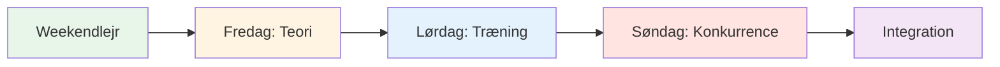
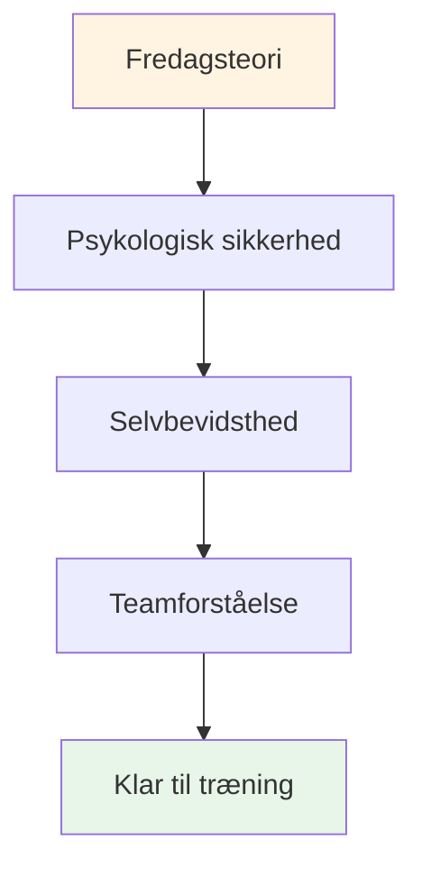

# Træningslejr: Weekend mentalt spil intensivt

## Oversigt

En omfattende weekendtræningslejr (fredag-søndag) for 10-20 spillere, der kombinerer mental spilteori, træning på pisten og konkurrencepræget anvendelse. Dette intensive format skaber transformerende læring gennem integration af alle tre elementer.

::: tip To afsnit i denne vejledning
- **[For deltagere](#for-participants)** - Hvad spillerne vil opleve i weekenden
- **[Til arrangører](#til-arrangører)** - Sådan planlægger og afholder du træningslejren
:::

::: tip Træningslejrens filosofi
**Teori uden praksis er blot information. Øvelse uden teori er blot gentagelse. Konkurrence uden refleksion er blot leg.** Denne weekend integrerer alle tre for transformerende læring.
:::

## Hurtig adgang

| Afsnit | Formål | Adgang |
|---------|---------|--------|
| **For deltagere** | Weekendplan og hvad du skal medbringe | [Se sektion](#for-deltagere) |
| **Til arrangører** | Komplet planlægnings- og faciliteringsguide | [Se sektion](#for-arrangører) |
| **Daglige tidsplaner** | Detaljeret tidsplan og aktiviteter | [Fredag](#fredag-aften-mentalt-spil-grundlag-3-4-timer) • [Lørdag](#lørdag-træning-ansøgning-heldag) • [Søndag](#søndag-konkurrence-integration-heldag) |
| **Relaterede vejledninger** | Andre træningsformater | [Mental Rejse](/da/guider/mental-rejse/) • [Workshop](/da/guider/workshop/) |

---

## For deltagere

### Hvad man kan forvente

Dette er en intensiv weekend, der vil udfordre dig mentalt, fysisk og følelsesmæssigt. Du lærer mentale spilkoncepter, øver dem på pisten og anvender dem i konkurrencer - alt imens du opbygger dybe forbindelser med medspillere.

**Weekendstruktur:**

### Daglig oversigt

#### Fredag aften: Mental Game Foundation (3-4 timer)
**Hvad:** Teorisession om mentale spilkoncepter
**Hvor:** Indendørs mødelokale
**Format:** Cirkeldiskussion og øvelser

**Du vil lære:**
- Zone- og flowtilstande
- Indre kritiker vs. indre coach
- Trykresponsmønstre
- Grundlæggende rutiner før indtagelse

**Aktiviteter:**
- Indtjekning og grundregler
- Petanqueens isbjerg
- Oprettelse af brugermanual
- Frygt i en hat-øvelse

#### Lørdag: Øvelse og ansøgning (heldag)
**Morgen (3 timer):** Struktureret træning med mental fokus
**Eftermiddag (3 timer):** Tryksimuleringsøvelser
**Aften (2 timer):** Refleksion og integration

**Du skal øve dig:**
- Rutiner før skud i rigtige kast
- Nulstil teknikker efter fejl
- Fokusankre under pres
- Protokoller for teamkommunikation

**Format:**
- Øvelser i små grupper (3-4 spillere)
- Videoanalyse af mentale mønstre
- Trykscenarier
- Aftenopfølgningsmøde

#### Søndag: Konkurrence og integration (heldag)
**Morgen (3 timer):** Turneringsspil
**Eftermiddag (2 timer):** Finalerunder
**Aften (1 time):** Afsluttende refleksion

**Du ansøger:**
- Alle mentale værktøjer i konkurrencen
- Teamprotokoller under pres
- Fejlretning i realtid
- Refleksionsproces efter kampen

### Hvad skal man medbringe

**Påkrævet:**
- Dine boules og udstyr
- Behageligt tøj til al slags vejr
- Notesbog og pen
- Åbent sind og villighed til at dele
- Vandflaske

**Valgfri:**
- Træningsdagbog
- Spørgsmål om specifikke mentale udfordringer
- Eksempler på pressede situationer, du står over for

**Ikke nødvendigt:**
- Tekniske coaching-ønsker (dette er mentalt spilfokuseret)
- Ego eller behov for at bevise dig selv
- Andres dom

### Grundregler for weekenden

::: tip Containeren
Alle deltagere er enige om:
1. **Fortrolighed** - Det, der deles, forbliver her
2. **Respekt** - Vis respekt for andres sårbarhed
3. **Deltagelse** - Engager dig fuldt ud i alle aktiviteter
4. **Væksttankegang** - Omfavn ubehag som læring
5. **Støtte** - Hjælp holdkammerater med at anvende koncepter
:::

### Hvad du efterlader med

**Viden:**
- Dyb forståelse af dine mentale mønstre
- Praktiske værktøjer til trykhåndtering
- Holdprotokoller for konkurrence
- Personlig rutine før optagelse

**Færdigheder:**
- Mulighed for at få adgang til flowtilstande
- Teknikker til fejlfinding
- Indre Coach-omformulering
- Fokusankre

**Forbindelse:**
- Dybere bånd med holdkammerater
- Fælles sprog til mentalt spil
- Støttenetværk til fortsat vækst

**Materialer:**
- Udfyldte arbejdsark og øvelser
- Videoanalyse af dine mentale mønstre
- Handlingsplan for de næste 30 dage
- Adgang til alle uddannelsesmoduler

### Typisk tidsplan

**Fredag:**
- 18:00 - Ankomst og indtjekning
- 19:00 - Aftensmad
- 20:00 - Åbningssession (teori)
- 23:00 - Fritid / hvile

**Lørdag:**
- 08:00 - Morgenmad
- 09:00 - Morgentræning
- 12:00 - Frokost
- 13:30 - Eftermiddagstræning
- 17:00 - Pause
- 18:00 - Aftensmad
- 19:30 - Aftenrefleksion
- 21:00 - Fritid / hvile

**Søndag:**
- 08:00 - Morgenmad
- 09:00 - Turneringen begynder
- 12:00 - Frokost
- 13:00 - Finalerunder
- 15:00 - Priser og anerkendelse
- 16:00 - Slutningscirkel
- 17:00 - Afgang

---

## Til arrangører

### Planlægningsoversigt

Denne sektion indeholder alt, hvad du behøver for at organisere og afholde en vellykket weekendtræningslejr for 10-20 spillere.

### Planlægning før lejren (6-8 uger før)

### Gruppestørrelse og -struktur

**Optimalt:** 10-20 spillere
- **Lille lejr (10-12):** Mere intim, dybere deling
- **Stor lejr (16-20):** Mere forskelligartede perspektiver, kræver undergrupper

**Holdstruktur:**
- Del jer op i hold på 3-4 til træning og konkurrence
- Bland færdighedsniveauer og spillestile
- Roter holdene i løbet af weekenden

### Bemandingskrav

| Rolle | Ansvar | Mængde |
|------|------------------|----------|
| **Koordinator for mental præstation** | Facilitering af teorisessioner, gruppedynamik | 1 |
| **Teknisk træner** | Overvåg øvelser, giv feedback | 1-2 |
| **Konkurrencedirektør** | Afhold turnering, styr logistik | 1 |
| **Supportpersonale** | Måltider, opsætning, administration | 1-2 |

### Krav til placering

::: info Facilitetsbehov
**Piste:**
- Flere terræner (minimum 3-4 pister)
- Forskellige overflader, hvis muligt (grus, sand, hårdt)
- Belysning til aftenleg

**Indendørs rum:**
- Plads til 20 personer i rundkreds (teoriundervisning)
- Adskilt fra pisten
- Whiteboard/projektor
- Komfortable siddepladser

**Indkvartering:**
- På stedet eller i nærheden (gåafstand)
- Delte rum fremmer tilknytning
- Stille rum til refleksion

**Forplejning:**
- Ernæringsfokuserede måltider (se [Madguide](./food))
- Undgå sukkerkrascher
- Hydreringsstationer
:::

### Materialecheckliste

::: details Komplet materialeliste
**Teoritimer:**
- [ ] Stole til rundkreds (ingen borde)
- [ ] Boules og cochonet til center
- [ ] Flipovere og tuscher
- [ ] Sticky notes
- [ ] Arbejdsark (brugermanual, indre kritiker osv.)
- [ ] Papir og penne
- [ ] Projektor (til hjemmesideindhold)

**Øvelsessessioner:**
- [ ] Målebånd
- [ ] Kegler/markører til boremaskiner
- [ ] Videokamera/stativ
- [ ] Udklipsholder og papir (sporing)
- [ ] Fløjte

**Konkurrence:**
- [ ] Pointlister
- [ ] Turneringsramme
- [ ] Præmier/anerkendelse
- [ ] Førstehjælpskasse

**Logistik:**
- [ ] Navneskilte
- [ ] Deltagerliste med kontakter
- [ ] Kontaktoplysninger i nødstilfælde
- [ ] Vandflasker
- [ ] Solcreme
- [ ] Væv (til følelsesmæssigt arbejde!)
:::

## Weekendplan

### Fredag aften (3 timer)

**18:00-18:30 - Ankomst og velkomst**
- Indtjekning
- Rumtildelinger
- Oversigt over weekenden

**18:30-19:30 - Aftensmad**
- Ernæringsfokuseret måltid
- Uformelle introduktioner

**19:30-22:30 - Teorisession: Grundlæggende**

Brug [Workshop-guiden](./workshop) til detaljeret facilitering:

1. **Grundregler (15 min)** - Etabler psykologisk tryghed
2. **Check-in matrix (20 min)** - Vurder gruppens energi
3. **Isbjerget (30 min)** - Udforsk indre tanker
4. **Brugermanual (45 min)** - Skab teamforståelse
5. **Frygt i en hat (45 min)** - Bryd isolation
6. **Udtjekning (15 min)** - Slut på kredsløbet

**22:30 - Fritid**
- Uformel socialisering
- Hvile og refleksion

### Lørdag (Heldag - Teori + Praksis)

**08:00-09:00 - Morgenmad og mindfulness**
- Stille morgenmad
- Valgfri 15-minutters guidet meditation
- Sæt intentioner for dagen

**09:00-10:30 - Teorisession: Forbindelse af indhold med oplevelse**

Vælg 3-4 emner fra Akademiets hjemmeside og udforsk det indre spil:

**Eksempler på emner:**

1. **[Ernæring](./uddannelse/ernæring/)** (20 min)
   - &quot;Hvordan ændrer dit madvalg sig under pres?&quot;
   - &quot;Spiser du, hvad din krop har brug for, eller hvad din angst ønsker?&quot;
   - Øvelse: Planlæg ernæring på konkurrencedagen

2. **[Mental styrke](./uddannelse/mentalt-spil/mental-styrke/)** (25 min)
   - &quot;Hvad er dit forhold til fiasko?&quot;
   - &quot;Hvordan taler du til dig selv efter en miss?&quot;
   - Aktivitet: Omformuler indre kritiker til indre coach

3. **[Mindfulness](./uddannelse/mentalt-spil/mindfulness/)** (25 min)
   - &quot;Hvor går dine tanker hen i pausen før du kaster?&quot;
   - &quot;Hvad trækker dig ud af nuet?&quot;
   - Øvelse: 5-minutters kropsscanning

4. **[Taktik](./uddannelse/teknik/taktik/)** (20 min)
   - &quot;Er dit valg af slag baseret på strategi eller frygt?&quot;
   - &quot;Hvornår spiller man sikkert vs. tager man risici?&quot;
   - Diskuter: Risikoprofiler i gruppen

**10:30-10:45 - Pause**

**10:45-12:30 - Integration på pisten: Øvelser med mentalt fokus**

**Øvelse 1: Tag dit skud (30 min)**

Fra [Workshop-guiden](./workshop) - øv dig i at eje intention og tvivl:

1. Annoncer målet: &quot;Jeg skyder med jernet&quot;
2. Statens tillid: &quot;Jeg får 7 ud af 10&quot;
3. Navngiv den indre tanke: &quot;Min indre stemme bekymrer sig om bagspin&quot;
4. Udfør skuddet
5. Reflektér: &quot;Hvad skete der? Hvad lærte du?&quot;

**Øvelse 2: Kognitiv interferens (30 min)**

Test om teknikken er blevet automatisk:
- Koordinator stiller komplekse spørgsmål, mens spilleren skyder
- &quot;Nævn 5 hovedstæder&quot; eller &quot;Tæl baglæns fra 100 gange 7&quot;
- Succes = teknik er implicit, ikke bevidst bearbejdet

**Øvelse 3: Brugermanualøvelse (30 min)**

Anvend brugermanualerne fra fredag:
- Spil i hold af 3
- Efter hvert skud reagerer holdkammeraterne i henhold til brugermanualen
- &quot;Marc har brug for stilhed efter en misser&quot; - holdet hylder det
- Opsummering: &quot;Hvordan føltes det at blive forstået?&quot;

**12:30-14:00 - Frokost og hvile**
- Ernæringsfokuseret måltid
- Stille tid til refleksion
- Valgfrit: Individuelle indtjekninger med koordinator

**14:00-17:00 - Træningssession: Terræntilpasning**

**Mål:** Opbygge tilpasningsevne og mental fleksibilitet

**Opsætning:**
- Roter gennem 3-4 forskellige terræner/pister
- 45 minutter pr. terræn
- Fokus på mental tilpasning, ikke kun teknisk

**Rotationsstruktur:**

| Terræn | Mental fokus | Praksis |
|---------|--------------|----------|
| **Terræn 1: Blødt/Sand** | Accept af usikkerhed | &quot;Donnéen - accepter hvad der er&quot; |
| **Terræn 2: Hårdt/Gruset** | Præcision under pres | &quot;Stol på din teknik&quot; |
| **Terræn 3: Ujævnt** | Følelsesmæssig regulering | &quot;Bevar roen, når det er uretfærdigt&quot; |
| **Terræn 4: Konkurrence** | Adgang til flowtilstand | &quot;Find zonen&quot; |

**Facilitering:**
- Teknisk træner giver feedback på teknik
- MPC spørger: &quot;Hvad sker der i dit hoved lige nu?&quot;
- Spillerjournal mellem rotationer

**17:00-18:00 - Pause og refleksion**
- Individuel journalføring
- &quot;Hvad lærte du om dig selv i dag?&quot;
- &quot;Hvad er én ting, du vil gøre anderledes i morgen?&quot;

**18:00-19:00 - Aftensmad**

**19:00-21:00 - Aftenteori: Dyb sårbarhed**

**Aktivitet 1: Omformulering af den indre kritiker (45 min)**

Se [Workshop-vejledning](./workshop) for den fulde protokol:
1. Identificer den nøjagtige kritikerfrase
2. Omformuler som indre coach
3. Partnerpraksis

**Aktivitet 2: Konkurrenceforberedelse (45 min.)**

I morgen er det konkurrencedag. Forbered dig mentalt:

1. **Visualisering (15 min.)**
   - Luk øjnene
   - Forestil dig det perfekte skud
   - Føl selvtilliden
   - Læg mærke til roen

2. **Teamprotokoller (20 min.)**
   - Skab signaler for støtte
   - &quot;Jeg har brug for en nulstilling&quot; = rør ved boules
   - &quot;Jeg har brug for opmuntring&quot; = knytnævestød
   - &quot;Jeg har brug for plads&quot; = et skridt tilbage

3. **Sæt intentioner (10 min)**
   - &quot;I morgen vil jeg fokusere på...&quot;
   - &quot;Mit mål er ikke at vinde, men at...&quot;
   - &quot;Jeg vil øve mig...&quot;

**Udtjekning (30 min.)**
- Del én frygt om morgendagen
- Del én intention
- Gruppestøtte

**21:00 - Fritid**
- Tidligt i seng (konkurrence i morgen!)
- Stille refleksion

### Søndag (konkurrencedag)

**08:00-09:00 - Morgenmad og mental forberedelse**
- Let morgenmad (se [Ernæringsvejledning](./education/nutrition/))
- 15-minutters mindfulness-øvelse
- Holdmøder

**09:00-09:30 - Konkurrencebriefing**

**Format:** Round-robin-turnering
- Hold på 3
- Spil til 13 point
- Alle spiller alle
- Fokus på PROCES, ikke resultat

**Twist: Mental præstationsscoring**

::: tip Dobbelt scoringssystem
**Traditionel:** Point vundet
**Mental præstation:** Bedømmelse foretaget af MPC

Mentale præstationspoint (0-5 pr. kamp):
- Brugte brugermanualværktøjer
- Støttede effektivt holdkammerater
- Håndteret indre kritiker
- Forblev til stede (ikke dvælende ved tidligere optagelser)
- Dokumenteret psykologisk sikkerhed

**Vinder:** Bedste kombinerede score (traditionel + mental)
:::

**09:30-13:00 - Morgenkonkurrence**
- Round-robin-spil
- MPC observerer og scorer
- Teknisk træner giver kort feedback mellem kampene
- Hydrering og snackpauser

**13:00-14:00 - Frokost**
- Ernæringsfokuseret
- Uformel refleksion
- Hvile

**14:00-17:00 - Eftermiddagskonkurrence**
- Fortsæt round-robin
- Semifinaler og finaler
- Øget pres
- Anvend morgenens læring

**17:00-17:30 - Priser og anerkendelse**

**Kategorier:**
- Traditionel vinder
- Vinder af mental præstation
- Mest forbedrede
- Bedste holdkammerat
- Modpris (mest sårbare)

**17:30-19:00 - Afsluttende refleksionssession**

**Kritisk:** Det er her, læring cementeres.

**Struktur:**

**1. Individuel refleksion (15 min.)**
Skriv i dagbogen:
- Hvad lærte du om dig selv i weekenden?
- Hvad overraskede dig?
- Hvad vil du gøre anderledes?
- Hvad tager du med hjem?

**2. Deling i små grupper (30 min)**
Grupper på 4-5:
- Del vigtige indsigter
- Hvad gav mest genklang?
- Hvad var sværest?
- Hvad var mest værdifuldt?

**3. Fuld gruppeintegration (30 min)**
Ring op:
- Hver person deler ÉN vigtig konklusion
- MPC validerer og forbinder temaer
- Diskuter: &quot;Hvordan vil I anvende dette?&quot;

**4. Forpligtelser (15 min.)**
- Hver person forpligter sig én gang
- &quot;I min næste konkurrence vil jeg...&quot;
- Gruppevidner og støtter

**5. Afslutning (15 min.)**
- Tak deltagerne for modet
- Mind om fortrolighed
- Udveksle kontakter
- Planlæg opfølgning (valgfri online session)

**19:00 - Aftensmad og afrejse**

## Tips til facilitering

### Balancering af teori og praksis

::: warning Overbelast ikke teorien
**Fejlen:** For meget snak, for lidt handling

**Restbeløbet:**
- Teori skaber bevidsthed
- Øvelse opbygger færdigheder
- Integration af konkurrencetests
- Refleksion cementerer læring

**Tommelfingerregel:** 30% teori, 40% øvelse, 20% konkurrence, 10% refleksion
:::

### Håndtering af gruppedynamik

**Den konkurrencedygtige alfa:**
- Vil vinde for enhver pris
- Modstår sårbarhed
- **Strategi:** Kanaliser konkurrenceevne ind i mental præstationsscoring

**Den stille iagttager:**
- Tager det hele ind, deler ikke
- **Strategi:** Skab indgangspunkter med lav risiko, valider observation som deltagelse

**Skeptikeren:**
- &quot;Det her følsomme virkede ikke&quot;
- **Strategi:** Verbal Aikido - justér og drej (se [Workshop-guide](./workshop))

**Den Overdelende:**
- Dominerer diskussionen
- **Strategi:** &quot;Tak, lad os høre fra andre&quot;

### Håndtering af følelsesmæssige øjeblikke

**Nogen græder under Fear in a Hat:**
- ✅ Normaliser: &quot;Tårer er mod, ikke svaghed&quot;
- ✅ Tilbyd lommetørklæder, ikke forhast dig
- ✅ Spørg: &quot;Hvad har du brug for lige nu?&quot;
- ❌ Lad være med at: &quot;Det er okay, græd ikke&quot;

**Konflikt mellem spillere:**
- ✅ Pause og adresse
- ✅ &quot;Hvad sker der lige nu?&quot;
- ✅ Brug som læringsmoment
- ❌ Undlad at: Ignorer eller minimer

**Nogen lukker ned:**
- ✅ Check ind privat i pausen
- ✅ &quot;Jeg bemærkede, at du blev stille. Hvad sker der?&quot;
- ✅ Tilbudsmuligheder: deltag anderledes, tag en pause
- ❌ Undlad at: Råb ud offentligt

## Opfølgning efter lejren

### Øjeblikkelig (24-48 timer)

**Send til alle deltagere:**
- Takbesked
- Opsummering af de vigtigste konklusioner
- Billeder fra weekenden
- Kontaktliste (med tilladelse)
- Link til ressourcer på hjemmesiden

**Individuelle indtjekninger:**
- Send en sms til alle, der har delt meget
- &quot;Hvordan har du det med weekenden?&quot;
- Håndter eventuelle sårbarhedsoverskud

### Kortvarig (2 uger)

**Valgfri online session (60-90 min):**
- Hvordan har du anvendt læringerne?
- Hvad virker? Hvad er udfordrende?
- Peer-støtte og problemløsning
- Styrk forpligtelserne

### Langsigtet (1-3 måneder)

**Deltagere i undersøgelsen:**
- Hvad er anderledes i dit spil?
- Hvilke værktøjer bruger du stadig?
- Hvad ville gøre den næste lejr bedre?
- Vil du anbefale det til andre?

**Sporpåvirkning:**
- Konkurrenceresultater
- Selvrapporteret selvtillid
- Holddynamik
- Fortsat engagement

## Tilpasning til forskellige gruppestørrelser

### Lille lejr (10-12 spillere)

**Fordele:**
- Dybere deling
- Mere individuel opmærksomhed
- Stærkere bånd

**Justeringer:**
- Enkelt gruppe for al teori
- Mere tid pr. person til aktiviteter
- Intim konkurrenceformat

### Stor lejr (16-20 spillere)

**Fordele:**
- Forskellige perspektiver
- Mere variation i konkurrencer
- Stordriftsfordele

**Justeringer:**
- Del op i 2 grupper til nogle teoritimer
- Brug for 2 MPC/facilitatorer
- Større turneringsramme
- Mere strukturerede rotationer

## Budgetovervejelser

### Omsætning

| Punkt | Pris pr. person | 20 personer | 10 personer |
|------|------------------|-----------|-----------|
| **Registrering** | 150-250 € | 3.000-5.000 euro | 1.500-2.500 euro |

### Udgifter

| Kategori | Koste | Noter |
|----------|------|-------|
| **Leje af faciliteter** | 500-1.000 euro | Weekendpris |
| **Indkvartering** | 40-60 €/person/nat | Delte værelser |
| **Måltider** | 30-40 €/person/dag | 6 måltider |
| **Personale** | 500-1.000 euro | MPC + trænere |
| **Materialer** | 100-200 euro | Regneark, forsyninger |
| **Præmier** | 100-200 euro | Anerkendelseselementer |

**I alt pr. person:** €120-180
**Margin:** €30-70/person (eller nulpunkt for fællesskabsopbygning)

## Succesmålinger

### Umiddelbare indikatorer

- [ ] Psykologisk sikkerhedsscore (gennemsnit 1-10 &gt;7)
- [ ] Deltagelsesprocent (&gt;80% deler aktivt)
- [ ] Færdiggørelsesprocent (&gt;90% opholder sig hele weekenden)
- [ ] Tilfredshedsscore (gennemsnit 1-10 &gt;8)

### Langsigtede indikatorer

- [ ] Adfærdsændring (ved hjælp af værktøjer i konkurrencer)
- [ ] Forbedring af præstation (selvrapporteret)
- [ ] Opbygning af fællesskab (at holde kontakten)
- [ ] Anbefalinger (anbefalinger til andre)

## Almindelige fejl at undgå

::: danger Faldgruber
**1. For meget indhold**
- Forsøger at dække alt
- **Rettelse:** Fokus på dybde, ikke bredde

**2. Springer refleksion over**
- Skynder sig til næste aktivitet
- **Rettelse:** Indbygget behandlingstid

**3. Ignorerer modstand**
- At overvinde skepsis
- **Løsning:** Håndter det direkte med Verbal Aikido

**4. Teknisk træning under teorien**
- Blanding af roller
- **Rettelse:** Tydelige grænser mellem MPC og teknisk træner

**5. Ingen opfølgning**
- Weekenden slutter, læringen stopper
- **Rettelse:** Planlæg kontaktpunkter efter lejren
:::

## Ressourcer

### Fra dette websted

- [Workshopguide](./workshop) - Detaljerede faciliteringsprotokoller
- [Guide til træningssession](./training-session) - Til løbende træning
- [Ernæring](./uddannelse/ernæring/) - Protokoller for konkurrencedagen
- [Mental styrke](./uddannelse/mental-spil/mental-styrke/) - Indre spilkoncepter
- [Mindfulness](./uddannelse/mentalt-spil/mindfulness/) - Nærværsteknikker
- [Taktik](./uddannelse/teknik/taktik/) - Strategisk tænkning

### Anbefalet læsning

- *Tennisens indre spil* af Timothy Gallwey
- *Tankegang* af Carol Dweck
- *Den frygtløse organisation* af Amy Edmondson

