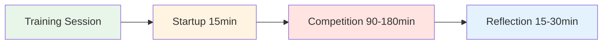

# Training Session: Competition Practice Guide


## How 4 Players Can Train Together Regularly

This guide shows how to create a regular training group of 4 players that competes against each other on different surfaces and environments for 2-4 hours. Emulate real competition while building psychological safety and mental performance skills.

::: tip The Training Session Philosophy
**Competition without reflection is just playing. Training without competition is just practice.** This format combines both: compete hard, then reflect deeply.
:::

## Quick Access

| Section | Purpose | Access |
|---------|---------|--------|
| **Finding Your Group** | How to recruit the right 4 players | [View Section](#finding-your-group) |
| **Session Structure** | 2-hour and 4-hour formats | [View Section](#session-structure) |
| **Startup Protocol** | How to begin each session | [View Section](#startup-protocol-15-min) |
| **Reflection Guide** | Post-session debrief process | [View Section](#reflection-protocol-15-30-min) |
| **Related Guides** | Other training formats | [Mental Journey](/da/guides/mental-journey/) • [Workshop](/da/guides/workshop/) • [Training Camp](/da/guides/training-camp/) |



## Why 4 Players?

**The Perfect Number:**
- **2v2 format** - Mirrors real competition
- **Rotation options** - Change partners, play singles
- **Peer learning** - Diverse playing styles
- **Accountability** - Hard to cancel on 3 people
- **Intimacy** - Small enough for deep sharing

::: info The Group Dynamic
4 players creates the ideal balance between competition intensity and psychological safety. You compete hard, but you also support each other's growth.
:::

## Finding Your Group

### Ideal Group Composition

**Skill Level:**
- Similar level (within 1-2 tiers)
- All committed to improvement
- Mix of pointers and shooters
- Different playing styles

**Mindset:**
- Open to vulnerability
- Willing to reflect
- Competitive but supportive
- Growth-oriented

**Logistics:**
- Live within 30 minutes of each other
- Can commit to regular schedule
- Similar availability

### Recruiting Your Group

**Where to find players:**
- Your club's elite players
- Regional tournament regulars
- Online pétanque communities
- Ask your coach for recommendations

**The Invitation:**
> "I'm forming a small training group of 4 players who want to compete regularly and work on the mental game. We'd meet weekly for 2-3 hours, play hard, then reflect on what we're learning. Interested?"

## Session Structure

### 2-Hour Session

| Time | Activity | Duration |
|------|----------|----------|
| **Startup** | Check-in & setup | 15 min |
| **Competition** | 2v2 matches | 90 min |
| **Reflection** | Debrief & learning | 15 min |

### 3-Hour Session

| Time | Activity | Duration |
|------|----------|----------|
| **Startup** | Check-in & setup | 15 min |
| **Competition Round 1** | 2v2 matches | 60 min |
| **Break** | Rest & informal chat | 15 min |
| **Competition Round 2** | Rotate partners | 60 min |
| **Reflection** | Deep debrief | 30 min |

### 4-Hour Session

| Time | Activity | Duration |
|------|----------|----------|
| **Startup** | Check-in & setup | 20 min |
| **Competition Round 1** | 2v2 matches | 75 min |
| **Break** | Rest & snack | 15 min |
| **Competition Round 2** | Rotate partners | 75 min |
| **Break** | Rest | 10 min |
| **Competition Round 3** | Singles or challenge | 45 min |
| **Reflection** | Deep debrief & planning | 30 min |


## Startup Protocol (15-20 minutes)

### 1. Physical Setup (5 min)

**Choose the terrain:**
- Rotate through different surfaces each week
- Vary difficulty and conditions
- Sometimes choose uncomfortable terrain intentionally

**Set up the space:**
- Mark boundaries clearly
- Prepare measuring tools
- Water station
- Shade if needed

### 2. Mental Check-In (10 min)

**The Check-In Circle:**

Stand in a circle (no boules yet) and go around:

**Each person shares:**
1. **Energy level** (1-10): "I'm at a 7 today"
2. **Mental state**: "I'm feeling focused" or "I'm distracted by work stress"
3. **Intention**: "Today I want to work on staying calm after misses"

**Why this matters:**
- Builds awareness of mental state
- Creates empathy in the group
- Sets individual focus for the session
- Normalizes being "off" some days

**Facilitator tip:** Rotate who goes first each week

### 3. Ground Rules Reminder (5 min)

**Every session, briefly remind:**

::: tip Session Ground Rules
1. **Compete hard** - Play to win, no holding back
2. **Support growth** - Help each other learn
3. **Respect User Manuals** - Honor how each person wants to be treated
4. **Stay present** - No phones during play
5. **Reflect honestly** - Share what's really happening inside
6. **Confidentiality** - What's shared here, stays here
:::

**The Balance:**
> "We compete like it's a tournament, but we support like we're teammates. Hard on the game, soft on the person."

## Competition Conduct Rules

### Match Format

**Standard 2v2:**
- Play to 13 points
- Standard pétanque rules
- Keep score honestly
- Measure when needed (don't guess)

**Rotation Options:**

**Week 1:** A+B vs C+D
**Week 2:** A+C vs B+D
**Week 3:** A+D vs B+C
**Week 4:** Singles round-robin

### Creating Competition Environment

::: warning Critical: Make It Real
**This is not casual practice.** Treat it like a tournament:

✅ **Do:**
- Keep official score
- Measure accurately
- Call foot faults
- Take it seriously
- Celebrate good shots
- Show disappointment in misses

❌ **Don't:**
- Give "do-overs"
- Be overly casual
- Let bad calls slide
- Joke through the whole game
- Make excuses
:::

### The Mental Performance Twist

**Track two scores:**

1. **Traditional Score** - Points won
2. **Mental Performance Score** - How well you managed your inner game

**Mental Performance Criteria (self-scored 1-5 after each game):**

| Criterion | 1 (Poor) | 3 (Good) | 5 (Excellent) |
|-----------|----------|----------|---------------|
| **Stayed Present** | Dwelled on past shots | Mostly present | Fully in the moment |
| **Managed Inner Critic** | Harsh self-talk | Caught and reframed | Used Inner Coach |
| **Emotional Regulation** | Visible frustration | Stayed mostly calm | Calm throughout |
| **Supported Partner** | Ignored or blamed | Basic support | Used User Manual |
| **Focus** | Distracted, unfocused | Mostly focused | Laser focused |

**Total:** /25 per game

**Why this matters:**
- Shifts focus from outcome to process
- Builds awareness of mental game
- Creates accountability for inner work
- Celebrates mental performance, not just winning

### Varying the Environment

**Rotate through different challenges:**

**Week 1: Home Terrain**
- Your regular piste
- Comfortable conditions
- Focus: Building confidence

**Week 2: Difficult Terrain**
- Uneven, challenging surface
- Focus: Emotional regulation, acceptance

**Week 3: Different Location**
- Another club's piste
- Focus: Adaptability

**Week 4: Pressure Conditions**
- Spectators (invite others to watch)
- Focus: Managing external pressure

**Week 5: Weather Challenge**
- Wind, heat, or cold
- Focus: Mental toughness

**Week 6: Time Pressure**
- Shot clock (30 seconds per throw)
- Focus: Decision-making under pressure

```mermaid
graph TD
    A[Vary Environment] --> B[Different Surfaces]
    A --> C[Different Locations]
    A --> D[Different Conditions]
    A --> E[Different Pressures]

    B --> F[Build Adaptability]
    C --> F
    D --> F
    E --> F

    style A fill:#e8f5e9
    style F fill:#fff4e1


## Reflection Protocol (15-30 minutes)

**Critical:** This is where the learning happens. Don't skip it!

### Short Reflection (15 min)

**After each game, quick debrief:**

**Go around the circle, each person shares:**

1. **Mental Performance Score** (1-5): "I give myself a 4 today"
2. **One thing that went well mentally**: "I stayed calm after my miss in the 3rd end"
3. **One thing to work on**: "I need to catch my inner critic faster"

**Group discussion:**
- "What did you notice about your inner game today?"
- "When did you feel most in the zone?"
- "When did you lose focus?"

### Deep Reflection (30 min)

**After final game, deeper debrief:**

**Structure:**

**1. Individual Journaling (5 min)**

Write privately:
- What happened in my mind during pressure moments?
- When did I use my Inner Coach vs. Inner Critic?
- How did I support my partner?
- What pattern am I noticing about myself?

**2. Pair Sharing (10 min)**

Partner up, share:
- One insight from journaling
- One question you're sitting with
- One commitment for next session

**3. Group Integration (15 min)**

Full circle:
- Each person shares ONE key learning
- Group identifies themes
- Discuss: "What are we learning as a group?"
- Set focus for next session

**Closing:**
- Thank each other for showing up
- Confirm next session date/time
- One-word check-out: "How are you leaving?"


## User Manual Integration

### Creating Your User Manuals

**In your first session together, each person completes:**

| Section | Prompt | Example |
|---------|--------|---------|
| **My Stress Signature** | "When I'm anxious, I..." | "...go completely quiet" |
| **How to Support Me** | "After a miss, I need..." | "...silence, not encouragement" |
| **My Trigger** | "I get defensive when..." | "...someone questions my shot choice" |
| **My Reset Signal** | "When I need a mental reset, I..." | "...touch my boules and take 3 breaths" |

**Share with the group and keep copies.**

### Using User Manuals During Play

**During competition:**
- Partner knows how to support you
- Teammates respect your needs
- No guessing about what helps

**Example:**
- Marc's User Manual says: "After a miss, I need 30 seconds of silence"
- His partner knows: Don't immediately encourage, give space
- Result: Marc feels understood, recovers faster

**This is psychological safety in action.**

## Advanced Variations

### The Mental Challenge Week

**Once a month, add a mental challenge:**

**Week 1: Silent Game**
- No talking during play
- Only non-verbal communication
- Focus: Internal awareness

**Week 2: Positive Self-Talk Only**
- Catch and reframe every negative thought
- Say Inner Coach phrase out loud
- Focus: Cognitive restructuring

**Week 3: Pressure Simulation**
- Play with spectators
- Announce score loudly
- Focus: External pressure management

**Week 4: Gratitude Game**
- After each end, state one thing you're grateful for
- Focus: Positive mindset

### The Vulnerability Round

**Every 4-6 weeks, dedicate a session to deeper sharing:**

**Format:**
- 30 min: Play one game
- 60 min: Deep reflection using [Workshop](./workshop) activities
- 30 min: Play final game applying insights

**Activities to use:**
- Fear in a Hat
- Reframing Inner Critic
- The Iceberg
- User Manual updates

**Why this matters:**
- Prevents the group from becoming just "playing buddies"
- Maintains psychological safety
- Deepens learning
- Builds authentic connection

## Tracking Progress

### Individual Tracking

**Keep a training journal:**

After each session, record:
- Date, location, conditions
- Partners and opponents
- Traditional score
- Mental performance score (1-5)
- Key insights
- Patterns noticed
- Commitments for next time

**Monthly review:**
- What's improving?
- What patterns keep showing up?
- What's my mental performance trend?
- What do I need to focus on?

### Group Tracking

**Shared document (Google Sheet):**

| Date | Location | Teams | Score | Mental Perf | Key Learning |
|------|----------|-------|-------|-------------|--------------|
| Jan 7 | Club A | A+B vs C+D | 13-11 | 4.2 avg | Staying calm in wind |
| Jan 14 | Club B | A+C vs B+D | 13-8 | 3.8 avg | Managing inner critic |

**Benefits:**
- See progress over time
- Notice group patterns
- Celebrate improvements
- Identify focus areas

## Sustaining the Group

### Commitment Agreement

**At the start, agree on:**

**Frequency:**
- Weekly? Bi-weekly? Monthly?
- Same day/time each week?
- How many sessions committed to? (suggest minimum 8-12)

**Cancellation Policy:**
- 24-hour notice required
- Maximum 2 cancellations per person per quarter
- If someone cancels repeatedly, have a conversation

**Rotation:**
- Who chooses location each week?
- Who facilitates reflection?
- How do we keep it fresh?

### Handling Conflicts

**When tension arises:**

::: warning Address It, Don't Avoid It
**The mistake:** Letting resentment build

**The solution:** Use it as a learning moment

**Script:**
> "I notice some tension. Can we pause and talk about what's happening? This is exactly the kind of moment we can learn from."
:::

**Common conflicts:**
- Disagreement on calls
- Perceived unfairness
- Personality clashes
- Competitive intensity

**Resolution process:**
1. Pause the game
2. Each person shares their perspective
3. Group validates both sides
4. Agree on how to move forward
5. Return to play

**This builds psychological safety.**

### Keeping It Fresh

**Avoid stagnation:**

**Every 8-12 weeks, change something:**
- Invite a 5th player for variety
- Play at a tournament together
- Do a mini training camp (full day)
- Bring in a guest coach
- Try a new format (singles, different scoring)
- Do a deep vulnerability session

**The goal:** Keep learning, keep growing, keep it interesting

## Integration with Tournaments

### Pre-Tournament Prep

**2 weeks before a major tournament:**

**Session focus:**
- Play on similar terrain
- Simulate tournament pressure
- Practice competition-day nutrition
- Rehearse pre-shot routines
- Visualize success

**Mental preparation:**
- What's your intention for the tournament?
- What's your Inner Coach phrase?
- What's your reset signal?
- How will you handle pressure?

### Post-Tournament Debrief

**After a tournament:**

**Dedicate a session to reflection:**

**Structure:**
- 30 min: Share tournament experience
- 30 min: What worked? What didn't?
- 30 min: What did you learn about yourself?
- 30 min: Play a game applying learnings

**Questions:**
- When did you feel most in the zone?
- When did you lose it?
- How did you handle pressure?
- What would you do differently?
- What are you proud of?

**This cements learning and builds resilience.**

## Resources & Tools

### From This Site

- [Workshop Guide](./workshop) - Deep facilitation protocols
- [Training Camp Guide](./training-camp) - Weekend intensive format
- [Nutrition](./education/nutrition/) - Competition-day protocols
- [Mental Strength](./education/mental-game/mental-strength/) - Inner game concepts
- [Mindfulness](./education/mental-game/mindfulness/) - Presence techniques
- [Tactics](./education/technique/tactics/) - Strategic thinking

### Recommended Tools

**Journaling:**
- Physical notebook or digital app
- Prompt: "What happened in my mind today?"

**Video Analysis:**
- Phone camera on tripod
- Review technique and body language
- Notice patterns

**Meditation Apps:**
- Headspace, Calm, Insight Timer
- 5-10 minutes before sessions

**Tracking:**
- Google Sheets for group data
- Personal spreadsheet for trends

## Success Stories

### Example: The Stockholm Four

**Group:** 4 elite players, ages 28-45
**Frequency:** Weekly, 3 hours
**Duration:** 18 months

**Results:**
- All 4 improved tournament rankings
- 2 made national team
- Mental performance scores increased from 3.2 to 4.5 average
- Group still meets 3 years later

**Key factors:**
- Consistent commitment
- Deep vulnerability work
- Honest reflection
- Mutual support

### Example: The Barcelona Crew

**Group:** 4 club players wanting to compete regionally
**Frequency:** Bi-weekly, 2 hours
**Duration:** 6 months

**Results:**
- Confidence increased dramatically
- All 4 entered first regional tournament
- 1 placed in top 8
- Group expanded to 8 players

**Key factors:**
- Started small and built trust
- Focused on mental game
- Celebrated small wins
- Kept it fun

## Common Challenges

### "We just end up playing, not reflecting"

**Solution:**
- Set a timer
- Designate a "reflection keeper"
- Make reflection non-negotiable
- Start with just 10 minutes

### "One person dominates"

**Solution:**
- Use structured sharing (everyone gets 2 minutes)
- Rotate who speaks first
- Gently redirect: "Let's hear from others"

### "It's getting stale"

**Solution:**
- Change locations
- Try new formats
- Do a vulnerability session
- Invite a guest
- Take a break and come back fresh

### "Someone's not committed"

**Solution:**
- Have an honest conversation
- Revisit commitment agreement
- Consider finding a replacement
- It's okay if someone leaves

## Getting Started Checklist

::: details Your First Session Checklist

**Before Session 1:**
- [ ] Find your 4 players
- [ ] Agree on frequency and duration
- [ ] Choose first location
- [ ] Share this guide with everyone
- [ ] Create group chat

**Session 1 Agenda:**
- [ ] Introductions and intentions
- [ ] Agree on ground rules
- [ ] Complete User Manuals
- [ ] Play first game
- [ ] Short reflection
- [ ] Schedule next 4 sessions

**Ongoing:**
- [ ] Rotate locations
- [ ] Track progress
- [ ] Deep reflection every 4-6 weeks
- [ ] Adjust format as needed
- [ ] Celebrate improvements
:::

## Final Thoughts

::: tip The Power of Regular Practice
**Consistency beats intensity.** Four players meeting regularly, competing hard, and reflecting deeply will improve faster than sporadic tournament play alone.

**Why?**
- Regular feedback loop
- Psychological safety to experiment
- Accountability and support
- Deliberate practice on mental game
- Community and connection

**The result:** You don't just get better at pétanque. You become a more complete competitor.
:::


