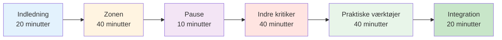

# Sessionsguide: Introduktion til mentalt spil (2-3 timer)

<AdBanner />

## Oversigt

Denne guide hjælper dig med at gennemføre en 2-3 timers introduktionssession om mental spiltræning for petanquespillere. Perfekt til trænere, klubledere eller erfarne spillere, der ønsker at introducere mental træning til deres hold.

::: tip To afsnit i denne vejledning
- **[For deltagere](#for-participants)** - Hvad spillerne vil lære
- **[For facilitatorer](#for-facilitators)** - Sådan afholdes sessionen
:::

## Hurtig adgang

| Afsnit | Formål | Adgang |
|---------|---------|--------|
| **For deltagere** | Hvad du kan forvente af sessionen | [Se sektion](#for-deltagere) |
| **For facilitatorer** | Fuld sessionsplan og tidsplan | [Se sektion](#for-facilitatorer) |
| **Materialer til sessionen** | Guider, slides og arbejdsark | [Se materialer](/da/mental-journey/materialer) |
| **Forberedelsestjekliste** | Hvad skal man forberede inden sessionen | [Se tjekliste](#forberedelse-1-uge-før) |

---

## For deltagere

### Hvad man kan forvente

Denne session introducerer det mentale spil petanque gennem diskussion, øvelser og praktiske teknikker, du kan bruge med det samme.

**Du vil lære:**
- Hvorfor mental træning er vigtig for præstation
- Forskellen mellem &quot;teknisk tilstand&quot; og &quot;flowtilstand&quot;
- Sådan genkender og håndterer du din indre kritiker
- Enkle teknikker til trykhåndtering
- En grundlæggende rutine før indtagelse

**Hvad du skal bruge:**
- Åbent sind og villighed til at dele
- Notesbog og pen
- Dine egne erfaringer at diskutere
- 2-3 timers fokuseret tid

### Sessionsstruktur



### Nøglebegreber, du vil udforske

#### 1. Zonen (flowtilstand)
- Hvordan det føles, når alting klikker
- Hvorfor det at tænke på teknik forstyrrer præstationen
- &quot;Skiftet&quot; fra planlægning til udførelse

#### 2. Den indre kritiker
- Hvordan negativ selvsnak påvirker præstationen
- Forskellen mellem den indre kritiker og den indre coach
- Neutral observation vs. hård dom

#### 3. Trykrespons
- Hvorfor du spiller anderledes i konkurrencer
- Fysiske tegn på tryk
- Teknikker til hurtig nulstilling

#### 4. Praktiske værktøjer
- 3-åndedrætsnulstilling
- Simpel rutine før indtagelse
- Protokol til fejlretning

### Hvad skal man medbringe

**Påkrævet:**
- Dig selv og dine oplevelser
- Villighed til at deltage

**Valgfri:**
- Eksempler på mentale udfordringer, du står over for
- Spørgsmål om specifikke situationer
- Notesbog til personlige noter

### Efter sessionen

Du vil modtage:
- Opsummerende uddeling af nøglebegreber
- Øvelser til ugen
- Links til detaljerede uddannelsesmoduler
- Målskabelon til mental spiludvikling

<AdInArticle />

---

## For facilitatorer

### Forberedelsestjekliste

**1 uge før:**
- [ ] Book et værelse i 2-3 timer
- [ ] Inviter 6-12 deltagere
- [ ] Bogmærk materialesider (se [Materialer](/da/mental-journey/materialer))
- [ ] Gennemgå denne vejledning grundigt
- [ ] Forbered flipover eller whiteboard

**1 dag før:**
- [ ] Bekræft fremmøde
- [ ] Opsætningsrum (siddepladser i rundkreds)
- [ ] Test enhver teknologi (slides osv.)
- [ ] Forbered materialer

**1 time før:**
- [ ] Ankom tidligt
- [ ] Arranger siddepladser i en cirkel
- [ ] Opsætning af materialer
- [ ] Centrer dig selv

### Din rolle som facilitator

::: warning Vigtig
Du er **ikke** en terapeut eller teknisk coach. Du er en **facilitator**, der:
- Guidediskussion
- Skaber et trygt rum
- Forbinder koncepter med oplevelser
- Styrer gruppedynamik
:::

**Nøglefærdigheder:**
- Aktiv lytning
- Neutral tilstedeværelse
- Håndtering af forskellige personligheder
- At vide, hvornår man skal videre

### Detaljeret sessionsplan

---

#### Del 1: Introduktion (20 minutter)

**Mål:**
- Skab psykologisk tryghed
- Sæt forventninger
- Opbyg gruppeforbindelse

**Manuskript:**

&quot;Velkommen alle sammen. Denne session handler om det mentale spil petanque - de tanker, følelser og mønstre, der påvirker din præstation.&quot;

**Grundregler:**
1. Det, der deles her, forbliver her
2. Ingen dom over andres oplevelser
3. Deltagelse er frivillig
4. Der er ingen forkerte svar

**Hurtig runde:** Navn, hvor længe du har spillet, én mental udfordring du står over for.

**Noter til underviser:**
- Gå først til at modellere sårbarhed
- Hold introduktionerne korte (1 minut hver)
- Bemærk fælles temaer
- Valider alle svar

---

#### Del 2: Zone-/flowtilstanden (40 minutter)

**Mål:**
- Forstå flowtilstande
- Anerkend teknisk vs. flow-tilstand
- Lær &quot;switch&quot;-konceptet

**Åbningsspørgsmål:**
&quot;Tænk på en gang, hvor du spillede din bedste petanque. Hvordan føltes det? Hvad var anderledes?&quot;

**Diskussionsspørgsmål:**
1. &quot;Hvor mange af jer har haft spil, hvor alt bare klikkede?&quot;
2. &quot;Hvad tænkte du på i de øjeblikke?&quot;
3. &quot;Hvordan er det anderledes end når du kæmper?&quot;

**Vigtige undervisningspunkter:**

Brug whiteboard til at tegne:
```
PLANNING MODE          →    EXECUTION MODE
(Outside circle)            (Inside circle)
- Analyze situation         - Eyes on target
- Choose strategy           - Trust training
- Decide throw type         - Automatic movement
```

**Øvelse: Skiftet (10 minutter)**

&quot;Lad os øve skifteøjeblikket:
1. Stå op
2. Forestil dig, at du er uden for cirklen - tænk på et skud
3. Tag en indånding
4. Træd frem (ind i en imaginær cirkel)
5. Slip analysen, når du træder
6. Fokuser kun på et imaginært mål&quot;

**Opsummering:**
- &quot;Hvad bemærkede du?&quot;
- &quot;Var det let eller svært at give slip på tankerne?&quot;
- &quot;Hvordan kan dette gælde i rigtige spil?&quot;

---

#### Del 3: Pause (10 minutter)

**Facilitatorhandlinger:**
- Opfordr til uformel diskussion
- Bemærk gruppeenergi
- Forbered dig på næste afsnit

---

#### Del 4: Den indre kritiker (40 minutter)

**Mål:**
- Genkend negative selvsnakmønstre
- Skeln mellem indre kritiker og indre coach
- Øv neutral observation

**Åbning:**
&quot;Vi har alle en indre stemme, der kommenterer vores præstation. Nogle gange er den hjælpsom, nogle gange er den hård. Lad os udforske det.&quot;

**Øvelse: Indre kritiker-opgørelse (15 minutter)**

&quot;Skriv ned på dit papir:&quot;
1. Hvad din indre stemme siger efter et dårligt kast
2. Hvad det siger, når du er under pres
3. Hvad det siger om dine evner&quot;

*Giv 5 minutter til at skrive*

&quot;Hvem er villig til at dele ét eksempel?&quot;

**Noter til underviser:**
- Normaliser hård selvsnak
- Forsøg ikke at &quot;fikse&quot; nogen
- Led efter fælles mønstre

**Undervisning: Indre kritiker vs. Indre coach (15 minutter)**

Tegn to kolonner på tavlen:

| Indre kritiker | Indre træner |
|--------------|-------------|
| &quot;Hvordan kunne du overse det?!&quot; | &quot;Den gik til venstre&quot; |
| &quot;Du kvæles altid&quot; | &quot;Lad os prøve igen&quot; |
| &quot;Du er forfærdelig&quot; | &quot;Hvad kan jeg lære?&quot; |

**Diskussion:**
- &quot;Læg mærke til forskellen?&quot;
- &quot;Hvilken stemme hjælper præstationen?&quot;
- &quot;Kan du ændre stemmen?&quot;

**Øvelse: Omformulering (10 minutter)**

&quot;Tag en af dine Indre Kritiker-udsagn. Hvordan ville en Indre Coach sige den?&quot;

Del eksempler.

---

#### Del 5: Praktiske værktøjer (40 minutter)

**Mål:**
- Lær 3-åndedrætsnulstilling
- Lav en simpel rutine før optagelserne
- Forstå fejlrettelse

**Værktøj 1: Nulstilling af 3 åndedræt (10 minutter)**

&quot;Dette er din nødknap til nulstilling. Brug den, når du mærker trykket vokse.&quot;

**Demonstrere:**
1. Træk vejret ind i 4 tællinger
2. Hold i 2 tællinger
3. Pust ud i 6 tællinger
4. Gentag 3 gange

&quot;Lad os øve os sammen nu.&quot;

*Led gruppen gennem 3 cyklusser*

**Opsummering:**
- &quot;Hvad bemærkede du i din krop?&quot;
- &quot;Hvornår kan du bruge dette?&quot;

**Værktøj 2: Simpel rutine før optagelse (15 minutter)**

&quot;En rutine hjælper dig med at skifte fra planlægning til udførelse konsekvent.&quot;

**Grundlæggende struktur:**
```
Outside Circle (Planning):
- Look at situation
- Decide on throw
- See the result in your mind

Walking to Circle (Transition):
- One deep breath
- Let go of analysis

Inside Circle (Execution):
- Eyes on target only
- Trust your training
- Execute
```

**Øvelse:**
&quot;Lav din egen 3-trinsrutine. Skriv den ned.&quot;

Del eksempler.

**Værktøj 3: Protokol til fejlretning (15 minutter)**

&quot;Elitespillere laver ikke færre fejl. De kommer sig hurtigere.&quot;

**3-trinsprotokol:**
1. **Observer** - Angiv faktum neutralt (&quot;Det gik til venstre&quot;)
2. **Lær** - Uddrag information (&quot;Vinden stærkere end jeg troede&quot;)
3. **Nulstil** - Bevæg dig fremad (3-åndedrætsnulstilling, øjne fremad)

**Praksis:**
&quot;Tænk på en nylig fejltagelse. Gennemgå de 3 trin.&quot;

---

#### Del 6: Integration og afslutning (20 minutter)

**Mål:**
- Konsolider læring
- Opret handlingsplaner
- Tilvejebring ressourcer

**Refleksionsspørgsmål:**
1. &quot;Hvilken indsigt tager du med dig?&quot;
2. &quot;Hvad er én ting, du vil prøve i denne uge?&quot;
3. &quot;Hvilke spørgsmål er der stadig?&quot;

**Handlingsplanlægning (10 minutter)**

&quot;På dit uddelingsark skal du skrive:&quot;
1. En teknik du skal øve dig på i denne uge
2. Hvornår/hvornår du skal øve det
3. Hvordan du vil følge dine fremskridt&quot;

**Ressourcer:**
- Uddel et opsummeringsark
- Del hjemmeside: carreau.app
- Anbefalet startmodul: [Zonen](/da/uddannelse/zonen/)

**Slutning af cirklen:**
&quot;Et ord til at beskrive, hvordan du har det lige nu.&quot;

**Slutord:**
&quot;Mental træning er en færdighed som enhver anden - det kræver øvelse. Start småt, vær tålmodig med dig selv, og læg mærke til, hvad der ændrer sig. Tak for din åbenhed i dag.&quot;

---

### Tips til facilitatorer

#### Håndtering af vanskelige situationer

**Hvis nogen dominerer:**
- &quot;Tak til [navn]. Lad os høre fra andre.&quot;
- Brug struktureret turtagning

**Hvis nogen er imod:**
- Ikke skændtes
- &quot;Det er et gyldigt perspektiv. Hvad mener andre?&quot;
- Afstem med deres bekymring

**Hvis nogen bliver følelsesladet:**
- Normaliser det
- &quot;Dette rører ved noget virkeligt. Tak fordi du deler.&quot;
- Forsøg ikke at reparere

**Hvis diskussionen går i stå:**
- Brug specifikke prompts
- Del dit eget eksempel
- Gå til en øvelse

#### Energistyring

**Høj energi:** Brug øvelser og bevægelse
**Lav energi:** Stil provokerende spørgsmål
**Spredt:** Bring tilbage til strukturen
**Spændt:** Brug humor eller pause

### Efter sessionen

**Opfølgning:**
- Send en oversigtsmail inden for 24 timer
- Inkluder links til ressourcer
- Tilbyd at besvare spørgsmål
- Planlæg valgfri opfølgningssession

**Selvrefleksion:**
- Hvad fungerede godt?
- Hvad ville du ændre?
- Hvad overraskede dig?
- Hvad lærte du?

<AdBanner />

---

## Materialer

- [Deltagervejledning](/da/mental-rejse/materialer#deltagervejledning)
- [Facilitator-slides](/da/mental-rejse/materialer#facilitator-slides)
- [Opsummeringsark](/da/mental-rejse/materialer#opsummeringsark)
- [Øvelsesark](/da/mental-rejse/materialer#øvelsesark)

---

::: tip Klar til at facilitere?
1. Gennemgå denne vejledning grundigt
2. Download materialer
3. Øv øvelserne selv
4. Planlæg din session
5. Stol på processen
:::

