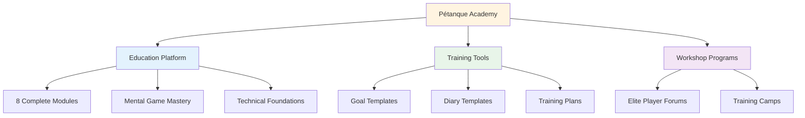
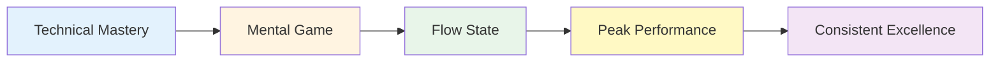

# Nyheder og opdateringer

<AdBanner />

## Velkommen til Petanque Akademiet

::: tip Platformen er nu live! 🎉
**Petanque-akademiet er nu fuldt operationelt!**

Vi har lanceret en omfattende platform dedikeret til at hjælpe elite-petanquespillere med at nå deres fulde potentiale gennem mental spilmestring, struktureret træning og praktiske værktøjer.
:::

<AdInArticle />

## Hvad er tilgængeligt nu

### 📚 Komplet uddannelsesplatform

Vi har lanceret **8 omfattende uddannelsesmoduler**, der dækker alt fra flowtilstande til ernæring:

| Modul | Hvad er der indeni | Nøglefunktioner |
|--------|----------------|--------------|
| **[The Zone](/en/education/the-zone/)** | Flowtilstandsstyring | 4 detaljerede vejledninger til at komme ind i og opretholde flow |
| **[Mental Strength](/en/education/mental-strength/)** | Trykhåndtering | Rutiner før optagelser, håndtering af indre kritiker |
| **[Mindfulness](/en/education/mindfulness/)** | Bevidsthed i nuet | Daglig træning, konkurrenceteknikker |
| **[Goals](/en/education/goals/)** | Strategisk planlægning | SMART-mål, hierarki, sporingssystemer |
| **[Tactics](/en/education/tactics/)** | Spilstrategi | Beslutningstagning, sandsynlighed, positionering |
| **[Team Player](/en/education/team-player/)** | Samarbejdsevner | Kommunikation, tillid, teamdynamik |
| **[Training](/en/education/training/)** | Øvelsesmetoder | Øvelser, bevidst øvelse, progression |
| **[Nutrition](/en/education/nutrition/)** | Ydelsesbrændstof | Blodsukkerstyring, konkurrenceernæring |

### 🛠️ Praktiske værktøjer

**Brugsklare skabeloner og programmer:**

- **[Workshop](/da/workshop)** - Strukturerede 3-timers sessioner til mental spiludvikling
- **[Træningslejr](/da/træningslejr)** - Intensive weekendprogrammer for elitespillere
- **[Træningssession](/da/træningssession)** - 2-3 timers øvelsesrammer
- **[Målskabelon](/da/målskabelon)** - Komplet system til målsætning og sporing
- **[Skabelon til dagbog](/da/skabelon-til-dagbog)** - Daglig øvelses- og refleksionsdagbog

### 🎯 Teknisk vejledning

**[Teknisk rådgivning](/da/teknisk/)** afsnittet indeholder:
- Komplet guide til alle petanque-kast
- Strategier til valg af bane
- Teknikker til spinkontrol
- Rammer for udvælgelse af billeder

### 🍽️ Ernæring for præstation

**[Mad](/da/mad)** - Omfattende guide til:
- Blodsukkerstyring for stabilt fokus
- Ernæringsstrategier før konkurrence
- Energioptimering til turneringer

## Vores mission

::: tip Det næste niveau
Elitespillere har allerede mestret teknikken. Det næste gennembrud kommer fra det **mentale spil** - at lære at tilgå flowtilstande, håndtere pres og præstere konsekvent bedst muligt.

**Pétanque Academy leverer den komplette køreplan.**
:::

## Platformstatistik

::: info Hvad vi har bygget
- ✅ **8 uddannelsesmoduler** med 30+ detaljerede guider
- ✅ **5 praktiske værktøjer** klar til brug
- ✅ **10 sprog** - tilgængelig over hele verden
- ✅ **100+ sider** med indhold på eliteniveau
- ✅ **Havfruediagrammer** til visuel læring
- ✅ **Kopier-indsæt skabeloner** til øjeblikkelig brug
:::

## Sådan kommer du i gang

### For nye besøgende

**Start med det grundlæggende:**

1. **[Ambition](/da/ambition)** - Forstå filosofien bag eliteudvikling
2. **[Zonen](/da/uddannelse/zonen/)** - Lær om flowtilstande
3. **[Målskabelon](/da/målskabelon)** - Sæt dine første strukturerede mål

### For erfarne spillere

**Dyk ned i avancerede emner:**

1. **[Mental styrke](/da/uddannelse/mental-styrke/)** - Mestre pressede situationer
2. **[Taktik](/da/uddannelse/taktik/)** - Forfine strategisk beslutningstagning
3. **[Workshop](/da/workshop)** - Implementer strukturerede mentale spilsessioner

### For hold

**Opbyg kollektiv ekspertise:**

1. **[Holdspiller](/da/uddannelse/holdspiller/)** - Forbedr holddynamikken
2. **[Træningslejr](/da/træningslejr)** - Organiser weekendintensivkurser
3. **[Træningssession](/da/træningssession)** - Strukturér holdøvelser

## Hvad gør dette anderledes

::: warning Hvorfor Pétanque Academy skiller sig ud
**Det meste træning fokuserer på teknik. Vi fokuserer på, hvad elitespillere rent faktisk har brug for:**

1. **Mental spilmestring** - Den virkelige differentiator på høje niveauer
2. **Praktiske værktøjer** - Ikke bare teori, men også brugervenlige skabeloner
3. **Strukturerede programmer** - Klare rammer for workshops og lejre
4. **Evidensbaseret** - Bygget på sportspsykologi og flow state-forskning
5. **Elitefokuseret** - Designet til spillere, der allerede har mestret det grundlæggende
:::

## Bliv involveret

**Vil du bidrage eller give feedback?**

Besøg vores **[Om](/da/om)** side for at:
- Lær mere om platformen
- Del din feedback
- Anmod om specifikt indhold
- Følg os

---

::: tip Start din rejse i dag
Alt du behøver for at tage dit spil til det næste niveau er allerede her. Vælg et modul, hent en skabelon, og begynd at implementere.

**Velkommen til Pétanque Academy - hvor elitespillere bliver exceptionelle.**
:::

<AdBanner />
