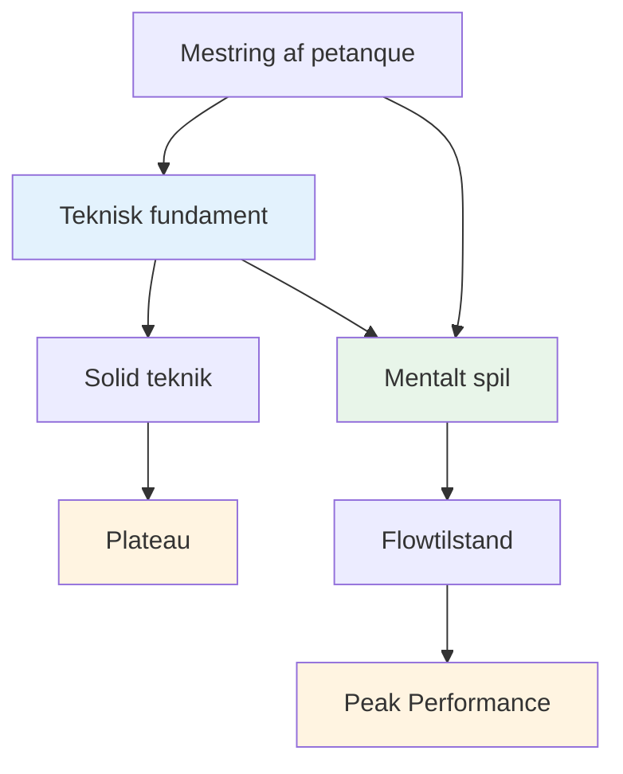
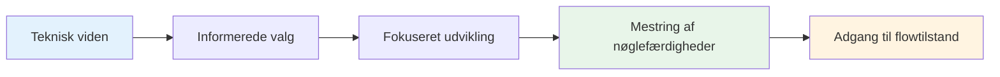

# Teknisk rådgivning
<AdBanner />

## En bemærkning om teknik

Selvom vores primære fokus er på det mentale spil og flowtilstanden, anerkender vi, at teknik er fundamentet, som alt andet bygger på.

::: info Vores filosofi
**Teknik er fundamentet, men flow er loftet.** Du har brug for solid teknik for at nå eliteniveau, men mental mestring er det, der fører dig videre.
:::

## Vores perspektiv

<AdInArticle />

::: tip Du behøver ikke at mestre alt
**Du behøver ikke at mestre alle teknikker**, men at forstå hele paletten af muligheder hjælper dig med at:

- ✅ Vid hvad der er muligt
- ✅ Træf informerede valg om, hvad du vil udvikle
- ✅ Værdsæt spillet på et dybere niveau
- ✅ Forstå hvad elitespillere kan gøre
:::

::: info Målet
Hvis du har et teknisk fokus og ønsker at udvide dit repertoire, skitserer dette afsnit slutmålet - den komplette palet af kast, der er tilgængeligt for en petanque-spiller.

**Husk:** Målet er ikke at mestre alt. Det handler om at have et tilstrækkeligt teknisk fundament til, at du kan komme ind i zonen og lade din krop vælge det rigtige kast naturligt.
:::

## Emner

### [Palette af kast](/da/teknisk/kast)
Hvad er alle de forskellige kast derude? En omfattende oversigt over de tekniske muligheder i petanque.

::: tip Hvad er det næste efter teknikken?
Når du først har en solid teknik, kommer den virkelige vækst fra:
- **[Zonen](/da/uddannelse/zonen/)** - Adgang til flowtilstande
- **[Mental styrke](/da/uddannelse/mental-styrke/)** - Håndtering af pres
- **[Træningsmetoder](/da/uddannelse/træning/)** - Sådan træner du effektivt
:::

<AdBanner />
