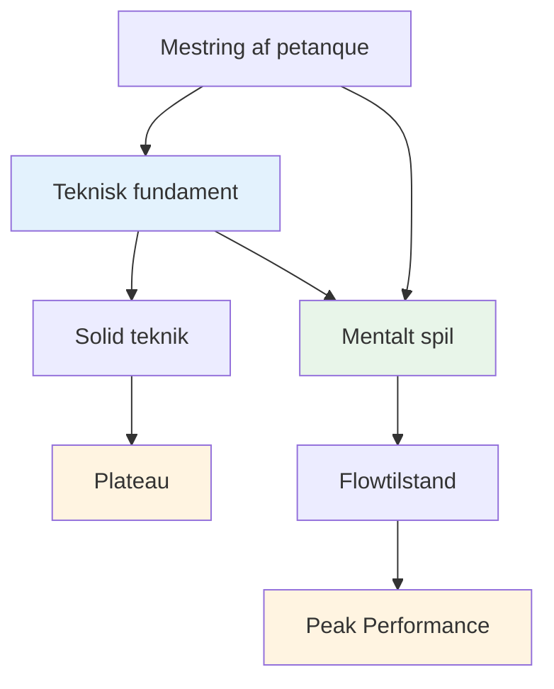
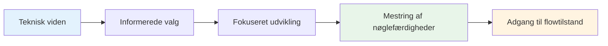

# Teknisk rådgivning
<AdBanner />

## En bemærkning om teknik

Selvom vores primære fokus er på det mentale spil og flowtilstanden, anerkender vi, at teknik er fundamentet, som alt andet bygger på.

::: info Vores filosofi
**Teknik er fundamentet, men flow er loftet.** Du har brug for solid teknik for at nå eliteniveau, men mental mestring er det, der fører dig videre.
:::

## Den mest almindelige fejl i teknisk træning

<AdInArticle />

::: info Denne sektion er for erfarne spillere
Hvis du er nybegynder inden for petanque, skal du naturligvis udvikle din grundlæggende teknik fra bunden – og det er en anden rejse.

**Dette råd er til spillere, der har spillet i årevis** og allerede har en etableret teknik, der føles naturlig, afslappet og pålidelig. Du har fundet din måde at kaste på. Nu er spørgsmålet: hvordan udvikler du dig herfra?
:::

::: warning Den fælles fælde
Når erfarne spillere vil forbedre sig, vender de ofte tilbage til det grundlæggende – justering af deres greb, armsving, udløsningspunkt, kropsposition. Timevis af øvelse. Uendelig finjustering.

**Men de har sprunget det vigtigste spørgsmål over:** Hvad er det præcist, du vil have, at kuglen skal gøre?
:::

Før du rører ved din teknik, skal du have klarhed over det **resultat**, du forsøger at opnå. Ikke &quot;Jeg vil gerne slå mere&quot; eller &quot;Jeg vil gerne være mere konsekvent&quot; – det er ikke resultater, det er ønsker.

Et reelt resultat ser sådan ud:
- &quot;Jeg vil have et lob med høj bue, der stopper inden for 20 cm fra hvor den lander&quot;
- &quot;Jeg vil have et rullende skud, der drejer til venstre i denne type terræn&quot;
- &quot;Jeg vil have et blødt, devant skud, der næsten ikke rører målkuglen&quot;

**Først skal du udforske [Palette af kast](/da/teknisk/kast)** for at forstå, hvad der er muligt. Beslut derefter, hvilket specifikt kast du vil tilføje til dit repertoire. Først derefter bør du begynde at arbejde med, hvordan din arm, håndled og krop skal bevæge sig for at skabe det resultat.

## Den rigtige måde at arbejde med teknik på

Vi siger ikke, at du aldrig skal arbejde med din arm, håndled, aflastning eller kropsstilling. **Teknisk arbejde med udførelse er absolut gyldigt** — men det skal have det rigtige formål.

::: info Det rette formål med teknisk arbejde
**Korrekt formål:** &quot;Jeg vil gerne tilføje et nyt tæppe til min palet&quot;

**Forkert formål:** &quot;Jeg vil gerne slå flere slag&quot; eller &quot;Jeg vil gerne være mere konsekvent&quot;
:::

Her er processen:

1. **Udforsk [Palette af kast](/da/teknisk/kast)** — Identificer hvilket kast eller hvilken teknik du vil tilføje til dit repertoire
2. **Visualiser resultatet** — Hvad skal kuglen gøre? Hvilken bane, landing, spin og adfærd har du brug for?
3. **Arbejd derefter på udførelsen** — Nu kan du fokusere på arm, håndled, kropsposition og frigivelse for at opnå det specifikke resultat

Denne tilgang giver din tekniske træning **klar retning og målbar fremgang**. Du &quot;øver&quot; dig ikke bare – du udvider bevidst dine evner.

::: tip Eksempel: Tilføjelse af en Plombée
**Mål:** Tilføj et drop shot (plombée) til dit pointrepertoire

**Resultatvisualisering:** Kuglen skal bue højt, lande blødt med bagspin og stoppe næsten øjeblikkeligt

**Teknisk fokus:** Højere udløsningspunkt, mere håndledsaktion til bagspin, blødere greb

**Succesmåling:** Kan du udføre dette kast, når du har lyst? Det er målet.
:::

## Hvorfor &quot;slå mere&quot; er det forkerte mål

Hvis du justerer din teknik til at &quot;slå oftere&quot; eller &quot;være mere konsekvent&quot;, adresserer du sandsynligvis det forkerte problem.

**Sandheden er:** Hvis du kan slå godt i træning, men kæmper i konkurrence, er problemet ikke din teknik – det er det mentale. Din arm ved, hvad den skal gøre. Spørgsmålet er, om dit sind tillader det.

::: tip Den mentale forbindelse
Inkonsekvens under pres er sjældent et teknisk problem – det er et mentalt.

**For at sikre konsistens og præstation under pres, se vores [Uddannelse](/da/uddannelse/) afsnit**, især:
- [Zonen](/da/uddannelse/zonen/) — Skaber betingelser for toppræstation
- [Mental styrke](/da/uddannelse/mental-styrke/) — Præsterer når det betyder noget
- [Teknisk vs. Flow](/da/uddannelse/zonen/teknisk-vs-flow) — Hvornår skal man fokusere på teknik vs. tillid
:::

## Vores perspektiv

::: tip Du behøver ikke at mestre alt
**Du behøver ikke at mestre alle teknikker**, men at forstå hele paletten af muligheder hjælper dig med at:

- ✅ Vid hvad der er muligt
- ✅ Træf informerede valg om, hvad du vil udvikle
- ✅ Værdsæt spillet på et dybere niveau
- ✅ Forstå hvad elitespillere kan gøre
:::

::: info Målet
Hvis du har et teknisk fokus og ønsker at udvide dit repertoire, skitserer dette afsnit slutmålet - den komplette palet af kast, der er tilgængeligt for en petanque-spiller.

**Husk:** Målet er ikke at mestre alt. Det handler om at have et tilstrækkeligt teknisk fundament til, at du kan komme ind i zonen og lade din krop vælge det rigtige kast naturligt.
:::

## Emner

### [Palette af kast](/da/teknisk/kast)
Hvad er alle de forskellige kast derude? En omfattende oversigt over de tekniske muligheder i petanque.

::: tip Hvad er det næste efter teknikken?
Når du først har en solid teknik, kommer den virkelige vækst fra:
- **[Zonen](/da/uddannelse/zonen/)** - Adgang til flowtilstande
- **[Mental styrke](/da/uddannelse/mental-styrke/)** - Håndtering af pres
- **[Træningsmetoder](/da/uddannelse/træning/)** - Sådan træner du effektivt
:::

<AdBanner />
