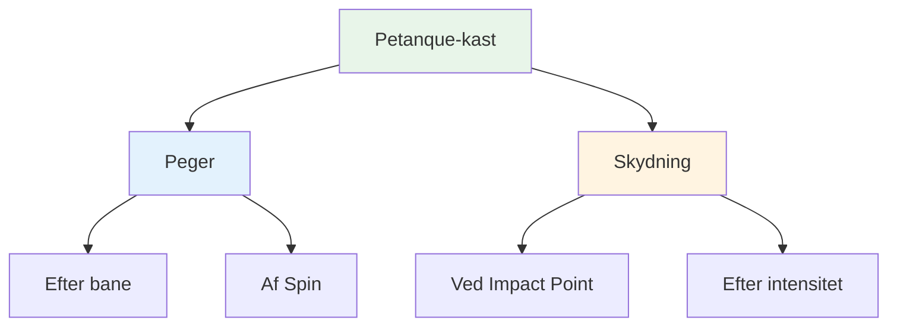
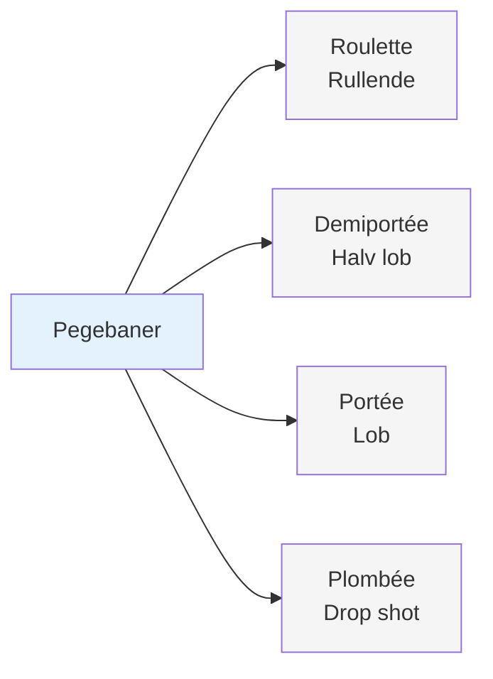
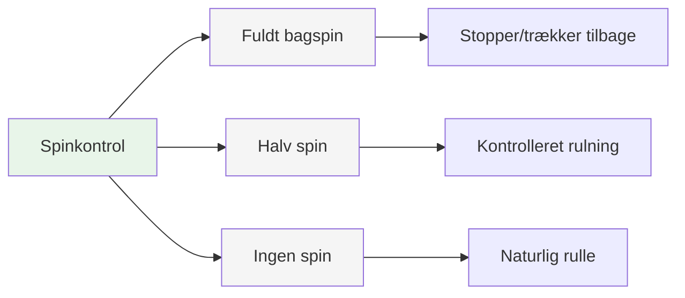
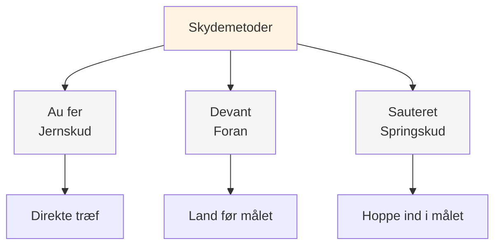
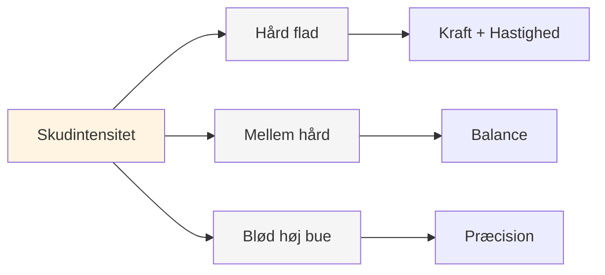
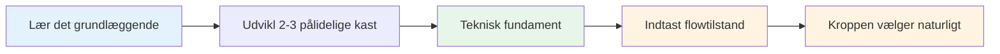

# Palet af tæpper

## Det komplette tekniske repertoire

Dette er en oversigt over de kast, der findes i petanque. Du behøver ikke at mestre dem alle, men at vide, hvad der findes, hjælper dig med at forstå spillets fulde omfang.

::: tip Det store billede
**Forståelse af hele paletten hjælper dig med at træffe informerede valg om, hvad du skal udvikle.** Du behøver ikke at mestre alt - fokuser på, hvad der fungerer for dit spil.
:::

## Pegeteknikker

### Efter bane

| Kaste | Fransk betegnelse | Bane | Hvornår skal man bruge |
|-------|-------------|------------|-------------|
| **Rullende** | Roulette | Lav, ruller det meste af vejen | Jævnt terræn, kort afstand |
| **Halv-lob** | Demiportée | Mellem, lander halvvejs | Mest almindelige, alsidige |
| **Lob** | Portée | Høj, lander nær målet | Forhindringer, ujævnt terræn |
| **Drop shot** | Plombée | Meget høj, falder lodret | Snævre rum, præcis placering |

### Af Spin

| Spintype | Effekt på landing | Hvornår skal man bruge |
|-----------|-------------------|-------------|
| **Fuld spin (bagspin)** | Stopper eller trækker sig tilbage ved landing | Skal stoppe hurtigt, undgå at rulle forbi |
| **Halv centrifugering** | Moderat bagspin, kontrolleret rulning | Mest alsidig, forudsigelig |
| **Ingen spin** | Neutral, naturlig rulning ved landing | Lad terrænet diktere rulning |

## Skydeteknikker

### Ved Impact Point

| Teknik | Fransk betegnelse | Anslagspunkt | Karakteristika |
|-----------|-------------|--------------|-----------------|
| **Jernskud** | Au fer | Direkte træf på kuglen | Mest almindelige, rene kontakter |
| **Foran** | Devant | Lander lige før målet | Sikrere, mindre præcision nødvendig |
| **Hoppeskud** | Sauteret | Hopper ind i målet | Avanceret, til forhindringer |

### Efter intensitet

| Intensitet | Bane | Hvornår skal man bruge |
|-----------|------------|-------------|
| **Hårdt fladt skud** | Direkte, kraftfuld, flad | Klar linje, brug for afstand ved stød |
| **Mellem hård** | Balanceret kraft og kontrol | Mest alsidig |
| **Blød med høj svang** | Lobskud, falder ovenfra | Forhindringer, trange rum |

## Den komplette palet

::: details Hurtig reference: Alle kast
**Peger:**
- Roulette (rullende)
- Demiportée (halv lob)
- Portée (lob)
- Plombée (drop shot)
- Fuld centrifugering / Halv centrifugering / Ingen centrifugering

**Skydning:**
- Au fer (jernskud)
- Devant (foran)
- Sautée (springskud)
- Hård flad / Medium / Blød høj bue
:::

## Mestringsstien

::: tip Huske
**Målet er ikke at mestre alt.** Det handler om at have et tilstrækkeligt teknisk fundament til, at du kan komme ind i zonen og lade din krop vælge det rigtige kast naturligt.

Fokuser på:
1. **2-3 pegeteknikker** du kan stole på
2. **1-2 optagelsesmetoder** der fungerer for dig
3. **Konsekvent udførelse** under pres
4. **Mentalt spil** for at få adgang til flowtilstand
:::

::: info Næste trin
Når du først har en solid teknik, kommer den virkelige vækst fra:
- **[Zonen](/da/uddannelse/zonen/)** - Adgang til flowtilstande konsekvent
- **[Træningsmetoder](/da/uddannelse/træning/)** - Sådan træner du effektivt
- **[Mental styrke](/da/uddannelse/mental-styrke/)** - Præsterer under pres
:::

