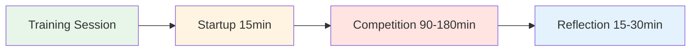

# Træningssession: Guide til konkurrencetræning

<AdBanner />

## Hvordan 4 spillere kan træne sammen regelmæssigt

Denne guide viser, hvordan man opretter en regelmæssig træningsgruppe på 4 spillere, der konkurrerer mod hinanden på forskellige overflader og i forskellige miljøer i 2-4 timer. Efterlign reel konkurrence, samtidig med at man opbygger psykologisk sikkerhed og mentale præstationsevner.

::: tip Træningssessionens filosofi
**Konkurrence uden refleksion er bare leg. Træning uden konkurrence er bare øvelse.** Dette format kombinerer begge dele: konkurrence hårdt, og reflekter derefter dybt.
:::



## Hvorfor 4 spillere?

**Det perfekte tal:**
- **2v2-format** - Afspejler ægte konkurrence
- **Rotationsmuligheder** - Skift partnere, spil singler
- **Peer learning** - Forskellige spillestile
- **Ansvarlighed** - Svært at afbestille på 3 personer
- **Intimitet** - Lille nok til dyb deling

::: info Gruppedynamikken
4 spillere skaber den ideelle balance mellem konkurrenceintensitet og psykologisk sikkerhed. I konkurrerer hårdt, men I støtter også hinandens vækst.
:::

## Find din gruppe

### Ideel gruppesammensætning

**Færdighedsniveau:**
- Lignende niveau (inden for 1-2 niveauer)
- Alle er engagerede i forbedringer
- Blanding af pointere og skydere
- Forskellige spillestilarter

**Tankegang:**
- Åben for sårbarhed
- Villig til at reflektere
- Konkurrencepræget men støttende
- Vækstorienteret

**Logistik:**
- Bor inden for 30 minutter fra hinanden
- Kan forpligte sig til en fast tidsplan
- Lignende tilgængelighed

### Rekruttering af din gruppe

**Hvor finder man spillere:**
- Din klubs elitespillere
- Stammspillere i regionale turneringer
- Online petanquefællesskaber
- Spørg din træner om anbefalinger

**Invitationen:**
&gt; &quot;Jeg er ved at danne en lille træningsgruppe på 4 spillere, der gerne vil konkurrere regelmæssigt og arbejde på deres mentale spil. Vi ville mødes ugentligt i 2-3 timer, spille hårdt og derefter reflektere over, hvad vi lærer. Interesseret?&quot;

## Sessionsstruktur

### 2-timers session

| Tid | Aktivitet | Varighed |
|------|----------|----------|
| **Opstart** | Indtjekning og opsætning | 15 min |
| **Konkurrence** | 2 mod 2 kampe | 90 min |
| **Refleksion** | Debriefing og læring | 15 min |

### 3-timers session

| Tid | Aktivitet | Varighed |
|------|----------|----------|
| **Opstart** | Indtjekning og opsætning | 15 min |
| **Konkurrencerunde 1** | 2 mod 2 kampe | 60 min |
| **Pause** | Hvile og uformel snak | 15 min |
| **Konkurrencerunde 2** | Skift partnere | 60 min |
| **Reflektion** | Dybdegående debriefing | 30 min |

### 4-timers session

| Tid | Aktivitet | Varighed |
|------|----------|----------|
| **Opstart** | Indtjekning og opsætning | 20 min |
| **Konkurrencerunde 1** | 2 mod 2 kampe | 75 min |
| **Pause** | Hvile og mellemmåltid | 15 min |
| **Konkurrencerunde 2** | Skift partnere | 75 min |
| **Pause** | Hvile | 10 min |
| **Konkurrencerunde 3** | Single eller udfordring | 45 min |
| **Refleksion** | Dybdegående debriefing og planlægning | 30 min |

<AdInArticle />

## Opstartsprotokol (15-20 minutter)

### 1. Fysisk opsætning (5 min)

**Vælg terræn:**
- Roter gennem forskellige overflader hver uge
- Varierende sværhedsgrad og betingelser
- Vælger nogle gange ubehageligt terræn med vilje

**Opsæt pladsen:**
- Marker tydeligt grænser
- Forbered måleværktøjer
- Vandstation
- Skygge om nødvendigt

### 2. Mental check-in (10 min)

**Indtjekningscirklen:**

Stil dig i en cirkel (ingen boules endnu) og gå rundt:

**Hver person deler:**
1. **Energiniveau** (1-10): &quot;Jeg er på en 7 i dag&quot;
2. **Mental tilstand**: &quot;Jeg føler mig fokuseret&quot; eller &quot;Jeg er distraheret af arbejdsstress&quot;
3. **Intention**: &quot;I dag vil jeg arbejde på at bevare roen efter misser&quot;

**Hvorfor dette er vigtigt:**
- Skaber bevidsthed om mental tilstand
- Skaber empati i gruppen
- Sætter individuelt fokus for sessionen
- Normaliserer at være &quot;off&quot; nogle dage

**Tip til facilitator:** Skift til den første hver uge

### 3. Påmindelse om grundregler (5 min)

**Mind kort på følgende ved hver session:**

::: Grundregler for tipsession
1. **Konkurrer hårdt** - Spil for at vinde, uden at holde dig tilbage
2. **Støt vækst** - Hjælp hinanden med at lære
3. **Respekter brugermanualer** - Vis respekt for, hvordan hver person ønsker at blive behandlet
4. **Vær til stede** - Ingen telefoner under leg
5. **Reflekter ærligt** - Del, hvad der virkelig sker indeni
6. **Fortrolighed** - Det, der deles her, forbliver her
:::

**Balancen:**
&gt; &quot;Vi konkurrerer, som om det var en turnering, men vi støtter hinanden, som om vi var holdkammerater. Hårde ved spillet, bløde ved personen.&quot;

## Regler for konkurrenceadfærd

### Matchformat

**Standard 2v2:**
- Spil til 13 point
- Standard petanqueregler
- Hold regnskab ærligt
- Mål når det er nødvendigt (gæt ikke)

**Rotationsmuligheder:**

**Uge 1:** A+B vs. C+D
**Uge 2:** A+C vs. B+D
**Uge 3:** A+D vs. B+C
**Uge 4:** Single round-robin

### Skaber et konkurrencemiljø

::: warning Kritisk: Gør det til virkelighed
**Dette er ikke almindelig træning.** Betragt det som en turnering:

✅ **Gør:**
- Hold officielle score
- Mål præcist
- Kald fodfejl
- Tag det alvorligt
- Fejr gode skud
- Vis skuffelse over tab

❌ **Gør ikke:**
- Giv &quot;genopfriskninger&quot;
- Vær for afslappet
- Lad dårlige opkald passere
- Spøg gennem hele spillet
- Lav undskyldninger
:::

### Den mentale præstationstwist

**Spor to noder:**

1. **Traditionel score** - Vundne point
2. **Mental præstationsscore** - Hvor godt du håndterede dit indre spil

**Kriterier for mental præstation (selvscoring 1-5 efter hver kamp):**

| Kriterium | 1 (Dårlig) | 3 (God) | 5 (Fremragende) |
|-----------|-----------|-----------|---------------|
| **Forblev til stede** | Dvælede ved tidligere optagelser | Mest til stede | Fuldt ud i nuet |
| **Håndteret indre kritiker** | Hård selvsnak | Fanget og omformuleret | Brugt indre coach |
| **Følelsesregulering** | Synlig frustration | Forblev stort set rolig | Rolig hele vejen igennem |
| **Understøttet partner** | Ignoreret eller bebrejdet | Grundlæggende support | Brugt brugermanual |
| **Fokus** | Distraheret, ufokuseret | Mest fokuseret | Laserfokuseret |

**I alt:** /25 pr. kamp

**Hvorfor dette er vigtigt:**
- Skifter fokus fra resultat til proces
- Skaber bevidsthed om det mentale spil
- Skaber ansvarlighed for indre arbejde
- Hylder mental præstation, ikke kun sejre

### Variation af miljøet

**Rotér gennem forskellige udfordringer:**

**Uge 1: Hjemmeterræn**
- Din almindelige piste
- Komfortable forhold
- Fokus: Opbygning af selvtillid

**Uge 2: Vanskeligt terræn**
- Ujævn, udfordrende overflade
- Fokus: Følelsesmæssig regulering, accept

**Uge 3: Anden lokation**
- En anden klubs piste
- Fokus: Tilpasningsevne

**Uge 4: Trykforhold**
- Tilskuere (inviter andre til at se med)
- Fokus: Håndtering af eksternt pres

**Uge 5: Vejrudfordring**
- Vind, varme eller kulde
- Fokus: Mental styrke

**Uge 6: Tidspres**
- Skudur (30 sekunder pr. kast)
- Fokus: Beslutningstagning under pres

```mermaid
graph TD
    A[Vary Environment] --> B[Different Surfaces]
    A --> C[Different Locations]
    A --> D[Different Conditions]
    A --> E[Different Pressures]

    B --> F[Build Adaptability]
    C --> F
    D --> F
    E --> F

    style A fill:#e8f5e9
    style F fill:#fff4e1


## Reflection Protocol (15-30 minutes)

**Critical:** This is where the learning happens. Don't skip it!

### Short Reflection (15 min)

**After each game, quick debrief:**

**Go around the circle, each person shares:**

1. **Mental Performance Score** (1-5): "I give myself a 4 today"
2. **One thing that went well mentally**: "I stayed calm after my miss in the 3rd end"
3. **One thing to work on**: "I need to catch my inner critic faster"

**Group discussion:**
- "What did you notice about your inner game today?"
- "When did you feel most in the zone?"
- "When did you lose focus?"

### Deep Reflection (30 min)

**After final game, deeper debrief:**

**Structure:**

**1. Individual Journaling (5 min)**

Write privately:
- What happened in my mind during pressure moments?
- When did I use my Inner Coach vs. Inner Critic?
- How did I support my partner?
- What pattern am I noticing about myself?

**2. Pair Sharing (10 min)**

Partner up, share:
- One insight from journaling
- One question you're sitting with
- One commitment for next session

**3. Group Integration (15 min)**

Full circle:
- Each person shares ONE key learning
- Group identifies themes
- Discuss: "What are we learning as a group?"
- Set focus for next session

**Closing:**
- Thank each other for showing up
- Confirm next session date/time
- One-word check-out: "How are you leaving?"

<AdInArticle />

## User Manual Integration

### Creating Your User Manuals

**In your first session together, each person completes:**

| Section | Prompt | Example |
|---------|--------|---------|
| **My Stress Signature** | "When I'm anxious, I..." | "...go completely quiet" |
| **How to Support Me** | "After a miss, I need..." | "...silence, not encouragement" |
| **My Trigger** | "I get defensive when..." | "...someone questions my shot choice" |
| **My Reset Signal** | "When I need a mental reset, I..." | "...touch my boules and take 3 breaths" |

**Share with the group and keep copies.**

### Using User Manuals During Play

**During competition:**
- Partner knows how to support you
- Teammates respect your needs
- No guessing about what helps

**Example:**
- Marc's User Manual says: "After a miss, I need 30 seconds of silence"
- His partner knows: Don't immediately encourage, give space
- Result: Marc feels understood, recovers faster

**This is psychological safety in action.**

## Advanced Variations

### The Mental Challenge Week

**Once a month, add a mental challenge:**

**Week 1: Silent Game**
- No talking during play
- Only non-verbal communication
- Focus: Internal awareness

**Week 2: Positive Self-Talk Only**
- Catch and reframe every negative thought
- Say Inner Coach phrase out loud
- Focus: Cognitive restructuring

**Week 3: Pressure Simulation**
- Play with spectators
- Announce score loudly
- Focus: External pressure management

**Week 4: Gratitude Game**
- After each end, state one thing you're grateful for
- Focus: Positive mindset

### The Vulnerability Round

**Every 4-6 weeks, dedicate a session to deeper sharing:**

**Format:**
- 30 min: Play one game
- 60 min: Deep reflection using [Workshop](./workshop) activities
- 30 min: Play final game applying insights

**Activities to use:**
- Fear in a Hat
- Reframing Inner Critic
- The Iceberg
- User Manual updates

**Why this matters:**
- Prevents the group from becoming just "playing buddies"
- Maintains psychological safety
- Deepens learning
- Builds authentic connection

## Tracking Progress

### Individual Tracking

**Keep a training journal:**

After each session, record:
- Date, location, conditions
- Partners and opponents
- Traditional score
- Mental performance score (1-5)
- Key insights
- Patterns noticed
- Commitments for next time

**Monthly review:**
- What's improving?
- What patterns keep showing up?
- What's my mental performance trend?
- What do I need to focus on?

### Group Tracking

**Shared document (Google Sheet):**

| Date | Location | Teams | Score | Mental Perf | Key Learning |
|------|----------|-------|-------|-------------|--------------|
| Jan 7 | Club A | A+B vs C+D | 13-11 | 4.2 avg | Staying calm in wind |
| Jan 14 | Club B | A+C vs B+D | 13-8 | 3.8 avg | Managing inner critic |

**Benefits:**
- See progress over time
- Notice group patterns
- Celebrate improvements
- Identify focus areas

## Sustaining the Group

### Commitment Agreement

**At the start, agree on:**

**Frequency:**
- Weekly? Bi-weekly? Monthly?
- Same day/time each week?
- How many sessions committed to? (suggest minimum 8-12)

**Cancellation Policy:**
- 24-hour notice required
- Maximum 2 cancellations per person per quarter
- If someone cancels repeatedly, have a conversation

**Rotation:**
- Who chooses location each week?
- Who facilitates reflection?
- How do we keep it fresh?

### Handling Conflicts

**When tension arises:**

::: warning Address It, Don't Avoid It
**The mistake:** Letting resentment build

**The solution:** Use it as a learning moment

**Script:**
> "I notice some tension. Can we pause and talk about what's happening? This is exactly the kind of moment we can learn from."
:::

**Common conflicts:**
- Disagreement on calls
- Perceived unfairness
- Personality clashes
- Competitive intensity

**Resolution process:**
1. Pause the game
2. Each person shares their perspective
3. Group validates both sides
4. Agree on how to move forward
5. Return to play

**This builds psychological safety.**

### Keeping It Fresh

**Avoid stagnation:**

**Every 8-12 weeks, change something:**
- Invite a 5th player for variety
- Play at a tournament together
- Do a mini training camp (full day)
- Bring in a guest coach
- Try a new format (singles, different scoring)
- Do a deep vulnerability session

**The goal:** Keep learning, keep growing, keep it interesting

## Integration with Tournaments

### Pre-Tournament Prep

**2 weeks before a major tournament:**

**Session focus:**
- Play on similar terrain
- Simulate tournament pressure
- Practice competition-day nutrition
- Rehearse pre-shot routines
- Visualize success

**Mental preparation:**
- What's your intention for the tournament?
- What's your Inner Coach phrase?
- What's your reset signal?
- How will you handle pressure?

### Post-Tournament Debrief

**After a tournament:**

**Dedicate a session to reflection:**

**Structure:**
- 30 min: Share tournament experience
- 30 min: What worked? What didn't?
- 30 min: What did you learn about yourself?
- 30 min: Play a game applying learnings

**Questions:**
- When did you feel most in the zone?
- When did you lose it?
- How did you handle pressure?
- What would you do differently?
- What are you proud of?

**This cements learning and builds resilience.**

## Resources & Tools

### From This Site

- [Workshop Guide](./workshop) - Deep facilitation protocols
- [Training Camp Guide](./training-camp) - Weekend intensive format
- [Nutrition](./education/nutrition/) - Competition-day protocols
- [Mental Strength](./education/mental-strength/) - Inner game concepts
- [Mindfulness](./education/mindfulness/) - Presence techniques
- [Tactics](./education/tactics/) - Strategic thinking

### Recommended Tools

**Journaling:**
- Physical notebook or digital app
- Prompt: "What happened in my mind today?"

**Video Analysis:**
- Phone camera on tripod
- Review technique and body language
- Notice patterns

**Meditation Apps:**
- Headspace, Calm, Insight Timer
- 5-10 minutes before sessions

**Tracking:**
- Google Sheets for group data
- Personal spreadsheet for trends

## Success Stories

### Example: The Stockholm Four

**Group:** 4 elite players, ages 28-45
**Frequency:** Weekly, 3 hours
**Duration:** 18 months

**Results:**
- All 4 improved tournament rankings
- 2 made national team
- Mental performance scores increased from 3.2 to 4.5 average
- Group still meets 3 years later

**Key factors:**
- Consistent commitment
- Deep vulnerability work
- Honest reflection
- Mutual support

### Example: The Barcelona Crew

**Group:** 4 club players wanting to compete regionally
**Frequency:** Bi-weekly, 2 hours
**Duration:** 6 months

**Results:**
- Confidence increased dramatically
- All 4 entered first regional tournament
- 1 placed in top 8
- Group expanded to 8 players

**Key factors:**
- Started small and built trust
- Focused on mental game
- Celebrated small wins
- Kept it fun

## Common Challenges

### "We just end up playing, not reflecting"

**Solution:**
- Set a timer
- Designate a "reflection keeper"
- Make reflection non-negotiable
- Start with just 10 minutes

### "One person dominates"

**Solution:**
- Use structured sharing (everyone gets 2 minutes)
- Rotate who speaks first
- Gently redirect: "Let's hear from others"

### "It's getting stale"

**Solution:**
- Change locations
- Try new formats
- Do a vulnerability session
- Invite a guest
- Take a break and come back fresh

### "Someone's not committed"

**Solution:**
- Have an honest conversation
- Revisit commitment agreement
- Consider finding a replacement
- It's okay if someone leaves

## Getting Started Checklist

::: details Your First Session Checklist

**Before Session 1:**
- [ ] Find your 4 players
- [ ] Agree on frequency and duration
- [ ] Choose first location
- [ ] Share this guide with everyone
- [ ] Create group chat

**Session 1 Agenda:**
- [ ] Introductions and intentions
- [ ] Agree on ground rules
- [ ] Complete User Manuals
- [ ] Play first game
- [ ] Short reflection
- [ ] Schedule next 4 sessions

**Ongoing:**
- [ ] Rotate locations
- [ ] Track progress
- [ ] Deep reflection every 4-6 weeks
- [ ] Adjust format as needed
- [ ] Celebrate improvements
:::

## Final Thoughts

::: tip The Power of Regular Practice
**Consistency beats intensity.** Four players meeting regularly, competing hard, and reflecting deeply will improve faster than sporadic tournament play alone.

**Why?**
- Regular feedback loop
- Psychological safety to experiment
- Accountability and support
- Deliberate practice on mental game
- Community and connection

**The result:** You don't just get better at pétanque. You become a more complete competitor.
:::

<AdBanner />

