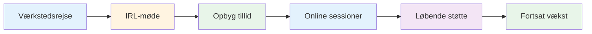
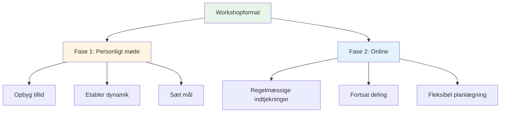
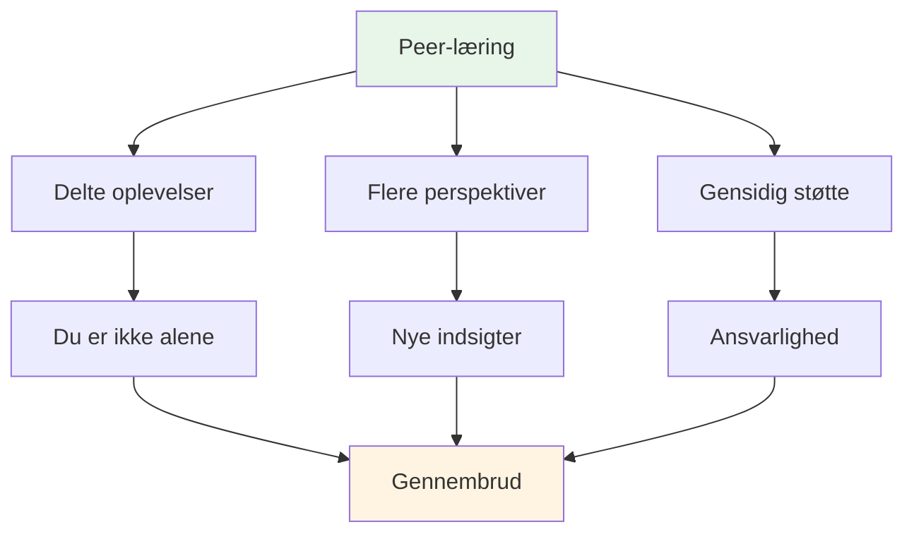

# Værksted

## Fora for elitespillere

Vores workshops er intime fora, hvor elitespillere deler oplevelser og åbner op for deres indre tanker om spillet, præstationer og mentale udfordringer.

::: tip Hvad gør vores workshops anderledes
**Små, kuraterede grupper af elitespillere i et trygt rum til ærlig diskussion.** Dette er ikke et foredrag - det er en peer learning-oplevelse, hvor I deler, lærer og vokser sammen.
:::

## Format

### Små grupper
::: info Gruppestørrelse
- **6-8 spillere** pr. workshop
- Omhyggeligt udvalgte grupper for optimal dynamik
- Trygt rum for ærlig diskussion
- Alle bidrager, alle lærer
:::

### Hybrid tilgang

| Fase | Format | Formål | Fordele |
|-------|--------|---------|----------|
| **Første møde** | Personligt (IRL) | Bygg fundament | Tillid, forbindelse, gruppedynamik |
| **Løbende sessioner** | Online | Bevar momentum | Regelmæssig support, fleksibilitet, ansvarlighed |

::: details Fase 1: Personligt møde
**Hvorfor møde op først?**
- Skab tillid og kontakt ansigt til ansigt
- Skab gruppedynamik og tryghed
- Sæt intentioner og mål sammen
- Skab fundamentet for ærlig deling

**Hvad sker der:**
- Introduktioner og målsætning
- Indledende øvelser og diskussioner
- Etablering af gruppenormer
- Opbygning af rapport
:::

::: details Fase 2: Online sessioner
**Hvorfor online for løbende brug?**
- Regelmæssige check-ins uden rejse
- Fortsat deling og støtte
- Fleksibel planlægning for travle spillere
- Hold momentum mellem personlige møder

**Hvad sker der:**
- Statusopdateringer og udfordringer
- Peer-støtte og problemløsning
- Ansvarlighedstjek
- Fortsat læring og vækst
:::

## Hvad man kan forvente

### Emner vi udforsker

| Areal | Fokus | Resultater |
|------|-------|----------|
| **Mentalt spil** | Flowtilstand, tryk, fokus | Konsekvent toppræstation |
| **Personlige udfordringer** | Frygt, blokeringer, frustrationer | Gennembrud og løsninger |
| **Peer-læring** | Delte oplevelser | Nye perspektiver og indsigter |
| **Praktiske værktøjer** | Teknikker og øvelser | Øjeblikkelig anvendelse |
| **Fællesskab** | Løbende støtte | Langsigtet vækst |

::: tip Værkstedserfaring
- 🧠 Dybdegående diskussioner om spillets mentale aspekter
- 💬 Deling af personlige oplevelser og udfordringer
- 🤝 Peer-støtte og ansvarlighed
- 🛠️ Praktiske øvelser og teknikker
- 👥 Et fællesskab af spillere, der er engagerede i vækst
:::

## Hvem bør deltage?

::: info Ideelle deltagere
- **Elitespillere**, der ønsker at tage det næste skridt
- Spillere, der har **mestret teknikken**, men ønsker mere
- Dem, der er interesserede i det **mentale spil**
- Spillere er åbne for **ærlig selvrefleksion**
- Engageret i **personlig vækst**
:::

::: warning Ikke en god match, hvis
- Du søger kun teknisk coaching
- Du er ikke tryg ved at dele i en gruppe
- Du er ikke villig til at være sårbar
- Du ønsker hurtige løsninger uden at gøre arbejdet
:::

## Værdien af peer learning

::: tip Hvorfor peergrupper virker
Elitespillere står over for unikke udfordringer, som andre ikke forstår. I en workshop er du sammen med folk, der **forstår det** - presset, forventningerne, de mentale kampe. Dette skaber et trygt rum for reel vækst.
:::

## Klar til at deltage?

::: info Næste trin
Workshops annonceres i vores [Nyheder](/da/nyheder/) sektion. Hold øje med kommende datoer og tilmeldingsoplysninger.
:::

