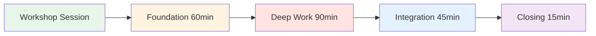
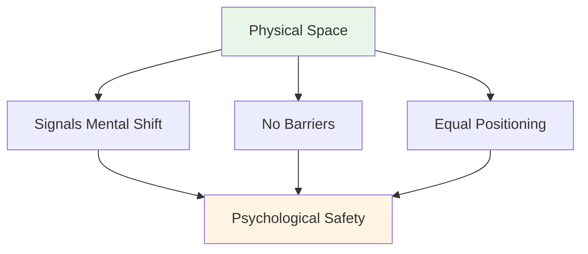
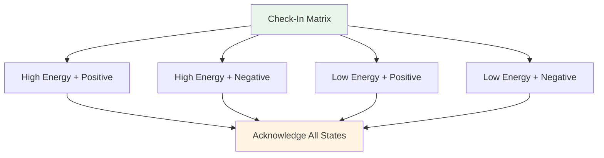
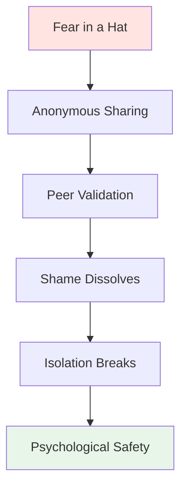

# Workshop: Teoretisk sessionsguide

<AdBanner />

## En omfattende guide til koordinatorer

Denne guide hjælper dig med at afholde en 3-4 timers teoretisk workshop med 6-8 elitespillere. Som **Mental Performance Coordinator (MPC)** vil du facilitere dybdegående diskussioner om det mentale spil og skabe psykologisk tryghed, der omsættes til præstation på pisten.

::: warning Kritisk koncept
**Du er ikke teknisk træner eller terapeut.** Din rolle er at facilitere sårbarhedsbaseret læring, der hjælper spillerne med at forstå forbindelsen mellem deres indre tanker og deres præstation.
:::

## Forberedelse før workshoppen

### Koordinatorens rolle

::: info Dine ansvarsområder
- **Faciliter, ikke forelæs** - Du styrer diskussionen, ikke underviser i teknik
- **Hold rummet** - Skab og oprethold psykologisk tryghed
- **Bro mellem teori og praksis** - Forbind hjemmesideindhold med indre oplevelse
- **Overvåg gruppedynamikken** - Læg mærke til, hvem der er engagerede, og hvem der er modstandsdygtige
- **Overhold grænser** - Vid, hvornår du skal søge professionel hjælp
:::

### Essentielle kompetencer

| Kompetence | Hvad det betyder | Hvordan man udvikler sig |
|------------|----------------|----------------|
| **Emotionel intelligens** | Opdag mikroudtryk af ubehag | Øv aktiv observation |
| **Neutral autoritet** | Opbyg respekt uden teknisk magt | Skab troværdighed gennem tilstedeværelse |
| **Sportskontekst** | Forstå trykmekanik | Lær petanque-terminologi og -kultur |
| **Verbal Aikido** | Tilpas dig modstanden, bekæmp den ikke | Øv dig i ikke-defensiv kommunikation |

::: details Vigtige petanque-udtryk, du skal kende
- **Carreau** - Perfekt skud, der forskyder modstanderens kugle
- **Bibber** - &quot;Yips&quot; - ufrivillig rysten under udløsning
- **Donnée** - Det &quot;givne&quot; - at acceptere terrænet, som det er
- **Portée** - Kast uden at hoppe
- **Roulette** - Rullende skud
- **Cochonnet** - Målkuglen (jack)
:::

## Fysisk opsætning: Den magiske cirkel

### Krav til placering

::: warning Kritisk opsætning
**Vælg et neutralt område VÆK fra pisten.** Dette signalerer et skift fra fysisk til mentalt arbejde.

Krav:
- ✅ Lydisoleret eller privat
- ✅ Behagelig temperatur
- ✅ Ingen distraktioner (telefoner slukket)
- ✅ Naturligt lys, hvis muligt
- ✅ Adskilt fra træningsområdet
:::

### Cirkelkonfigurationen

**Siddepladser:**
- Perfekt cirkel af stole
- **INGEN BORDE** - Borde skaber barrierer og skjuler kropssprog
- Alle stole i samme højde (ingen elektriske positioner)
- Koordinator sidder som en del af cirklen (ikke foran)

**Centerartefakter:**
- Placer boules og cochonet i midten
- Forankrer arbejdet til sporten
- Visuel påmindelse om fælles formål

## Sessionsstruktur (3-4 timer)

### Fase 1: Grundlæggende (60 minutter)

#### 1. Velkomst og grundregler (15 min)

**Den sociale kontrakt:**

::: tip beholderen - Vigtige grundregler
Før enhver deling begynder, SKAL gruppen acceptere:

1. **Fortrolighed** - Hvad der siges her, bliver her
2. **Vegas-reglen** - Lektioner forlader rummet, historier bliver
3. **Ingen reparationer** - Vær vidne til og forstå, prøv ikke at løse
4. **Ret til at passere** - Sårbarhed kan ikke påtvinges
5. **Respekter processen** - Stol på ubehaget
:::

**Dit manuskript:**
&gt; &quot;Velkommen. Dette rum er anderledes end pisten. Her udforsker vi, hvad der sker *inde*, når du står over det billede. Alt, der deles her, er fortroligt. De lektioner, du lærer, kan forsvinde, men de personlige historier bliver. I er ikke her for at reparere hinanden - bare for at forstå. Og I kan altid give afkald på det. Kan alle blive enige om dette?&quot;

#### 2. Aktivitet: Indtjekningsmatricen (20 min)

**Mål:** Normalisere indrømmelsen af træthed eller stress

**Materialer:** Whiteboard eller flipover, gule sedler

**Procedure:**
1. Tegn en 2x2-matrix: Høj/lav energi (lodret), positiv/negativ (horisontal)
2. Hver spiller skriver sit navn på en seddel
3. Placer noten i dens nuværende kvadrant
4. Diskuter: &quot;Vi har tre personer i &#39;Lav energi/negativ&#39;. Hvordan påvirker dette vores session i dag?&quot;

**Tips til facilitering:**
- Bedøm ikke nogen kvadrant som &quot;dårlig&quot;
- Spørg: &quot;Hvad har din krop brug for lige nu?&quot;
- Læg mærke til mønstre: &quot;Tre af jer er i det samme rum - hvad handler det om?&quot;

#### 3. Aktivitet: Pétanques isbjerg (25 min)

**Mål:** Visualiser skjulte indre tanker

**Materialer:** Stort papir, tuscher

**Procedure:**
1. Tegn et isbjerg på papir
2. **Over vandet:** Skriv &quot;Teknikken, Kastet, Resultatet&quot;
3. **Under vandet:** Spørg: &quot;Hvad sker der i dit sind, som ingen ser?&quot;

**Instruktioner:**
- &quot;Hvad er du bange for, når du træder frem for at skyde?&quot;
- &quot;Hvilken dom er du bekymret for?&quot;
- &quot;Hvad siger din indre stemme, når du bommer?&quot;

**Indsigtsspørgsmålet:**
&gt; &quot;Hvad sker der med din kastearm, når &#39;undervands&#39;-tingene bliver for tunge?&quot;

Dette forbinder mental belastning med fysisk spænding (snak/yip).

::: details Almindelige &quot;Under vand&quot;-svar
- Frygt for at svigte holdet
- Bekymret for at se dum ud
- Tvivl om evner
- Sammenligning med andre
- Pres for at bevise sin værdighed
- Frygt for at blive dømt af træner/holdkammerater
- Impostorsyndrom
:::

<AdInArticle />

### Fase 2: Dybdegående arbejde (90 minutter)

#### 4. Aktivitet: Brugermanualen (30 min)

**Mål:** Operationalisering af empati - hjælp holdkammerater med at forstå hinanden

**Materialer:** Arbejdsark (et pr. spiller)

**Skabelonen til brugermanualen:**

| Afsnit | Spørgsmål | Eksempel |
|---------|--------|---------|
| **Min stresssignatur** | &quot;Når jeg er angst,...&quot; | &quot;...bliver jeg helt stille&quot; |
| **Sådan håndterer du mig selv** | &quot;Når jeg misser et afgørende skud, har jeg brug for...&quot; | &quot;...stilhed, ikke opmuntring&quot; |
| **Min indre tanke** | &quot;Løgnen jeg fortæller mig selv er...&quot; | &quot;...at jeg ikke er god nok&quot; |
| **Min udløsende faktor** | &quot;Jeg bliver defensiv, når...&quot; | &quot;...nogen sætter spørgsmålstegn ved mit slagvalg&quot; |

**Procedure:**
1. Giv spillerne 10 minutter til at gennemføre i stilhed
2. Gå rundt i cirklen - hver person deler ÉN sektion
3. Andre kan stille opklarende spørgsmål (ikke råd!).
4. Koordinator validerer hver deling

**Faciliteringsmanuskript:**
&gt; &quot;Dette er din brugsanvisning. Når din holdkammerat ved, at du bliver stille, når du er ængstelig, vil de ikke tage det personligt. Når de ved, at du har brug for stilhed efter en fejl, vil de ikke forsøge at &#39;fikse&#39; dig. Sådan opbygger vi teamintelligens.&quot;

#### 5. Forbind hjemmesideindhold med indre tanker (30 min)

**Mål:** Forbinde teknisk indhold med psykologisk oplevelse

Vælg 2-3 sektioner fra Akademiets hjemmeside og udforsk det indre spil:

**Eksempel 1: Teknik - Grebet og Slip**

**Spørgsmålet om tillid:**
&gt; &quot;Når du er på 12-12 i en turnering, *føles* din hånd så som teknikbeskrivelsen? Er det musklerne, der ændrer sig, eller tanken &#39;Tab den ikke&#39;, der ændrer dit greb?&quot;

**Mikrotremoren:**
&gt; &quot;Hvem her mærker angstens &#39;mikrotremor&#39;? Hvilken indre tanke udløser det?&quot;

**Eksempel 2: Taktik - Pegning vs. Skydning**

**Risikoprofil:**
&gt; &quot;Når guiden siger &#39;Skyd for at vinde&#39;, er din reaktion så begejstring eller frygt? Hvad fortæller det dig om dit forhold til risiko?&quot;

**Bedrageren:**
&gt; &quot;Peger du nogensinde, når du *ved*, at du burde skyde, bare for at undgå den forlegenhed at misse? Hvad er prisen for den sikkerhed?&quot;

**Eksempel 3: Ernæring - Konkurrencedag**

**Komfortmadfælden:**
&gt; &quot;Spiser du, hvad din krop har brug for, eller hvad din angst ønsker? Hvordan kender du forskellen?&quot;

::: tip Faciliteringsteknik
Lad være med at holde foredrag om indholdet. Stil spørgsmål, der forbinder den tekniske information med deres levede erfaringer. Indsigten kommer fra DEM, ikke fra dig.
:::

#### 6. Aktivitet: Frygt i en hat (30 min)

**Mål:** Bryd isolationsløkken - vis at jævnaldrende deler dybe usikkerheder

**Materialer:** Papir, pen, hat/taske

**Procedure:**
1. Alle skriver en dyb karriere-/holdfrygt anonymt
2. Fold papirerne og bland hatten i
3. Hver spiller trækker en node (ikke sin egen)
4. Læs det højt
5. Validér det: &quot;Jeg kan forstå, hvorfor nogen ville have det sådan, fordi...&quot;

**Eksempel på frygt:**
- &quot;Jeg er bange for, at jeg har toppet og aldrig vil blive bedre&quot;
- &quot;Jeg er bekymret for, at mine holdkammerater synes, jeg er overvurderet&quot;
- &quot;Jeg er bange for, at jeg kvæles i det store øjeblik&quot;
- &quot;Jeg er bange for at blive erstattet af yngre spillere&quot;

**Kraften:**
Når spillerne hører deres hemmelige frygt blive læst højt og bekræftet af deres jævnaldrende, forsvinder skammen. De indser: &quot;Jeg er ikke alene. Det her er normalt.&quot;

**Koordinatorens rolle:**
- Valider ALLE frygt som legitime
- Minimer ikke: &quot;Det er ikke sandt!&quot; ugyldiggør følelsen
- Spørg: &quot;Hvor mange af jer har følt noget lignende?&quot;

### Fase 3: Integration (45 minutter)

#### 7. Aktivitet: Omformulering af den indre kritiker (25 min)

**Mål:** Kognitiv omstrukturering - ændring af den interne dialog

**Materialer:** Arbejdsark

**Procedure:**

**Trin 1: Identificér kritikeren (10 min)**
&gt; &quot;Skriv den PRÆCIS sætning ned, som din indre kritiker siger efter en fejltagelse. Ikke den høflige version - den brutale.&quot;

Eksempler:
- &quot;Du kvæles altid&quot;
- &quot;Alle ser dig fejle&quot;
- &quot;Du gør dig selv til grin&quot;
- &quot;Du hører ikke hjemme her&quot;

**Trin 2: Omformuler som indre coach (10 min)**
&gt; &quot;Omskriv det nu som din indre coach - fast, men støttende.&quot;

Eksempler:
- Kritiker: &quot;Du kvæles altid&quot; → Træner: &quot;Nulstil og træk vejret. Næste skud.&quot;
- Kritiker: &quot;Alle ser dig fejle&quot; → Træner: &quot;Fokuser på målet, ikke publikum&quot;
- Kritiker: &quot;Du gør dig selv til grin&quot; → Træner: &quot;Én chance ad gangen. Du har gjort det før.&quot;

**Trin 3: Partnerøvelse (5 min.)**
&gt; &quot;Del din Coach-frase med en partner. De vil minde dig om den, når de ser Kritikeren komme frem.&quot;

#### 8. Bro til pisten (20 min)

**Mål:** Opret brugbare protokoller til konkurrence

**Diskussionsspørgsmål:**
1. &quot;Hvad er ÉN ting fra i dag, du vil bruge i din næste konkurrence?&quot;
2. &quot;Hvordan ved dine holdkammerater, at du har brug for støtte?&quot;
3. &quot;Hvad er dit signal for &#39;Jeg har brug for en mental nulstilling&#39;?&quot;

**Opret teamprotokoller:**

| Situation | Protokol | Eksempel |
|-----------|----------|---------|
| **Efter en misser** | Tjek brugermanualen | &quot;Marc har brug for stilhed, Lisa har brug for et knytnævestød&quot; |
| **Føler pres** | Brug coach-frasen | &quot;Nulstil og træk vejret&quot; |
| **Holdspænding** | Timeout for opkald | &quot;Lad os tage 2 minutter&quot; |
| **Indre kritiker højlydt** | Fysisk nulstilling | Berørings-boules, dyb indånding |

### Fase 4: Afslutning (15 minutter)

#### 9. Udtjekning (10 min)

**Procedure:**
Gå rundt i cirklen, og hver person deler:
1. **Én ting du tager med dig:** &quot;Hvilken indsigt eller hvilket værktøj går du med?&quot;
2. **Én ting du efterlader:** &quot;Hvad giver du slip på?&quot;

**Koordinatorens rolle:**
- Tak hver enkelt person for deres bidrag
- Valider det udførte arbejde
- Mind om fortrolighed

#### 10. Opfølgningsprotokol (5 min)

::: warning Kritisk: Forebyg sårbarhed Tømmermænd
Dybt arbejde forårsager en &quot;sårbarhedstømmermænd&quot; - fortrydelse eller skam over at dele.

**Din 24-timers protokol:**
- Send en sms til alle, der har delt meget inden for 24 timer
- Besked: &quot;Tak for dit mod i går. Det, du delte, hjalp alle.&quot;
- Check ind: &quot;Hvordan har du det med sessionen?&quot;
:::

**Afslutningsmanuskript:**
&gt; &quot;Det, der skete her i dag, krævede mod. Du mødte op, du åbnede op, du stolede på processen. Det samme mod er det, du vil bringe til pisten. Husk: Lektionerne forlader dette rum, men historierne bliver. Tak.&quot;

<AdInArticle />

## Håndteringsmodstand

### Den &quot;for seje&quot; atlet

**Scenarie:** En spiller ruller med øjnene ved en sårbarhedsøvelse

**Strategi:** Verbal Aikido (Align og Pivot)

**Manuskript:**
&gt; &quot;Jeg forstår den reaktion, [Navn]. Helt ærligt, jeg forstår det. At tale om følelser føles blødt. Men pisten er ubehagelig. Hvis vi ikke kan håndtere ubehaget i dette rum, træner vi ikke vores tolerance for ubehaget i spillet. Kan du stole på mig i 20 minutter?&quot;

### Den tavse deltager

**Scenarie:** Nogen har ikke talt i 45 minutter

**Strategi:** Skab et indgangspunkt med lav indsats

**Manuskript:**
&gt; &quot;[Navn], jeg bemærker, at du tager det hele ind. Hvad er én ting, der giver genlyd hos dig indtil videre? Bare et ord.&quot;

### Den Overdelende

**Scenarie:** Nogen dominerer med lange historier

**Strategi:** Blid omdirigering

**Manuskript:**
&gt; &quot;Tak for det, [Navn]. Jeg vil gerne sikre mig, at alle har plads. Lad os høre fra en, der ikke har delt endnu.&quot;

### Fixeren

**Scenarie:** Nogen forsøger at løse andres problemer

**Strategi:** Styrk grundreglerne

**Manuskript:**
&gt; &quot;Jeg sætter pris på, at du vil hjælpe, men husk vores regel: vær vidne til og forstå, ikke reparer. [Original taler], hvad har du brug for lige nu?&quot;

## Materialecheckliste

::: details Værkstedsmaterialer
**Fysisk opsætning:**
- [ ] Stole (6-8, ingen borde)
- [ ] Boules og cochonnet til center
- [ ] Flipover eller whiteboard
- [ ] Markører

**Aktiviteter:**
- [ ] Sticky notes (Check-in matrix)
- [ ] Stort papir (Isbjergaktivitet)
- [ ] Brugermanual-arbejdsark
- [ ] Papir og kuglepenne (Frygt i en hat)
- [ ] Indre kritiker/coach-arbejdsark

**Logistik:**
- [ ] Vand til deltagerne
- [ ] Væv (følelsesmæssigt arbejde!)
- [ ] Timer (hold dig på tidsplanen)
- [ ] Deltagerkontaktliste (til opfølgning)
:::

## Koordinator Selvhjælp

::: warning Du har også brug for støtte
At holde plads til sårbarhed er følelsesmæssigt krævende.

**Efter workshoppen:**
- Afstemning med en kollega eller supervisor
- Skriv en dagbog om, hvad der skete for dig
- Tag en gåtur eller en fysisk pause
- Tag ikke deres historier med hjem
:::

## Måling af effekt

### Øjeblikkelig feedback

Til sidst, spørg:
1. &quot;På en skala fra 1-10, hvor tryg følte du dig ved at dele i dag?&quot;
2. &quot;Hvad er én ting, der ville gøre den næste session bedre?&quot;

### Langsigtet sporing

Opfølgning efter 2-4 uger:
- &quot;Har du brugt noget værktøj fra værkstedet?&quot;
- &quot;Hvordan har dit forhold til din indre kritiker ændret sig?&quot;
- &quot;Hvad er anderledes i din konkurrencementalitet?&quot;

## Næste skridt

::: tip Bygg videre på dette fundament
Denne workshop er fase 1. Overvej:
- **Opfølgningssessioner** (online eller personligt)
- **Integration på pisten** (se træningsguiden)
- **Holdprotokoller** (implementer brugermanualer i konkurrencer)
- **Individuelle check-ins** (for spillere, der har brug for mere støtte)
:::

<AdBanner />

