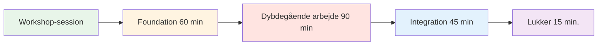
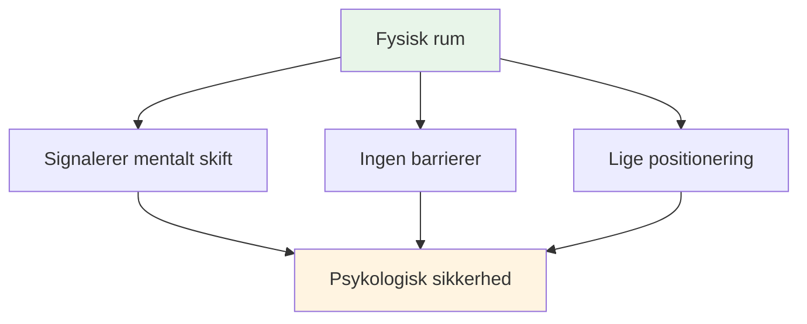
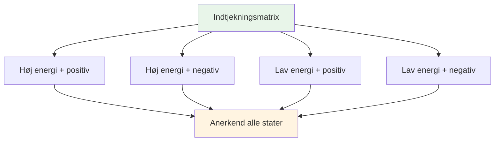
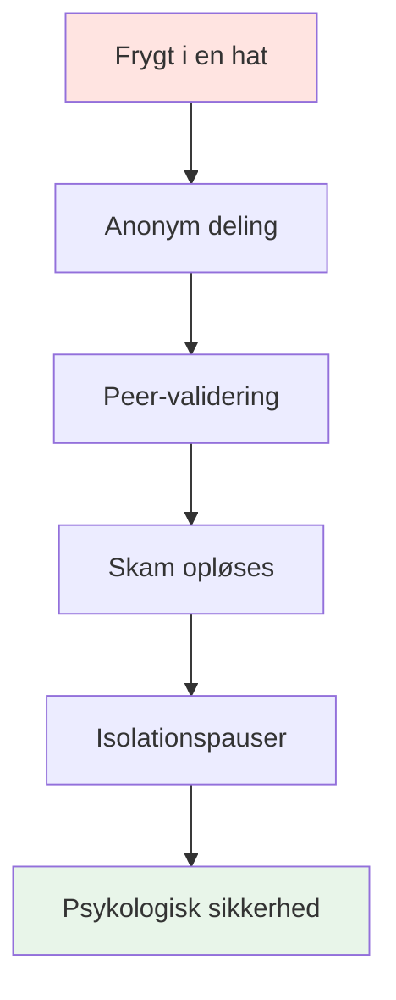

# Workshop: Avanceret mental spilsession (3-4 timer)

<AdBanner />

## Oversigt

Denne workshop er en avanceret teoretisk session på 3-4 timer for 6-8 elitespillere med fokus på dybdegående psykologisk arbejde og sårbarhedsbaseret læring. Den går ud over grundlæggende mentale færdigheder for at udforske det indre spil på et dybtgående niveau.

::: tip To afsnit i denne vejledning
- **[For deltagere](#for-participants)** - Hvad spillerne vil opleve og lære
- **[For facilitatorer](#for-facilitators)** - Sådan afholder du workshoppen som mental præstationskoordinator
:::

**Forskel fra begynderkursus:**
- **Begynder (2-3 timer):** Introduktion til mentale spilkoncepter → [Se Mental Rejse Guide](/da/mental-rejse/session-guide)
- **Avanceret (3-4 timer):** Dybdegående psykologisk arbejde med sårbarhedsøvelser (denne side)

## Hurtig adgang

| Afsnit | Formål | Adgang |
|---------|---------|--------|
| **For deltagere** | Hvad man kan forvente, og hvordan man forbereder sig | [Se sektion](#for-deltagere) |
| **For facilitatorer** | Komplet sessionsguide og øvelser | [Se sektion](#for-facilitatorer) |
| **Materialer til sessionen** | Øvelser og arbejdsark | [Se materialer](#facilitator-materials) |
| **Relaterede vejledninger** | Andre træningsformater | [Mental Rejse](/da/mental-rejse/) • [Træningslejr](/da/træningslejr) |

---

## For deltagere

### Hvad man kan forvente

Dette er ikke en typisk træningssession. Du vil deltage i dybe diskussioner om de mentale og følelsesmæssige aspekter af petanque, som sjældent bliver talt åbent om.

**Denne workshop er:**
- ✅ Et trygt rum til at udforske indre tanker og frygt
- ✅ Sårbarhedsbaseret læring med holdkammerater
- ✅ Forbinder mentale mønstre med præstation
- ✅ Opbygning af teamets psykologiske intelligens

**Denne workshop er IKKE:**
- ❌ Teknisk coaching eller taktiktræning
- ❌ Terapi eller rådgivning
- ❌ Positiv tænkning eller motivationstaler
- ❌ Dom eller kritik

### Sessionsstruktur

**Samlet varighed:** 3-4 timer
**Gruppestørrelse:** 6-8 spillere
**Format:** Cirkeldiskussion med strukturerede øvelser

### Hvad du vil lære

#### Fase 1: Grundlæggende (60 min)
- Grundregler for psykologisk tryghed
- &quot;Check-in matrixen&quot; - anerkendelse af din nuværende tilstand
- &quot;Pétanqueens isbjerg&quot; - udforskning af skjulte tanker

#### Fase 2: Dybdegående arbejde (90 min)
- Oprettelse af din &quot;brugermanual&quot; til holdkammerater
- Forbinder mentale mønstre med præstation
- &quot;Frygt i en hat&quot; - at bryde isolation gennem fælles sårbarhed

#### Fase 3: Integration (45 min)
- Omformulering af din indre kritiker til indre coach
- Oprettelse af holdprotokoller til konkurrencer
- Brugbare tips til pisten

#### Fase 4: Afslutning (15 min)
- Refleksion og engagement
- Opfølgende støtte

### Grundregler

Før sessionen begynder, accepterer alle deltagere at:

::: tip Containeren - Vigtige grundregler
1. **Fortrolighed** - Hvad der siges her, bliver her
2. **Vegas-reglen** - Lektionerne forlader rummet, historierne bliver
3. **Ingen reparation** - Vær vidne til og forstå, prøv ikke at løse
4. **Ret til at passere** - Sårbarhed kan ikke påtvinges
5. **Respekter processen** - Stol på ubehaget
:::

### Hvad skal man medbringe

**Påkrævet:**
- Åbent sind og villighed til at dele
- Dine egne oplevelser og udfordringer
- Respekt for andres sårbarhed

**Valgfri:**
- Notesbog til personlige refleksioner
- Spørgsmål om specifikke mentale udfordringer

### Vigtige aktiviteter, du vil opleve

#### Indtjekningsmatricen
Placer dig selv på et gitter af energi og humør. Normaliser, at vi alle har forskellige tilstande.

#### Petanqueens isbjerg
Udforsk hvad der sker under overfladen - tankerne og frygten, som ingen ser.

#### Brugermanualen
Lav en brugermanual til dig selv, så dine kolleger forstår, hvordan de kan støtte dig.

#### Frygt i en hat
Del anonymt dybe frygt og hør dem bekræftet af jævnaldrende. Bryd isolationen.

#### Indre kritiker omformulering
Forvandl hård selvsnak til støttende coachingsprog.

### Efter workshoppen

Du tager afsted med:
- Dybere forståelse af dine mentale mønstre
- Teamprotokoller for at støtte hinanden
- Omformulerede sætninger fra den indre coach
- Forbindelse til holdkammerater gennem delt sårbarhed
- Brugbare værktøjer til konkurrence

::: warning Sårbarhed Tømmermænd
Efter dyb deling kan du føle dig afsløret eller fortrydt. Dette er normalt. Facilitatoren vil kontakte dig inden for 24 timer. Husk: Det, du delte, hjalp alle.
:::

<AdInArticle />

---

## For facilitatorer

### Din rolle som koordinator for mental præstation

Som **Mental Performance Coordinator (MPC)** faciliterer du dybdegående diskussioner om det mentale spil og skaber psykologisk tryghed, der omsættes til præstation på pisten.

::: warning Kritisk koncept
**Du er ikke teknisk træner eller terapeut.** Din rolle er at facilitere sårbarhedsbaseret læring, der hjælper spillerne med at forstå forbindelsen mellem deres indre tanker og deres præstation.
:::

### Dit ansvar

::: info Nøgleansvarsområder
- **Faciliter, ikke forelæs** - Du styrer diskussionen, underviser ikke i teknik
- **Hold rummet** - Skab og oprethold psykologisk tryghed
- **Bro mellem teori og praksis** - Forbind hjemmesideindhold med indre oplevelse
- **Overvåg gruppedynamikken** - Læg mærke til, hvem der er engagerede, og hvem der er modstandsdygtige
- **Overhold grænser** - Vid, hvornår du skal søge professionel hjælp
:::

### Forberedelse før workshoppen

### Essentielle kompetencer

| Kompetence | Hvad det betyder | Sådan udvikler du |
|------------|---------------|----------------|
| **Emotionel intelligens** | Opdag mikroudtryk af ubehag | Øv aktiv observation |
| **Neutral autoritet** | Få respekt uden teknisk magt | Skab troværdighed gennem tilstedeværelse |
| **Sportskontekst** | Forstå trykmekanikken | Lær petanque-terminologi og -kultur |
| **Verbal Aikido** | Tilpas dig modstanden, kæmp ikke imod den | Øv dig i ikke-defensiv kommunikation |

::: details Vigtige petanque-udtryk at kende
- **Carreau** - Perfekt skud, der forskyder modstanderens kugle
- **Bibber** - &quot;Yips&quot; - ufrivillig rysten under udløsning
- **Donnée** - Det &quot;givne&quot; - at acceptere terrænet, som det er
- **Portée** - Kast uden at hoppe
- **Roulette** - Rullende skud
- **Cochonnet** - Målkuglen (jack)
:::

## Fysisk opsætning: Den magiske cirkel

### Krav til placering

::: warning Kritisk opsætning
**Vælg et neutralt område VÆK fra pisten.** Dette signalerer et skift fra fysisk til mentalt arbejde.

Krav:
- ✅ Lydisoleret eller privat
- ✅ Behagelig temperatur
- ✅ Ingen distraktioner (telefon slukket)
- ✅ Naturligt lys, hvis muligt
- ✅ Adskilt fra træningsområdet
:::

### Cirkelkonfigurationen

**Siddepladser:**
- Perfekt cirkel af stole
- **INGEN BORDE** - Borde skaber barrierer og skjuler kropssprog
- Alle stole i samme højde (ingen elektriske positioner)
- Koordinator sidder som en del af cirklen (ikke foran)

**Centerartefakter:**
- Placer boules og cochonet i midten
- Forankrer arbejdet til sporten
- Visuel påmindelse om fælles formål

## Sessionsstruktur (3-4 timer)

### Fase 1: Grundlæggende (60 minutter)

#### 1. Velkomst og grundregler (15 min)

**Den sociale kontrakt:**

::: tip Containeren - Vigtige grundregler
Før enhver deling begynder, SKAL gruppen acceptere:

1. **Fortrolighed** - Hvad der siges her, bliver her
2. **Vegas-reglen** - Lektionerne forlader rummet, historierne bliver
3. **Ingen reparation** - Vær vidne til og forstå, prøv ikke at løse
4. **Ret til at passere** - Sårbarhed kan ikke påtvinges
5. **Respekter processen** - Stol på ubehaget
:::

**Dit manuskript:**
> &quot;Velkommen. Dette rum er anderledes end pisten. Her udforsker vi, hvad der sker *inde*, når du står over det billede. Alt, der deles her, er fortroligt. De lektioner, du lærer, kan forsvinde, men de personlige historier bliver. I er ikke her for at reparere hinanden - bare for at forstå. Og I kan altid give afkald på det. Kan alle blive enige om dette?&quot;

#### 2. Aktivitet: Indtjekningsmatricen (20 min)

**Mål:** Normalisere indrømmelsen af træthed eller stress

**Materialer:** Whiteboard eller flipover, gule sedler

**Procedure:**
1. Tegn 2x2-matrix: Høj/lav energi (lodret), positiv/negativ (horisontal)
2. Hver spiller skriver sit navn på en seddel
3. Placer noten i deres nuværende kvadrant
4. Diskuter: &quot;Vi har tre personer i &#39;Lav energi/negativ&#39;. Hvordan påvirker dette vores session i dag?&quot;

**Tips til facilitering:**
- Døm ikke nogen kvadrant som &quot;dårlig&quot;
- Spørg: &quot;Hvad har din krop brug for lige nu?&quot;
- Læg mærke til mønstre: &quot;Tre af jer er i det samme rum - hvad handler det om?&quot;

#### 3. Aktivitet: Pétanques isbjerg (25 min)

**Mål:** Visualiser skjulte indre tanker

**Materialer:** Stort papir, tuscher

**Procedure:**
1. Tegn isbjerg på papir
2. **Over vandet:** Skriv &quot;Teknikken, Kastet, Resultatet&quot;
3. **Under vandet:** Spørg: &quot;Hvad sker der i dit sind, som ingen ser?&quot;

**Instruktioner:**
- &quot;Hvad er du bange for, når du træder frem for at skyde?&quot;
- &quot;Hvilken dom er du bekymret for?&quot;
- &quot;Hvad siger din indre stemme, når du bommer?&quot;

**Indsigtsspørgsmålet:**
> &quot;Hvad sker der med din kastearm, når &#39;undervands&#39;-tingene bliver for tunge?&quot;

Dette forbinder mental belastning med fysisk spænding (snak/yip).

::: details Almindelige &quot;under vand&quot;-svar
- Frygt for at svigte holdet
- Bekymret for at se dum ud
- Tvivl om evnen
- Sammenligning med andre
- Pres for at bevise værd
- Frygt for at blive dømt af træner/holdkammerater
- Impostor-syndrom
:::

<AdInArticle />

### Fase 2: Dybdegående arbejde (90 minutter)

#### 4. Aktivitet: Brugermanualen (30 min)

**Mål:** Operationalisering af empati - hjælp holdkammerater med at forstå hinanden

**Materialer:** Arbejdsark (et pr. spiller)

**Skabelonen til brugermanualen:**

| Afsnit | Hurtig | Eksempel |
|---------|--------|---------|
| **Min stresssignatur** | &quot;Når jeg er ængstelig, så...&quot; | &quot;...blive helt stille&quot; |
| **Sådan håndterer du mig** | &quot;Når jeg misser et afgørende skud, har jeg brug for...&quot; | &quot;...tavshed, ikke opmuntring&quot; |
| **Min indre tanke** | &quot;Løgnen jeg fortæller mig selv er...&quot; | &quot;...at jeg ikke er god nok&quot; |
| **Min udløser** | &quot;Jeg går i forsvarsposition, når...&quot; | &quot;...nogen sætter spørgsmålstegn ved mit valg af skud&quot; |

**Procedure:**
1. Giv spillerne 10 minutter til at gennemføre i stilhed
2. Gå rundt i cirklen - hver person deler ÉN sektion
3. Andre kan stille afklarende spørgsmål (ikke råd!).
4. Koordinator validerer hver deling

**Faciliteringsmanuskript:**
> &quot;Dette er din brugsanvisning. Når din holdkammerat ved, at du bliver stille, når du er ængstelig, vil de ikke tage det personligt. Når de ved, at du har brug for stilhed efter en fejl, vil de ikke forsøge at &#39;fikse&#39; dig. Sådan opbygger vi teamintelligens.&quot;

#### 5. Forbinde hjemmesideindhold med indre tanker (30 min)

**Mål:** Forbinde teknisk indhold med psykologisk oplevelse

Vælg 2-3 sektioner fra Akademiets hjemmeside og udforsk det indre spil:

**Eksempel 1: Teknik - Grebet og Slip**

**Spørgsmålet om tillid:**
> &quot;Når du er på 12-12 i en turnering, *føles* din hånd så som teknikbeskrivelsen? Er det musklerne, der ændrer sig, eller tanken &#39;Tab den ikke&#39;, der ændrer dit greb?&quot;

**Mikrotremoren:**
> &quot;Hvem her mærker angstens &#39;mikrotremor&#39;? Hvilken indre tanke udløser det?&quot;

**Eksempel 2: Taktik - Pegning vs. Skydning**

**Risikoprofil:**
> &quot;Når guiden siger &#39;Skyd for at vinde&#39;, er din reaktion så begejstring eller frygt? Hvad fortæller det dig om dit forhold til risiko?&quot;

**Bedrageren:**
> &quot;Peger du nogensinde, når du *ved*, at du burde skyde, bare for at undgå den forlegenhed at misse? Hvad er prisen for den sikkerhed?&quot;

**Eksempel 3: Ernæring - Konkurrencedag**

**Komfortmadfælden:**
> &quot;Spiser du, hvad din krop har brug for, eller hvad din angst ønsker? Hvordan kender du forskellen?&quot;

::: tip Faciliteringsteknik
Lad være med at holde foredrag om indholdet. Stil spørgsmål, der forbinder den tekniske information med deres levede erfaringer. Indsigten kommer fra DEM, ikke fra dig.
:::

#### 6. Aktivitet: Frygt i en hat (30 min)

**Mål:** Bryd isolationsløkken - vis at jævnaldrende deler dybe usikkerheder

**Materialer:** Papir, pen, hat/taske

**Procedure:**
1. Alle skriver en dyb karriere-/holdfrygt anonymt
2. Fold papirer og bland hatten i
3. Hver spiller trækker en node (ikke sin egen)
4. Læs det højt
5. Bekræft det: &quot;Jeg kan forstå, hvorfor nogen ville have det sådan, fordi...&quot;

**Eksempel på frygt:**
- &quot;Jeg er bange for, at jeg har toppet og aldrig vil blive bedre&quot;
- &quot;Jeg er bekymret for, at mine holdkammerater synes, jeg er overvurderet&quot;
- &quot;Jeg er bange for, at jeg kvæles i det store øjeblik&quot;
- &quot;Jeg er bange for at blive erstattet af yngre spillere&quot;

**Kraften:**
Når spillerne hører deres hemmelige frygt blive læst højt og bekræftet af deres jævnaldrende, forsvinder skammen. De indser: &quot;Jeg er ikke alene. Det her er normalt.&quot;

**Koordinatorens rolle:**
- Valider ALLE frygt som legitime
- Minimer ikke: &quot;Det er ikke sandt!&quot; ugyldiggør følelsen.
- Spørg: &quot;Hvor mange af jer har følt noget lignende?&quot;

### Fase 3: Integration (45 minutter)

#### 7. Aktivitet: Omformulering af den indre kritiker (25 min)

**Mål:** Kognitiv omstrukturering - ændring af den interne dialog

**Materialer:** Arbejdsark

**Procedure:**

**Trin 1: Identificér kritikeren (10 min)**
> &quot;Skriv den PRÆCIS sætning ned, som din indre kritiker siger efter en fejltagelse. Ikke den høflige version - den brutale.&quot;

Eksempler:
- &quot;Du kvæles altid&quot;
- &quot;Alle ser dig fejle&quot;
- &quot;Du gør dig selv til grin&quot;
- &quot;Du hører ikke hjemme her&quot;

**Trin 2: Omformuler som indre coach (10 min)**
> &quot;Omskriv det nu som din indre coach - fast, men støttende.&quot;

Eksempler:
- Kritiker: &quot;Du kvæles altid&quot; → Træner: &quot;Nulstil og træk vejret. Næste skud.&quot;
- Kritiker: &quot;Alle ser dig fejle&quot; → Træner: &quot;Fokuser på målet, ikke publikum&quot;
- Kritiker: &quot;Du gør dig selv til grin&quot; → Træner: &quot;Én chance ad gangen. Du har gjort det før.&quot;

**Trin 3: Partnerøvelse (5 min.)**
> &quot;Del din Coach-frase med en partner. De vil minde dig om den, når de ser Kritikeren komme frem.&quot;

#### 8. Bro til pisten (20 min)

**Mål:** Opret brugbare protokoller til konkurrence

**Diskussionsspørgsmål:**
1. &quot;Hvad er ÉN ting fra i dag, du vil bruge i din næste konkurrence?&quot;
2. &quot;Hvordan ved dine holdkammerater, at du har brug for støtte?&quot;
3. &quot;Hvad er dit signal for &#39;Jeg har brug for en mental nulstilling&#39;?&quot;

**Opret teamprotokoller:**

| Situation | Protokol | Eksempel |
|-----------|----------|---------|
| **Efter en misser** | Tjek brugermanualen | &quot;Marc har brug for stilhed, Lisa har brug for et knytnævestød&quot; |
| **Føler pres** | Brug Coach-frasen | &quot;Nulstil og træk vejret&quot; |
| **Holdspænding** | Opkaldstimeout | &quot;Lad os tage 2 minutter&quot; |
| **Højlydt indre kritiker** | Fysisk nulstilling | Berør boule, dyb indånding |

### Fase 4: Afslutning (15 minutter)

#### 9. Udtjekning (10 min)

**Procedure:**
Gå rundt i cirklen, og hver person deler:
1. **Én ting du tager med dig:** &quot;Hvilken indsigt eller hvilket værktøj tager du med dig?&quot;
2. **Én ting du efterlader:** &quot;Hvad giver du slip på?&quot;

**Koordinatorens rolle:**
- Tak hver person for deres bidrag
- Valider det udførte arbejde
- Mind om fortrolighed

#### 10. Opfølgningsprotokol (5 min)

::: warning Kritisk: Forebyg tømmermænd i sårbarheder
Dybt arbejde forårsager en &quot;sårbarhedstømmermænd&quot; - fortrydelse eller skam over at dele.

**Din 24-timers protokol:**
- Send en sms til alle, der har delt meget inden for 24 timer
- Besked: &quot;Tak for dit mod i går. Det, du delte, hjalp alle.&quot;
- Check ind: &quot;Hvordan har du det med sessionen?&quot;
:::

**Afslutningsmanuskript:**
> &quot;Det, der skete her i dag, krævede mod. Du mødte op, du åbnede op, du stolede på processen. Det samme mod er det, du vil bringe til pisten. Husk: Lektionerne forlader dette rum, men historierne bliver. Tak.&quot;

<AdInArticle />

## Håndtering af modstand

### Den &quot;for seje&quot; atlet

**Scenarie:** En spiller ruller med øjnene ved en sårbarhedsøvelse

**Strategi:** Verbal Aikido (Align og Pivot)

**Manuskript:**
> &quot;Jeg forstår den reaktion, [Navn]. Helt ærligt, jeg forstår det. Det føles blødt at tale om følelser. Men pisten er ubehagelig. Hvis vi ikke kan håndtere ubehaget i dette rum, træner vi ikke vores tolerance for ubehaget i spillet. Kan du stole på mig i 20 minutter?&quot;

### Den tavse deltager

**Scenarie:** Nogen har ikke talt i 45 minutter

**Strategi:** Skab et indgangspunkt med lav indsats

**Manuskript:**
> &quot;[Navn], jeg bemærker, at du tager det hele ind. Hvad er én ting, der giver genlyd hos dig indtil videre? Bare et ord.&quot;

### Den Overdelende

**Scenarie:** Nogen dominerer med lange historier

**Strategi:** Blid omdirigering

**Manuskript:**
> &quot;Tak for det, [Navn]. Jeg vil gerne sikre mig, at alle har plads. Lad os høre fra en, der ikke har delt endnu.&quot;

### Fixeren

**Scenarie:** Nogen forsøger at løse andres problemer

**Strategi:** Styrk grundreglerne

**Manuskript:**
> &quot;Jeg sætter pris på, at du gerne vil hjælpe, men husk vores regel: vær vidne til og forstå, ikke reparer. [Original taler], hvad har du brug for lige nu?&quot;

## Materialecheckliste

::: details Værkstedsmaterialer
**Fysisk opsætning:**
- [ ] Stole (6-8, ingen borde)
- [ ] Boules og cochonet til center
- [ ] Flipover eller whiteboard
- [ ] Markører

**Aktiviteter:**
- [ ] Sticky notes (Check-in matrix)
- [ ] Stort papir (isbjergaktivitet)
- [ ] Brugermanualens arbejdsark
- [ ] Papir og kuglepenne (Frygt i en hat)
- [ ] Indre kritiker/coach-arbejdsark

**Logistik:**
- [ ] Vand til deltagerne
- [ ] Væv (følelsesmæssigt arbejde!)
- [ ] Timer (hold dig på tidsplanen)
- [ ] Deltagerkontaktliste (til opfølgning)
:::

## Koordinator for egenomsorg

::: warning Du har også brug for støtte
At holde plads til sårbarhed er følelsesmæssigt krævende.

**Efter workshoppen:**
- Debrief med en kollega eller supervisor
- Journal om, hvad der skete for dig
- Tag en gåtur eller en fysisk pause
- Tag ikke deres historier med hjem
:::

## Måling af effekt

### Øjeblikkelig feedback

Til sidst, spørg:
1. &quot;På en skala fra 1-10, hvor tryg følte du dig ved at dele i dag?&quot;
2. &quot;Hvad er én ting, der ville gøre den næste session bedre?&quot;

### Langsigtet sporing

Opfølgning efter 2-4 uger:
- &quot;Har du brugt noget værktøj fra værkstedet?&quot;
- &quot;Hvordan har dit forhold til din indre kritiker ændret sig?&quot;
- &quot;Hvad er anderledes i din konkurrencementalitet?&quot;

## Næste trin

::: tip Bygger på dette fundament
Denne workshop er fase 1. Overvej:
- **Opfølgningssessioner** (online eller personligt)
- **Integration på pisten** (se træningsguiden)
- **Holdprotokoller** (implementer brugermanualer i konkurrencer)
- **Individuelle check-ins** (for spillere, der har brug for mere støtte)
:::

<AdBanner />

