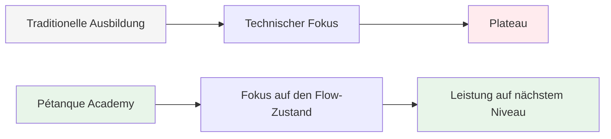
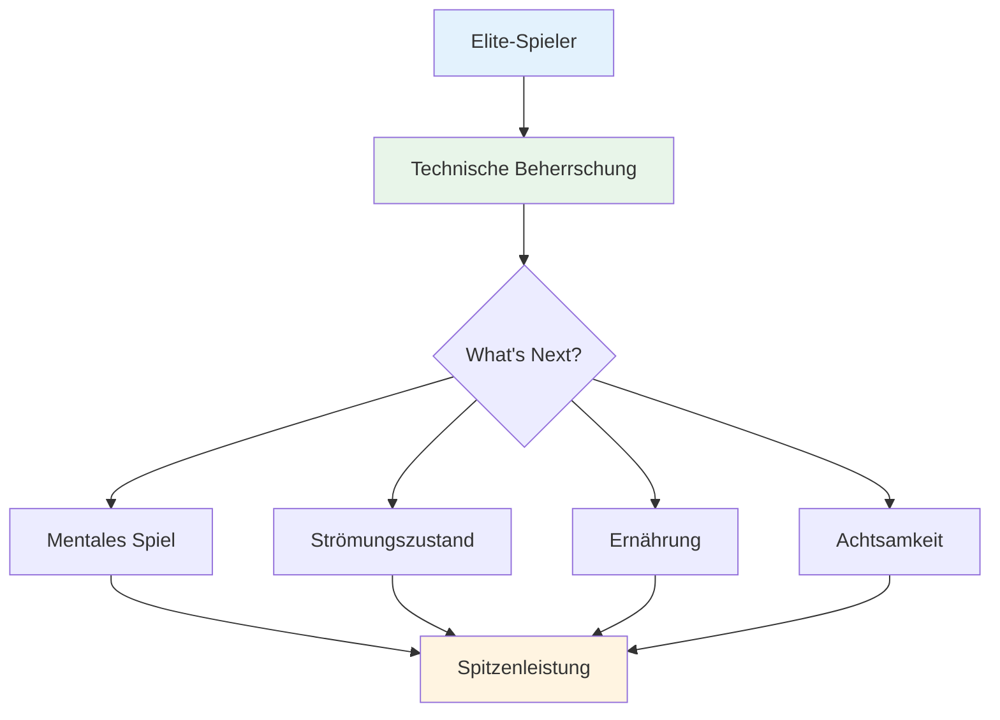

# Ehrgeiz

Unsere Mission ist es, Spitzenspielern dabei zu helfen, den nächsten Schritt in ihrer Entwicklung zu machen.

::: tip Unsere Vision
**Verwandeln Sie Spitzenspieler von technisch versiert in mental unaufhaltsam.** Wir helfen Ihnen, den Flow-Zustand zu erreichen, in dem perfekte Boule-Schläge zum natürlichen Ausdruck Ihrer Meisterschaft werden.
:::

## Über die Technik hinausgehen

Das traditionelle Training konzentriert sich stark auf technische Aspekte – Griff, Haltung, Wurftechnik. Diese Grundlagen sind zwar wichtig, aber Spitzenspieler beherrschen sie bereits.

::: info Der Durchbruch
**Auf der nächsten Stufe geht es nicht darum, die Technik zu perfektionieren – es geht darum, in den Flow-Zustand zu gelangen.**

Wir helfen Spielern, von einer rein technischen Trainingsperspektive zu einer **Flow-Perspektive (im Flow sein)** überzugehen, bei der perfekte Boule-Schläge zu einem natürlichen Ausdruck ihrer Meisterschaft werden und nicht zu einer bewussten Anstrengung.
:::

## Die Reise

## Unser Angebot

| Angebot | Beschreibung | Auswirkungen |
|----------|-------------|--------|
| **Workshops** | Kleine Gruppen von Spitzenspielern (6-8) | Intensives Lernen von Gleichaltrigen und Unterstützung |
| **Ausbildung** | Mentale Aspekte von Höchstleistungen | Praktische Techniken, die Sie sofort anwenden können |
| **Gemeinschaft** | Gleichgesinnte Spieler, die Grenzen verschieben | Verantwortlichkeit und gemeinsames Wachstum |
| **Ganzheitlicher Ansatz** | Ernährung, Denkweise und mentales Training | Vollständige Leistungsoptimierung |

::: tip Warum es funktioniert
Spitzenspieler verfügen bereits über die technischen Grundlagen. Was gute von großartigen Spielern unterscheidet, ist die Fähigkeit, unter Druck Höchstleistungen zu erbringen. Genau darauf konzentrieren wir uns.
:::

## Unser Ansatz

### 1. Flow-State-Training
Lerne, den „Flow“ regelmäßig und nicht zufällig zu erreichen.

### 2. Mentale Stärke
Entwickeln Sie Routinen, Achtsamkeit und Strategien zum Stressmanagement.

### 3. Intelligente Ernährung
Sorgen Sie für die nötige Energie, damit Ihr Gehirn konzentriert bleibt und Ihre Hände ruhig bleiben.

### 4. Lernen von Gleichaltrigen
Tauschen Sie sich in einem sicheren und unterstützenden Umfeld mit anderen Spitzenspielern aus.

::: info Bereit für den nächsten Schritt?
Erkunden Sie unseren Bereich [Bildung](/en/education/) oder erfahren Sie mehr über unsere [Workshops](/en/workshop).
:::

