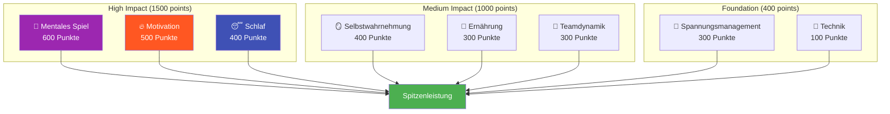

# Ehrgeiz

Unsere Mission ist es, Spitzenspielern dabei zu helfen, den nächsten Schritt in ihrer Entwicklung zu machen.

::: tip Unsere Vision
**Wir verwandeln Spitzenspieler von technisch versiert in mental unaufhaltsam.** Wir nutzen einen datengestützten Ansatz, um Ihre wirkungsvollsten Verbesserungsbereiche zu identifizieren.
:::

## Das 8-Faktoren-Leistungsmodell

Forschung und Erfahrung zeigen, dass die Leistung im Pétanque auf höchstem Niveau von **acht miteinander verbundenen Faktoren** abhängt. Die meisten Spieler konzentrieren sich zu sehr auf die Technik und vernachlässigen dabei die Faktoren, die gute von herausragenden Spielern unterscheiden.

### Warum die Technik das geringste Gewicht hat

::: warning Die unbequeme Wahrheit
**Die Technik macht in unserem Modell nur 100 von insgesamt 2.900 Punkten aus.**

Das liegt nicht daran, dass die Technik unwichtig wäre – sondern daran, dass Spitzenspieler bereits eine adäquate Technik entwickelt haben. Die geringfügige Verbesserung durch die Perfektionierung des Wurfs ist minimal im Vergleich zur Optimierung des Schlafs, dem Stressmanagement oder der Stärkung der mentalen Stärke.
:::

## Das ROI-Prinzip

Nicht alle Verbesserungen sind gleichwertig. Wir verwenden **ROI-Berechnungen**, um festzustellen, wo Ihre Trainingszeit den größten Effekt erzielt.

| Ihr Level | Faktor Gewichtung | ROI-Potenzial |
|------------|---------------|---------------|
| Geringe Fähigkeiten im Bereich hoher Gewichte | Hoch (z. B. 600) | **Maximal** |
| Hohes Können im Schwergewichtsbereich | Hoch (z. B. 600) | Niedrig (abnehmende Erträge) |
| Geringe Fähigkeiten im Leichtgewichtsbereich | Niedrig (z. B. 100) | Mäßig |
| Hohes Können im Leichtgewichtsbereich | Niedrig (z. B. 100) | **Minimal** |

**Beispiel:** Eine Verbesserung des Schlafs von 30 % auf 60 % (hoher Gewichtungsfaktor, geringes aktuelles Können) wird wahrscheinlich eine größere Wirkung haben als eine Verbesserung der Technik von 75 % auf 85 % (niedriger Gewichtungsfaktor, bereits hohes Können).

## Die 8 Faktoren erklärt

| Faktor | Gewicht | Was es beinhaltet |
|--------|--------|----------------|
| 🧠 **Denkspiel** | 600 | Denkmuster, Fokus, Selbstvertrauen, Zugang zum Flow-Zustand |
| 🔥 **Motivation** | 500 | Antrieb, Zielstrebigkeit, Zielorientierung, Beharrlichkeit |
| 😴 **Schlaf &amp; Erholung** | 400 | Qualitativ hochwertige Erholung, Wettkampfvorbereitungsprotokolle, Energiemanagement |
| 🪞 **Selbstwahrnehmung** | 400 | Genaue Selbstwahrnehmung, Erkennung blinder Flecken, Nutzung von Feedback |
| 🥗 **Ernährung** | 300 | Blutzuckerstabilität, Flüssigkeitszufuhr, Wettkampf-Energieversorgung |
| 🤝 **Teamdynamik** | 300 | Kommunikation, Vertrauen, Rollenklarheit, Teambeitrag |
| 💆 **Spannungsmanagement** | 300 | Körperliche Entspannung, Atemkontrolle, optimale Erregung |
| 🎯 **Technik** | 100 | Physikalische Eigenschaften, Wurfrepertoire, Konstanz |

## Entdecke deinen Weg

Wir haben ein **kostenloses Bewertungstool** entwickelt, das Ihre aktuellen Werte in allen 8 Faktoren analysiert und Ihre individuellen Verbesserungsprioritäten berechnet.

::: info Nehmen Sie an der Bewertung teil
**[→ Starten Sie Ihre Spielerentwicklungsbeurteilung](/de/assessment/)**

In 5 Minuten erhalten Sie:
- Ihr Radardiagramm über alle 8 Faktoren
- ROI-basierte Empfehlungen für die zu bearbeitenden Aufgaben
- Links zu spezifischen Lerninhalten für Ihre wichtigsten Prioritäten
- Option, Feedback von Teammitgliedern zu erhalten
:::

## Unser Angebot

| Angebot | Beschreibung | Link |
|----------|-------------|------|
| **Bewertungsinstrument** | Identifizieren Sie Ihre Bereiche mit dem höchsten ROI. | [Test absolvieren](/de/assessment/) |
| **Schulungsmodule** | Tiefgehende Inhalte zu allen 8 Faktoren | [Bildung durchsuchen](/de/education/) |
| **Workshops** | 3-4-stündige Trainingseinheiten für Gruppen von 6-8 Spielern | [Workshop-Leitfaden](/de/guides/workshop/) |
| **Trainingslager** | Wochenend-Intensivkurse, die Theorie und Praxis verbinden | [Camp Guide](/de/guides/training-camp/) |

## Unser Ansatz

### 1. Zuerst bewerten
Beginnen Sie mit einer ehrlichen Selbsteinschätzung. Holen Sie sich Feedback von Kollegen, um blinde Flecken zu erkennen.

### 2. Priorisierung nach ROI
Konzentriere dich auf die wichtigsten Faktoren, bei denen du Entwicklungspotenzial hast – nicht auf das, was sich bequem anfühlt.

### 3. Lerne die Wissenschaft kennen
Verstehe, *warum* etwas funktioniert, nicht nur, *was* zu tun ist.

### 4. Gezielt üben
Wende die Techniken im Training vor dem Wettkampf an. Entwickle Gewohnheiten, nicht nur Wissen.

### 5. Regelmäßig neu bewerten
Verfolge deinen Fortschritt. Deine Prioritäten werden sich mit deinen Fortschritten verändern.

::: tip Bereit für den nächsten Schritt?
**[→ Beginnen Sie mit der Selbsteinschätzung](/de/assessment/)** — Sie ist kostenlos und dauert 5 Minuten.

Oder erkunden Sie unseren Abschnitt [Bildung](/de/education/), um tiefer in einen der 8 Faktoren einzutauchen.
:::

