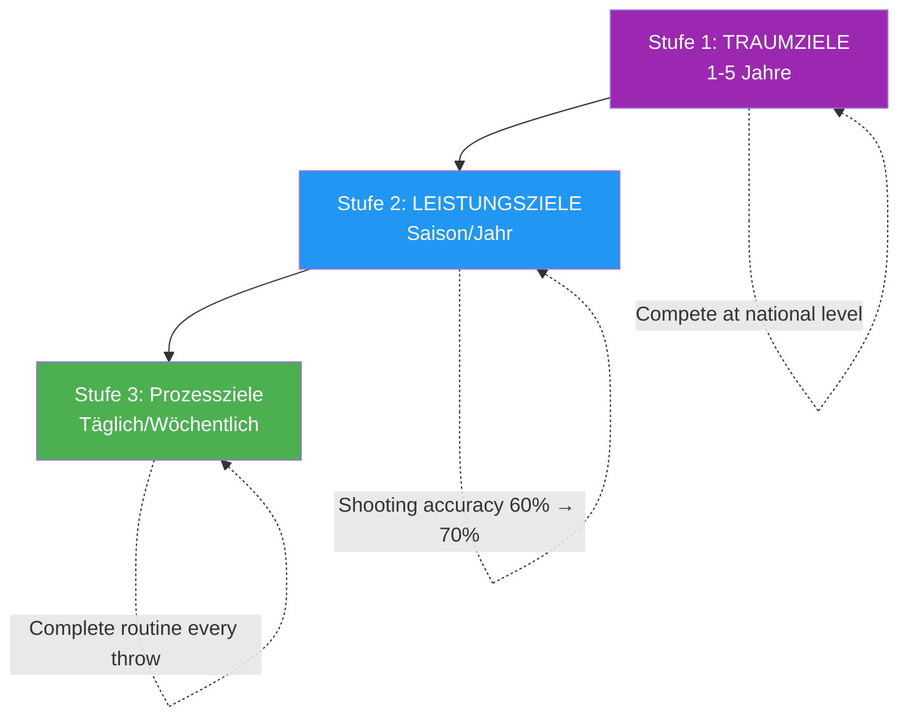

# Zielsetzung für Spitzensportler

> „Die richtigen Ziele beschleunigen die Entwicklung; die falschen führen zu Frustration und Stagnation.“

Zielsetzung scheint einfach: Man entscheidet, was man will, und arbeitet darauf hin. Doch Zielsetzung auf Spitzenniveau ist differenzierter.

::: warning Häufiger Fehler
Die meisten Spieler setzen sich nur Ergebnisziele („Die Meisterschaft gewinnen“). Man kann die Ergebnisse nicht kontrollieren – nur den Weg dorthin.
:::

---

## Über die grundlegenden Ziele hinaus

| Ergebniszielprobleme | Warum das ein Problem ist |
|----------------------|-------------------|
| Die Ergebnisse lassen sich nicht vollständig kontrollieren. | Erzeugt Hilflosigkeit |
| Erzeugt Druck ohne Richtung | Angst ohne Handlung |
| Erfolg oder Misserfolg ist binär. | Keine Teilsiege |
| Gibt keine Anleitung für die tägliche Praxis | Was machst du eigentlich? |

Die Zielsetzung auf Spitzenniveau geht tiefer.

---

## Die Zielhierarchie

### Stufe 1: Traumziele (1-5 Jahre)
Ihre größten Ziele:
- &quot;Auf nationaler Ebene antreten&quot;
- &quot;Als Eliteschütze anerkannt werden&quot;
- &quot;Gewinne eine Major-Meisterschaft&quot;

::: info Richtung vorgeben, nicht handeln
Sie geben Orientierung und Motivation, sind aber nicht im täglichen Leben umsetzbar.
:::

### Stufe 2: Leistungsziele (Saison/Jahr)
Messbare Verbesserungen in Ihrem Spiel:
- „Steigerung der Treffsicherheit von 60 % auf 70 %“
- „Reduzierung unnötiger Fehler um 25 %“
- &quot;Entwickeln Sie eine zuverlässige Plombée&quot;

Diese Faktoren liegen in Ihrer Hand und sind messbar.

### Stufe 3: Prozessziele (täglich/wöchentlich)
Die Maßnahmen, die zu Verbesserungen führen:
- &quot;Vollständige Vorbereitungsroutine vor jedem Wurf&quot;
- &quot;Üben Sie die Visualisierung täglich 10 Minuten lang.&quot;
- &quot;Trainiere deine Schusstechnik 3x pro Woche&quot;

::: tip Volle Kontrolle
**Die Prozessziele sind zu 100 % steuerbar.** Konzentrieren Sie sich hier, um maximale Wirkung zu erzielen.
:::

## Das SMART+-Framework

Gehen Sie über die grundlegenden SMART-Ziele hinaus:

### Spezifisch
Nicht „meine Treffsicherheit verbessern“, sondern „eine konstante Demi-Portée entwickeln, die aus 8 Metern Entfernung innerhalb von 30 cm des Ziels landet“.

### Messbar
Legen Sie fest, wie Sie den Fortschritt verfolgen werden:
- Erfolgsquoten in Prozent
- Konsistenzmetriken
- Videoanalyse-Marker

### Erreichbar, aber anspruchsvoll
Das Ziel sollte zwar Wachstum erfordern, aber realistisch sein. Ein Schütze mit einer Trefferquote von 60 %, der 65 % anstrebt, kann dies erreichen; 90 % anzustreben ist unrealistisch.

### Relevant
Ziele müssen mit Ihren übergeordneten Bestrebungen in Verbindung stehen und tatsächliche Schwächen angehen, nicht nur das, was leicht zu verbessern ist.

### Zeitgebunden
Klare Fristen setzen:
- „Bis zum Ende der Saison“
- &quot;Innerhalb von 3 Monaten&quot;
- &quot;Bis zur nationalen Meisterschaft&quot;

### + Persönlich bedeutsam
Das Ziel muss DIR wichtig sein, nicht nur deinem Trainer oder deinen Teamkollegen. Innere Motivation hält die Anstrengung aufrecht, wenn die Fortschritte langsam sind.

## Prozess- vs. Ergebnisorientierung

### Das Problem mit Ergebniszielen

„Das Spiel gewinnen“ schafft Probleme:
- Angst vor Dingen, die man nicht kontrollieren kann
- Ablenkung von der Hinrichtung
- Alles-oder-nichts-Denken
- Druck ohne Führung

### Die Macht der Prozessziele

„Führe meine Vorbereitungsroutine perfekt aus“ bietet:
- Volle Kontrolle
- Klarer Fokus
- Unmittelbares Feedback
- Führt auf natürliche Weise zu bestimmten Ergebnissen.

### Das Gleichgewicht

Nutzen Sie Ergebnisziele zur Motivation und Orientierung. Nutzen Sie Prozessziele für die tägliche Fokussierung und Umsetzung.

## Zielsetzung für verschiedene Phasen

### Nebensaison
Fokus auf Entwicklungsziele:
- Technische Verbesserungen
- Körperliche Konditionierung
- Aufbau mentaler Fähigkeiten
- Erweitern Sie Ihre Auswahl an Überwürfen

### Vorsaison
Übergang zur Integration:
- Kombination von Fähigkeiten unter spielähnlichen Bedingungen
- Verbesserungen im freundschaftlichen Wettbewerb testen
- Verfeinerungsstrategien

### Wettkampfsaison
Verlagerung hin zu Leistung und Prozess:
- Die Umsetzung dessen, was Sie entwickelt haben
- Prozessziele für jedes Spiel
- Minimale technische Änderungen

### Nach dem Wettbewerb
Reflexion und Planung:
- Analysieren Sie, was funktioniert hat.
- Wachstumsbereiche identifizieren
- Ziele für den nächsten Zyklus setzen

## Häufige Fehler bei der Zielsetzung

### Zu viele Tore
Konzentration ist Stärke. Zwei bis drei entscheidende Tore sind besser als zehn verstreute.

### Nur Ergebnisziele
Ohne Prozessziele gibt es keinen Fahrplan.

### Keine Flexibilität
Ziele sollten an neue Informationen angepasst werden. Starres Festhalten an überholten Zielen ist reine Zeitverschwendung.

### Vergleichsbasierte Ziele
„Sei besser als [Spieler]“ bedeutet, dass dein Erfolg in die Hände anderer gelegt wird.

### Vernachlässigung mentaler Ziele
Technische und physische Ziele stehen im Vordergrund, doch mentale Fähigkeiten entscheiden oft über den Sieg.

## Umsetzungsstrategien

### Schreibe sie auf
Schriftlich festgelegte Ziele werden mit deutlich höherer Wahrscheinlichkeit erreicht.

### Regelmäßig überprüfen
Die wöchentliche Überprüfung hält die Ziele präsent und ermöglicht Anpassungen.

### Selektiv teilen
Teile es mit denen, die dich unterstützen und nicht untergraben werden.

### Erfolg visualisieren
Stellen Sie sich regelmäßig vor, wie Sie Ihre Ziele erreichen – das Gefühl, den Moment.

### Fortschritt verfolgen
Was gemessen wird, wird auch gesteuert. Führen Sie Aufzeichnungen.

## Wenn Ziele nicht erreicht werden

Nicht erreichte Ziele sind keine Misserfolge – sie sind Daten:

1. **Analyse**: Warum wurde dieses Ziel nicht erreicht?
2. **Lernen**: Was lernst du daraus?
3. **Anpassen**: Ziel oder Vorgehensweise ändern.
4. **Weiter**: Beharrlichkeit schlägt Perfektion

## Das mentale Spiel der Tore

Ziele beeinflussen die Psychologie:
- **Zu einfach**: Langeweile, Selbstzufriedenheit
- **Zu schwierig**: Angstzustände, Entmutigung
- **Genau richtig**: Engagement, Fluss, Wachstum

Finde die ideale Balance, bei der Ziele herausfordernd, aber nicht überfordernd sind.

---

| *Verwandtes Thema: [Einführung in die Zielsetzung](/de/education/motivation/) | [SMART Goals](/de/education/motivation/smart-goals) | [Planung Ihrer Entwicklung](/de/education/motivation/planning)* |

