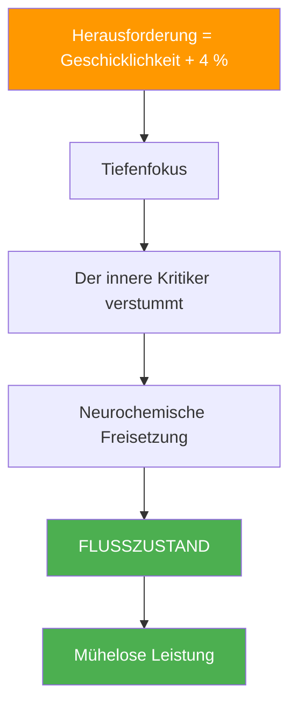
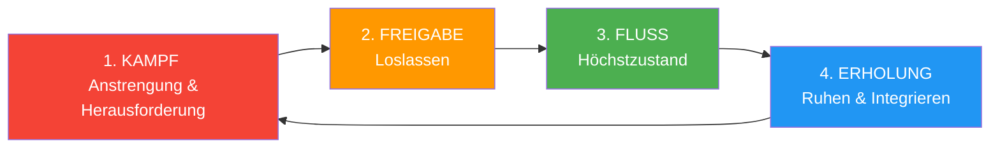

# Die Wissenschaft hinter den Strömungszuständen

> „Flow-Zustand – jener magische Zustand, in dem alles zusammenpasst, die Zeit langsamer vergeht und sich Leistung mühelos anfühlt.“

Es ist nichts Mystisches, sondern etwas Neurologisches. Wenn Sie die wissenschaftlichen Grundlagen des Flow-Erlebens verstehen, können Sie es regelmäßiger erreichen.

::: tip Wichtigste Erkenntnis
Flow lässt sich nicht erzwingen – aber man kann die Bedingungen schaffen, die sein Entstehen wahrscheinlicher machen.
:::

---

## Was ist Flow?

Der Psychologe Mihaly Csikszentmihalyi definierte Flow als „einen Zustand völliger Versenkung in eine Tätigkeit“. Beim Pétanque haben Sie es schon erlebt: Würfe, die sich automatisch anfühlen, Entscheidungen, die blitzschnell fallen, das Gefühl, dass Sie und das Spiel eins sind.

### Strömungseigenschaften

| Merkmal | Wie es sich anfühlt |
|----------------|-------------------|
| **Vollständige Absorption** | Das Spiel ist alles, was existiert |
| **Verlust des Selbstbewusstseins** | Kein innerer Kritiker |
| **Verzerrte Zeit** | Stunden fühlen sich wie Minuten an |
| **Intrinsische Motivation** | Spielen aus purer Freude daran |
| **Gefühl der Kontrolle** | Selbstbewusstsein ohne Arroganz |
| **Sofortiges Feedback** | Sofortige Anpassung |

## Die Neurowissenschaft des Flow-Erlebens

### Veränderungen im Gehirn während des Blutflusses

Wenn Sie in den Flow-Zustand geraten, durchläuft Ihr Gehirn messbare Veränderungen:

**Vorübergehende Hypofrontalität**
Der präfrontale Cortex – zuständig für Selbstkritik, Zweifel und Grübeleien – wird weniger aktiv. Deshalb fühlt sich Flow so mühelos an: Der innere Kritiker verstummt.

**Neurochemischer Cocktail**
Durch den Blutfluss wird eine starke Mischung von Neurotransmittern freigesetzt:
- **Dopamin**: Fördert Konzentration und Mustererkennung
- **Noradrenalin**: Steigert Wachheit und Aufmerksamkeit
- **Endorphine**: Erzeugen Wohlbefinden
- **Anandamid**: Fördert laterales Denken
- **Serotonin**: Erzeugt das Nachglühen des Blutflusses

**Veränderungen der Gehirnwellen**
Flow korreliert mit Verschiebungen von Beta-Wellen (normales Wachbewusstsein) zu Alpha- und Theta-Wellen (entspannte Wachheit und Kreativität).

## Die Flow-Trigger

Die Forschung hat Bedingungen identifiziert, die den Fluss wahrscheinlicher machen:

### 1. Ausgewogenes Verhältnis von Herausforderung und Können

Der Flow-Zustand entsteht, wenn die Herausforderung Ihr aktuelles Können leicht übersteigt – etwa 4 % über Ihrer Komfortzone. Zu einfach führt zu Langeweile; zu schwer führt zu Angstzuständen.

**Beim Boule:**
- Suche dir Gegner, die etwas besser sind als du.
- Stelle dir innerhalb der Spiele persönliche Herausforderungen.
- Variieren Sie Ihre Vorgehensweise, um das Engagement aufrechtzuerhalten.

### 2. Klare Ziele

Sie müssen wissen, was Sie erreichen wollen. Unklare Absichten führen nicht zu einem produktiven Arbeitsfluss.

**Beim Boule:**
- Definiere deine Absicht für jeden Wurf.
- Klare Spielziele festlegen
- Kenne deine Rolle im Team

### 3. Unmittelbares Feedback

Für einen reibungslosen Ablauf ist es notwendig zu wissen, wie es einem in Echtzeit geht.

**Beim Boule:**
- Das Ergebnis jedes Wurfes ist sofort sichtbar
- Lesen Sie die Geländereaktion
- Achten Sie auf die Rückmeldungen Ihres Körpers.

### 4. Tiefe Konzentration

Für einen Flow-Zustand ist konzentrierte Aufmerksamkeit ohne Ablenkung erforderlich.

**Beim Boule:**
- Entwickle deine Routine vor dem Spritzen
- Achtsamkeit üben
- Äußere Ablenkungen beseitigen

### 5. Kontrollgefühl

Das Gefühl, dass die eigenen Handlungen etwas bewirken und man Einfluss auf die Ergebnisse nehmen kann.

**Beim Boule:**
- Vertraue deinem Training
- Konzentriere dich auf das, was du kontrollieren kannst.
- Unsicherheit hinsichtlich der Ergebnisse akzeptieren

---

## Warum man den Fluss nicht erzwingen kann

::: warning Das Flussparadoxon
**Der Versuch, in den Flow-Zustand zu gelangen, verhindert ihn.** Flow entsteht, wenn man aufhört, ihn erreichen zu wollen, und sich einfach voll und ganz auf die Tätigkeit einlässt.
:::

Dies liegt daran:
- Der Versuch aktiviert den präfrontalen Cortex (das Gegenteil von Flow).
- Selbstüberwachung stört das Eintauchen
- Zielorientierung ersetzt Prozessorientierung

## Bedingungen für den Fluss schaffen

Man kann zwar keinen Fluss erzwingen, aber man kann Bedingungen schaffen, die ihn wahrscheinlicher machen:

### Vor dem Wettbewerb
- Ausreichender Schlaf und Ernährung
- Richtiges Aufwärmen
- Positiver mentaler Zustand
- Klare Absichten

### Während des Wettbewerbs
- Konzentriere dich auf die Gegenwart.
- Nutze deine Vorbereitungsroutine.
- Lass die Ergebnisse los
- Vertraue deinem Körper

### Umweltfaktoren
- Minimieren Sie Ablenkungen
- Angenehmer körperlicher Zustand
- Angemessener Schwierigkeitsgrad
- Unterstützende Teamdynamik

---

## Der Kreislauf

Der Fluss ist nicht konstant – er folgt einem Zyklus:

Das Verständnis dieses Kreislaufs hilft Ihnen dabei:
- Während der Kampfphase keinen erzwungenen Fluss erzwingen
- Erkennen, wann man loslassen muss
- Gewährleisten Sie eine ordnungsgemäße Wiederherstellung zwischen den Strömungszuständen.

## Flow in Team Pétanque

Der Flow kann ansteckend sein. Wenn ein Spieler in den Flow gerät, kann er sich auf seine Teamkollegen ausbreiten durch:
- Positive Energie und Körpersprache
- Verringerter Druck auf andere
- Gesteigertes kollektives Vertrauen
- Synchronisierter Teamrhythmus

## Gebäude-Durchflusskapazität

Wie jede Fähigkeit verbessert sich auch das Erreichen des Flow-Zustands durch Übung:

### Tägliche Praktiken
- Achtsamkeitsmeditation (fördert die Aufmerksamkeitskontrolle)
- Visualisierung (fördert die Aktivierung neuronaler Bahnen)
- Körperliches Training (bildet die Grundlage für die Fähigkeiten)

### In Ausbildung
- Übe an der Grenze deiner Fähigkeiten
- Auch bei Übungen volle Konzentration aufrechterhalten.
- Achten Sie darauf, wann ein Fluss auftritt und was ihm vorausging.

### Langfristige Entwicklung
- Erhöhen Sie schrittweise den Schwierigkeitsgrad
- Entwickle robuste Vorbereitungsroutinen
- Mentale Widerstandsfähigkeit für die schwierige Phase aufbauen

---

| *Verwandt: [Die Zone](/de/education/mental-game/the-zone/) | [In die Zone eintreten](/de/education/mental-game/the-zone/entering-the-zone) | [Achtsamkeitstechniken](/de/education/mental-game/mindfulness/techniques)* |

