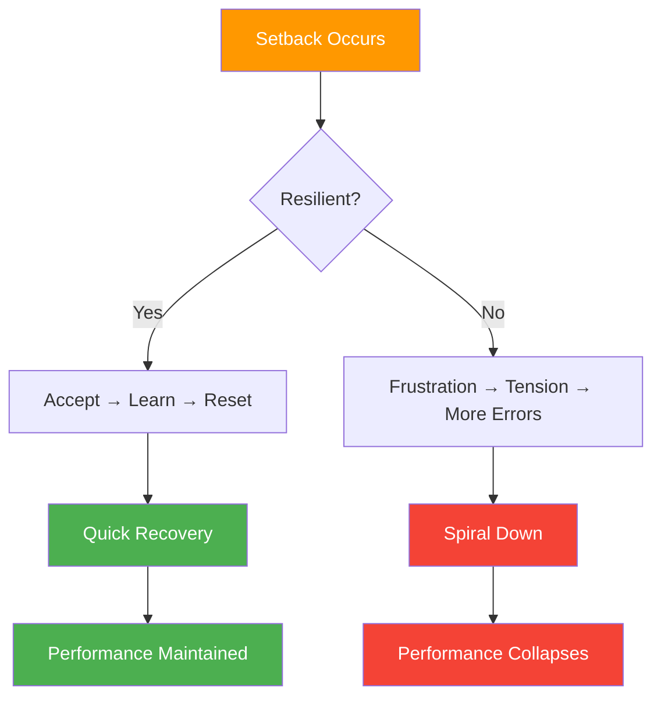

# Mental Resilience in Pétanque

> "Resilience isn't about never falling — it's about how quickly you get back up."

In pétanque, where momentum shifts rapidly and single throws can change everything, mental resilience often determines who wins.

::: tip The Resilience Truth
**Every elite player has bad moments.** What separates them is recovery speed — minutes, not matches.
:::

---

## What Is Mental Resilience?

Mental resilience is the ability to:
- Recover quickly from setbacks
- Maintain effort despite difficulties
- Adapt to changing circumstances
- Stay confident through adversity
- Learn from failures without being defined by them

---

## Why Resilience Matters in Pétanque

Pétanque tests resilience constantly:

| Challenge | Resilient Response | Non-Resilient Response |
|-----------|-------------------|------------------------|
| Perfect point gets shot | "Next throw" | "Unfair!" |
| Miss an "easy" shot | "Reset, move on" | "I always choke" |
| Opponents come back | "Stay focused" | "We're going to lose" |
| Teammate struggles | "Support them" | "They're ruining it" |

---

## The Resilience Mindset

### Fixed vs. Growth Mindset

| Fixed Mindset | Growth Mindset |
|---------------|----------------|
| "I missed because I'm not good enough" | "I missed — what can I learn?" |
| "I can't handle pressure" | "I'm learning to handle pressure" |
| "Failure means I'm a failure" | "Failure means I'm growing" |

::: info Key Insight
**Resilient players see setbacks as information, not identity.**
:::

### Controllables Focus

Resilient players focus on what they can control:
- Their preparation
- Their effort
- Their attitude
- Their response to events

They release what they can't control:
- Opponents' performance
- Weather conditions
- Lucky or unlucky bounces
- Others' opinions

### Long-Term Perspective

One throw, one match, one tournament — none define your career. Resilient players maintain perspective:
- "This is one moment in a long journey"
- "I've overcome setbacks before"
- "This will make me stronger"

## Building Resilience

### 1. Develop a Strong Foundation

Resilience is easier when you have:
- **Solid technique**: Confidence in your abilities
- **Physical fitness**: Energy to sustain effort
- **Mental skills**: Tools for managing adversity
- **Support network**: People who believe in you

### 2. Practice Adversity

You can't build resilience without facing challenges:
- Train in difficult conditions
- Practice when tired
- Compete against better players
- Put yourself in pressure situations

### 3. Develop Recovery Routines

Create rituals for bouncing back:

**Physical reset:**
- Deep breath
- Shake out tension
- Change posture

**Mental reset:**
- Acknowledge the setback
- Extract any lesson
- Refocus on the present

### 4. Build a Resilience Bank

Keep a mental record of times you've overcome adversity:
- Comebacks you've made
- Challenges you've faced
- Growth you've achieved

Draw on these memories when current challenges feel overwhelming.

## Resilience in Action

### After a Missed Shot

1. **Accept**: "That happened"
2. **Breathe**: One deep breath
3. **Learn**: Quick assessment (if useful)
4. **Release**: Let it go
5. **Refocus**: Next opportunity

### During a Losing Streak

1. **Perspective**: "Streaks end"
2. **Process**: Focus on execution, not results
3. **Patience**: Trust that performance will return
4. **Persistence**: Keep showing up

### When Opponents Are Dominating

1. **Respect**: Acknowledge their good play
2. **Focus**: Control what you can
3. **Compete**: Make them earn every point
4. **Learn**: What can you take from this?

### After a Tough Loss

1. **Feel**: Allow disappointment (briefly)
2. **Analyze**: What went well? What didn't?
3. **Extract**: Lessons for next time
4. **Move on**: Don't carry it forward

## The Resilience Killers

### Perfectionism
Expecting perfection guarantees disappointment. Excellence, not perfection, is the goal.

### Catastrophizing
"I missed that shot, the match is over, I'm terrible." One event doesn't determine everything.

### Comparison
Measuring yourself against others puts your confidence in their hands.

### Rumination
Replaying failures doesn't change them — it just extends their impact.

## Team Resilience

Resilience is contagious — both ways:

**Building team resilience:**
- Support struggling teammates
- Celebrate effort, not just results
- Model resilient responses
- Maintain positive body language

**Protecting against negativity:**
- Don't join complaint sessions
- Redirect negative conversations
- Focus on solutions, not problems

## Long-Term Resilience Development

### Daily Practices
- Gratitude journaling (builds positive perspective)
- Mindfulness meditation (builds emotional regulation)
- Physical exercise (builds stress tolerance)

### Weekly Reflection
- What challenges did I face?
- How did I respond?
- What would I do differently?
- What am I proud of?

### Seasonal Review
- Major setbacks and how I handled them
- Growth in resilience capacity
- Areas for continued development

## The Resilient Competitor

The most resilient competitors share traits:
- They expect challenges and prepare for them
- They see setbacks as temporary and specific
- They maintain effort when results lag
- They learn from every experience
- They keep perspective on what matters

Resilience isn't a trait you have or don't have — it's a skill you build through practice and intention.

---

*Related: [Mental Strength](/de/education/mental-game/mental-strength/) | [Handling Pressure](/de/education/mental-game/mental-strength/handling-pressure) | [The Zone](/de/education/mental-game/the-zone/)*

