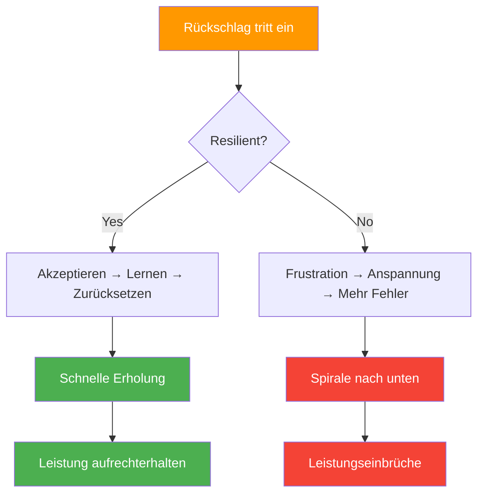

# Geistige Belastbarkeit beim Pétanque

> „Resilienz bedeutet nicht, niemals hinzufallen – sondern wie schnell man wieder aufsteht.“

Beim Pétanque, wo sich das Spielgeschehen schnell ändern kann und einzelne Würfe alles verändern können, entscheidet oft die mentale Stärke über den Sieg.

::: tip Die Wahrheit über Resilienz
**Jeder Spitzenspieler hat schlechte Momente.** Was sie unterscheidet, ist die Erholungsgeschwindigkeit – Minuten, nicht Spiele.
:::

---

## Was ist mentale Resilienz?

Mentale Widerstandsfähigkeit ist die Fähigkeit:
- Sich schnell von Rückschlägen erholen
- Trotz Schwierigkeiten die Anstrengung beibehalten
- Sich an veränderte Umstände anpassen
- Bewahre auch in schwierigen Zeiten Zuversicht.
- Lerne aus Fehlern, ohne dich von ihnen definieren zu lassen.

---

## Warum Resilienz beim Boule wichtig ist

Pétanque stellt die Belastbarkeit ständig auf die Probe:

| Herausforderung | Resiliente Reaktion | Nicht-resiliente Reaktion |
|-----------|-------------------|------------------------|
| Der perfekte Punkt wird getroffen. | &quot;Nächster Wurf&quot; | &quot;Unfair!&quot; |
| Einen vermeintlich einfachen Schuss verpassen | „Neustart, weiter geht’s“ | &quot;Ich versage immer.&quot; |
| Gegner kommen zurück | &quot;Bleib konzentriert&quot; | &quot;Wir werden verlieren.&quot; |
| Teamkollege hat Probleme | &quot;Unterstützt sie&quot; | &quot;Sie ruinieren es.&quot; |

---

## Die Resilienz-Mentalität

### Starres vs. dynamisches Mindset

| Starre Denkweise | Wachstumsdenken |
|---------------|----------------|
| „Ich habe verfehlt, weil ich nicht gut genug bin.“ | „Ich habe einen Fehler gemacht – was kann ich daraus lernen?“ |
| &quot;Ich kann mit Druck nicht umgehen.&quot; | „Ich lerne, mit Druck umzugehen.“ |
| &quot;Scheitern bedeutet, dass ich ein Versager bin.&quot; | &quot;Scheitern bedeutet, dass ich wachse.&quot; |

::: info Wichtigste Erkenntnis
**Resiliente Spieler sehen Rückschläge als Information, nicht als Identitätsmerkmal.**
:::

### Fokus auf kontrollierbare Faktoren

Resiliente Spieler konzentrieren sich auf das, was sie kontrollieren können:
- Ihre Vorbereitung
- Ihre Bemühungen
- Ihre Haltung
- Ihre Reaktion auf die Ereignisse

Sie lassen frei, was sie nicht kontrollieren können:
- Leistung der Gegner
- Wetterbedingungen
- Glückliche oder unglückliche Sprünge
- Meinungen anderer

### Langfristige Perspektive

Ein Wurf, ein Match, ein Turnier – nichts davon bestimmt deine Karriere. Widerstandsfähige Spieler bewahren die richtige Perspektive:
- „Dies ist ein Moment auf einer langen Reise.“
- „Ich habe schon früher Rückschläge überwunden.“
- „Das wird mich stärker machen.“

## Resilienz stärken

### 1. Eine solide Grundlage schaffen

Resilienz wird leichter, wenn man Folgendes hat:
- **Solide Technik**: Vertrauen in die eigenen Fähigkeiten
- **Körperliche Fitness**: Energie zur Aufrechterhaltung der Anstrengung
- **Mentale Fähigkeiten**: Werkzeuge zur Bewältigung von Widrigkeiten
- **Unterstützungsnetzwerk**: Menschen, die an dich glauben

### 2. Übe dich in Widrigkeiten

Resilienz lässt sich nicht aufbauen, ohne sich Herausforderungen zu stellen:
- Training unter schwierigen Bedingungen
- Üben, wenn man müde ist
- Messe dich mit besseren Spielern
- Begeben Sie sich in Drucksituationen.

### 3. Erholungsroutinen entwickeln

Schaffe Rituale, um wieder auf die Beine zu kommen:

**Physischer Reset:**
- Tief durchatmen
- Spannungen abbauen
- Körperhaltung ändern

**Mentale Neuorientierung:**
- Den Rückschlag anerkennen
- Eine beliebige Lektion extrahieren
- Konzentriere dich wieder auf die Gegenwart

### 4. Aufbau einer Resilienzbank

Notieren Sie sich im Geiste, wann Sie Widrigkeiten überwunden haben:
- Comebacks, die du geschafft hast
- Herausforderungen, denen Sie sich gestellt haben
- Das von Ihnen erreichte Wachstum

Greifen Sie auf diese Erinnerungen zurück, wenn Sie sich von den aktuellen Herausforderungen überwältigt fühlen.

## Resilienz in Aktion

### Nach einem Fehlschuss

1. **Akzeptieren**: &quot;Das ist passiert&quot;
2. **Atmen**: Ein tiefer Atemzug
3. **Lernen**: Kurze Selbsteinschätzung (falls hilfreich)
4. **Loslassen**: Lass es los
5. **Neuausrichtung**: Nächste Chance

### Während einer Pechsträhne

1. **Perspektive**: „Serien enden“
2. **Prozess**: Fokus auf die Umsetzung, nicht auf die Ergebnisse
3. **Geduld**: Vertrauen Sie darauf, dass sich die Leistung wieder einstellen wird.
4. **Durchhaltevermögen**: Immer wieder da sein

### Wenn die Gegner dominieren

1. **Respekt**: Würdigen Sie ihr gutes Spiel.
2. **Fokus**: Konzentriere dich auf das, was du beeinflussen kannst.
3. **Wettbewerb**: Lass sie sich jeden Punkt hart erkämpfen.
4. **Lernen**: Was können Sie daraus mitnehmen?

### Nach einer bitteren Niederlage

1. **Fühlen Sie sich**: Lassen Sie Enttäuschung (kurz) zu.
2. **Analysieren Sie:** Was lief gut? Was lief nicht gut?
3. **Auszug**: Lehren für das nächste Mal
4. **Machen Sie weiter**: Tragen Sie es nicht mit sich herum

## Die Resilienzkiller

### Perfektionismus
Perfektion zu erwarten, führt unweigerlich zu Enttäuschung. Exzellenz, nicht Perfektion, ist das Ziel.

### Katastrophisieren
„Ich habe den Schuss verfehlt, das Match ist vorbei, ich bin furchtbar.“ Ein einzelnes Ereignis entscheidet nicht über alles.

### Vergleich
Sich mit anderen zu vergleichen, bedeutet, sein Selbstvertrauen in deren Hände zu legen.

### Wiederkäuen
Das Wiederholen von Fehlern ändert nichts an ihnen – es verlängert lediglich ihre Auswirkungen.

## Teamresilienz

Resilienz ist ansteckend – und zwar in beide Richtungen:

**Stärkung der Teamresilienz:**
- Unterstützt eure Teamkollegen in schwierigen Situationen.
- Würdige den Einsatz, nicht nur die Ergebnisse.
- Modell für resiliente Reaktionen
- Achten Sie auf eine positive Körpersprache.

**Schutz vor Negativität:**
- Nehmen Sie nicht an Beschwerdesitzungen teil.
- Negative Gespräche umlenken
- Konzentriere dich auf Lösungen, nicht auf Probleme

## Entwicklung langfristiger Resilienz

### Tägliche Praktiken
- Dankbarkeitstagebuch (fördert eine positive Perspektive)
- Achtsamkeitsmeditation (fördert die Emotionsregulation)
- Körperliche Bewegung (steigert die Stresstoleranz)

### Wöchentliche Reflexion
- Welchen Herausforderungen musste ich mich stellen?
- Wie habe ich reagiert?
- Was würde ich anders machen?
- Worauf bin ich stolz?

### Saisonrückblick
- Größere Rückschläge und wie ich damit umgegangen bin
- Wachstum der Resilienzkapazität
- Bereiche für weitere Entwicklung

## Der widerstandsfähige Konkurrent

Die widerstandsfähigsten Wettbewerber weisen folgende Gemeinsamkeiten auf:
- Sie erwarten Herausforderungen und bereiten sich darauf vor.
- Sie betrachten Rückschläge als vorübergehend und spezifisch
- Sie halten auch dann an ihren Bemühungen fest, wenn die Ergebnisse hinter den Erwartungen zurückbleiben.
- Sie lernen aus jeder Erfahrung.
- Sie behalten den Blick für das Wesentliche.

Resilienz ist keine Eigenschaft, die man hat oder nicht hat – sie ist eine Fähigkeit, die man durch Übung und bewusste Anstrengung entwickelt.

---

| *Verwandt: [Mentale Stärke](/en/education/mental-game/mental-strength/) | [Umgang mit Druck](/en/education/mental-game/mental-strength/handling-pressure) | [Die Zone](/en/education/mental-game/the-zone/)* |

