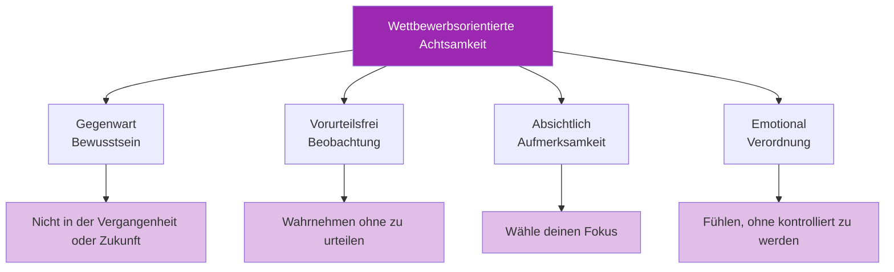

# Achtsamkeit im Wettbewerb

> „Achtsamkeit ist nicht nur etwas für Meditationskissen – sie ist ein Wettbewerbsvorteil.“

Die Fähigkeit, während Spielen präsent, aufmerksam und nicht reaktiv zu bleiben, unterscheidet Spitzensportler von denen, die unter Druck zusammenbrechen.

::: tip Der Vorteil des gegenwärtigen Augenblicks
**Man kann immer nur eine Boule-Kugel werfen.** Achtsamkeit hilft dir, im einzigen Moment zu bleiben, der zählt – diesem hier.
:::

---

## Was Achtsamkeit im Wettbewerb bedeutet

---

## Das Problem der abschweifenden Gedanken

::: danger Das 47%-Problem
**Studien zeigen, dass die Gedanken des Durchschnittsmenschen 47 % der Zeit abschweifen.** Im Wettbewerb ist dieses Abschweifen kostspielig.
:::

| Wohin die Gedanken gehen | Was Sie verpassen |
|-----------------|---------------|
| Letzter Fehlschuss | Aktuelle Geländemessung |
| Sich Sorgen um die Punktzahl machen | Optimale Wurfauswahl |
| Was andere denken | Gefühl der Boule |
| Feierlichkeiten planen | Ausführung im gegenwärtigen Moment |

Jeder Moment, den man mit gedanklichen Zeitreisen verbringt, ist ein Moment, den man nicht mit dem Wurf vor sich verbringt.

## Achtsamkeitsfähigkeiten für den Wettbewerb

### 1. Verankerung in der Gegenwart

Nutzen Sie sensorische Anker, um in die Gegenwart zurückzukehren:

**Physische Verankerungen:**
- Spüre das Gewicht des Balles
- Spüre deine Füße auf dem Boden
- Fühlen Sie die Textur des Griffs

**Umweltanker:**
- Betrachten Sie spezifische Details des Geländes.
- Hören Sie Umgebungsgeräusche
- Spüre die Temperatur und den Wind

### 2. Beobachten ohne zu reagieren

Wenn Emotionen aufkommen (Frustration, Angst, Aufregung), üben Sie Folgendes:

1. **Hinweis**: „Ich bin frustriert.“
2. **Name**: &quot;Das ist Frustration&quot;
3. **Erlauben**: Lass es einfach da sein, ohne dagegen anzukämpfen.
4. **Zurück**: Lenken Sie Ihre Aufmerksamkeit wieder auf die aktuelle Aufgabe.

Das Gefühl verschwindet nicht, aber es verliert seine Macht, dich zu kontrollieren.

### 3. Fokussierung auf einen einzigen Punkt

Übe deine Aufmerksamkeit darauf, dich auf eine Sache zu konzentrieren:

**Vor dem Wurf:**
- Konzentriere dich ausschließlich auf das Lesen des Geländes.
- Erst dann, wenn das Ergebnis visualisiert wird
- Dann nur noch abhängig von Ihrer Körperhaltung

**Während des Wurfs:**
- Konzentriere dich nur auf das Ziel
- Lass den Körper ohne Einmischung agieren.

### 4. Die Denkweise eines Anfängers

Gehe jeden Wurf so an, als wäre es dein erster:
- Keine Annahmen basierend auf der bisherigen Wertentwicklung
- Ein frischer Blick auf das Gelände
- Neugier statt Erwartung

## Praktische Anwendungen

### Zwischen den Würfen

Die Zeit zwischen den Würfen ist die Zeit, in der die Gedanken am ehesten abschweifen. Nutze diese Zeit bewusst:

- **Aktiv beobachten**: Beobachten Sie Ihre Teamkollegen und Gegner mit voller Aufmerksamkeit.
- **Bleibe im Einklang mit deinem Körper**: Achte auf deine Atmung, deine Haltung und deinen körperlichen Zustand.
- **Mentale Vorbereitung**: Mögliche Szenarien visualisieren
- **Aufmerksamkeitspausen**: Gönnen Sie Ihrer Konzentration kurze Pausen.

### Während Druckmomenten

Wenn es am meisten auf dem Spiel steht:

1. **Entschleunigen Sie**: Atmen Sie tief durch.
2. **Erde dich**: Spüre deine Füße, die Boule
3. **Enger Fokus**: Nur dieser Wurf
4. **Vertrauen**: Loslassen von der Ergebnisorientierung.

### Nach Fehlern

Fehler führen zu Grübeleien. Durchbrechen Sie den Kreislauf:

1. **Anerkennen**: „Das ist nicht wie geplant verlaufen.“
2. **Auszug**: „Was kann ich lernen?“
3. **Veröffentlichung**: „Es ist vorbei, weiter geht’s.“
4. **Neuausrichtung**: „Was kommt als Nächstes?“

## Die achtsame Vorbereitungsroutine

Integrieren Sie Achtsamkeit in Ihren Alltag:

1. **Ankommen**: Treten Sie mit voller Präsenz in den Kreis ein.
2. **Atmen**: Ein bewusster Atemzug zur Zentrierung
3. **Siehe:** Beobachten Sie das Gelände aufmerksam.
4. **Visualisieren**: Das Ergebnis klar erkennen
5. **Spüren**: Nimm die Kugel und deinen Körper wahr.
6. **Loslassen**: Lass los und vertraue.

## Häufige Herausforderungen

### &quot;Ich kann nicht aufhören zu denken&quot;

Du musst deine Gedanken nicht unterdrücken – folge ihnen einfach nicht. Nimm den Gedanken wahr, lass ihn vorbeiziehen und kehre zu deinem Anker zurück.

### „Achtsamkeit macht mich zu entspannt.“

Bei wettbewerbsorientierter Achtsamkeit geht es nicht darum, ruhig zu sein, sondern darum, präsent zu sein. Man kann gleichzeitig wach, energiegeladen und achtsam sein.

### &quot;Ich vergesse, achtsam zu sein.&quot;

Trigger verwenden:
- Das Aufheben der Boule-Kugel = Achtsamkeitsübung
- Das Betreten des Kreises = Erinnerung an die Anwesenheit
- Position beziehen = Aufmerksamkeitsanker

## Aufbau der Fähigkeit

### Tägliche Übung

5-10 Minuten formale Achtsamkeitsübungen bauen die neuronalen Verbindungen auf:
- Atemwahrnehmungsmeditation
- Körperscan-Übung
- Achtsamkeitsübungen

### Integration des Trainings

Übe Achtsamkeit während jeder Trainingseinheit:
- Volle Präsenz bei jedem Wurf
- Achten Sie darauf, wann Ihre Aufmerksamkeit abschweift.
- Übung zur Rückkehr zum Fokus

### Wettkampfvorbereitung

Vor den Spielen:
- Kurze Achtsamkeitsübung
- Setzen Sie sich eine Absicht für den Fokus auf die Gegenwart
- Erinnere dich an deine Ankerpunkte

## Der Wettbewerbsvorteil

Bewusste Wettbewerber haben Vorteile:
- **Schnellere Fehlerbehebung**
- **Bessere Entscheidungsfindung** unter Druck
- **Konstantere** Leistung
- **Mehr Freude** am Wettbewerb
- **Reduziertes Burnout** und weniger Angstzustände

Der Spieler, der bei jedem Wurf voll konzentriert ist, während die anderen in Gedanken versunken sind, hat einen deutlichen Vorteil.

---

| *Verwandt: [Einführung in die Achtsamkeit](/de/education/mental-game/mindfulness/) | [Achtsamkeitstechniken](/de/education/mental-game/mindfulness/techniques) | [Tägliche Übung](/de/education/mental-game/mindfulness/daily-practice)* |

