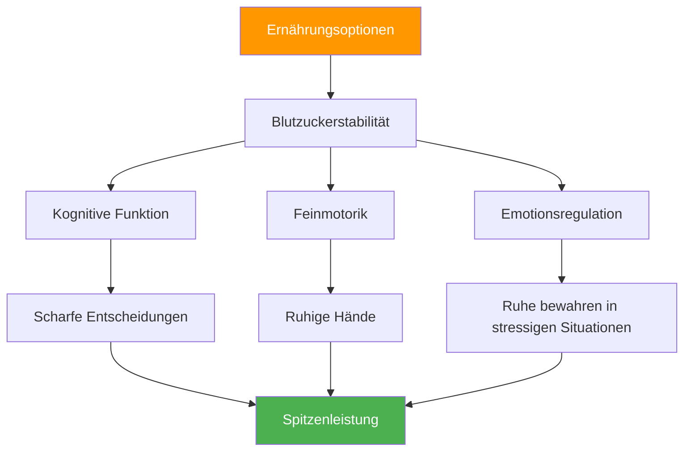

# Sporternährung: Präzisionsleistung fördern

> „Beim Pétanque ist dein Gehirn dein wichtigstes Werkzeug. Gib ihm beständige Energie, keine Achterbahnfahrt der Gefühle.“

Pétanque-Wettkämpfe können 6-10 Stunden dauern. Was Sie zu sich nehmen, beeinflusst direkt Ihre kognitive Leistungsfähigkeit, Ihre Feinmotorik und Ihre Fähigkeit, die Konzentration über mehrere Spiele hinweg aufrechtzuerhalten.

::: tip Die Goldene Regel
**Stabiler Blutzucker = ruhige Hände.** Jede Ernährungsentscheidung sollte eine gleichmäßige Energieversorgung unterstützen und keine Blutzuckerspitzen und -abfälle verursachen.
:::

---

## Warum Ernährung beim Boule wichtig ist

Im Gegensatz zu Hochleistungssportarten erfordert Pétanque Folgendes:

Die falsche Ernährung führt zu Leistungsproblemen, die die Spieler auf „mentale Schwäche“ oder „Pech“ zurückführen.

---

## Der Zusammenhang mit dem Blutzuckerspiegel

Ihr Gehirn benötigt Glukose. Blutzuckerschwankungen wirken sich direkt aus auf:

| Blutzuckerstatus | Mentale Wirkung | Physikalische Wirkung |
|-------------------|---------------|-----------------|
| **Stabil** | Klar denken, gute Entscheidungen | Ruhige Hände, Beständigkeit |
| **Spitze (zu hoch)** | Anfangsenergie, dann der Zusammenstoß | Nervös, überaktiv |
| **Absturz (zu niedrig)** | Konzentrationsschwäche, Reizbarkeit | Zittern, schwacher Griff |
| **Achterbahn** | Unvorhersehbare Stimmung/Fokus | Unbeständige Leistung |

**Ziel:** Aufrechterhaltung eines stabilen Blutzuckerspiegels während des gesamten Wettkampfs.

## Ernährung am Wettkampftag

### Vor dem Wettkampf (3-4 Stunden vorher)

**Essen Sie eine reichhaltige Mahlzeit:**
- Komplexe Kohlenhydrate (Haferflocken, Vollkornbrot, Reis)
- Protein (Eier, Joghurt, mageres Fleisch)
- Gesunde Fette (Avocado, Nüsse, Olivenöl)
- Vermeiden Sie: Einfache Zuckerarten, fettige/schwere Speisen

**Beispielgerichte:**
- Haferflocken mit Nüssen und Banane
- Eier auf Vollkorntoast mit Avocado
- Reis mit Hühnchen und Gemüse

### Vor dem Spiel (1-2 Stunden vorher)

**Leichter, bekannter Snack:**
- Banane
- eine kleine Handvoll Nüsse
- halbes Sandwich
- Vermeiden Sie: Alles Neue oder Experimentelle

### Während des Wettbewerbs

**Zwischen den Spielen:**
- Kleine, häufige Snacks alle 60-90 Minuten
- Nüsse, Samen, Trockenfrüchte
- Vollkorncracker
- Frisches Obst (Banane, Apfel)

**Während der Spiele:**
- Wasser sickert zwischen den Enden hindurch
- Bei Bedarf schnell verfügbare Kohlenhydrate (Trockenfrüchte)
- Vermeiden Sie es, während des aktiven Spielens zu essen.

### Erholung (nach dem Wettkampf)

**Innerhalb von 30-60 Minuten:**
- Protein für die Muskelregeneration
- Kohlenhydrate zum Auffüllen
- Flüssigkeiten zur Rehydrierung

## Hydratationsprotokoll

### Die Grundlagen
- Beginnen Sie mit ausreichender Flüssigkeitszufuhr (achten Sie auf die Farbe des Morgenurins).
- Trinken Sie regelmäßig, warten Sie nicht, bis Sie durstig sind.
- Zielmenge: 150-250 ml pro Wettkampfstunde
- An Hitze und Luftfeuchtigkeit anpassen

### Warnzeichen für Dehydrierung
- Durst (du bist bereits dehydriert)
- Dunkler Urin
- Kopfschmerzen
- Verminderte Konzentration
- Ermüdung

### Die Überwässerungsfalle
Zu viel Wasser, insbesondere ohne Elektrolyte:
- Häufige Toilettenpausen (stören den Rhythmus)
- Verdünnte Elektrolyte (können Zittern verursachen)
- Unbehagen und Ablenkung

**Ausgewogene Ernährung:** Gleichmäßige Zufuhr, bei hohen Temperaturen Elektrolyte hinzufügen.

## Zu vermeidende Lebensmittel

### Am Wettkampftag
- **Schwere Mahlzeiten** — lenken das Blut zur Verdauung um
- **Hoher Zuckergehalt** – Verursacht Energieeinbrüche.
- **Alkohol (am Vorabend)** – Stört den Schlaf, entwässert.
- **Übermäßiger Koffeinkonsum** – Kann Nervosität verursachen
- **Neue Lebensmittel** – Risiko von Verdauungsproblemen
- **Fettige/frittierte Speisen** – Langsame Verdauung, Lethargie

### Lebensmittel, die Probleme verursachen
- **Kohlensäurehaltige Getränke** – Blähungen, Unwohlsein
- **Ballaststoffreiche Lebensmittel** – Können Beschwerden verursachen
- **Milchprodukte (für manche)** – Verdauungsunverträglichkeit
- **Künstliche Süßstoffe** – Können Magenprobleme verursachen

## Koffeinstrategie

Koffein kann die Konzentration und Reaktionszeit verbessern, erfordert aber eine sorgfältige Dosierung:

### Effektive Nutzung
- Kenne deine Toleranz
- Gleichbleibende Zeitvorgaben (nicht für Wettbewerbe ändern)
- Mäßige Dosis (100-200 mg)
- Früh genug, um Störungen durch Abendspiele zu vermeiden.
- In Kombination mit Nahrungsmitteln kann dies Nervosität reduzieren.

### Ineffektive Nutzung
- Mehr als üblich (verursacht Angstzustände, Zittern)
- Spät am Tag (stört den Schlaf)
- Auf nüchternen Magen (Nervosität, Zusammenbruch)
- Sich auf Koffein verlassen, um schlechten Schlaf auszugleichen

## Erstellung deines Wettkampf-Ernährungsplans

### Schritt 1: Praxistest
Probiere deinen Wettkampf-Ernährungsplan im Training aus:
- Gleiche Zeit
- Gleiche Lebensmittel
- Gleiche Hydratation
- Achten Sie auf Ihre Gefühle und Ihre Leistung.

### Schritt 2: Logistik vorbereiten
- Informieren Sie sich über das Speisenangebot am Veranstaltungsort.
- Bringen Sie Ihre eigenen bewährten Snacks mit.
- Sorgen Sie für Backup-Optionen
- Packen Sie mehr ein, als Sie denken.

### Schritt 3: Einen Zeitplan erstellen
Notieren Sie Ihren Ernährungsplan:
- Mahlzeit vor dem Wettkampf (Zeitpunkt, Speisen)
- Snack vor dem Spiel (Zeitpunkt, Art des Essens)
- Während des Wettkampfs (Zeitplan, Verpflegung)
- Erinnerungsintervalle für Flüssigkeitszufuhr

### Schritt 4: Verfolgen und Anpassen
Nach Wettkämpfen ist Folgendes zu beachten:
- Was du gegessen hast und wann
- Wie Sie sich körperlich gefühlt haben
- Leistungsqualität
- Etwaige Probleme (Hunger, Erschöpfung, Magenbeschwerden)

## Überlegungen zu Hitze und Feuchtigkeit

Anforderungen an die Änderung der Wetterbedingungen bei heißem Wetter:

- **Flüssigkeitszufuhr erhöhen** – Möglicherweise benötigen Sie 50–100 % mehr Flüssigkeit.
- **Elektrolyte zuführen** – Durch Schwitzen gehen Mineralien verloren.
- **Leichtere Mahlzeiten** – Schwere Speisen sind schwerer verdaulich.
- **Schattenpausen** – Hitzestress nicht unterschätzen
- **Vorkühlung** – Kommen Sie kühl und hydriert am Veranstaltungsort an.

## Häufige Fehler

::: warning Vermeiden Sie diese
- **Frühstück auslassen** – Verbraucht morgendliches Glykogen.
- **Energy-Drinks** – Zu viel Koffein und Zucker
- **Warten, bis man hungrig ist** – Beeinträchtigt bereits die Leistung
- **Alkohol am Vorabend** – Dehydrierung und schlechter Schlaf
- **Neue Lebensmittel ausprobieren** – Risiko von Verdauungsproblemen
:::

## Handlungsschritte

1. **Plane deine Wettkampfernährung** im Voraus.
2. **Testen Sie Ihren Plan** unter Praxisbedingungen
3. **Bereiten Sie Ihre Snacks** am Abend zuvor vor
4. **Halten Sie sich unabhängig vom Spieldruck an Ihren Zeitplan**.
5. **Nach jedem Wettbewerb überprüfen und optimieren**

---

## Verwandte Inhalte

- [Ernährungsmodul](/de/education/nutrition/) — Umfassende Ernährungsbildung
- [Wettkampfernährung](/de/education/nutrition/competition) — Detaillierte Protokolle
- [Schlaf für mehr Leistung](/de/articles/sleep-performance) — Optimierung der Erholung

