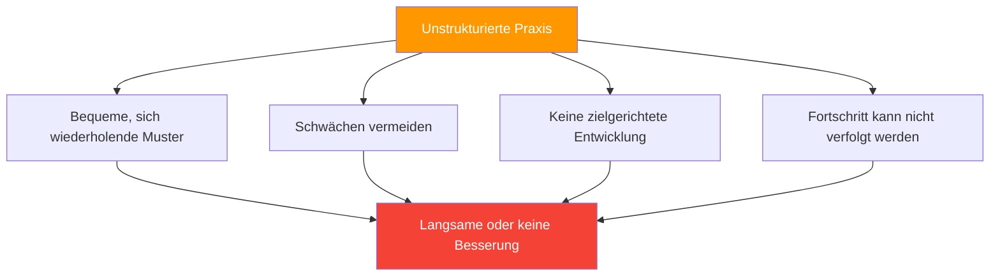

# Strukturierung Ihrer Praxis

> „Zwei Spieler können die gleiche Zeit auf dem Gelände verbringen und dabei völlig unterschiedliche Fortschritte erzielen.“

Der Unterschied liegt oft in der Struktur der Praxis.

::: tip Der 10.000-Stunden-Mythos
**Es geht nicht um die Stunden – es geht darum, wie man sie nutzt.** Gezieltes Üben ist sinnloser Wiederholung immer überlegen.
:::

---

## Das Problem mit unstrukturiertem Training

Die meisten Freizeitaktivitäten sehen folgendermaßen aus:
- Komm vorbei und spiel ein paar Boule-Runden
- Spiele ein paar Gelegenheitsspiele
- Chatte mit Freunden
- Nach Hause gehen

Das macht zwar Spaß, ist aber für Verbesserungen ineffizient.

---

## Grundsätze effektiver Praxis

| Prinzip | Frage, die man stellen sollte |
|-----------|----------------|
| **Zielgerichtet** | Woran arbeite ich heute? |
| **Absichtlich** | Ist das eine Herausforderung für mich? |
| **Referentiell mit Feedback** | Woran merke ich, ob ich mich verbessere? |
| **Fokussiert** | Bin ich voll und ganz präsent? |

### 1. Gezielte Übung

Jede Sitzung sollte einen klaren Zweck haben:
- Woran arbeite ich heute?
- Wie sieht Erfolg aus?
- Woran werde ich merken, ob ich mich verbessert habe?

### 2. Vorsätzliche Schwierigkeit

::: info Der Vorteil der Fähigkeit
**Übung sollte dich herausfordern.** Wenn es bequem ist, entwickelst du dich nicht weiter.
:::

- Arbeite am Rande deiner Fähigkeiten
- Fügen Sie Elemente hinzu, die schwierig sind
- Vermeiden Sie reine Wiederholungen in Ihrer Komfortzone.

### 3. Unmittelbares Feedback

Sie müssen wissen, wie Sie sich schlagen:
- Ergebnisse der Übungen verfolgen
- Nutzen Sie nach Möglichkeit Videos.
- Holen Sie sich Feedback von Trainingspartnern.

### 4. Fokussierte Aufmerksamkeit

Qualität vor Quantität:
- Volle Konzentration während des Trainings
- Kürzere, fokussierte Sitzungen sind besser als lange, ablenkende.
- Geistige Beteiligung ist unerlässlich

## Sitzungsstruktur

### Aufwärmen (10-15 Minuten)

**Körperliche Anforderungen:**
- Lichtbewegung
- Vorbereitung von Arm und Schulter
- Allmähliche Intensitätssteigerung

**Mental:**
- Übergang vom Alltag
- Zielsetzung für die Sitzung
- Beginnen Sie damit, Ihre Aufmerksamkeit zu fokussieren

### Technische Arbeit (20-30 Minuten)

Konzentration auf spezifische Fähigkeiten:
- Übung der isolierten Technik
- Übungen zur Schwachstellenanalyse
- Wiederholung mit Aufmerksamkeit

**Beispielhafte Schwerpunkte:**
- Zielgenauigkeit auf bestimmte Entfernungen
- Aufnahmen aus verschiedenen Blickwinkeln
- Spezifische Wurfarten (Plombée, Portée usw.)

### Angewandte Praxis (20-30 Minuten)

Fähigkeiten in realistischen Kontexten anwenden:
- Simulierte Spielsituationen
- Druckbohrmaschinen
- Entscheidungsfindungspraxis

### Abkühlphase (10 Minuten)

**Körperliche Anforderungen:**
- Lichtwurf
- Dehnen

**Mental:**
- Wiederholen Sie, was Sie gelernt haben.
- Bereiche für zukünftige Arbeiten notieren
- Übergang aus dem Übungsmodus

## Arten von Übungseinheiten

### Kompetenzentwicklungssitzung

Schwerpunkt: Entwicklung oder Verfeinerung spezifischer Techniken

- 70 % technische Übungen
- 20 % angewandte Praxis
- 10 % Aufwärmen/Abkühlen

### Wettbewerbssimulation

Schwerpunkt: Vorbereitung auf die Spielbedingungen

- 20 % Aufwärmen mit einem bestimmten Ziel
- 60 % spielähnliches Verhalten mit Druck
- 20 % Nachbesprechung und Anpassung

### Wartungssitzung

Fokus: Fähigkeiten auf dem neuesten Stand halten

- Ausgewogene Arbeit in allen Bereichen
- Keine intensive Konzentration auf eine einzige Sache
- Angenehm, aber zielgerichtet

### Erholungssitzung

Fokus: Leichtes Training nach dem Wettkampf

- Niedrige Intensität
- Viel Spaß beim Werfen
- Mentale Neuorientierung

## Bohrer entwerfen

Effektive Übungen haben:

### Klare Ziele
Was genau übst du?

### Messbare Ergebnisse
Wie misst man Erfolg?

### Angemessene Herausforderung
Schwer genug, um sich zu dehnen, aber nicht so schwer, dass man es nicht schaffen kann.

### Relevanz
Bezug zu tatsächlichen Spielsituationen

### Progression
Möglichkeiten zur Steigerung des Schwierigkeitsgrades im Laufe der Zeit

## Beispielbohrungen

### Zielgenauigkeit

**Aufstellung:** Ziel in 8 Metern Entfernung
**Ziel:** Innerhalb von 30 cm vom Ziel landen
**Erfolgsquote:** Erfolgsquote bei über 20 Würfen
**Fortschritt:** Zielgröße verringern, Entfernung erhöhen

### Schusskonstanz

**Aufbau:** Stationäre Zielscheibe
**Ziel:** Das Tor treffen
**Track:** Treffer pro 10 Versuche
**Fortschritt:** Winkel variieren, Bewegung hinzufügen

### Drucksimulation

**Spielablauf:** Man muss 3 Symbole in einer Reihe erzielen, um zu &quot;gewinnen&quot;.
**Ziel:** Vervollständige die Sequenz
**Track:** Versuche erforderlich
**Fortschritt:** Erhöhung der erforderlichen Sequenz

## Wochenplanung

### Beispiel für eine ausgeglichene Woche

**Montag:** Kompetenzentwicklung (Fokus auf das Zeigen)
**Mittwoch:** Wettbewerbssimulation
**Freitag:** Fertigkeitsentwicklung (Schwerpunkt Schießen)
**Wochenende:** Spielbetrieb

### Periodisierung

Die Intensität im Laufe der Saison variieren:

**Nebensaison:** Intensives Techniktraining
**Vorsaison:** Integration und Simulation
**Wettkampfsaison:** Wartung und Schärfen
**Nachsaison:** Erholung und Reflexion

## Häufige Fehler

### Zu viel Spiel

Videospiele machen zwar Spaß, zielen aber nicht effizient auf Schwächen ab.

### Keine Sendungsverfolgung

Ohne Messung kann man nicht wissen, ob man sich verbessert.

### Schwächen vermeiden

Wir üben naturgemäß das, was wir gut können. Zwingen Sie sich, an Ihren Schwächen zu arbeiten.

### Unregelmäßiger Zeitplan

Unregelmäßiges Üben führt zu unregelmäßigen Ergebnissen.

### Keine mentale Übung

Körperliche Wiederholung ohne geistige Beteiligung begrenzt den Fortschritt.

## Übungsstab herstellen

### Vor dem Training
- Setzen Sie klare Ziele
- Bereite dich mental vor
- Notizen der vorherigen Sitzung durchsehen

### Während des Trainings
- Bleib konzentriert
- Ergebnisse der Rennstrecke
- Bei Bedarf anpassen

### Nach dem Training
- Notieren Sie, was Sie gelernt haben.
- Nächste Schritte identifizieren
- Den Fortschritt feiern

## Der 10.000-Stunden-Mythos

Es geht nicht nur um die Stunden – es geht um die Qualität. 1.000 Stunden gezieltes Üben sind besser als 10.000 Stunden gedankenloses Wiederholen.

Wenn du dein Training zielgerichtet gestaltest, zählt jede Stunde mehr.

---

| *Verwandt: [Trainingsmethoden](/en/education/technique/training/) | [Trainingsübungen](/en/education/technique/training/drills) | [Zielsetzung](/en/education/motivation/)* |

