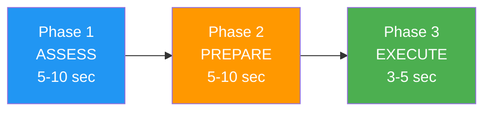

# Building Pre-Shot Routines

> "The difference between a good throw and a great throw often happens before the boule leaves your hand."

A well-designed pre-shot routine is your anchor in the storm of competition — a reliable sequence that prepares your mind and body for optimal performance.

::: tip Your Competitive Advantage
**A consistent routine creates consistent results.** It's the one thing you can control completely, regardless of pressure or circumstances.
:::

---

## Why Pre-Shot Routines Matter

Elite athletes across all sports use pre-shot routines. In pétanque, where each throw is discrete and pressure can build between shots, routines serve multiple purposes:

| Purpose | How It Helps |
|---------|--------------|
| **Consistency** | Same preparation → more consistent execution |
| **Focus** | Constructive task instead of worrying |
| **Transition** | Shift from thinking to doing |
| **Pressure management** | Familiar actions calm nervous system |
| **Reset** | Clears previous shot from mind |

---

## Anatomy of an Effective Routine

### Phase 1: Assessment (5-10 seconds)
- Read the terrain
- Visualize the intended result
- Choose your throw type
- Commit to the decision

### Phase 2: Preparation (5-10 seconds)
- Take your position
- Find your grip
- Settle your breathing
- Feel the weight of the boule

### Phase 3: Execution (3-5 seconds)
- Final focus on target
- Trust your body
- Release without thought
- Follow through naturally

## Building Your Personal Routine

### Step 1: Observe Your Current Patterns

Before creating a new routine, notice what you already do:
- What do you do before successful throws?
- What changes when you're under pressure?
- What feels natural to you?

### Step 2: Design Your Sequence

Create a routine that includes:

**Physical elements:**
- How you approach the circle
- How you pick up and hold the boule
- Your stance and positioning
- A specific breathing pattern

**Mental elements:**
- A visualization of the result
- A focus word or phrase
- A commitment point (the moment you decide "this is the throw")

### Step 3: Keep It Simple

Your routine should be:
- **Short enough** to maintain under pressure (15-25 seconds total)
- **Simple enough** to remember when stressed
- **Flexible enough** to adapt to different situations

## Example Routines

### The Pointer's Routine
1. Stand behind the circle, assess the terrain
2. Visualize the boule's path and landing spot
3. Step into the circle, find your stance
4. Three slow breaths while feeling the boule
5. Eyes on the target, release

### The Shooter's Routine
1. Identify the target boule, choose the angle
2. Visualize the impact and result
3. Enter the circle with purpose
4. One deep breath, feel the weight
5. Lock eyes on target, execute

## Common Mistakes to Avoid

### Too Long
If your routine takes more than 30 seconds, you're overthinking. Long routines give anxiety more time to build.

### Too Rigid
If any interruption destroys your routine, it's too fragile. Build in flexibility — if something breaks your concentration, have a reset trigger.

### Skipping Under Pressure
The routine matters most when pressure is highest. If you abandon it when stressed, you lose its protective benefits.

### Focusing on Mechanics
Your routine should end with focus on the result, not on technique. "Hit the target" not "keep your elbow straight."

## Practicing Your Routine

### In Training
- Use your full routine for every throw, even casual ones
- Time yourself to ensure consistency
- Practice with distractions to build resilience

### Building Automaticity
The goal is for your routine to become automatic — something you do without thinking. This takes repetition:
- 100+ throws with the same routine
- Consistent use across different situations
- Gradual exposure to pressure while maintaining the routine

## Adapting to Competition

In matches, your routine may need slight adjustments:

- **Time pressure**: Have a shortened version ready
- **Weather conditions**: Adjust physical elements as needed
- **High pressure moments**: Slow down slightly, don't speed up

## The Reset Routine

Equally important is what you do after a throw:

1. **Accept the result** — good or bad, it's done
2. **Physical reset** — step back, shake out tension
3. **Mental reset** — clear the throw from your mind
4. **Prepare for next** — shift focus to what's coming

---

*Related: [Pre-Shot Routine Guide](/de/education/mental-game/mental-strength/pre-shot-routine) | [Handling Pressure](/de/education/mental-game/mental-strength/handling-pressure) | [Mindfulness Techniques](/de/education/mental-game/mindfulness/techniques)*

