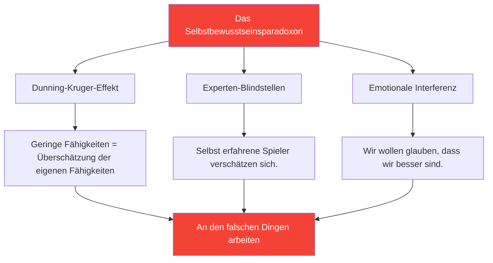

# Entwicklung von Selbstwahrnehmung: Die Grundlage für Verbesserung

> „Was man nicht richtig wahrnimmt, kann man nicht verbessern.“

Selbstwahrnehmung – das Wissen um die eigenen Stärken und Schwächen – ist die Grundlage für eine effektive Entwicklung.

::: danger Die unbequeme Wahrheit
**Die meisten Spieler arbeiten an den falschen Dingen,** weil sie sich selbst nicht klar sehen.
:::

---

## Das Selbstbewusstseinsparadoxon

---

## Warum Pétanque-Spieler Schwierigkeiten haben

Pétanque macht die Selbsteinschätzung besonders schwierig:

| Herausforderung | Warum es schwierig ist |
|-----------|--------------|
| **Ergebnisabweichung** | Gute Entscheidungen können zu schlechten Ergebnissen führen (und umgekehrt). |
| **Vergleichsverzerrung** | Wir erinnern uns an die besten Leistungen, erklären die schlechtesten weg. |
| **Identitätsschutz** | Schwäche einzugestehen, fühlt sich bedrohlich an. |

::: warning Speicher ist nicht gleich Daten
Wir konstruieren Narrative, die unser Selbstbild schützen. Objektive Nachverfolgung ist unerlässlich.
:::

---

## Die Komponenten der Selbstwahrnehmung

Wahre Selbsterkenntnis erfordert Einblick in mehrere Bereiche:

| Domain | Schlüsselfragen |
|--------|---------------|
| **Technisch** | Welche Würfe sind tatsächlich zuverlässig? Welche sind unbeständig? |
| **Psychisch** | Wie reagiere ich auf Druck? Was triggert meinen inneren Kritiker? |
| **Physisch** | Wann habe ich am meisten Energie? Wie wirkt sich Müdigkeit auf mich aus? |
| **Taktisch** | Greife ich zu stark an? Greife ich zu schwach an? Wie schätze ich Situationen ein? |
| **Emotional** | Was frustriert mich? Wann spiele ich zu konzentriert? |
| **Zwischenmenschliche Beziehungen** | Wie nehmen meine Teamkollegen meine Kommunikation wahr? |

## Externes Feedback: Der Spiegel, den Sie brauchen

Man kann seine eigenen blinden Flecken nicht erkennen. Man braucht Außenperspektiven.

### Methoden für strukturiertes Feedback

**Videoanalyse**
- Spiele und Training aufzeichnen
- Beobachten Sie mit Blick auf bestimmte Bereiche
- Achten Sie auf Muster, die Ihnen im Moment entgehen.

**Peer-Bewertung**
- Bitten Sie vertrauenswürdige Teammitglieder um ehrliches Feedback.
- Nutzen Sie das [Bewertungsinstrument](/de/assessment/) zur Peer-Validierung.
- Vergleichen Sie Ihre Selbsteinschätzung mit deren Bewertung.

**Trainerbeobachtung**
- Ein frischer Blick sieht, was dem vertrauten Blick entgeht.
- Bitten Sie um konkretes Feedback, nicht um allgemeine Eindrücke.
- Feedbackthemen im Zeitverlauf verfolgen

### Die Feedback-Lücke

Wenn Ihre Selbsteinschätzung deutlich von externem Feedback abweicht, sollten Sie aufmerksam sein:

| Lückentyp | Bedeutung | Aktion |
|----------|---------|--------|
| Sie schneiden besser ab | Möglicher toter Winkel | Mithilfe von Video-/Datenrecherchen |
| Sie bewerten niedriger | Mögliches Vertrauensproblem | Schwerpunkt auf Kompetenznachweisen |
| Konstante Lücke | Systematischer Wahrnehmungsfehler | Kalibrieren Sie Ihr mentales Modell neu. |

## Gewohnheiten zur Förderung der Selbstwahrnehmung

### Tägliche Reflexion (5 Minuten)

Fragen Sie sich nach jeder Sitzung:

1. **Was lief gut?** (Bitte konkret sein.)
2. **Was lief nicht gut?** (Seien Sie ehrlich)
3. **Was würde ich anders machen?** (Bitte konstruktiv antworten.)
4. **Was hat mich überrascht?** (Seid neugierig!)

### Wöchentlicher Rückblick (15 Minuten)

Achten Sie auf Muster:

- Welche Situationen fordern mich immer wieder heraus?
- Wo sehe ich Verbesserungspotenzial?
- Welches Feedback habe ich erhalten?
- Was vermeide ich anzusehen.

### Monatliche Bewertung

Nutzen Sie das [Spielerbewertungstool](/de/assessment/):

- Bewerten Sie sich selbst anhand aller 8 Faktoren
- Peer-Validierung anfordern
- Vergleich zum Vormonat
- Identifizieren Sie die größten Lücken

## Der Datenvorteil

Subjektive Wahrnehmung ist unzuverlässig. Daten liefern Objektivität.

### Was zu verfolgen ist

**Leistungsdaten**
- Erfolgsquoten nach Wurfart
- Leistung unter Druck vs. ohne Druck
- Erster Satz vs. spätere Sätze
- Mit verschiedenen Partnern

**Verarbeitungsdaten**
- Schlafqualität vor den Spielen
- Einhaltung der Routine vor dem Spiel
- Mentaler Zustand in Schlüsselmomenten
- Erholungszeit nach Fehlern

### Wie man Daten nutzt

1. **Muster erkennen** — Was korreliert mit guter/schlechter Leistung?
2. **Hinterfragen Sie Ihre Annahmen** – Stimmen die Daten mit Ihren Überzeugungen überein?
3. **Anleitung zum Training** – Konzentrieren Sie sich auf tatsächliche Schwächen, nicht auf vermeintliche.
4. **Fortschritte verfolgen** – Verbesserungen sind ohne Messung oft unsichtbar.

## Häufige Blockaden der Selbstwahrnehmung

::: warning Achten Sie auf Folgendes
- **Abwehrverhalten** beim Empfang von Feedback
- **Beschönigung** schlechter Leistungen
- **Bestätigung suchen** statt Wahrheit zu finden
- **Vermeidung der Messung** von Schwachstellen
- **Ständige Schuldzuweisung an externe Faktoren**
:::

## Die Verbindung zum Wachstumsdenken

Selbsterkenntnis erfordert die Akzeptanz folgender Tatsachen:

- Die aktuelle Fähigkeit ist nicht festgelegt.
- Schwäche ist Information, nicht Identität
- Feedback ist ein Geschenk, kein Angriff.
- Verbesserung erfordert eine ehrliche Bewertung

## Handlungsschritte

1. **Heute:** Füllen Sie die [Selbstbewertung](/de/assessment/) aus.
2. **Diese Woche:** Bitten Sie zwei vertraute Teammitglieder um Feedback.
3. **Laufend:** Etablieren Sie eine tägliche Reflexionsgewohnheit.
4. **Monatlich:** Fortschritte durch wiederholte Beurteilungen verfolgen

---

## Verwandte Inhalte

- [Modul zur Selbstwahrnehmung](/de/education/self-awareness/) — Vollständige Bildung
- [Spielerbewertung](/de/assessment/) — Bewerten Sie Ihre 8 Faktoren
- [Der innere Kritiker](/de/articles/inner-critic) — Umgang mit Selbstverurteilung

