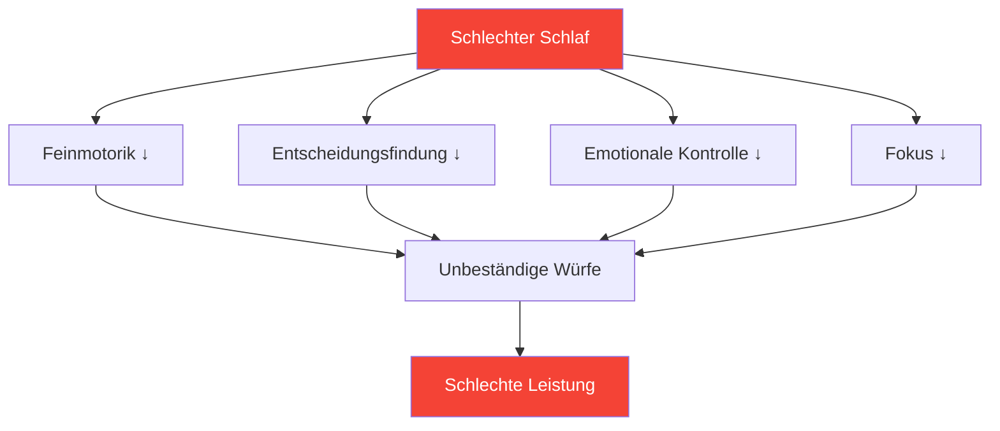

# Schlaf: Der am meisten unterschätzte Leistungsfaktor

> „Der Spieler, der besser geschlafen hat, gewinnt oft.“

Die meisten Spieler konzentrieren sich auf Technik und mentales Training. Nur wenige optimieren ihren Schlaf. Das ist ein Fehler – Schlaf ist für die meisten Wettkampfspieler die wirkungsvollste Maßnahme zur Leistungssteigerung.

::: tip Verbesserung mit hohem ROI
**Schlafoptimierung erfordert keinerlei Talent und liefert enorme Ergebnisse.** Sie ist das, was einem legalen Leistungssteigerer am nächsten kommt.
:::

---

## Die Forschung

Schlafforschung enthüllt verblüffende Auswirkungen auf sportliche Höchstleistungen:

### Reaktionszeit
- **24 Stunden ohne Schlaf** = Reaktionszeit entsprechend 0,1 % Blutalkohol
- **6 Stunden pro Nacht über 2 Wochen** = entspricht 48 Stunden Wachbleiben.
- Spitzensportler trainieren durchschnittlich **8,5+ Stunden**, im Vergleich zu 7 Stunden in der Allgemeinbevölkerung.

### Entscheidungsfindung
- Schlafentzug beeinträchtigt zunächst den präfrontalen Kortex.
- Taktische Entscheidungen verschlechtern sich, bevor offensichtliche Erschöpfung auftritt.
- Sie bemerken Ihre Beeinträchtigung nicht (auch die Metakognition versagt).

### Motorsteuerung
- Feinmotorische Fähigkeiten (Greifen, Loslassen) erfordern ein konsolidiertes Gedächtnis
- Die Konsolidierung des Gedächtnisses findet im Tiefschlaf statt.
- Fertigkeitserwerb ohne ausreichend Schlaf = vergeudetes Üben

## Die Präzisionsverbindung

Pétanque erfordert genau das, was Schlafmangel zerstört:

| Erforderliche Fähigkeiten | Auswirkungen von Schlafentzug |
|----------------|--------------------------|
| Feinmotorik | Der Griffdruck wird ungleichmäßig |
| Visuelle Verarbeitung | Entfernungseinschätzung beeinträchtigt |
| Entscheidungsfindung | Taktische Fehler nehmen zu |
| Emotionsregulation | Die Frustration nach Fehlern nimmt zu |
| Anhaltende Aufmerksamkeit | Der Fokus verlagert sich in längeren Spielen |

## Anzeichen dafür, dass Sie zu wenig schlafen

Sie haben sich an chronischen Schlafentzug angepasst, wenn:

- Du brauchst einen Wecker zum Aufwachen.
- Am frühen Nachmittag sind Sie schläfrig.
- Du schläfst innerhalb von 5 Minuten nach dem Hinlegen ein.
- Man holt das am Wochenende nach.
- Kaffee ist unverzichtbar, nicht optional.

**Realitätscheck:** Wer Koffein braucht, um normal zu funktionieren, leidet unter Schlafmangel.

## Das Protokoll der Wettkampfwoche

### 7 Tage vorher
- Beginnen Sie damit, jede Nacht 30 Minuten länger zu schlafen.
- Aufwachzeit stabilisieren (jeden Tag zur gleichen Zeit)

### 3 Tage zuvor
- Kein Alkohol (stört den Schlafrhythmus)
- Nach 19 Uhr keine schweren Mahlzeiten mehr.
- Reduzieren Sie die Bildschirmzeit nach Sonnenuntergang.

### Am Abend zuvor
- Normale Schlafenszeit (geh nicht früh ins Bett – du liegst dann nur wach)
- Vertraute Umgebung, wenn möglich
- Entspannungsroutine

### Wettbewerbsvormittag
- Zur normalen Zeit aufwachen
- Sofortige Lichteinwirkung
- Normale Frühstücksroutine

## Optimierung der Schlafqualität

Es kommt nicht nur auf die Dauer an – die Qualität ist wichtiger.

### Schlafumgebung
- **Temperatur:** 18–20 °C (65–68 °F) ist optimal.
- **Dunkelheit:** Vollständige Dunkelheit oder Schlafmaske
- **Ton:** Gleichmäßiges Rauschen (weißes Rauschen) oder Stille
- **Bettwäsche:** Bequem, nicht zu warm

### Abendroutine
- Mindestens 60 Minuten vor dem Schlafengehen bildschirmfrei sein
- Gedämpftes Licht am Abend
- Konsequente Entspannungsaktivitäten
- Eine kühle Dusche kann das Einschlafen fördern

### Timing
- Regelmäßige Aufstehzeiten (wichtiger als Schlafenszeiten)
- Vermeiden Sie es, am Wochenende länger als 30 Minuten zu schlafen.
- Mittagsschlaf: vor 15 Uhr, unter 20 Minuten

## Die Nickerchen-Strategie

Strategisches Nickerchen an Wettkampftagen:

### Das Power-Nap (10-20 Min.)
- Reduziert Müdigkeit ohne Benommenheit
- Am besten geeignet für die Zeit zwischen Vormittags- und Nachmittagssitzungen
- Wecker stellen – nicht verschlafen

### Der komplette Zyklus (90 Minuten)
- Vollständiger Schlafzyklus
- Nur wenn Sie mindestens 2 Stunden vor dem Wettkampf Zeit haben.
- Bei Unterbrechung besteht die Gefahr von Benommenheit.

### Niemals ein Nickerchen machen, wenn:
- Sie leiden unter Einschlafstörungen
- Der Wettbewerb findet innerhalb von 90 Minuten statt.
- Es ist nach 15 Uhr und du musst in dieser Nacht schlafen.

## Reiseüberlegungen

Für Auswärtswettbewerbe:

### Vor der Reise
- Bringen Sie vertraute Schlafutensilien mit (Kissen, Schlafmaske).
- Hotelzimmer recherchieren (Ruhezimmer anfragen)
- Passen Sie den Zeitplan an, wenn Sie Zeitzonen überqueren.

### Am Zielort
- Halten Sie sich nach Möglichkeit an Ihren gewohnten Schlafrhythmus zu Hause.
- Lichtexposition steuert den zirkadianen Rhythmus
- Vermeiden Sie schwere Mahlzeiten kurz vor dem Schlafengehen.

### Zeitzonenüberschreitung
- 1 Tag pro Stunde zur vollständigen Anpassung
- Anpassung der Belichtungszeiten bei Morgenlicht nach Osten
- Anpassung der Belichtungszeiten bei Abendlicht nach Westen

## Ihren Schlaf verfolgen

Was gemessen wird, wird auch gesteuert:

### Einfaches Tracking
- Aufwachzeit und Schlafenszeit
- Subjektive Qualität (1-10)
- Anmerkungen zur Leistungskorrelation

### Erweitertes Tracking
- Schlaftracker oder Wearable
- Trends der Herzfrequenzvariabilität (HRV)
- Schlafphasendaten

### Worauf Sie achten sollten
- Korrelation zwischen Schlaf und Leistung
- Verhaltensmuster (Wochenend-Aufholjagd, Schlaflosigkeit vor Wettkämpfen)
- Trends im Laufe der Zeit

## Häufige Fehler

::: warning Vermeiden Sie diese
- **Alkohol als Schlafmittel** – Hilft beim Einschlafen, verschlechtert aber die Schlafqualität
- **Schlaf am Wochenende nachholen** – Schlafdefizit lässt sich nicht „zurückzahlen“.
- **Bildschirme im Bett** — Trainiert das Gehirn, dass Bett nicht gleich Schlaf ist.
- **Unregelmäßiger Zeitplan** – Der zirkadiane Rhythmus braucht Regelmäßigkeit.
- **Schlaf zugunsten des Trainings vernachlässigen** – Qualität gegen Quantität tauschen
:::

## Handlungsschritte

1. **Diese Woche:** Erfassen Sie Ihren tatsächlichen Schlaf (Dauer + Qualität)
2. **Nächste Woche:** Regelmäßige Aufstehzeiten einführen
3. **Folgende Wochen:** Umgebung und Routine optimieren.
4. **Vor dem Wettkampf:** Das Protokoll für die Wettkampfwoche umsetzen.

---

## Verwandte Inhalte

- [Schlaf- und Erholungsmodul](/de/education/sleep/) — Umfassende Schlafaufklärung
- [Schlafgewohnheiten](/de/education/sleep/habits) — Nachhaltige Routinen entwickeln
- [Wettkampfschlaf](/de/education/sleep/competition) — Veranstaltungsspezifische Protokolle

