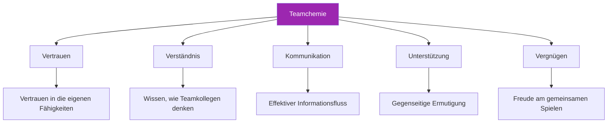

# Teamchemie aufbauen

> „Sie kennen das: Teams, bei denen das Ganze mehr ist als die Summe seiner Teile.“

Spieler, die einander vorausahnen, sich gegenseitig unterstützen und gemeinsam bessere Leistungen erbringen als allein. Das ist Teamchemie – und die kommt nicht von ungefähr.

::: tip Chemie wird aufgebaut, nicht gefunden
**Großartige Teams werden nicht zusammengestellt – sie werden entwickelt.** Chemie erfordert gezielte Anstrengungen über einen längeren Zeitraum.
:::

---

## Was ist Teamchemie?

---

## Warum Chemie wichtig ist

| Mit Chemie ✅ | Ohne Chemie ❌ |
|-------------------|----------------------|
| Treffen Sie bessere kollektive Entscheidungen | Gebt euch gegenseitig die Schuld für Misserfolge. |
| Sich schneller von Rückschlägen erholen | Unter Stress schlecht kommunizieren |
| Auch unter Druck konstant gute Leistungen erbringen | Lehnen im Vergleich zu ihrem Talent hinter den Erwartungen zurück. |
| Mehr Spaß am Wettbewerb | Konflikte und Frustration erleben |
| Bleibt länger zusammen | Team löst sich auf |

## Die Bausteine

### 1. Gemeinsame Ziele

Chemie beginnt mit der Ausrichtung:
- Was wollen wir erreichen?
- Wie sieht Erfolg aus?
- Was sind wir bereit zu opfern?

Teams mit gegensätzlichen Zielen (die einen wollen Spaß haben, die anderen wollen um jeden Preis gewinnen) haben Schwierigkeiten, eine gute Teamchemie aufzubauen.

### 2. Rollenklarheit

Jeder Spieler muss Folgendes wissen:
- Was von ihnen erwartet wird
- Wie sie zum Erfolg des Teams beitragen
- Wann man führen und wann man folgen sollte.

Unklare Rollen erzeugen Reibung und Unmut.

### 3. Gegenseitiger Respekt

Respekt bedeutet:
- Die Leistung jedes Teammitglieds wertschätzen
- Unterschiedliche Stile und Herangehensweisen akzeptieren
- Einander mit Würde behandeln, insbesondere unter Druck

### 4. Psychologische Sicherheit

Die Spieler müssen sich sicher fühlen, um:
- Fehler machen, ohne dafür hart verurteilt zu werden
- Meinungen und Bedenken äußern
- Seien Sie sie selbst, ohne sich zu verstellen.

## Chemie aufbauen: Praktische Schritte

### Gemeinsame Zeit

Chemie erfordert Investitionen:
- Üben Sie regelmäßig zusammen.
- Verbringt gemeinsam Zeit abseits des Geländes
- Teilen Sie Erfahrungen, die über Pétanque hinausgehen

### Strukturierte Teambildung

Gezielte Aktivitäten helfen:
- Team-Zielsetzungssitzungen
- Nachbesprechungen nach dem Spiel (konstruktiv)
- Diskussionen über Spielstile und Vorlieben

### Konfliktlösung

Probleme angehen, bevor sie sich verschlimmern:
- Schaffen Sie Raum für ehrliche Gespräche
- Fokus auf Verhaltensweisen, nicht auf Persönlichkeiten.
- Sucht nach Lösungen, nicht nach Schuldigen.

### Gemeinsam feiern

Gemeinsame Freude schafft Bindungen:
- Gute Leistungen anerkennen
- Feiern Sie die Erfolge des Teams
- Gemeinsam Meilensteine feiern

## Chemische Killer

### Schuldkultur

Wenn Fehler zu Kritik statt zu Unterstützung führen, schwindet das Vertrauen schnell.

### Ungleiches Engagement

Wenn einige Spieler mehr investieren als andere, entsteht Unmut.

### Mangelhafte Kommunikation

Missverständnisse und falsche Annahmen schaffen Distanz.

### Ego-Konflikte

Wenn individuelle Anerkennung wichtiger ist als der Erfolg des Teams, leidet die Teamchemie.

### Ungelöster Konflikt

Ungelöste Probleme verschwinden nicht – sie verschärfen sich.

## Chemie im Wettbewerb

### Vor den Spielen

- Gemeinsam ankommen, gemeinsam aufwärmen
- Kurze Teambesprechung zum Vorgehen
- Positive Energie und gegenseitige Ermutigung

### Während der Spiele

- Sichtbare gegenseitige Unterstützung
- Nur konstruktive Kommunikation
- Gemeinsame Feier guter Theaterstücke
- Gemeinsame Reaktion auf Rückschläge

### Nach den Spielen

- Ob Sieg oder Niederlage, haltet zusammen
- Kurze Nachbesprechung (Was hat funktioniert, was kann verbessert werden)
- Unabhängig vom Ergebnis positive Beziehungen pflegen

## Unterschiedliche Persönlichkeiten

Starke Teams bestehen oft aus unterschiedlichen Persönlichkeitstypen:

- **Der Beständige**: Ruhig in stressigen Situationen, beständig
- **Der Energiespender**: Bringt Begeisterung und Motivation
- **Der Stratege**: Denkt voraus, erkennt Muster
- **Der Wettkämpfer**: Trieb den Siegeswillen an

In der Chemie geht es nicht darum, dass alle gleich sind – sondern darum, dass Unterschiede zusammenwirken.

## Wenn die Chemie fehlt

### Anzeichen für schlechte Chemie

- Sichtbare Frustration über die Teamkollegen
- Schuldzuweisungen nach Fehlern
- Mangelnde Kommunikation
- Als Einzelspieler agieren, nicht als Team
- Spiele eher fürchten als genießen.

### Wiederaufbau der Chemie

1. **Das Problem anerkennen**: Benennen Sie es offen.
2. **Ursachen ermitteln**: Was erzeugt die Reibung?
3. **Verpflichtung zum Wandel**: Alle Beteiligten müssen investieren
4. **Handeln Sie jetzt!**: Konkrete Schritte zur Verbesserung
5. **Haben Sie Geduld:** Chemische Prozesse brauchen Zeit, um sich zu erholen.

### Wann man weiterziehen sollte

Manchmal lassen sich chemische Probleme nicht beheben:
- Fundamentale Wertunterschiede
- Wiederholter Vertrauensbruch
- Unwilligkeit zur Veränderung

Es ist in Ordnung zu erkennen, wenn ein Team nicht funktioniert.

## Die Rolle des Kapitäns

Wenn Sie der Teamleiter sind:
- Das Verhalten vorleben, das Sie sehen möchten
- Probleme frühzeitig und direkt angehen
- Schaffen Sie Möglichkeiten zur Kontaktaufnahme
- Die Teamkultur schützen
- Individuelle Bedürfnisse mit Teambedürfnissen in Einklang bringen

## Langzeitchemie

Chemie ist nicht statisch – sie benötigt Pflege:

### Regelmäßige Check-ins

- Wie funktionieren wir als Team?
- Was funktioniert? Was funktioniert nicht?
- Gibt es Probleme, die angegangen werden müssen?

### Kontinuierliche Investitionen

- Verbringt weiterhin Zeit miteinander
- Kommunizieren Sie weiterhin offen.
- Unterstützt euch weiterhin gegenseitig.

### Anpassung

- So wie sich die Spieler weiterentwickeln und verändern, muss sich auch das Team verändern.
- Seien Sie bereit, Rollen und Dynamiken weiterzuentwickeln.
- Bleibt neugierig aufeinander.

---

| *Verwandt: [Teamdynamik](/en/education/team-dynamics/) | [Kommunikation](/en/education/team-dynamics/communication) | [Führung im Pétanque](/en/articles/team-leadership)* |

