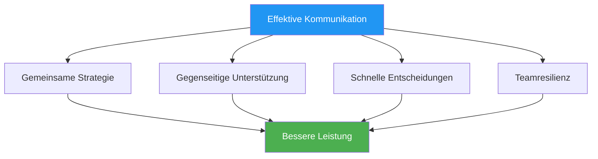

# Kommunikation unter Druck

> „Die richtigen Worte zur richtigen Zeit schaffen Vertrauen. Die falschen Worte können selbst erfahrene Teams aus dem Gleichgewicht bringen.“

::: tip Die Kommunikationswahrheit
**Unter Druck gilt: Weniger ist mehr.** Klare und prägnante Kommunikation ist langen Diskussionen stets überlegen.
:::

---

## Warum Kommunikation wichtig ist

Pétanque-Teams stehen vor einzigartigen Herausforderungen:
- Es müssen schnell Entscheidungen getroffen werden.
- Druck beeinflusst, wie wir sprechen und zuhören.
- Nonverbale Signale sind für Gegner sichtbar.
- Die individuelle Leistung beeinflusst die Teamdynamik.

---

## Die Kommunikationsprinzipien

### 1. Klarheit vor Quantität

| ❌ Sag nicht | ✅ Sag stattdessen |
|-------------|---------------|
| &quot;Ich denke, wir sollten vielleicht versuchen, hierhin zu zeigen, aber ich bin mir nicht sicher...&quot; | „Ich zeige nach links. Dort ist der Boden besser.“ |

### 2. Positive Darstellung

| ❌ Negativ | ✅ Positiv |
|------------|------------|
| &quot;Das sollten Sie sich nicht entgehen lassen.&quot; | &quot;Du schaffst das – vertrau deinem Wurf.&quot; |
| &quot;Das war furchtbar.&quot; | „Abhaken, nächster Versuch.“ |

### 3. Aktueller Fokus

::: warning Vergangenheit vs. Gegenwart
**Statt:** „Warum hast du es dort hingeworfen?“
**Sag:** „Okay, was ist jetzt unsere beste Option?“
:::

### 4. Eigentumsverhältnisse

Verwenden Sie „Ich“-Aussagen für Ihre eigenen Handlungen, „Wir“-Aussagen für Teamsituationen:

- &quot;Ich nehme diese Chance.&quot;
- „Wir müssen diesen Punkt schützen.“
- &quot;Ich denke, wir sollten...&quot;

## Was zu kommunizieren ist

### Vor jedem Ende

- **Strategiebesprechung**: Kurze Abstimmung über das Vorgehen
- **Klare Rollenverteilung**: Wer macht was?
- **Geländebeobachtungen**: Relevante Bedingungen

### Während des Spiels

- **Entscheidungen**: Klare Darlegung der beabsichtigten Maßnahmen
- **Unterstützung**: Ermutigung vor dem Werfen
- **Informationen**: Relevante Beobachtungen zum Gelände oder zu Gegnern

### Nach Würfen

- **Anerkennung**: Kurze Würdigung (positiv oder negativ)
- **Anpassung**: Alle erforderlichen strategischen Änderungen
- **Zurücksetzen**: Hilf deinem Teamkollegen, sich neu zu fokussieren

## Was man NICHT kommunizieren sollte

### Vermeiden Sie es in Stresssituationen

- Technische Hinweise („Ellbogen eng am Körper halten“)
- Kritik an früheren Würfen
- Ausdruck der Frustration
- Zweifel an den Fähigkeiten des Teamkollegen
- Übermäßige Analyse

### Generell vermeiden

- Schuldzuweisungen
- Sarkasmus oder passive Aggression
- Vergleiche mit anderen Spielern
- Vorhersagen des Scheiterns

## Nonverbale Kommunikation

Ihre Körpersprache spricht Bände:

### Positive Signale
- Blickkontakt mit Teamkollegen
- Offene, entspannte Körperhaltung
- Nicken und zustimmendes Bestätigen
- Ruhige, stetige Bewegungen

### Negative Signale (vermeiden)
- Augenrollen oder Seufzen
- Sich von den Teamkollegen abwenden
- Verschränkte Arme oder geschlossene Körperhaltung
- Sichtbare Frustration

### Leseteammitglieder

Lerne zu erkennen, wann Teammitglieder etwas brauchen:
- **Bitte nicht stören**: Die Verarbeitung läuft, bitte nicht unterbrechen.
- **Unterstützung**: Sie haben es schwer, bieten Sie ihnen Ermutigung.
- **Information**: Sie sind unsicher, bitte um Klärung.
- **Energie**: Sie sind flach, bringen Begeisterung mit sich.

## Kommunikationsrollen

### Der Zeiger
- Schildern Sie Ihre Einschätzung des Geländes.
- Geben Sie Ihren geplanten Platzierungsort deutlich an.
- Bei Unsicherheit um Rat fragen

### Der Schütze
- Zielauswahl bestätigen
- Selbstvertrauen kommunizieren
- Informationen zu Winkeln anfordern

### Das Milieu/Kapitän
- Teamdiskussionen moderieren
- Treffen Sie bei Bedarf endgültige Entscheidungen.
- Teamenergie und -fokus steuern

## Drucksituationen

### Wenn hinter

- Bleiben Sie lösungsorientiert.
- Bewahre positive Energie
- Vermeiden Sie Schuldzuweisungen oder Frustration.
- Feiere kleine Erfolge

### Wenn

- Bleiben Sie konzentriert, vermeiden Sie Selbstzufriedenheit.
- Sorgen Sie für eine konsistente Kommunikation.
- Ändere nicht, was funktioniert

### Matchball (Ihre)

- Den Druck kurz anerkennen
- Konzentriere dich auf den Prozess
- Unterstützt euch gegenseitig sichtbar

### Matchball (Unserer)

- Bleiben Sie ruhig und konzentriert.
- Vermeiden Sie verfrühte Feierlichkeiten.
- Wie gewohnt ausführen.

## Aufbau von Kommunikationsfähigkeiten

### In der Praxis

- Üben Sie die Kommunikation während des Trainings.
- Feedback zur Kommunikation geben und erhalten
- Experimentieren Sie mit verschiedenen Ansätzen

### Teamvereinbarungen

Teamnormen festlegen:
- Wie wir mit Meinungsverschiedenheiten umgehen
- Wie Unterstützung aussieht
- Wann man sprechen und wann man schweigen sollte

### Spielanalyse

Kommunikation besprechen:
- Was hat gut funktioniert?
- Was könnte verbessert werden?
- Gibt es irgendwelche Missverständnisse, die wir aufklären sollten?

## Wenn die Kommunikation zusammenbricht

### Im Augenblick

1. Atme tief durch
2. Setzen Sie den Satz mit einer einfachen Aussage zurück: „Konzentrieren wir uns auf diesen Wurf.“
3. Zurück zu den Grundlagen: klar, positiv, präsent

### Nach dem Spiel

- Probleme ruhig angehen
- Fokus auf Verhaltensweisen, nicht auf Persönlichkeiten.
- Einigung auf Verbesserungen
- Gemeinsam vorwärts

## Die stille Unterstützung

Manchmal ist die beste Kommunikation Präsenz:
- Er steht einem kämpfenden Teamkollegen bei.
- Eine Hand auf der Schulter
- Ein vertrauensvolles Nicken
- Einfach nur da sein.

Worte sind nicht immer notwendig. Verbindung ist es.

---

| *Verwandt: [Teamdynamik](/de/education/team-dynamics/) | [Kommunikation](/de/education/team-dynamics/communication) | [Umgang mit Druck](/de/education/mental-game/mental-strength/handling-pressure)* |

