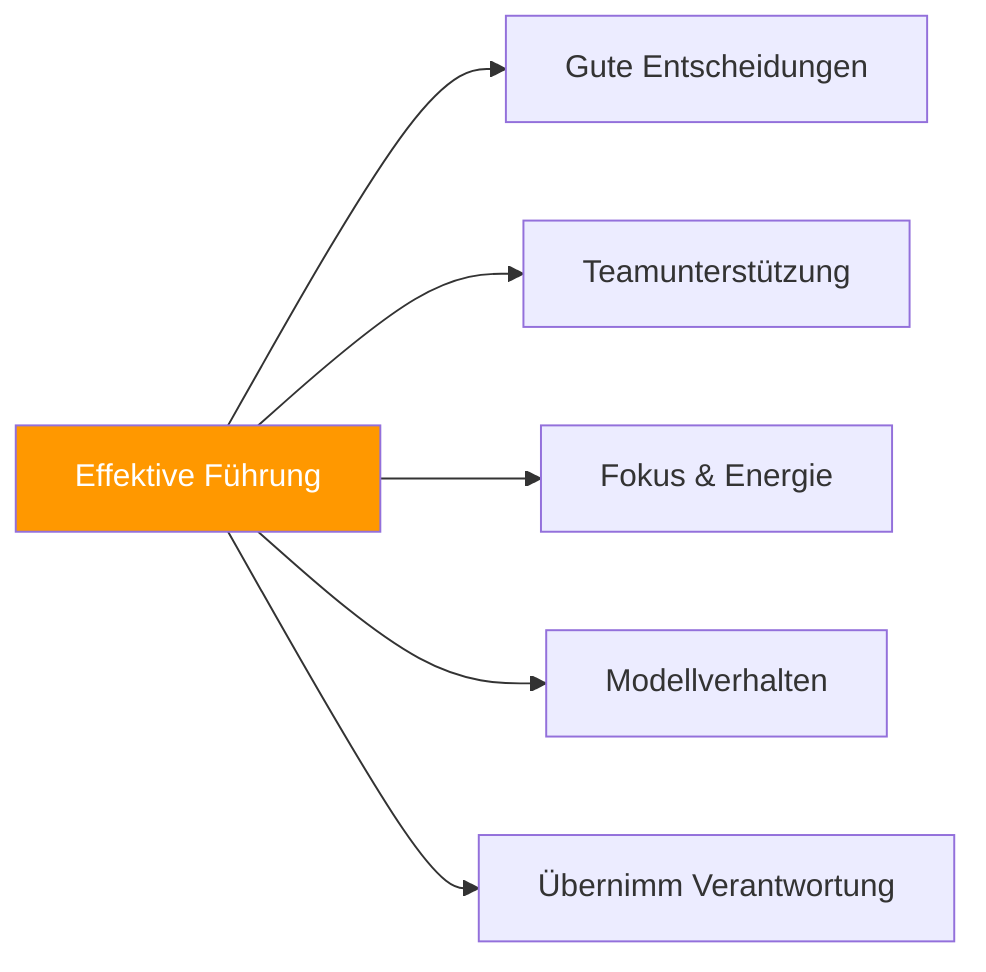

# Führung im Pétanque

> „Führung bedeutet nicht nur, Kapitän zu sein – es geht darum, das Beste aus seinem Team herauszuholen.“

Jeder Spieler kann auf unterschiedliche Weise führen. Es geht um Einflussnahme, Unterstützung und darum, ein Vorbild an Exzellenz zu sein.

::: tip Jeder kann führen
**Man braucht keinen Titel, um eine Führungskraft zu sein.** Führung ist Verhalten, nicht Position.
:::

---

## Was ist Pétanque-Führung?

---

## Führungsstile

| Typ | Fokus | So sieht es aus |
|------|-------|--------------|
| **Positionell** | Behörde | Der Kapitän trifft die endgültigen Entscheidungen und prägt die Kultur. |
| **Leistung** | Exzellenz | Konstante Fähigkeiten, guter Umgang mit Druck |
| **Emotional** | Energie | Positiv bleiben, andere unterstützen |
| **Taktisch** | Strategie | Das Spiel analysieren, Einblicke bieten |

### Positionelle Führung

Der designierte Kapitän oder Teamleiter:
- Trifft endgültige strategische Entscheidungen
- Vertritt das Team offiziell
- Steuert die Teamdynamik
- Prägt den Ton und die Kultur

### Leistungsführung

Führend durch Exzellenz:
- Geschicklichkeit und Beständigkeit unter Beweis stellen
- Zeigen, wie man mit Druck umgeht
- Standards durch Handeln setzen
- Inspirierend durch Leistung

### Emotionale Führung

::: info Oft unterbewertet
**Emotionale Führung ist entscheidend** – der Spieler, der bei einem Rückstand von 2:10 positiv bleibt, kann das gesamte Spiel noch drehen.
:::

Teamenergie und -moral managen:
- Auch unter Druck positiv bleiben
- Unterstützung für Teamkollegen in schwierigen Situationen
- Erfolge feiern
- Die Perspektive bewahren

### Taktische Führung

Strategisches Denken einbringen:
- Das Spiel gut lesen
- Bietet wertvolle Einblicke
- Muster erkennen, die anderen entgehen
- Vorausdenken

## Der effektive Führer

### In der Praxis

- Kommt vorbereitet und konzentriert an.
- Arbeitet hart und ermutigt andere
- Gibt konstruktives Feedback
- Schafft ein positives Trainingsumfeld

### Vor dem Wettbewerb

- Stellt sicher, dass das Team vorbereitet ist
- Schafft klare Erwartungen
- Bewältigt die Nervosität vor dem Spiel
- Schafft Konzentration und Selbstvertrauen

### Während des Wettbewerbs

- Trifft klare und zeitnahe Entscheidungen
- Unterstützt Teamkollegen sichtbar
- Bleibt auch unter Druck ruhig.
- Passt die Strategie nach Bedarf an

### Nach dem Wettbewerb

- Geht mit Siegen elegant um.
- Geht mit Verlusten gelassen um.
- Leitet konstruktive Nachbesprechungen
- Pflegt die Beziehungen zum Team

## Führungsherausforderungen

### Schwierige Entscheidungen treffen

Manchmal muss man:
- Wählen Sie zwischen Optionen, bei denen es keine eindeutige Antwort gibt.
- Mit Teamkollegen nicht einverstanden sein
- Übernehmen Sie Verantwortung für die Ergebnisse.
- Handeln Sie trotz Unsicherheit entschlossen.

**Ansatz:**
- Schnell Input sammeln
- Triff die Entscheidung
- Sich voll und ganz engagieren
- Aus den Ergebnissen lernen

### Konfliktmanagement

Teamreibung ist unvermeidlich:
- Unterschiedliche Meinungen zur Strategie
- Frustration nach Fehlern
- Persönlichkeitskonflikte
- Ungleiches Engagement

**Ansatz:**
- Probleme frühzeitig angehen
- Hören Sie sich alle Perspektiven an.
- Fokus auf Lösungen
- Respektvoller Umgang

### Unterstützung von Spielern in Schwierigkeiten

Wenn ein Teammitglied unter seinen Möglichkeiten bleibt:
- Erhöhen Sie den Druck nicht.
- Bieten Sie konkrete, positive Unterstützung an.
- Strategie bei Bedarf anpassen
- Bewahren Sie Ihr Vertrauen in sie

### Umgang mit den eigenen Problemen

Auch Führungskräfte haben mit Schwierigkeiten zu kämpfen:
- Akzeptiere es (dir selbst gegenüber)
- Lassen Sie sich davon nicht in Ihrer Führungsrolle beeinträchtigen.
- Stütze dich auf deine Teamkollegen
- Modellresilienz

## Führungsstile

### Der Kommandant

- Direkt und entschlossen
- Klare Erwartungen
- Übernimmt in der Krise die Führung
- Risiko: Kann erdrückend sein

### Der Trainer

- Entwickelt andere
- Stellt Fragen
- Baut Fähigkeiten auf
- Risiko: Kann in Krisenzeiten langsam reagieren.

### Der Mitarbeiter

- Bittet um Feedback
- Schafft Konsens
- Schätzt alle Stimmen
- Risiko: Kann unentschlossen sein

### Der Unterstützer

- Fokus auf Beziehungen
- Schafft Sicherheit
- Ermutigt und bestärkt
- Risiko: Kann unangenehme Wahrheiten vermeiden.

**Die besten Führungskräfte passen ihren Führungsstil der jeweiligen Situation an.**

## Entwicklung von Führungskompetenzen

### Selbstwahrnehmung

Kenne deine:
- Natürlicher Führungsstil
- Stärken und Schwächen
- Auswirkungen auf andere
- Auslöser und Reaktionen

### Emotionale Intelligenz

Fähigkeit entwickeln, um:
- Emotionen erkennen (eigene und die anderer)
- Verwalten Sie Ihre Antworten
- Mit den Teamkollegen Empathie zeigen
- Soziale Dynamiken verstehen

### Kommunikationsfähigkeit

Üben:
- Klare, prägnante Botschaften
- Aktives Zuhören
- Konstruktives Feedback geben
- Schwierige Gespräche

### Entscheidungsfindung

Verbessern durch:
- Analyse vergangener Entscheidungen
- Ich bitte um Feedback
- Aus Fehlern lernen
- Üben unter Druck

## Führen ohne Titel

Man muss kein Kapitän sein, um zu führen:

### Mit gutem Beispiel vorangehen
- Erscheine vorbereitet
- Gib dein Bestes
- Gut mit Widrigkeiten umgehen
- Unterstütze Teammitglieder

### Führen durch Unterstützung
- Ermutige andere
- Biete Hilfe an
- Feiert die Erfolge eurer Teamkollegen
- Sei zuverlässig

### Führen durch Beitrag
- Beobachtungen teilen
- Ideen respektvoll einbringen
- Ergreifen Sie die Initiative
- Lücken füllen

## Die Führungsmentalität

### Verantwortung statt Schuldzuweisung

Führungskräfte übernehmen Verantwortung:
- „Wir haben nicht gut gespielt“, nicht „Sie haben daneben geschossen“.
- „Ich hätte besser kommunizieren sollen“, nicht „Sie haben nicht zugehört“.

### Team vor Selbst

Führungskräfte stellen den Erfolg des Teams in den Vordergrund:
- Feiern Sie die Erfolge des Teams
- Teilen Sie den Kredit großzügig
- Übernehmen Sie die Schuld persönlich
- Die Bedürfnisse des Teams haben Priorität.

### Wachstum statt Komfort

Führungskräfte stellen sich der Herausforderung:
- Suche nach schwierigen Situationen
- Aus Fehlern lernen
- Streben nach Verbesserung
- Modell kontinuierliches Wachstum

## Wenn Führung versagt

Auch gute Führungskräfte scheitern manchmal:
- Falsche Entscheidungen werden getroffen
- Trotz guter Führung verlieren die Teams.
- Beziehungen werden belastet

**Erholung:**
1. Bestätige, was geschehen ist
2. Übernehmen Sie die entsprechende Verantwortung
3. Lerne die Lektionen
4. Gehe mit Demut voran

---

| *Verwandt: [Teamdynamik](/en/education/team-dynamics/) | [Kommunikation](/en/education/team-dynamics/communication) | [Aufbau von Teamchemie](/en/articles/team-chemistry)* |

