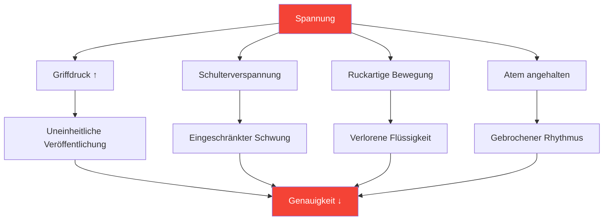

# Spannung und Präzision: Die verborgene Verbindung

> „Man kann nicht gleichzeitig angespannt und präzise sein. Das ist physikalisch unmöglich.“

Sie kennen das: der entscheidende Wurf, bei dem sich Ihr Körper anspannt, Ihr Griff fester wird und der Ball genau dorthin fliegt, wo Sie ihn nicht haben wollten. Anspannung ist der stille Feind der Präzision.

::: danger Der verborgene Feind
**Die meisten Spannungen sind für den Spieler, der sie erlebt, unsichtbar.** Man merkt erst zu spät, dass man angespannt ist.
:::

---

## Die Biomechanik der Spannung

---

## Wo sich Spannungen verbergen

Die meisten Spieler kennen grobe Verspannungen (verspannte Schultern vor einem weiten Wurf). Nur wenige bemerken subtile Verspannungen, die die Leistung dauerhaft beeinträchtigen:

| Standort | Auswirkung auf den Wurf | Wie man es erkennt |
|----------|-----------------|---------------|
| **Griff** | Uneinheitlicher Veröffentlichungszeitpunkt | Kugelabdrücke auf der Handfläche |
| **Unterarm** | Eingeschränkte Beweglichkeit des Handgelenks | Brennendes Gefühl |
| **Schulter** | Eingeschränkter Schwenkbereich | Der Wurf fühlt sich &quot;kurz&quot; an. |
| **Nacken** | Veränderte Kopfhaltung | Steifheit nach den Spielen |
| **Kiefer** | Ganzkörper-Spannungskaskade | Zusammengebissene Zähne |
| **Atem** | Gestörter Rhythmus | Atem anhalten |

---

## Die Druck-Spannungs-Spirale

Unter Druck setzt ein zerstörerischer Kreislauf in Gang:

::: tip Den Kreislauf durchbrechen
**Unterbrechen Sie bei Schritt 2** – bevor die Anspannung die Leistung beeinträchtigt. Deshalb sind Vorbereitungsroutinen mit Spannungschecks unerlässlich.
:::

## Erkennen Ihrer Spannungsmuster

### Die Körperscan-Methode

Schließen Sie vor dem Üben die Augen und scannen Sie:

1. Beginnen Sie bei Ihren Füßen – Verkrampfen sich Ihre Zehen?
2. Gehen Sie die Beine nach oben – Sind irgendwelche Knie durchgedrückt?
3. Achten Sie auf Hüfte und Rumpf – Gibt es irgendwelche Stützmechanismen?
4. Überprüfen Sie die Schultern – Gibt es Erhebungen?
5. Arme und Hände scannen – Gibt es ein vorzeitiges Zupacken?
6. Achten Sie auf Hals und Gesicht – Sind Verspannungen zu sehen?

Bewerten Sie die Spannung an jeder Messstelle auf einer Skala von 0 bis 10. **Ihr Ausgangswert sollte 2 oder weniger betragen.**

### Die Videomethode

Nehmt euch selbst beim Einwerfen auf:
- Übung mit geringem Einsatz
- Übung mit moderatem Einsatz
- Wettbewerb mit hohem Einsatz

Vergleichen Sie Ihre Körpersprache. Wo verkrampfen Sie sich, wenn der Einsatz steigt?

### Die Partnermethode

Bitten Sie einen Teamkollegen, Folgendes zu beobachten:
- Dein Gesichtsausdruck vor wichtigen Würfen
- Ihre Haltung ändert sich unter Druck
- Ihre Atemmuster
- Ihr Griffverhalten

Außenstehende sehen, was wir nicht fühlen können.

## Releasetechniken

### Schnellverschlüsse (für den Einsatz im Wettkampf)

**Der Shake-Out**
- Kurzer, kräftiger Händedruck und Armschütteln
- Freigabe von Haltepositionen
- Dauert 2-3 Sekunden

**Der Ausatem-Tropfen**
- Tief einatmen
- Beim Ausatmen die Schultern bewusst sinken lassen.
- Kieferspannung gleichzeitig lösen

**Der Griff-Reset**
- Die Hand ist vollständig geöffnet
- Finger weit spreizen
- Mit minimalem Kraftaufwand erneut greifen.

### Tiefe Releases (Verwendung im Training/vor dem Wettkampf)

**Progressive Muskelentspannung**
- Spannen Sie jede Muskelgruppe bewusst an (5 Sekunden).
- Vollständig loslassen (15 Sekunden)
- Beachten Sie den Unterschied.
- Durch den gesamten Körper arbeiten

**Verbindung zwischen Atem und Körper**
- Langsames Atmen (4 zählen ein, 6 zählen aus)
- Bei jedem Ausatmen einen Körperbereich entspannen.
- Fahren Sie fort, bis eine vollständige Entspannung des Körpers erreicht ist.

## Die Pre-Shot-Integration

Integriere das Bewusstsein für Anspannung in deine Vorbereitungsroutine vor dem Wurf:

### Bevor ich den Kreis betrete
- Schneller Körperscan (2 Sekunden)
- Einmal ausatmen
- Bestätigen Sie den entspannten Griff.

### Im Kreis
- Letzter Atemzug zum Einatmen
- Weichzeichnen auf das Ziel
- Den Wurf aus dem entspannten Zustand einleiten

### Nach dem Wurf
- Beachten Sie, wo sich Spannungen aufgebaut haben.
- Bei Bedarf ausschütteln
- Für den nächsten Wurf zurücksetzen.

## Spannungsbewusstseinstraining

### Übung 1: Der Mindestgriff

Ermitteln Sie den minimalen Griffdruck, der die Kontrolle aufrechterhält:
- Beginnen Sie mit festem Griff – werfen Sie 5 Bälle.
- Reduziere den Griff um 20 % – wirf 5 Bälle
- Reduzieren Sie weiter, bis die Kontrolle verloren geht.
- Gehen Sie eine Ebene zurück – das ist Ihr optimaler Griff.

Die meisten Spieler greifen 40-60% fester zu als nötig.

### Übung 2: Drucksimulation

Üben unter künstlichem Druck bei gleichzeitiger Überwachung der Spannung:
- Konsequenzen für Übungswürfe festlegen
- Achten Sie darauf, wo Spannungen auftreten.
- Üben Sie das Loslassen bei gleichzeitiger Beibehaltung der Konzentration.
- Drucktoleranz schrittweise erhöhen

### Übung 3: Der entspannte Zeiger

Bewerten Sie sich selbst in zwei Dimensionen:
- Technisches Ergebnis (Wo ist der Ball gelandet?)
- Spannungsniveau (Wie entspannt waren Sie?)

**Ziel:** Beides gleichzeitig maximieren. Viele Spieler müssen anfangs etwas schlechtere Ergebnisse in Kauf nehmen, während sie lernen, entspannt zu werfen.

## Protokoll für den Wettkampftag

### Vor dem Spiel
- 10-minütige progressive Entspannung
- Körperscan zur Identifizierung von Haltemustern
- Ausschütteln

### Zwischen den Enden
- Kurzes Ausschütteln
- Ein befreiender Atemzug
- Spannungsprüfung vor kritischen Würfen

### Während des Wurfs
- Vertraue deiner Vorbereitungsroutine.
- Die Freigabetechnik ist vorprogrammiert.
- Kontrolliere die Ausführung nicht bewusst.

## Häufige Fehler

::: warning Vermeiden Sie diese
- **Übermäßige Entspannung** – Eine gewisse Aktivierung ist notwendig
- **Bewusste Kontrolle während des Wurfs** — Unterbricht den Wurffluss
- **Nur bei weiten Würfen entspannen** — Sollte konstant sein.
- **Atem ignorieren** – Atem und Anspannung hängen zusammen
- **Die Routine überstürzen** — Spannungsabbau braucht Zeit
:::

## Der langfristige Nutzen

Spieler, die das Spannungsmanagement beherrschen:
- Unter Druck konstantere Leistungen erbringen
- Weniger körperliche Erschöpfung erleben
- Sich schneller von Fehlern erholen
- Mehr Spaß am Wettbewerb

---

## Verwandte Inhalte

- [Modul Spannungsmanagement](/en/education/tension/) — Vollständige Ausbildung
- [Körperliche Vorbereitung](/en/education/tension/physical) — Körperliche Bereitschaft
- [Druckmanagement](/en/articles/pressure-management) — Mentale Aspekte

