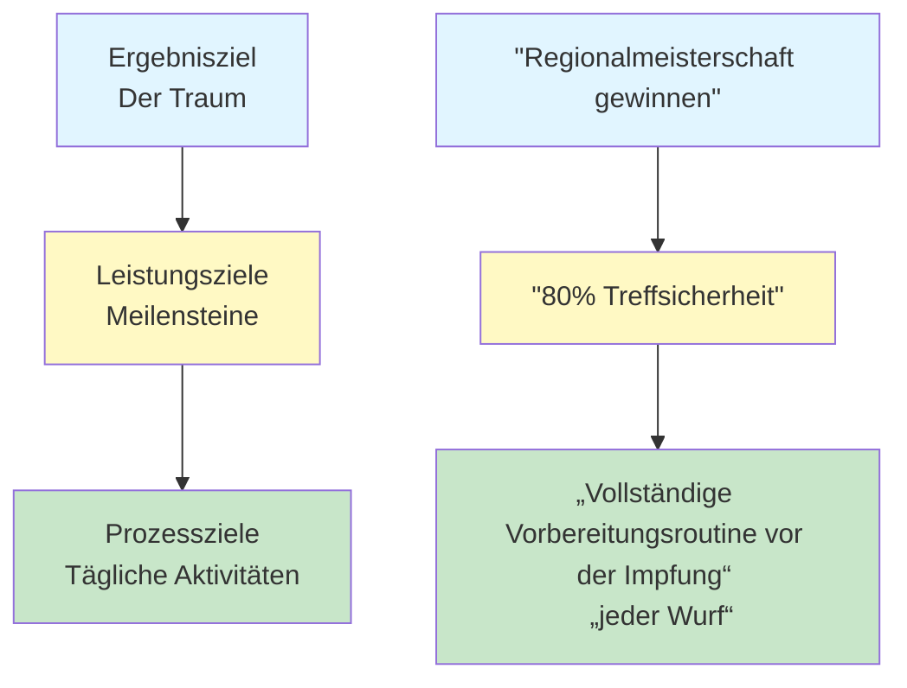

# Zielsetzung für Pétanque-Spieler
<AdBanner />

Klare Ziele sind dein Kompass. Sie geben deinem Training Richtung, motivieren dich in schwierigen Phasen und ermöglichen es dir, deine Fortschritte zu messen. Ohne Ziele wirfst du planlos Bälle. Mit Zielen arbeitest du auf etwas hin.

::: tip Das Kernprinzip
**Ein Ziel ohne Plan ist nur ein Wunsch.** Setzen Sie sich klare Ziele, unterteilen Sie diese in kleinere Schritte, konzentrieren Sie sich auf das, was Sie kontrollieren können, und verfolgen Sie Ihre Fortschritte.
:::

## Warum Ziele wichtig sind

Ziele erfüllen mehrere Zwecke:
- **Anleitung:** Wissen, woran man arbeiten soll
- **Motivation:** Ein Ziel haben, nach dem man streben kann
- **Messung:** Verfolgen Sie Ihren Fortschritt
- **Fokus:** Priorisieren Sie Ihre begrenzte Zeit

Für den selbstmotivierten Spieler sind Ziele besonders wichtig. Ohne einen Trainer, der einen antreibt, werden die eigenen Ziele zum Leitfaden.

## Die drei Zielarten

Nicht alle Ziele sind gleichwertig. Wenn man die verschiedenen Zieltypen versteht, kann man bessere Ziele setzen.

### 1. Ergebnisziele
**Was:** Das gewünschte Endergebnis
**Beispiel:** „Die Regionalmeisterschaft gewinnen“
**Kontrollniveau:** Niedrig – abhängig von Gegnern, Bedingungen und Glück

### 2. Leistungsziele
**Was:** Spezifische Leistungsstandards
**Beispiel:** „Erreiche eine Trefferquote von 80 % bei Schießübungen“
**Kontrollgrad:** Mittel – hängt größtenteils von Ihnen ab.

### 3. Prozessziele
**Was:** Handlungen und Verhaltensweisen, die Sie kontrollieren
**Beispiel:** „Führe meine Vorbereitungsroutine vor jedem Wurf durch.“
**Kontrollgrad:** Hoch – Sie haben die volle Kontrolle.

### Die Zielhierarchie

::: warning Wichtigste Erkenntnis
**Konzentrieren Sie sich vor allem auf die Prozessziele.** Diese haben Sie unter Kontrolle und sie führen zu den gewünschten Ergebnissen.

- **Ergebnisziele:** Geringe Kontrolle, hohe Motivation
- **Leistungsziele:** Mittlere Kontrolle, messbarer Fortschritt
- **Prozessziele:** Hohe Kontrolle, täglicher Fokus ← **Fokus hier**
:::

## Das SMART-Framework

::: info SMART-Ziele-Checkliste
Jedes Ziel sollte sein:
- ✅ **Spezifisch** – Klar und präzise definiert
- ✅ **Messbar** – Sie können Ihren Fortschritt verfolgen
- ✅ **Erreichbar** – anspruchsvoll, aber möglich
- ✅ **R**relevant – auf Ihr übergeordnetes Ziel ausgerichtet
- ✅ **Zeitgebunden** - Hat eine Frist
:::

<AdInArticle />

### S - Spezifisch
❌ &quot;Verbessere deine Schießkünste&quot;
✅ „Meine Treffsicherheit bei Direktschüssen aus 8 Metern Entfernung verbessern“

### M – Messbar
❌ „Genauer schießen“
✅ „Erreiche mindestens 24 von 30 Punkten bei der Schießleiterübung“

### A – Erreichbar
❌ &quot;Nie einen Schuss verfehlen&quot; (unmöglich)
✅ „Genauigkeit innerhalb von 8 Wochen um 10 % verbessern“ (anspruchsvoll, aber realistisch)

### R – Relevant
❌ &quot;Einen Marathon laufen&quot; (nicht direkt verwandt)
✅ „Verbessert Gleichgewicht und Stabilität für bessere Würfe“ (unterstützt dein Spiel)

### T – Zeitgebunden
❌ „Eines Tages wird es mir besser gehen.“
✅ „Bis zum 15. März werde ich Folgendes erreichen…“

## Torbeispiele für Pétanque

| Typ | Schlechtes Tor | SMART-Ziel |
|------|-----------|------------|
| Ergebnis | &quot;Mehr gewinnen&quot; | „Das Halbfinale beim Frühlingsturnier erreichen“ |
| Leistung | &quot;Besser punkten&quot; | &quot;Erreichen Sie 70 % der Punkte innerhalb von 50 cm auf eine Entfernung von 8 m.&quot; |
| Verfahren | &quot;Übe mehr&quot; | &quot;Absolviere 3 gezielte Trainingseinheiten pro Woche&quot; |

## Große Ziele in ihre Einzelteile zerlegen

Große Ziele können überwältigend wirken. Teilen Sie sie in kleinere Teile auf:

### Beispiel: „Gewinne die Vereinsmeisterschaft (in 12 Monaten)“

**Jahresziel:** Vereinsmeisterschaft gewinnen

**Quartalsziele:**
- Frage 1: Verbesserung der Schussgenauigkeit auf 75 %
- Frage 2: Entwickeln Sie eine konsistente Vorbereitungsroutine vor dem Schuss.
- Frage 3: Drucksituationen meistern
- Q4: Höchstleistung und Wettkampfvorbereitung

**Monatliche Ziele (1. Quartal):**
- Monat 1: Ausgangslage festlegen, Schwächen identifizieren
- Monat 2: Schwerpunkt auf der Aufnahmetechnik
- Monat 3: Den Druck beim Schießtraining erhöhen

**Wöchentliche Ziele (Monat 2):**
- Woche 1: 3 Schießsitzungen, Videoanalyse
- Woche 2: Arbeit an dem identifizierten technischen Problem
- Woche 3: Die Distanz schrittweise erhöhen
- Woche 4: Fortschritte testen, Plan anpassen

## Ziele mit Ihrem „Warum“ verbinden

Ziele funktionieren besser, wenn sie mit einer tieferen Motivation verbunden sind.

Frage dich selbst:
- Warum möchte ich das erreichen?
- Was wird das für mich bedeuten?
- Wie werde ich mich fühlen, wenn ich Erfolg habe?
- Was treibt mich an, mich zu verbessern?

Notieren Sie Ihre Antworten. Kehren Sie darauf zurück, wenn Ihre Motivation nachlässt.

## In diesem Abschnitt

- **[SMART Goals im Detail](/en/education/goals/smart-goals)** – Ein detaillierter Einblick in die Erstellung effektiver Ziele
- **[Erstellung deines Trainingsplans](/en/education/goals/planning)** – Ziele in die Tat umsetzen

## Zusammenfassung: Regeln zur Zielsetzung

::: tip Regel Nr. 1: Die Kontrollregel
**Konzentrieren Sie sich auf Prozessziele (das, was Sie kontrollieren können) und nicht auf Ergebnisziele.**
Prozessziele führen zu Leistungszielen, die wiederum zu Ergebniszielen führen.
:::

::: tip Regel Nr. 2: Die SMART-Regel
**Ziele müssen spezifisch, messbar, erreichbar, relevant und terminiert sein.**
Vage Ziele führen zu vagen Ergebnissen. SMART-Ziele führen zu Fortschritt.
:::

::: tip Regel Nr. 3: Die Aufschlüsselungsregel
**Große Ziele erfordern vierteljährliche, monatliche und wöchentliche Meilensteine.**
Große Ziele lassen sich in kleine, umsetzbare Schritte unterteilen, die Sie diese Woche erledigen können.
:::

::: tip Regel Nr. 4: Die Verbindungsregel
Verbinde deine Ziele mit deinem tieferen „Warum“.
Wenn die Motivation nachlässt, ist es dein „Warum“, das dich am Laufen hält.
:::

## Wichtigste Erkenntnis

> Ein Ziel ohne Plan ist nur ein Wunsch.

Setzen Sie sich klare Ziele. Unterteilen Sie diese in kleinere Schritte. Konzentrieren Sie sich auf das, was Sie beeinflussen können. Verfolgen Sie Ihre Fortschritte.

<AdBanner />
