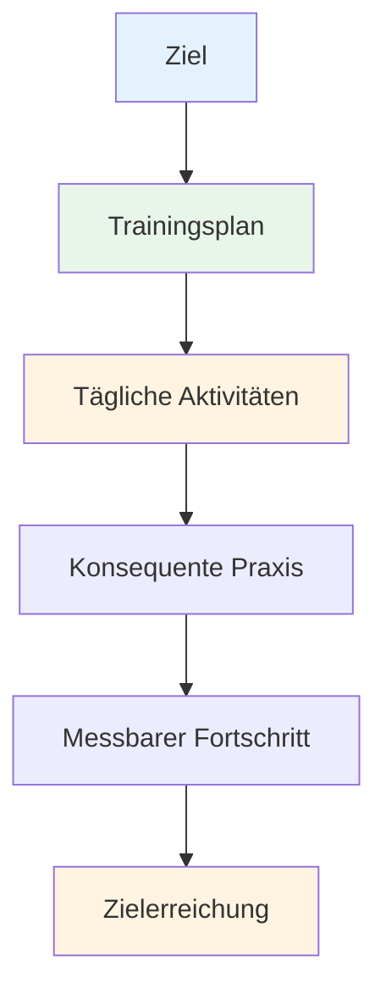

# Erstellung Ihres Trainingsplans

Ziele ohne Plan sind nur Wünsche. Dieser Leitfaden hilft Ihnen, Ihre Ziele in einen strukturierten Trainingsplan umzusetzen, der tatsächlich funktioniert.

::: tip Die große Idee
**Ziele ohne Plan sind nur Wünsche.** Ein strukturierter Trainingsplan verwandelt Ihre Ziele in tägliche Handlungen, die sich zu echten Fortschritten summieren.
:::

## Die 8 Phasen der selbstgesteuerten Entwicklung

### Phase 1: Setzen Sie sich Ihre Ziele
Sie haben bereits etwas über SMART-Ziele gelernt. Ordnen Sie diese nun nach ihrer Bedeutung:

1. **Langfristiges Ziel** (1-2 Jahre): Ihr Traum
2. **Jahresziel**: Zielvorgabe für dieses Jahr
3. **Quartalsziele**: Meilensteine nach 3 Monaten
4. **Monatliche Ziele**: Spezifische Schwerpunkte
5. **Wöchentliche Ziele**: Trainingsziele

### Phase 2: Schätzen Sie Ihre Ressourcen ein

Bevor Sie mit der Planung beginnen, sollten Sie ehrlich prüfen, was Sie haben:

| Ressource | Fragen, die man stellen sollte |
|----------|-----------------|
| **Zeit** | Wie viele Stunden pro Woche können Sie realistisch trainieren? |
| **Standort** | Haben Sie Zugang zu einer geeigneten Piste? Wie ist die Oberflächenbeschaffenheit? |
| **Ausrüstung** | Haben Sie geeignete Kugeln? Messwerkzeuge? Videoausrüstung? |
| **Wissen** | Was sind Ihre technischen Stärken und Schwächen? |
| **Körperlicher Zustand** | Gibt es Einschränkungen? Bereiche, in denen Verbesserungsbedarf besteht? |

Seien Sie ehrlich. Ein realistischer Plan ist besser als eine ambitionierte Fantasie.

### Phase 3: Wähle deine Übungen

Wählen Sie Übungen, die Ihre Ziele direkt unterstützen:

**Zur Verbesserung der Zeigerfunktion:**
- Präzises Zeigen auf markierte Zonen
- Übungen zur Distanzvariation
- Verschiedene Oberflächenpraktiken

**Zur Verbesserung der Treffsicherheit:**
- Schießleiter (progressive Distanzen)
- Hindernisschießen (erzwungener hoher Bogen)
- Übung mit beweglichen Zielen

**Zur geistigen Entwicklung:**
- Routineübungen vor dem Schuss
- Visualisierungssitzungen
- Drucksimulation

**Gestalten Sie Ihr Programm aus:**
- Technische Arbeiten (Zeigen, Schießen)
- Mentales Training (Achtsamkeit, Visualisierung)
- Körperliche Kondition (Gleichgewicht, Flexibilität)
- Spielpraxis (Anwendung von Fähigkeiten)

### Phase 4: Erstellen Sie Ihren Zeitplan

Erstellen Sie einen realistischen Wochenplan:

| Tag | Morgen | Nachmittag | Abend | Fokus |
|-----|---------|-----------|---------|-------|
| Montag | - | Technisch: Zeigen | Leichte Mobilität | Präzision |
| Di. | - | Technik: Aufnahmen | - | Leistung/Genauigkeit |
| Heiraten | - | Mentales Training | - | Achtsamkeit |
| Donnerstag | - | Gemischt: Spielszenarien | Leichte Mobilität | Anwendung |
| Freitag | - | Technische Schwäche | - | Verbesserung |
| Sa | Spiel oder Wettkampf | - | - | Leistung |
| Sonne | Ausruhen | Wochenrückblick | Planung | Erholung |

**Grundprinzipien:**
- Mentales Training sollte Priorität haben (es wird oft vernachlässigt).
- Ruhetage einschließen
- Unterschiedliche Fähigkeiten ausbalancieren
- Flexibilität fürs Leben

### Phase 5: Vorbereitung auf Hindernisse

Es wird etwas schiefgehen. Planen Sie dafür ein.

| Risiko | Wahrscheinlichkeit | Auswirkungen | Backup-Plan |
|------|------------|--------|-------------|
| Zeitmangel | Hoch | Medium | Halten Sie eine „Minimalsitzung“ (20 Minuten) bereit. |
| Schlechtes Wetter | Medium | Medium | Innenraumvisualisierung, Videostudie |
| Geringe Motivation | Hoch | Medium | Zurück zum „Warum“, kleinere Ziele setzen, eine Pause einlegen |
| Leichte Verletzung | Medium | Hoch | Fokus auf mentales Training, nicht beeinträchtigte Fähigkeiten |
| Kein Übungspartner | Medium | Niedrig | Solo-Übungen, Video-Selbstanalyse |

### Phase 6: Verfolge deinen Fortschritt

Was gemessen wird, wird auch gesteuert.

**Führe ein Trainingstagebuch:**
- Datum und Dauer
- Übungen abgeschlossen
- Ergebnisse
- Wie Sie sich gefühlt haben (Energie, Konzentration, Flow)
- Technische Hinweise
- Wetter/Bedingungen

**Wöchentliche Wiederholungsfragen:**
- Habe ich meine geplanten Sitzungen absolviert?
- Welche Punktzahl habe ich erreicht?
- Was hat sich gut angefühlt? Was war schwierig?
- Irgendwelche Flow-Erlebnisse?
- Was sollte ich anpassen?

### Phase 7: Motiviert bleiben

Motivation schwankt. Entwickeln Sie Systeme, um sie aufrechtzuerhalten:

**Innere Motivation:**
- Verbinde dich mit deinem „Warum“
- Feiere kleine Erfolge
- Im Laufe der Zeit ist eine Verbesserung festzustellen.
- Finde Freude am Prozess

**Externe Unterstützung:**
- Trainingspartner (auch gelegentlich)
- Ziele mit jemandem teilen
- Treten Sie Online-Communities bei.
- Serien und Konstanz verfolgen

**Wenn die Motivation nachlässt:**
- Mach eine Minimalsitzung (besser etwas als nichts).
- Verändern Sie Ihre Umgebung
- Überprüfen Sie Ihren Fortschritt
- Erinnern Sie sich an vergangene Erfolge
- Machen Sie bei Bedarf eine geplante Pause.

### Phase 8: Überprüfung und Anpassung

Ihr Plan sollte sich weiterentwickeln:

**Wöchentlich:** Kurze Überprüfung, kleinere Anpassungen
**Monatlich:** Fortschritte bei der Erreichung der Monatsziele bewerten, Fokus anpassen
**Vierteljährlich:** Umfassende Überprüfung, Festlegung der Ziele für das nächste Quartal.
**Jährlich:** Vollständige Bewertung, neuer Jahresplan

**Fragen zur Überprüfung:**
- Mache ich Fortschritte bei der Erreichung meiner Ziele?
- Ist mein Training effektiv?
- Benötige ich andere Übungen?
- Sind meine Ziele noch relevant?
- Was habe ich gelernt?

## Beispielhafter 8-Wochen-Plan

**Ziel:** Verbesserung der Schussgenauigkeit um 15 %

| Woche | Fokus | Wichtige Sitzungen |
|------|-------|--------------|
| 1 | Ausgangswert | Aktuelles Niveau prüfen, Videoanalyse |
| 2 | Technik | Identifizieren und bearbeiten Sie die wichtigsten Probleme |
| 3 | Wiederholung | Schießtraining mit hohem Volumen |
| 4 | Prüfen | Zwischenbewertung, Anpassung |
| 5 | Variation | Unterschiedliche Entfernungen und Winkel |
| 6 | Druck | Füge Übungen Konsequenzen hinzu |
| 7 | Integration | Spielähnliche Szenarien |
| 8 | Abschlussprüfung | Verbesserung messen |

## Wichtigste Erkenntnis

> Plane deine Arbeit und setze deinen Plan dann um. Sei aber bereit, dich anzupassen.

Der beste Plan ist der, den man auch wirklich befolgt. Fang einfach an, bleib konsequent und passe ihn an, während du dazulernst.

