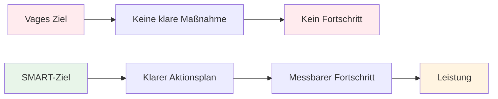

# SMART-Ziele für Pétanque

Das SMART-Framework wandelt vage Wünsche in konkrete Ziele um. Betrachten wir jedes Element im Detail, anhand von Beispielen aus dem Boule-Spiel.

::: tip Die große Idee
**Vage Ziele führen zu vagen Ergebnissen.** SMART-Ziele schaffen Klarheit, führen zu konkreten Maßnahmen und messbarem Fortschritt. Wandeln Sie aus „Ich möchte mich verbessern“ spezifische Ziele um, die Sie tatsächlich erreichen können.
:::

## S - Spezifisch

Ein konkretes Ziel beantwortet diese Fragen:
- **Was genau** möchte ich erreichen?
- **Wo** wird das passieren?
- Welche Aspekte sind beteiligt?

### Ziele konkretisieren

| Vage | Spezifisch |
|-------|----------|
| &quot;Mein Zeigen verbessern&quot; | „Meine Zielgenauigkeit auf Schotterflächen in Entfernungen von 7-9 Metern verbessern“ |
| &quot;Mental stärker werden&quot; | „Eine einheitliche Vorbereitungsroutine entwickeln, die ich für jeden Wurf anwende.“ |
| &quot;Gewinne mehr Spiele&quot; | &quot;Mindestens 60 % meiner Wettkampfspiele in dieser Saison gewinnen&quot; |

### Checkliste zur Spezifität
- [ ] Kann jemand anderes genau verstehen, was ich versuche?
- [ ] Habe ich die Bedingungen (Entfernung, Oberfläche, Situation) definiert?
- [ ] Gibt es nur eine Interpretation dieses Ziels?

## M – Messbar

Was man nicht messen kann, kann man nicht steuern. Messbare Ziele ermöglichen es Ihnen, Fortschritte zu verfolgen und zu wissen, wann Sie erfolgreich waren.

### Möglichkeiten zur Messung von Pétanque-Zielen

**Quantitative Messgrößen:**
- In den Übungen erzielte Punkte (z. B. 24/30)
- Prozentuale Genauigkeit (z. B. 75 % Trefferquote)
- Abstand vom Ziel (z. B. durchschnittlich 30 cm von der Zielscheibe entfernt)
- Konstanz (z. B. 3 erfolgreiche Sitzungen in Folge)

**Nutzung von Trainingsübungen als Messinstrumente:**

| Bohren | Was es misst | Zielbeispiel |
|-------|-----------------|----------------|
| Schießleiter | Schussgenauigkeit unter Druck | Erreiche 10 m innerhalb von 30 Boules |
| Zielgenauigkeit | Zielgenauigkeit zur Zone | 24/30 Punkte |
| Distanzvariation | Tiefensteuerung | 80 % innerhalb von 50 cm |

### Ihre Messwerte verfolgen
Führe ein einfaches Protokoll:
- Datum
- Übung/Training
- Ergebnis
- Bedingungen (Oberfläche, Wetter)
- Anmerkungen

## A – Erreichbar (aber anspruchsvoll)

Ziele sollten dich herausfordern, ohne unmöglich zu sein.

### Das richtige Niveau finden

**Zu einfach:** „Einmal im Monat üben“
- Kein Wachstum, keine Motivation

**Zu schwer:** „Nie einen Schuss verfehlen“
- Unmöglich, führt zu Frustration

**Genau richtig:** „Verbessern Sie Ihre Treffsicherheit um 15 % in 8 Wochen“
- Anspruchsvoll, aber mit etwas Mühe realistisch.

### Fragen zur Überprüfung der Erreichbarkeit
- Haben das auch andere auf meinem Niveau erreicht?
- Habe ich die nötige Zeit und die erforderlichen Ressourcen?
- Liegt das (größtenteils) in meiner Hand?
- Bin ich bereit, alles Notwendige zu tun?

### Erweiterte Ziele
Es ist völlig in Ordnung, ambitionierte Langzeitziele zu haben. Achte nur darauf, dass deine kurzfristigen Ziele erreichbare Schritte auf dem Weg dorthin sind.

## R – Relevant

Ihre Ziele sollten mit Ihrem übergeordneten Ziel übereinstimmen.

### Relevanzfragen
- Unterstützt dieses Ziel meine Gesamtentwicklung?
- Ist das im Moment die richtige Priorität?
- Passt das zu meinen verfügbaren Zeitressourcen?
- Bin ich von diesem Ziel wirklich motiviert?

### Beispiel: Relevanzprüfung

**Situation:** Sie möchten auf nationaler Ebene an Wettkämpfen teilnehmen.

**Relevante Ziele:**
- Verbesserung der Schussgenauigkeit (wirkt sich direkt auf die Ergebnisse aus)
- Entwickeln Sie mentale Routinen (hilft in Drucksituationen).
- Erhöhte Trainingshäufigkeit (schnellerer Fertigkeitsaufbau)

**Weniger relevante Ziele:**
- Lerne Trickschüsse (Spaß, aber keine Priorität im Wettkampf)
- Kaufen Sie teure neue Boulekugeln (die Ausrüstung ist nicht der limitierende Faktor).

## T – Zeitgebunden

Fristen erzeugen Dringlichkeit und ermöglichen Planung.

### Zeitrahmen festlegen

| Zieltyp | Typischer Zeitrahmen |
|-----------|------------------|
| Langfristig | 1-3 Jahre |
| Jährlich | 12 Monate |
| Vierteljährlich | 3 Monate |
| Monatlich | 4 Wochen |
| Wöchentlich | 7 Tage |
| Sitzung | Einzelpraxis |

### Beispiel-Zeitleiste

**Langfristig (2 Jahre):** Qualifikation für die Nationalmannschaftsauswahl

**Jährlich:** Unter die Top 10 der regionalen Rangliste kommen

**Vierteljährlich (Q1):**
- Etablieren Sie eine regelmäßige Trainingsroutine
- Verbessere deine Treffsicherheit auf 70 %.

**Monatlich (Januar):**
- Woche 1: Aktuelles Niveau ermitteln, Ausgangswerte festlegen
- Woche 2-3: Schwerpunkt Schusstechnik
- Woche 4: Testen und Messen des Fortschritts

**Wöchentlich:**
- Montag: Technisches Schießtraining
- Mittwoch: Spielzüge und Spielsituationen
- Freitag: Mentales Training und Visualisierung
- Wochenende: Wettkampf- oder Spielpraxis

## Das Ganze zusammenfügen

### Arbeitsblatt zur Zielsetzung

**Mein Ziel (erster Entwurf):**
_________________________________

**Spezifisch – Was genau?**
_________________________________

**Messbar – Woran werde ich das erkennen?**
_________________________________

**Erreichbar - Ist es realistisch?**
_________________________________

**Relevant – Warum ist das wichtig?**
_________________________________

**Zeitlich begrenzt – Bis wann?**
_________________________________

**Mein SMART-Ziel (Endfassung):**
_________________________________

### Beispiel abgeschlossen

**Erster Entwurf:** „Verbessere deine Wurftechnik“

**SMART-Version:** „Bis zum 30. April werde ich in drei aufeinanderfolgenden Trainingseinheiten beim Schießleiter-Training (6-10 m mit Hindernissen) eine Punktzahl von 24/30 oder höher erreichen, gemessen anhand meines Trainingsprotokolls.“

## Wichtigste Erkenntnis

> SMART-Ziele verwandeln Träume in Pläne und Pläne in Ergebnisse.

Nimm dir Zeit, deine Ziele sorgfältig zu formulieren. Ein klar definiertes Ziel ist die halbe Miete.

