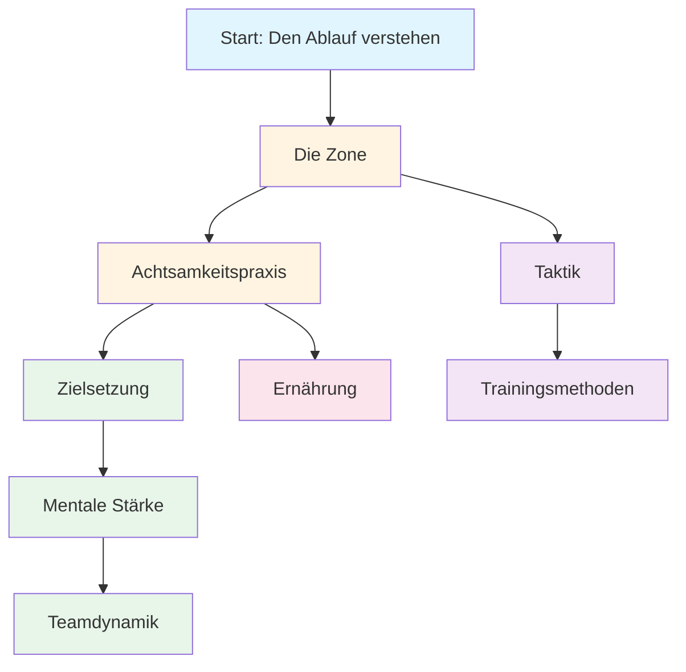

# Ausbildung
<AdBanner />

Willkommen beim Ausbildungsprogramm der Pétanque-Akademie. Hier lernen Spitzenspieler, das mentale Spiel zu meistern.

::: tip Kernprinzip
Auf Spitzenniveau **wird mentales Training wichtiger als technisches Training**. Das Verhältnis kehrt sich mit zunehmender Erfahrung um: Anfänger benötigen 90 % technisches Training, Experten 80 % mentales Training.
:::

## Warum mentales Training wichtig ist

Im Spitzensport ist technisches Können nur der Anfang. Studien zeigen, dass die mentale Einstellung in Präzisionssportarten wie Pétanque genauso wichtig sein kann wie das körperliche. Der Unterschied zwischen guten und großartigen Spielern liegt oft in ihrer mentalen Stärke.

> „Sport ist zu 100 % Kopfsache. Der Geist ist die treibende Kraft hinter allen körperlichen Fähigkeiten.“

## Ihre Lernreise

Hier ist der empfohlene Ablauf durch unser Ausbildungsprogramm:

**Empfohlene Reihenfolge:**
1. **Grundlagen:** Beginnen Sie mit The Zone und Achtsamkeit
2. **Struktur:** Zielsetzung und Trainingsmethoden hinzufügen
3. **Wettbewerb:** Mentale Stärke und Taktik entwickeln
4. **Teamspiel:** Meistere die Teamdynamik
5. **Optimierung:** Feinabstimmung durch Ernährung

## Unsere Lernwege

<AdInArticle />

### 🎯 [Die Zone (Flow-Zustand)](/en/education/the-zone/)
Lerne, was der „Flow“ wirklich ist und wie du ihn erreichst. Verstehe die Wissenschaft hinter diesen Zuständen und entdecke praktische Techniken, um in entscheidenden Momenten Höchstleistungen zu erbringen.

### 🧘 [Achtsamkeit](/en/education/mindfulness/)
Meistern Sie die Kunst der Achtsamkeit. Lernen Sie wissenschaftlich erprobte Techniken, um Ihren Geist zu beruhigen, Ihre Konzentration zu verbessern und sich schnell von Fehlern zu erholen.

### 📊 [Zielsetzung](/en/education/goals/)
Erstellen Sie einen Fahrplan für Ihre Weiterentwicklung. Lernen Sie das SMART-Framework für Pétanque kennen und entwickeln Sie einen Trainingsplan, der wirklich funktioniert.

### 💪 [Mentale Stärke](/en/education/mental-strength/)
Entwickle die mentale Stärke, die für den Wettkampf nötig ist. Lerne, mit Druck umzugehen, Ängste zu überwinden und Routinen zu entwickeln, die Höchstleistungen ermöglichen.

### 🤝 [Teamdynamik](/en/education/team-player/)
Werde zum Teamkollegen, mit dem jeder gerne zusammenspielt. Lerne alles über Kommunikation, Vertrauen und wie du zu einer erfolgreichen Teamkultur beitragen kannst.

### ♟️ [Taktiken](/en/education/tactics/)
Denken Sie in jeder Situation strategisch. Lernen Sie, auf Wahrscheinlichkeitsrechnung basierende Entscheidungen zu treffen und wann Sie Risiken eingehen sollten.

### 🏋️ [Trainingsmethoden](/en/education/training/)
Trainiere intelligenter, nicht nur härter. Lerne, wie du dein Training strukturierst, um maximale Fortschritte zu erzielen.

### 🥗 [Ernährung](/en/education/nutrition/)
Optimieren Sie Ihre Gehirnleistung für maximale Präzision. Lernen Sie, wie Sie Ihre Energie und Konzentration während des gesamten Wettkampfs aufrechterhalten.

<AdInArticle />

## Der Weg von der Technik zum Flow

Mit zunehmender Spielentwicklung kehrt sich das Trainingsverhältnis um – mentales Training wird wichtiger, nicht weniger:

| Ebene | Verhältnis (Technik:Mental) | Primäres Ziel |
|-------|---------------------|-------------------|
| **Anfänger** | 90 : 10 | Baue die Maschine |
| **Dazwischenliegend** | 70 : 30 | Die Fertigkeit stabilisieren |
| **Fortschrittlich** | 50 : 50 | Vertraue der Maschine |
| **Experte** | 20 : 80 | Leistungsfreiheit |

Man kann einen Anfänger nicht wie einen Experten ausbilden (ihm fehlen die neuronalen Verbindungen), und man kann einen Experten nicht wie einen Anfänger ausbilden (das hohe technische Volumen führt zu übermäßigem Nachdenken).

## Kurzübersicht: Wichtigste Prinzipien aus jedem Abschnitt

| Abschnitt | Kernprinzip | Wichtigste Erkenntnis |
|---------|---------------|--------------|
| **Die Zone** | Vom analytischen in den automatischen Modus wechseln | „Es gibt keine Techniken, die immer einen perfekten Boule hervorbringen. Aber es gibt einen mentalen Zustand, in dem perfekte Boules zur Gewohnheit werden.“ |
| **Achtsamkeit** | Wähle aus, worauf du deine Aufmerksamkeit richten möchtest. | *„Bei Achtsamkeit geht es nicht darum, den Geist zu leeren. Es geht darum, bewusst zu entscheiden, worauf man seine Aufmerksamkeit richtet.“* |
| **Zielsetzung** | Konzentriere dich auf das, was du kontrollieren kannst. | *„Ein Ziel ohne Plan ist nur ein Wunsch.“* |
| **Mentale Stärke** | Trotz Nervosität eine gute Leistung erbringen | „Mentale Stärke bedeutet nicht, Nervosität zu überwinden oder nie Fehler zu machen. Es geht darum, trotz allem gute Leistungen zu erbringen.“ |
| **Teamdynamik** | Vertrauen und Kommunikation entscheiden Spiele | *„Die besten Teams sind nicht immer die technisch versiertesten – es sind diejenigen, die am besten zusammenspielen.“* |
| **Taktik** | Entscheidungsfindung schlägt Technik | *„Auf Spitzenniveau liegt der Unterschied selten in der Technik – es ist die Entscheidungsfindung.“* |
| **Ausbildung** | Qualität vor Quantität | *„Trainiere intelligenter, nicht nur härter.“* |
| **Ernährung** | Stabile Energie = stabile Leistung | *„Ihr Gehirn ist ein Präzisionsinstrument. Versorgen Sie es entsprechend.“* |

## Alle wichtigen Regeln und Erkenntnisse

::: details Zum Erweitern klicken: Vollständige Liste der Prinzipien
Dies ist Ihre Kurzanleitung. Speichern Sie diesen Abschnitt als Lesezeichen und kehren Sie regelmäßig dazu zurück.

### Die Zonenregeln
1. **Die Switch-Regel:** Analysiere vor dem Kreis, führe im Kreis aus, beobachte danach
2. **Die Umkehrregel:** Mit zunehmender Fertigkeit wird mentales Training wichtiger als technisches Training.
3. **Die Vertrauensregel:** Dein Bewusstsein plant, dein Unterbewusstsein führt aus

### Achtsamkeitsregeln
1. **Die Regel der Achtsamkeit:** Beobachte ohne zu urteilen.
2. **Die SOAS-Regel:** Anhalten, Beobachten, Akzeptieren, Loslassen
3. **Die Gegenwartsregel:** Du kannst nur diesen Moment, diesen Wurf kontrollieren.

### Regeln zur Zielsetzung
1. **Die Kontrollregel:** Konzentrieren Sie sich auf Prozessziele (was Sie kontrollieren können) anstatt auf Ergebnisziele.
2. **Die SMART-Regel:** Ziele müssen spezifisch, messbar, erreichbar, relevant und terminiert sein.
3. **Die Aufteilungsregel:** Große Ziele benötigen vierteljährliche, monatliche und wöchentliche Meilensteine.

### Regeln der mentalen Stärke
1. **Die Routineregel:** Konsequente Vorbereitungsroutinen vor dem Schuss führen zu Höchstleistungen.
2. **Die Reset-Regel:** Entwickeln Sie eine 10-Sekunden-Reset-Routine nach Fehlern.
3. **Der Selbstvertrauenskreislauf:** Bessere Vorbereitung → Mehr Selbstvertrauen → Bessere Leistung

### Taktische Regeln
1. **Die Wahrscheinlichkeitsregel:** Wähle Würfe, bei denen die Erfolgswahrscheinlichkeit das Risiko rechtfertigt.
2. **Die Jack-Kontrollregel:** Das Team, das die Jack-Position kontrolliert, hat den Vorteil.
3. **Die Distanzregel:** Kurze Distanz begünstigt das Schießen, lange Distanz begünstigt das Zielen.
4. **Die Stilregel:** Erzwinge das Spiel in den stärksten Stil deines Teams.
5. **Die Boule-Management-Regel:** Manchmal ist es besser, einen Punkt abzugeben, als drei zu riskieren.

### Teamdynamikregeln
1. **Die Kommunikationsregel:** Klare, positive Kommunikation schafft Vertrauen
2. **Die Unterstützungsregel:** Wie du auf die Fehler deiner Teamkollegen reagierst, ist wichtiger als dein Können.
3. **Die Rollenregel:** Kenne deine Rolle und führe sie vollumfänglich aus.

### Ausbildungsregeln
1. **Die Spezifitätsregel:** Trainiere das, was du verbessern willst.
2. **Die Variationsregel:** Unvorhergesehenes Training ist blockweisem Training im Hinblick auf den Wettkampferfolg überlegen.
3. **Die Erholungsregel:** Ruhe ist die Zeit, in der Anpassung stattfindet.

### Ernährungsregeln
1. **Die Stabilitätsregel:** Vermeiden Sie Blutzuckerspitzen und -abfälle.
2. **Die Flüssigkeitsregel:** Schon 2 % Dehydrierung beeinträchtigen die Leistungsfähigkeit.
3. **Die Timing-Regel:** Essen Sie 2-3 Stunden vor dem Wettkampf.
:::

## Beginne deine Reise

::: tip Empfohlener Ausgangspunkt
Beginnen Sie mit [The Zone](/en/education/the-zone/), um die Grundlagen von Höchstleistungen zu verstehen, und erkunden Sie anschließend [Mindfulness](/en/education/mindfulness/), um praktische Techniken kennenzulernen, die Sie sofort anwenden können.
:::

<AdBanner />
:::
