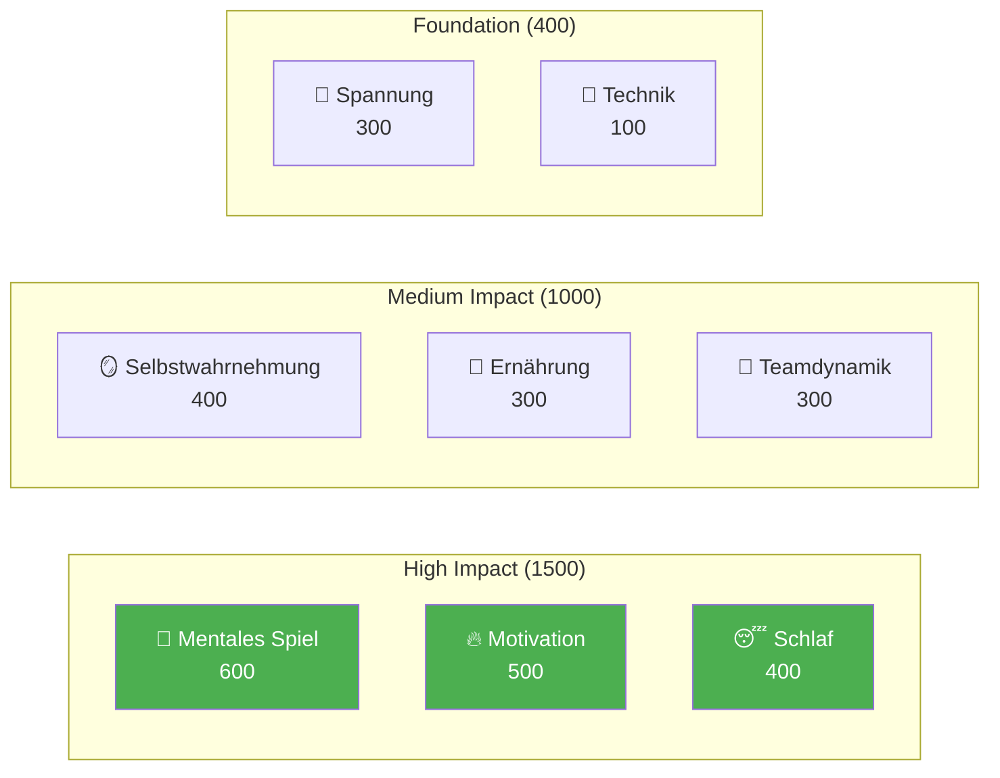

# Entwicklung von Spitzenspielern

Willkommen beim Pétanque Academy Ausbildungsprogramm – dem kompletten System zur Spielerentwicklung, das auf 8 Leistungsfaktoren basiert.

::: tip Kernprinzip
Im Spitzensport **wird mentales Training wichtiger als technisches Training**. Die Technik hat die geringste Gewichtung – nicht weil sie unwichtig wäre, sondern weil im Spitzensport jeder über eine gute Technik verfügt. Der entscheidende Unterschied liegt im Mentalen.
:::

---

## Das 8-Faktoren-Leistungsmodell

Unser Lehrplan basiert auf 8 Schlüsselfaktoren, die nach ihrem Einfluss auf Spitzenleistungen gewichtet sind:

| Faktor | Gewicht | Beschreibung |
|--------|--------|-------------|
| 🧠 [**Mentales Spiel**](/en/education/mental-game/) | **600** | Denkmuster, Konzentration, Flow-Zustände, Selbstgespräch |
| 🔥 [**Motivation**](/en/education/motivation/) | **500** | Antrieb, Zielstrebigkeit, Zielorientierung, Beharrlichkeit |
| 😴 [**Schlaf &amp; Erholung**](/en/education/sleep/) | **400** | Schlafqualität, Erholung, Ruhe vor dem Wettkampf |
| 🪞 [**Selbstwahrnehmung**](/en/education/self-awareness/) | **400** | Genaue Selbstwahrnehmung, Erkennung blinder Flecken |
| 🥗 [**Ernährung**](/en/education/nutrition/) | **300** | Blutzuckerstabilität, Flüssigkeitszufuhr, Wettkampf-Energie |
| 🤝 [**Teamdynamik**](/en/education/team-dynamics/) | **300** | Kommunikation, Vertrauen, Rollenklarheit |
| 💆 [**Spannungsmanagement**](/en/education/tension/) | **300** | Körperliche Anspannung, Entspannung, Atemkontrolle |
| 🎯 [**Technik**](/de/bildung/technik/) | **100** | Physikalische Mechanik, Wurfrepertoire |

**Gesamt: 2.900 Punkte**

---

## Warum gerade diese Gewichte?

Die Gewichtungen spiegeln die **Auswirkungen auf Spitzenniveau** wider:

> „Bei den Regionalmeisterschaften entscheidet die Technik über die Platzierung der besten 50 Prozent. Bei den nationalen Meisterschaften verfügt jeder im Raum über eine herausragende Technik. Was die einzelnen Teilnehmer unterscheidet, ist alles andere.“

---

## Jeden Faktor genauer betrachten

### 🧠 Mentales Spiel (600 Punkte)

**Der einflussreichste Faktor für Höchstleistungen.**

Ihre Fähigkeit, Gedanken zu steuern, den Fokus zu behalten und Flow-Zustände zu erreichen.

- [The Zone](/en/education/mental-game/the-zone/) — Flow-Zustände verstehen und erreichen
- Mentale Stärke – Umgang mit Druck, Vorbereitungsroutinen vor dem Wurf
- [Achtsamkeit](/en/education/mental-game/mindfulness/) — Konzentration auf den gegenwärtigen Moment, Erholung von Fehlern

### 🔥 Motivation (500 Punkte)

**Was treibt Sie an, sich Tag für Tag, Jahr für Jahr zu verbessern?**

- [Zielsetzung](/en/education/motivation/) — SMART-Ziele, Prozess- vs. Ergebnisorientierung
- Motivationspsychologie – Intrinsische vs. extrinsische Motivation, Selbstbestimmungstheorie
- Motivation aufrechterhalten – Burnout-Prävention, Plateau-Bewältigung

### 😴 Schlaf &amp; Erholung (400 Punkte)

**Oft übersehen, aber enorm wirkungsvoll.**

Die Schlafqualität beeinflusst direkt Reaktionszeit, Entscheidungsfindung und Emotionsregulation.

- [Schlafwissenschaft für Sportler](/en/education/sleep/) — Warum Schlaf für Präzisionssportarten so wichtig ist
- [Schlafgewohnheiten entwickeln](/en/education/sleep/habits) — Praktische Schlafhygiene
- [Schlaf &amp; Wettkampf](/en/education/sleep/competition) — Vorveranstaltungsprotokolle, Reisemanagement

### 🪞 Selbstwahrnehmung (400 Punkte)

Was man nicht sieht, kann man nicht verbessern.

Eine präzise Selbstwahrnehmung ermöglicht gezielte Verbesserungen.

- [Der Vorteil der Selbstwahrnehmung](/en/education/self-awareness/) — Warum Selbsterkenntnis wichtig ist
- [Feedback einholen](/en/education/self-awareness/feedback) — Externe Perspektiven
- [Videoanalyse](/en/education/self-awareness/video) — Video zur Selbsterkenntnis nutzen

### 🥗 Nährwerte (300 Punkte)

**Stabile Energie = stabile Leistung.**

Dein Gehirn ist ein Präzisionsinstrument – sorge dafür, dass es die nötige Energie erhält.

- [Leistungssteigerung durch Energiezufuhr](/en/education/nutrition/) — Blutzucker, Flüssigkeitszufuhr, Wettkampfernährung

### 🤝 Teamdynamik (300 Punkte)

**Die besten Teams sind nicht immer die technisch versiertesten.**

Kommunikation und Vertrauen sind oft wichtiger als individuelles Talent.

- [Ein großartiger Teamplayer sein](/en/education/team-dynamics/) — Teamkultur und Unterstützung
- [Teamkommunikation](/en/education/team-dynamics/communication) — Klare, positive Kommunikation

### 💆 Spannungsmanagement (300 Punkte)

**Spannung ist der Feind der Präzision.**

Man kann nicht gleichzeitig angespannt und präzise sein.

- [Spannung verstehen](/en/education/tension/) — Körperliche vs. mentale Spannung
- [Entspannungstechniken](/en/education/tension/techniques) — PMR, Atmung, schnelle Resets
- [Wettkampfmanagement](/en/education/tension/competition) — Protokolle vor und während des Spiels

### 🎯 Technik (100 Punkte)

**Das Fundament – notwendig, aber nicht ausreichend.**

Auf Spitzenniveau ist Technik selbstverständlich. Die Unterscheidungsmerkmale liegen weiter oben.

- [Technikübersicht](/en/education/technique/) — Physikalische Mechanik
- [Trainingsmethoden](/en/education/technique/training/) — Gezieltes Üben
- [Taktiken](/en/education/technique/tactics/) — Strategische Entscheidungsfindung

---

## Der Entwicklungsweg

Mit zunehmender Spielentwicklung kehrt sich dein Trainingsverhältnis um:

| Ebene | Verhältnis (Technik:Mental) | Fokus |
|-------|---------------------|-------|
| **Anfänger** | 90 : 10 | Baue die Maschine |
| **Dazwischenliegend** | 70 : 30 | Die Fertigkeit stabilisieren |
| **Fortschrittlich** | 50 : 50 | Vertraue der Maschine |
| **Experte** | 20 : 80 | Leistungsfreiheit |

Man kann einen Anfänger nicht wie einen Experten ausbilden (ihm fehlen die neuronalen Verbindungen), und man kann einen Experten nicht wie einen Anfänger ausbilden (das hohe technische Volumen führt zu übermäßigem Nachdenken).

---

## Kurzübersicht: Kernprinzipien

::: details Zum Erweitern klicken: Vollständige Liste der Prinzipien

### Regeln für mentale Spiele
1. **Die Switch-Regel:** Analysiere vor dem Kreis, führe im Kreis aus, beobachte danach
2. **Die Vertrauensregel:** Dein Bewusstsein plant, dein Unterbewusstsein führt aus
3. **Die Gegenwartsregel:** Du kannst nur diesen Moment, diesen Wurf kontrollieren.

### Motivationsregeln
1. **Die Kontrollregel:** Fokus auf Prozessziele statt auf Ergebnisziele
2. **Die SMART-Regel:** Ziele müssen spezifisch, messbar, erreichbar, relevant und terminiert sein.
3. **Die intrinsische Regel:** Innere Motivation ist länger anhaltend als äußere Belohnungen.

### Schlafregeln
1. **Die Regel der Konstanz:** Jeden Tag zur gleichen Zeit aufstehen, auch am Wochenende.
2. **Die Pufferregel:** Entspannen Sie sich mindestens 60 Minuten vor dem Schlafengehen.
3. **Die Wettbewerbsregel:** Ausreichend Schlaf in der Woche zuvor, nicht nur in der Nacht davor

### Regeln der Selbstwahrnehmung
1. **Die Feedback-Regel:** Suchen Sie aktiv nach externen Perspektiven.
2. **Die Videoregel:** Was du fühlst ≠ was real ist – aufnehmen und analysieren
3. **Die Regel des blinden Flecks:** Geringes Selbstbewusstsein beeinträchtigt alle anderen Beurteilungen.

### Ernährungsregeln
1. **Die Stabilitätsregel:** Vermeiden Sie Blutzuckerspitzen und -abfälle.
2. **Die Flüssigkeitsregel:** Schon 2 % Dehydrierung beeinträchtigen die Leistungsfähigkeit.
3. **Die Timing-Regel:** Essen Sie 2-3 Stunden vor dem Wettkampf.

### Teamdynamikregeln
1. **Die Kommunikationsregel:** Klare, positive Kommunikation schafft Vertrauen
2. **Die Support-Regel:** Wie Sie auf Fehler reagieren, ist wichtiger als Ihr Können.
3. **Die Rollenregel:** Kenne deine Rolle und führe sie vollumfänglich aus.

### Spannungsregeln
1. **Die Entspannungsregel:** Man kann nicht gleichzeitig angespannt und präzise sein.
2. **Die Yerkes-Dodson-Regel:** Finde deine optimale Erregungszone
3. **Die Reset-Regel:** 10 Sekunden Reset vor jedem Wurf

### Technikregeln
1. **Die Spezifitätsregel:** Trainiere das, was du verbessern willst.
2. **Die Variationsregel:** Zufälliges Üben ist besser als blockiertes Üben.
3. **Die Erholungsregel:** Ruhe ist die Zeit, in der Anpassung stattfindet.
:::

---

## Beginne deine Reise

::: tip Empfohlener Ausgangspunkt
Beginnen Sie mit [Mental Game](/en/education/mental-game/), um die Grundlagen für Höchstleistungen zu verstehen. Anschließend sollten Sie sich mit [Sleep](/en/education/sleep/) beschäftigen – dies ist oft die wirkungsvollste Maßnahme zur Verbesserung der Leistungsfähigkeit von Nachwuchsspielern.
:::

