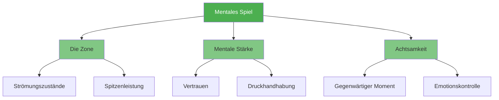

# Mentales Spiel

::: tip Der wichtigste Faktor
**Gewichtung: 600 Punkte** — Die mentale Stärke hat den größten Einfluss auf Ihre Leistung. Beherrschen Sie Ihren Geist, und alles andere ergibt sich von selbst.
:::

Die mentale Komponente umfasst alles, was im Kopf vorgeht: Gedanken, Konzentration, Selbstvertrauen und Selbstgespräche. Spitzenspieler verfügen nicht nur über eine bessere Technik, sondern haben auch eine bessere Kontrolle über ihren mentalen Zustand.

## Die drei Säulen

### 🎯 [Die Zone](/en/education/mental-game/the-zone/)
Erreichen Sie den Flow-Zustand, in dem sich Leistung mühelos anfühlt. Lernen Sie, was den Flow auslöst und wie Sie ihn dauerhaft erreichen.

- [Einführung in The Zone](/en/education/mental-game/the-zone/)
- [Technik vs. Flow-Training](/en/education/mental-game/the-zone/technical-vs-flow)
- [In die Zone eintreten](/en/education/mental-game/the-zone/entering-the-zone)

### 💪 [Mentale Stärke](/en/education/mental-game/mental-strength/)
Entwickeln Sie die psychische Widerstandsfähigkeit, um auch unter Druck Leistung zu bringen. Stärken Sie Ihr Selbstvertrauen, lernen Sie, mit Rückschlägen umzugehen und bewahren Sie die Ruhe.

- [Mentale Stärke aufbauen](/en/education/mental-game/mental-strength/)
- [Umgang mit Druck](/en/education/mental-game/mental-strength/handling-pressure)
- [Vorbereitungsroutine vor dem Wurf](/en/education/mental-game/mental-strength/pre-shot-routine)

### 🧘 [Achtsamkeit](/en/education/mental-game/mindfulness/)
Entwickle Achtsamkeit für den gegenwärtigen Moment, um konzentriert zu bleiben und Fehler schnell wieder gutzumachen.

- [Einführung in die Achtsamkeit](/en/education/mental-game/mindfulness/)
- [Achtsamkeitstechniken](/en/education/mental-game/mindfulness/techniques)
- [Tägliche Übung](/en/education/mental-game/mindfulness/daily-practice)

## Warum die mentale Stärke am wichtigsten ist

| Aspekt | Technische Ausbildung | Mentales Training |
|--------|-------------------|-----------------|
| **In der Praxis** | Du kannst den Schuss machen. | Du kannst den Schuss machen. |
| **Im Wettbewerb** | Die Technik kann unter Druck versagen. | Mentale Fähigkeiten erhalten die Leistung aufrecht |
| **Der Unterschied** | Körperliche Geschicklichkeit ist erforderlich | Mentale Fähigkeiten sind der Multiplikator. |

::: warning Der häufigste Fehler
Die meisten Spieler verbringen 90 % ihrer Zeit mit Technik und nur 10 % mit mentalen Fähigkeiten. Spitzenspieler kehren dieses Verhältnis oft um, sobald sie die Grundlagen beherrschen.
:::

## Wo soll ich anfangen?

**Neu im mentalen Training?** Beginnen Sie mit [The Zone](/en/education/mental-game/the-zone/), um zu verstehen, wie sich Höchstleistungen anfühlen.

**Sie fühlen sich unter Druck gesetzt?** Unter [Mentale Stärke](/en/education/mental-game/mental-strength/) finden Sie praktische Techniken.

**Schweifen Ihre Gedanken während der Spiele ab?** [Achtsamkeit](/en/education/mental-game/mindfulness/) hilft Ihnen, im Hier und Jetzt zu bleiben.

## Verwandte Ressourcen

- Selbstwahrnehmung – Kenne dich selbst, um dich schneller zu verbessern
- [Spannungsmanagement](/en/education/tension/) — Körperliche Entspannung ermöglicht geistige Klarheit
- [Bewertungstool](/en/education/) — Analysiere deine mentale Stärke und erhalte personalisierte Empfehlungen

