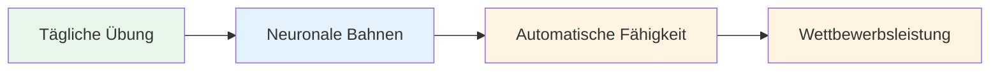
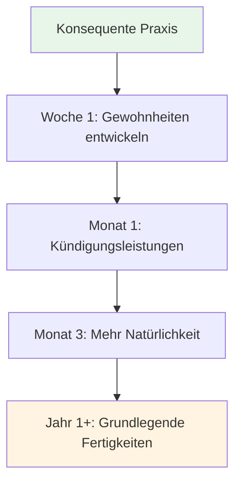

# Aufbau einer täglichen Achtsamkeitspraxis

Die Vorteile von Achtsamkeit ergeben sich aus regelmäßiger Übung. So integrieren Sie sie in Ihr Leben.

::: tip Die große Idee
Regelmäßigkeit ist wichtiger als Intensität. Fünf Minuten täglich sind besser als eine Stunde einmal pro Woche. Fangen Sie klein an, bleiben Sie dran, und die positiven Effekte verstärken sich mit der Zeit.
:::

## Warum tägliches Üben wichtig ist

::: info Achtsamkeit ist wie körperliche Fitness
- ❌ Mit nur einem Besuch im Fitnessstudio wird man nicht fit.
- ✅ Regelmäßiges Üben führt zu nachhaltigen Veränderungen
- ✅ Die Effekte verstärken sich mit der Zeit
- ✅ Mit der Zeit wird es einfacher.
:::

::: tip Forschungsbasiert
Studien zeigen, dass bereits **3 Minuten täglich** messbare Vorteile bringen. Man muss es aber regelmäßig tun.
:::

## Erstellen Sie Ihre Routine

### Schritt 1: Wählen Sie Ihren Zeitpunkt

Wählen Sie eine feste Zeit, die in Ihren Alltag passt:

| Zeit | Vorteile | Überlegungen |
|------|------------|----------------|
| **Morgen** | Setzt die richtige Stimmung für den Tag, weniger Unterbrechungen. | Ich muss früher aufstehen |
| **Mittag** | Unterteilt den Tag, lenkt den Fokus neu | Kann man vergessen, Terminkonflikte |
| **Abend** | Entspannen, den Tag Revue passieren lassen | Möglicherweise müde, weniger aufmerksam |
| **Vor dem Training** | Direkter Anschluss an Pétanque | Hängt vom Trainingsplan ab |

**Beste Vorgehensweise:** Verknüpfen Sie es mit einer bestehenden Gewohnheit (nach dem Kaffee, vor dem Mittagessen usw.).

### Schritt 2: Fangen Sie klein an

Setzen Sie sich am ersten Tag nicht das Ziel von 30 Minuten.

**Empfohlene Vorgehensweise:**
- Woche 1-2: 3-5 Minuten
- Woche 3-4: 5-10 Minuten
- Monat 2: 10-15 Minuten
- Ab Monat 3: 15-20 Minuten

Es ist besser, jeden Tag 5 Minuten zu üben als einmal pro Woche 30 Minuten.

### Schritt 3: Gestalten Sie Ihren Raum

Man braucht keinen Meditationsraum, aber ein regelmäßiger Platz ist hilfreich:
- Einen ruhigen Ort (oder Kopfhörer benutzen)
- Bequeme Sitzgelegenheiten
- Minimale Ablenkungen
- Wenn möglich, immer am selben Ort.

### Schritt 4: Hindernisse beseitigen

Das Üben soll leicht gemacht werden:
- Schalte dein Telefon stumm.
- Bitten Sie Ihre Familie/Mitbewohner, nicht zu unterbrechen.
- Alles bereithalten (Kissen, Timer)
- Warten Sie nicht auf „perfekte“ Bedingungen.

## Beispielhafte Tagespläne

### Minimale Übung (5 Minuten)
- Morgens: 3 Minuten bewusstes Atmen
- Über den Tag verteilt: 3 Momente der Achtsamkeitsübung
- Abends: 2 Minuten Körperwahrnehmung vor dem Einschlafen

### Standardverfahren (15 Minuten)
- Morgens: 10 Minuten Sitzmeditation
- Mittags: 2 Minuten bewusstes Atmen
- Abends: 3-minütiger Körperscan

### Intensives Training (30 Minuten)
- Morgens: 15 Minuten Sitzmeditation
- Mittags: 5 Minuten Gehmeditation
- Abends: 10-minütiger Körperscan
- Außerdem: Achtsames Essen bei einer Mahlzeit

## Integration mit Pétanque-Training

### Vor dem Training
- 5 Minuten Sitzmeditation
- Setzen Sie sich ein Ziel für die Sitzung
- Scannen Sie Ihren Körper, um eventuelle Verspannungen zu erkennen.

### Während des Trainings
- Nutze die Vorbereitungsroutine als Achtsamkeitsübung
- SOAS nach Fehlern anwenden
- Bleib zwischen den Würfen präsent.

### Nach dem Training
- 3 Minuten zum Nachdenken (ohne Wertung)
- Beachten Sie alle Strömungsmomente
- Bewusstes Atmen zum Übergang

## Ihre Praxis verfolgen

Das Führen eines Protokolls trägt zur Konsistenz bei:

### Einfaches Protokoll
| Datum | Dauer | Typ | Anmerkungen |
|------|----------|------|-------|
| Montag | 10 Minuten | Sitzend | Mein Kopf ist sehr beschäftigt |
| Di. | 10 Minuten | Sitzend | Heute ruhiger |
| Heiraten | 5 Minuten | Körperscan | Verspannungen in den Schultern festgestellt |

### Was zu verfolgen ist
- Hast du geübt? (Ja/Nein)
- Wie lange?
- Welche Art?
- Kurzer Hinweis zur Erfahrung (optional)

### Apps, die helfen
- Headspace
- Ruhig
- Insight Timer
- Einfache Gewohnheitstracker

## Überwindung häufiger Hindernisse

### &quot;Ich habe keine Zeit.&quot;
- Sie haben 3 Minuten Zeit.
- Es geht um Prioritäten, nicht um Zeit.
- Versuchen Sie, eine Verbindung zu bestehenden Aktivitäten herzustellen.

### &quot;Ich vergesse es immer wieder.&quot;
- Stelle einen täglichen Alarm ein
- Anknüpfung an bestehende Gewohnheiten
- Platzieren Sie eine visuelle Erinnerung an einem Ort, wo Sie sie sehen können.

### &quot;Ich mache es nicht richtig.&quot;
- Es gibt keinen &quot;richtigen&quot; Weg
- Wer aufmerksam ist, macht es auch.
- Gedankenabschweifen ist normal und zu erwarten.

### &quot;Ich sehe keine Ergebnisse.&quot;
- Die Vorteile sind zunächst subtil.
- Führe ein Tagebuch, um Veränderungen im Laufe der Zeit festzuhalten.
- Vertrauen Sie der Forschung – sie funktioniert.

### „Es ist langweilig.“
- Langeweile ist nur eine weitere Erfahrung, die man beobachten kann.
- Probieren Sie verschiedene Techniken aus.
- Erinnere dich daran, warum du es tust.

## Anzeichen für Fortschritt

Sie werden vielleicht keine dramatischen Veränderungen bemerken, aber achten Sie auf Folgendes:
- Sich selbst dabei ertappen, wenn die Gedanken abschweifen (schneller)
- sich schneller von Frustration erholen
- Spannungen erkennen, bevor sie sich aufbauen
- Sich während der Spiele präsenter fühlen
- Besserer Schlaf
- Reagiert weniger stark auf schlechte Würfe

## Das lange Spiel

Achtsamkeit ist eine lebenslange Übung. Spitzensportler sagen oft, es sei die wertvollste Fähigkeit, die sie entwickelt haben.

**Monat 1:** Aufbau einer Gewohnheit
**Monate 2-3:** Erste positive Effekte werden sichtbar.
**Monate 4-6:** Wird natürlicher
**Ab dem 1. Schuljahr:** Ein grundlegender Bestandteil dessen, wer du bist

## Wichtigste Erkenntnis

> Regelmäßigkeit ist wichtiger als Intensität. Fünf Minuten täglich sind besser als eine Stunde einmal pro Woche.

Fang heute an. Fang klein an. Mach weiter.

