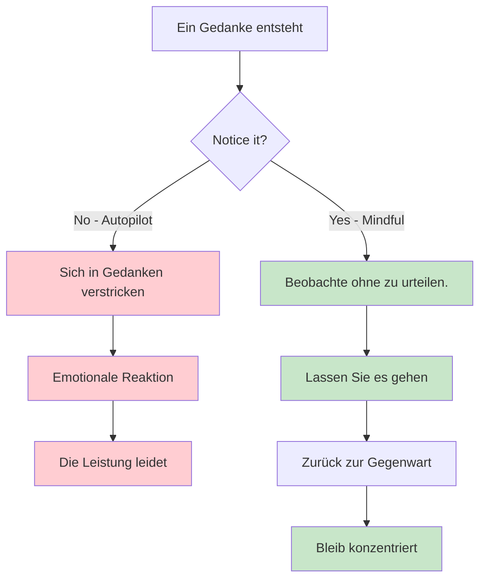
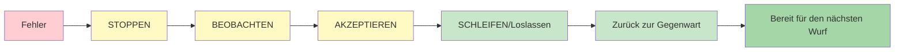

# Achtsamkeit für Boule-Spieler

Achtsamkeit ist eines der wirkungsvollsten Werkzeuge für Sportler. Sie ist weder mystisch noch kompliziert – es ist einfach die Übung, dem gegenwärtigen Moment unvoreingenommen Aufmerksamkeit zu schenken.

::: tip Das Kernprinzip
Achtsamkeit bedeutet nicht, den Geist zu leeren. Es geht darum, bewusst zu entscheiden, worauf man seine Aufmerksamkeit richtet. Man kann das Auftauchen von Gedanken nicht verhindern, aber man kann entscheiden, ihnen nicht zu folgen.
:::

## Was ist Achtsamkeit?

Achtsamkeit bedeutet, vollkommen präsent und sich dessen bewusst zu sein:
- Wo du bist
- Was du tust
- Wie du dich fühlst

...ohne von den Geschehnissen um dich herum überwältigt zu werden oder darauf zu reagieren.

Für Pétanque-Spieler bedeutet dies:
- Bei jedem Wurf voll präsent sein.
- Gedanken wahrnehmen, ohne sich in ihnen zu verlieren
- Sich schnell von Fehlern erholen
- In stressigen Situationen ruhig bleiben

## Die Wissenschaft dahinter

Achtsamkeit ist nicht nur Philosophie – sie wird durch solide Forschung untermauert:

### Auswirkungen auf Ihr Gehirn
- **Reduziert die Aktivität der Amygdala** (das Alarmsystem Ihres Gehirns)
- **Stärkt den präfrontalen Cortex** (Entscheidungsfindung und Konzentration) – dies hilft Ihnen, bei der Planung klar zu denken.
- **Verbessert Ihre Fähigkeit, den Geist bei Bedarf zu beruhigen** – unerlässlich, um während der Ausführung in den Flow-Zustand zu gelangen.
- **Verbessert die Verbindungen** zwischen Hirnregionen
- **Schafft bei regelmäßiger Übung dauerhafte strukturelle Veränderungen**

### Auswirkungen auf die Leistung
| Nutzen | Wie es deinem Spiel hilft |
|---------|----------------------|
| Stressabbau | Niedrigerer Cortisolspiegel, ruhigere Hände |
| Besserer Fokus | Weniger Ablenkungen, klarere Entscheidungen |
| Emotionale Kontrolle | Lass schlechte Würfe nicht außer Kontrolle geraten. |
| Schnellere Genesung | Sich schnell von Fehlern erholen |
| Verbesserter Schlaf | Bessere Erholung, bessere Leistung |

## Warum Boule-Spieler Achtsamkeit brauchen

Pétanque hat einzigartige mentale Herausforderungen:

1. **Zeit zwischen den Würfen** - Viel Gelegenheit für negative Gedanken
2. **Sichtbare Fehler** – Jeder sieht, wenn du einen Fehler machst
3. **Teamdruck** – Dein Wurf beeinflusst deine Partner
4. **Lange Wettkämpfe** – Mentale Erschöpfung über viele Stunden
5. **Knappe Spiele** – Hoher Druck in den entscheidenden Momenten

Achtsamkeit hilft Ihnen dabei, all das zu bewältigen.

## Die Kernkompetenz: Wertfreie Wahrnehmung

Das Schlüsselwort ist „vorurteilsfrei“.

::: danger Wertendes Denken (Fügt emotionales Gewicht hinzu)
❌ &quot;Das war ein furchtbarer Wurf.&quot;
❌ &quot;Die verpasse ich immer.&quot;
❌ „Meine Teamkollegen müssen frustriert sein.“

**Ergebnis:** Spirale negativer Emotionen, Anspannung, schlechtere Leistung
:::

::: tip Wertfreie Wahrnehmung (einfach nur beobachten)
✅ „Der Wurf ging links vom Ziel vorbei.“
✅ „Ich merke, dass ich angespannt bin.“
✅ „Meine Gedanken schweifen zur Partitur ab.“

**Ergebnis:** Klare Beobachtung, schnelle Erholung, Aufrechterhaltung der Konzentration
:::

**Der Unterschied?** Werturteile verleihen dem Ganzen emotionale Bedeutung und lösen Reaktionen aus. Achtsamkeit hingegen beobachtet und ermöglicht es Ihnen, angemessen zu reagieren.

## Erste Schritte

Sie brauchen keine stundenlange Meditation. Beginnen Sie mit diesen einfachen Übungen:

### 1. Bewusstes Atmen (2 Minuten)
- Nehmen Sie bequem Platz.
- Konzentriere dich auf deinen Atem
- Wenn deine Gedanken abschweifen (was sie tun werden), kehre sanft zum Atem zurück.
- Kein Urteil übers Umherwandern – einfach zurückkehren

### 2. Körperscan (5 Minuten)
- Nehmen Sie Empfindungen in Ihren Füßen wahr.
- Richte deine Aufmerksamkeit langsam nach oben durch deinen Körper.
- Einfach nur beobachten – nichts verändern.
- Spannungsfelder erkennen, ohne sie zu bekämpfen.

### 3. Achtsame Momente
- Wähle eine alltägliche Aktivität (Kaffee trinken, spazieren gehen).
- Führe es mit voller Aufmerksamkeit aus.
- Nehmen Sie alle damit verbundenen Empfindungen wahr.
- Wenn Ihre Gedanken abschweifen, kehren Sie zur Aktivität zurück.

## Achtsamkeit im Wettbewerb

### Vor dem Spiel
- Nehmen Sie sich 2-3 Minuten Zeit für bewusstes Atmen.
- Setzen Sie sich eine Absicht hinsichtlich der Art und Weise, wie Sie spielen möchten (nicht des Ergebnisses, sondern des Prozesses).
- Nehmen Sie jegliche Nervosität wahr, ohne zu versuchen, sie zu beseitigen.

### Während des Spiels
- Nutze deine Vorbereitungsroutine als Achtsamkeitsanker
- Zwischen den Würfen die Aufmerksamkeit wieder auf die Gegenwart richten.
- Nimm deine Gedanken zum Ergebnis wahr und lass sie dann los.

### Nach Fehlern

::: warning Die SOAS-Methode (Ihr Reset-Tool)
**Stopp – Vor der Reaktion innehalten.**
**Beobachte** – Was ist passiert? Was fühle ich?
**A**akzeptieren – Es ist passiert. Es ist vollbracht.
**Slip (Loslassen) – Lass es los, kehre zum Jetzt zurück.

**Benötigte Zeit:** 10 Sekunden
**Anwendung:** Nach jedem Fehler, jedem Fehlgriff oder jedem frustrierenden Moment
:::

## In diesem Abschnitt

- **[Techniken](/de/education/mental-game/mindfulness/techniques)** - Praktische Übungen, die Sie nutzen können
- **[Tägliche Übung](/de/education/mental-game/mindfulness/daily-practice)** - Achtsamkeit in dein Leben integrieren

## Zusammenfassung: Achtsamkeitsregeln

::: tip Regel Nr. 1: Die Bewusstseinsregel
**Beobachten Sie ohne zu urteilen.**
Gedanken und Gefühle wahrnehmen, ohne sie als gut oder schlecht zu bezeichnen.
:::

::: tip Regel Nr. 2: Die SOAS-Regel
**Anhalten, Beobachten, Akzeptieren, Loslassen.**
Deine 10-Sekunden-Reset-Funktion nach Fehlern. Nutze sie jedes Mal.
:::

::: tip Regel Nr. 3: Die Gegenwartsregel
**Du kannst nur diesen Moment, diesen Wurf kontrollieren.**
Vergangene Würfe sind vorbei. Zukünftige Würfe existieren noch nicht. Sei im Hier und Jetzt.
:::

::: tip Regel Nr. 4: Die Übungsregel
**Fangen Sie klein an: 2-5 Minuten täglich.**
Kontinuität ist wichtiger als Dauer. Tägliches Üben fördert die Fertigkeit.
:::

## Wichtigste Erkenntnis

> Bei Achtsamkeit geht es nicht darum, den Geist zu leeren. Es geht darum, bewusst zu entscheiden, worauf man seine Aufmerksamkeit richtet.

Man kann nicht verhindern, dass Gedanken auftauchen. Aber man kann sich entscheiden, ihnen nicht in den Kaninchenbau zu folgen.

