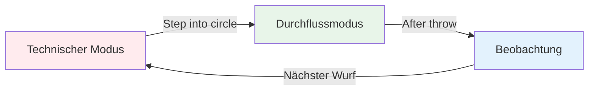
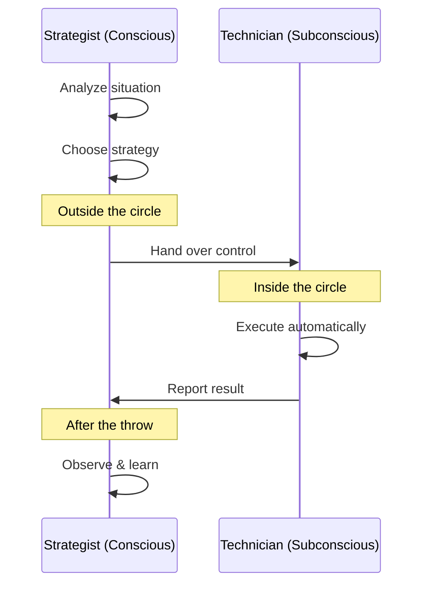

# Die Zone: Den Flow-Zustand verstehen

Hattest du jemals ein Spiel, bei dem einfach alles lief? Wo du nicht über deine Technik nachgedacht hast und jede Kugel genau da landete, wo du sie haben wolltest? Das ist der „Flow“ – und ihn konstant abrufen zu können, unterscheidet die Elite von den anderen.

::: tip Die große Idee
**Der Flow-Zustand ist erreicht, wenn Ihr analytisches Denken zur Ruhe kommt und Ihre trainierten Instinkte die Kontrolle übernehmen.** Man kann sich nicht in diesen Zustand hineindenken – man muss loslassen.
:::

## Was ist die Zone?

Der Flow-Zustand, auch Zone genannt, ist ein mentaler Zustand, in dem man völlig in seiner Tätigkeit aufgeht. Die Zeit scheint langsamer zu vergehen. Die Bewegungen fühlen sich mühelos an. Man denkt nicht über die Technik nach – man *macht* einfach.

Wissenschaftler bezeichnen diesen Zustand als **vorübergehende Hypofrontalität**. Vereinfacht ausgedrückt: Der analytische Teil des Gehirns (der präfrontale Cortex) beruhigt sich, sodass die trainierten Instinkte die Kontrolle übernehmen können.

### Die zwei Gehirnmodi

**Technischer Modus (Planung):**
- Analysiere die Situation
- Wähle deine Strategie
- Entscheide, welchen Wurf du machen willst.

**Ablaufmodus (Ausführung):**
- Vertraue deinem Training
- Konzentriere dich nur auf das Ziel
- Lass deinen Körper automatisch handeln

**Beobachtung (Lernen):**
- Nehmen Sie das Ergebnis wertfrei zur Kenntnis.
- Lerne aus dem, was passiert ist.
- Für den nächsten Wurf zurücksetzen.

## Das Paradoxon von Pétanque

Die Herausforderung beim Pétanque: Man hat viel Zeit zum Nachdenken zwischen den Würfen. Anders als bei schnellen Sportarten, bei denen man sofort reagieren muss, hat man Zeit, zum Kreis zu gehen, die Situation einzuschätzen und den Wurf vorzubereiten.

Diese „Zeit zum Nachdenken“ ist Fluch und Segen zugleich:
- **Geschenk:** Sie können Strategien planen und kluge Entscheidungen treffen.
- **Fluch:** Man kann zu viel nachdenken und seine natürliche Fähigkeit beeinträchtigen.

Der Spitzenspieler lernt, diese Zeit weise zu nutzen – während der Planung nachzudenken und dann während der Ausführung „abzuschalten“.

## Zwei Spielmodi

Ihr Gehirn arbeitet in zwei verschiedenen Modi:

| Besonderheit | Technischer Modus | Durchflussmodus |
|---------|---------------|-----------|
| **Wann verwenden?** | Schulung, Erlernen neuer Fähigkeiten | Wettbewerb, Ausführung |
| **Gehirnaktivität** | Hohes analytisches Denkvermögen | Leise, automatisch |
| **Fokus** | Interne (Körpermechanik) | Extern (Ziel) |
| **Gefühl** | Mühevoll, bewusst | Mühelos, natürlich |

Die wichtigste Fähigkeit besteht darin, zu lernen, **zum richtigen Zeitpunkt** zwischen diesen Modi zu wechseln.

## Der &quot;Schalter&quot;-Moment

::: warning Die Switch-Regel
**Vor dem Kreis:** Analysieren, Strategie entwickeln, entscheiden, welchen Wurf man macht
**Im Kreis:** Lass die Analyse los, vertraue deinem Training, konzentriere dich nur auf das Ziel
**Nach dem Wurf:** Beobachten Sie das Ergebnis wertfrei.
:::

Der Übergang erfolgt beim Betreten des Kreises. Dies ist die wichtigste Fertigkeit im Boule der Spitzenklasse.

Stellen Sie es sich so vor: Ihr Bewusstsein ist der **Stratege**, der den Plan entwirft, und Ihr Unterbewusstsein ist der **Techniker**, der ihn umsetzt. Der Stratege muss sich zurücknehmen und den Techniker seine Arbeit machen lassen.

## Warum übermäßiges Nachdenken die Leistung beeinträchtigt

Wenn man seine Bewegungen während der Ausführung bewusst überwacht, stört man die trainierten automatischen Abläufe. Dies nennt man „Versagen“ – und es passiert jedem.

::: danger Anzeichen dafür, dass du zu viel nachdenkst
- ❌ Über die Armposition während des Wurfs nachdenken
- ❌ Sich vor der Veröffentlichung Sorgen um das Ergebnis machen
- ❌ Sich angespannt oder mechanisch fühlen
- ❌ Sich selbst im Kreis in Frage stellen
:::

::: tip Die Lösung
Die Lösung besteht nicht darin, *weniger* zu denken, sondern darin, zur **richtigen Zeit** über die **richtigen Dinge** nachzudenken.

✅ **Richtiges Denken:** „Ich sehe das Ziel klar vor Augen.“
❌ **Falsches Denken:** „Meinen Ellbogen gerade halten“
:::

## In diesem Abschnitt

Lerne, wie du die Zone meisterst:

- **[Technik vs. Flow-Training](/en/education/mental-game/the-zone/technical-vs-flow)** – Verstehen, wann man sich auf die Technik konzentrieren und wann man loslassen sollte
- **[Den Flow erreichen](/en/education/mental-game/the-zone/entering-the-zone)** - Praktische Techniken zum Erreichen des Flow-Zustands

## Zusammenfassung: Die Zonenregeln

::: tip Regel Nr. 1: Die Schalterregel
**Analysiere vor dem Kreis, führe im Kreis aus, beobachte danach.**
Dein Bewusstsein plant, dein Unterbewusstsein führt aus.
:::

::: tip Regel Nr. 2: Die Umkehrregel
**Mit zunehmender Fertigkeit wird mentales Training wichtiger als technisches Training.**
Anfänger: 90 % Technik / 10 % mentale Fähigkeiten
Experten: 20 % technisches Know-how / 80 % mentales Know-how
:::

::: tip Regel Nr. 3: Die Vertrauensregel
**Man kann sich die perfekte Ausführung nicht durch Denken erarbeiten.**
Vertraue deinem Training. Konzentriere dich auf das Ziel, nicht auf deine Technik.
:::

## Wichtigste Erkenntnis

> Es gibt keine Techniken, die immer einen perfekten Boule hervorbringen. Aber es gibt einen mentalen Zustand, in dem perfekte Boules ganz natürlich gelingen.

Deine Technik ist das Fundament. Die Zone ist der Ort, an dem dieses Fundament zur Kunst wird.

