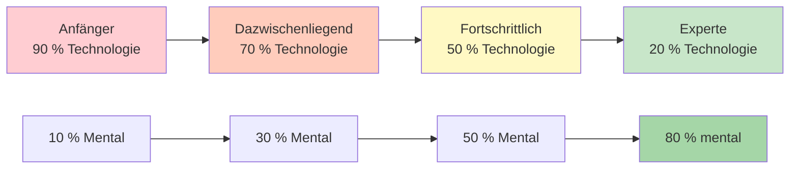

# Technisches Training vs. Flow-Training

Das Verständnis des Unterschieds zwischen technischem Training und Flow-Training ist für die Entwicklung von Spitzensportlern unerlässlich. Beides ist notwendig, dient aber unterschiedlichen Zwecken und erfordert unterschiedliche Ansätze.

::: tip Das Kernprinzip
**Man kann einen Anfänger nicht wie einen Experten ausbilden** (ihnen fehlen die neuronalen Verbindungen), und **man kann einen Experten nicht wie einen Anfänger ausbilden** (ein hohes technisches Volumen führt zu übermäßigem Nachdenken).
:::

## Zwei Arten von Schulungen

::: info Technische Schulung (Explizites Lernen)
**Schwerpunkt:** Mechanik und Form
**Achtung:** Bewusste Körperbewegungen
**Methode:** Aufschlüsselung der Fertigkeiten, wiederholtes Üben
**Ideal für:** Erlernen neuer Fähigkeiten, Korrektur schlechter Gewohnheiten, Aufbau einer soliden Grundlage

**Beispiel:** Üben Sie Ihren Abwurfpunkt 50 Mal mit Videoanalyse
:::

::: info Flow-Training (Implizites Lernen)
**Fokus:** Ergebnisse, nicht Mechanismen
**Achtung:** Das Unterbewusstsein die Kontrolle übernehmen lassen
**Methode:** Abwechslungsreiches, spielerisches Üben, Visualisierung
**Ideal für:** Wettkampfvorbereitung, Stärkung des Selbstvertrauens, Höchstleistungen

**Beispiel:** Übungsspiele unter Druck, bei denen man sich nur auf die Ziele konzentriert
:::

## Das dynamische Inversionsmodell

Das richtige Trainingsverhältnis verhält sich umgekehrt proportional zur technischen Kompetenz. Je besser man die Technik beherrscht, desto wichtiger wird mentales Training – nicht weniger.

### 1. Anfänger (Kognitives Stadium)
- Man denkt bewusst darüber nach, *was* man tun soll.
- Die Bewegungen fühlen sich unbeholfen an und erfordern Anstrengung.
- Das Gehirn ist vollständig mit Mechanik durchdrungen.
- **Verhältnis:** 90 % Technik / 10 % Mental
- **Mentale Ausrichtung:** Genuss, externer Fokus (Ziel fixieren), keine komplexe Visualisierung

### 2. Zwischenstufe (Assoziationsstufe)
- Man verfeinert die Fertigkeit mit weniger bewusstem Denken
- Die Bewegungen werden flüssiger, Fehler nehmen ab
- Man beginnt, seine eigenen Fehler zu erkennen.
- **Verhältnis:** 70 % Technik / 30 % Mental
- **Mentaler Fokus:** Entwicklung Ihrer Vorbereitungsroutine (Pre-Performance Routine, PPR)

### 3. Fortgeschritten (Schwelle der Autonomie)
- Die Fertigkeit ist weitgehend automatisiert.
- Ihr Selbstbild hinkt oft Ihren körperlichen Fähigkeiten hinterher.
- Das Training konzentriert sich auf die Drucksimulation.
- **Verhältnis:** 50 % Technik / 50 % Mental
- **Mentaler Fokus:** Visualisierung, Selbstbild, Angstbewältigung

### 4. Experte (Autonome Phase)
- Technische Fähigkeiten sind vollständig unbewusst.
- Bewusste Konzentration auf die Mechanik stört die Leistung
- Das Wartungsvolumen ist technisch gesehen alles, was Sie benötigen.
- **Verhältnis:** 20 % Technik / 80 % Mental
- **Mentale Fokussierung:** Flow-Zustand, Strategie, Beruhigung des Geistes

## Die Fortschrittstabelle

| Ebene | Technik: Mental | Primäres Ziel |
|-------|---------------|-------------------|
| Anfänger | 90 : 10 | Baue die Maschine |
| Dazwischenliegend | 70 : 30 | Die Fertigkeit stabilisieren |
| Fortschrittlich | 50 : 50 | Vertraue der Maschine |
| Experte | 20 : 80 | Leistungsfreiheit |

## Die Expertenfalle

Für fortgeschrittene und Expertenspieler ist die Rückkehr zu einem stark technischen Fokus gefährlich.

**Das Problem:** Wenn man eine Fertigkeit automatisiert hat, sie aber während eines Wettkampfs bewusst überwacht, aktiviert man den bewussten Verstand und überlagert das Unterbewusstsein. Dies führt zu Leistungsangst und einem „Versagen in entscheidenden Momenten“.

**Die wissenschaftliche Erklärung:** Der Aufwand, der nötig ist, um eine Fertigkeit zu erhalten, ist deutlich geringer (oft nur ein Drittel bis ein Neuntel) als der Aufwand, der nötig ist, um sie zu erlernen. Experten benötigen nur minimales technisches Training, um ihr Können zu bewahren.

**Beispiel aus der Elite:** Champions wie Philippe Quintais und Dylan Rocher konzentrieren sich stark auf taktische Szenarien und kritische Momente anstatt auf mechanische Übungen.

Anzeichen dafür, dass du die Technik zu sehr hinterfragst:
- Analyse-Paralyse
- Unbeständige Leistungen trotz guter Technik
- Im Wettkampf schlechtere Ergebnisse als im Training
- Es fühlt sich eher „mechanisch“ als fließend an.

## Vergleich der Trainingsmethoden

| Aspekt | Technische Ausbildung | Flow-Training |
|--------|-------------------|---------------|
| **Praxisart** | Blockiert (dieselbe Fähigkeit wiederholt) | Zufällig (unterschiedliche Fähigkeiten) |
| **Rückmeldung** | Sofort, detailliert | Verzögert, ergebnisorientiert |
| **Umfeld** | Kontrolliert, vorhersehbar | Variabel, spielähnlich |
| **Psychischer Zustand** | Analytisch, bewusst | Intuitiv, automatisch |
| **Beste Zeit** | Nebensaison, Kompetenzaufbau | Vorwettbewerbs-Wartung |

## Blockiertes vs. zufälliges Training

**Blockiertes Training:** Wiederholen Sie denselben Wurf 20 Mal.
- Fühlt sich produktiv an (man sieht schnelle Verbesserungen)
- Gut geeignet für erste Lernprozesse
- Ungeeignet für die langfristige Speicherung

**Zufälliges Üben:** Variieren Sie Entfernung, Ziel und Wurfart.
- Fühlt sich schwieriger an (mehr Fehler)
- Besser für den Wettbewerbstransfer
- Fördert Anpassungsfähigkeit und Entscheidungsfindung

## Praktische Richtlinien

### Für technische Sitzungen
1. Konzentriere dich jeweils auf EINEN Aspekt.
2. Videoanalyse nutzen
3. Hol dir Feedback von einem Trainer oder Trainingspartner.
4. Akzeptiere, dass es sich anfangs etwas seltsam anfühlen wird.
5. Die Sitzungen sollten kürzer sein (Qualität vor Quantität).

### Für Flow-Sitzungen
1. Erzeuge spielähnlichen Druck
2. Konzentriere dich auf das Ziel, nicht auf deinen Körper.
3. Halten Sie Ihre Vorbereitungsroutine konsequent ein.
4. Analysieren Sie nicht während der Sitzung
5. Vertraue deinem Training

## Die Integrationsherausforderung

Die eigentliche Kunst besteht darin, zu wissen, wann man welchen Modus einsetzt:

**Während eines Wettkampfspiels:**
- Technisches Denken: NIEMALS während der Ausführung
- Flow-Modus: IMMER beim Werfen

**Während des Trainings:**
- Technische Sitzungen: Geplant, spezifischer Schwerpunkt
- Flow-Sessions: Spielsimulation, Druckübungen

## Beispiel für einen wöchentlichen Kontostand

| Tag | Sitzungstyp | Fokus |
|-----|-------------|-------|
| Montag | Technisch | Zielgenauigkeit |
| Dienstag | Technisch | Schussgenauigkeit |
| Mittwoch | Fließen | Mentales Training, Visualisierung |
| Donnerstag | Gemischt | Spielszenarien mit Fokus auf Spielfluss |
| Freitag | Technisch | Schwächebereich |
| Samstag | Fließen | Spielablauf, Wettbewerbssimulation |
| Sonntag | Ausruhen | Erholung, Reflexion |

## Zusammenfassung: Regeln für das Trainingsgleichgewicht

::: tip Regel Nr. 1: Training dem Niveau anpassen
**Anfänger (90/10):** Bauen Sie die Maschine – konzentrieren Sie sich auf die Technik.
**Mittelstufe (70/30):** Fertigkeit stabilisieren – mentale Arbeit hinzufügen
**Fortgeschritten (50/50):** Vertrauen Sie der Maschine – halten Sie beides im Gleichgewicht.
**Experte (20/80):** Handlungsfreiheit – hauptsächlich mental
:::

::: tip Regel Nr. 2: Blockiertes vs. zufälliges Training
**Blockiertes Üben** (wiederholter Wurf): Gut für den Lernprozess, schlecht für die Behaltensleistung.
**Zufälliges Training** (variierende Würfe): Im Training schwieriger, im Wettkampf besser.
:::

::: tip Regel Nr. 3: Die Expertenfalle
**Für Experten:** Hohes technisches Volumen führt zu Überdenken und Sprachlosigkeit.
**Lösung:** Minimaler technischer Wartungsaufwand, maximales mentales Training
:::

## Wichtigste Erkenntnis

> Man kann einen Anfänger nicht wie einen Experten ausbilden (ihm fehlen die neuronalen Verbindungen für geistige Arbeit), und man kann einen Experten nicht wie einen Anfänger ausbilden (ein hohes technisches Pensum führt zu Burnout und übermäßigem Nachdenken).

Der Weg von der Technik zum Flow erfordert eine strategische Umkehrung. Passe dein Training an deine Entwicklungsstufe an.

