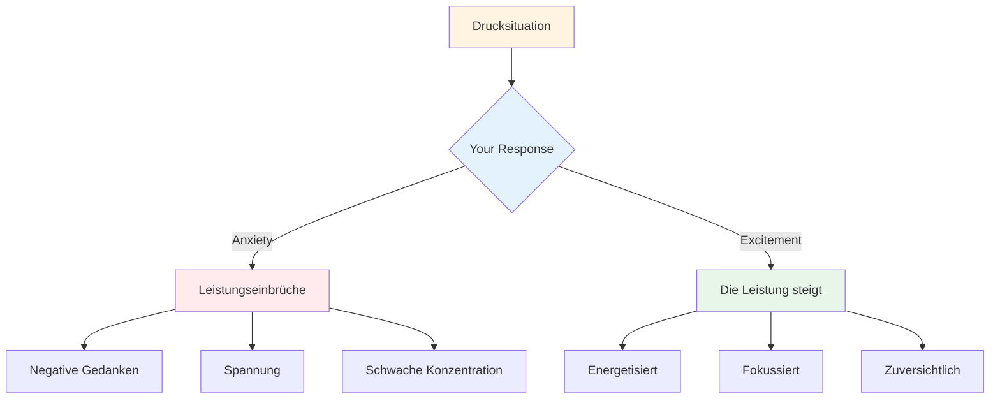

# Handhabungsdruck

Druck gehört zum Wettbewerb dazu. Es geht nicht darum, ihn zu eliminieren – das ist unmöglich. Es geht darum, trotz des Drucks gute Leistungen zu erbringen und ihn sogar zu seinem Vorteil zu nutzen.

::: tip Die große Idee
**Der Druck verschwindet nicht mit der Erfahrung – man lernt nur besser damit umzugehen.** Die besten Spieler sind nicht ruhig; sie verstehen es, ihre Erregung produktiv zu nutzen.
:::

## Druck verstehen

### Wodurch wird Druck erzeugt?
- Hoher Einsatz (wichtiges Spiel, entscheidender Wurf)
- Beobachtet werden (Publikum, Teamkollegen)
- Erwartungen (Ihre und die anderer)
- Unsicherheit (knappes Ergebnis, unbekannte Gegner)
- Zeit (läuft ab, wartet zu lange)

### Was Druck mit Ihrem Körper macht
Wenn Sie Druck verspüren, reagiert Ihr Körper:
- Herzfrequenz steigt
- Die Atmung wird flach
- Muskeln angespannt
- Die Hände können zittern
- Der Fokus verengt sich (manchmal zu sehr).

Dein Körper bereitet sich auf eine Belastung vor. Das ist nichts Schlechtes – es ist Energie, die du nutzen kannst.

## Umstrukturierungsdruck

### Druck als Erregung

Die körperlichen Empfindungen von Angst und Aufregung sind nahezu identisch. Der Unterschied liegt in der Interpretation dieser Empfindungen.

**Interpretation der Angst:** „Ich bin nervös, es könnte etwas Schlimmes passieren.“
**Interpretation der Begeisterung:** „Ich bin voller Energie, das ist mir wichtig.“

**Versuchen Sie Folgendes:** Wenn Sie sich unter Druck gesetzt fühlen, sagen Sie zu sich selbst: „Ich bin aufgeregt“ anstatt „Ich bin nervös“.

### Druck als Privileg

Nur wichtige Momente erzeugen Druck. Wenn du ihn spürst, befindest du dich in einer Situation, die von Bedeutung ist.

> „Druck ist ein Privileg – er wird nur denen zuteil, die ihn sich verdienen.“ – Billie Jean King

## Techniken für Hochdruckmomente

### 1. Atemkontrolle

Dein Atem ist der schnellste Weg, deinen Zustand zu verändern.

**Die 4-7-8-Technik:**
1. Vier Sekunden lang einatmen.
2. Halten Sie die Position für 7 Sekunden.
3. Atmen Sie 8 Sekunden lang aus.
4. 2-3 Mal wiederholen

**Schnellreset (im Kreis):**
- Ein langsamer, tiefer Atemzug
- Spüre deine Füße auf dem Boden
- Lassen Sie beim Ausatmen die Schultern sinken.

### 2. Physische Erdung

Verbinde dich mit körperlichen Empfindungen, um aus deinen Gedanken herauszukommen:
- Spüre das Gewicht des Balles
- Spüre deine Füße auf dem Boden
- Drücken Sie Ihre Nicht-Wurfhand zusammen und lassen Sie sie wieder los.
- Rollen Sie Ihre Schultern zurück

### 3. Fokusverengung

In Drucksituationen sollten Sie sich nur auf das Wesentliche konzentrieren:
- Nicht das Ergebnis
- Nicht das Publikum
- Nicht das, was passieren könnte
- Nur dieser Wurf, dieses Ziel, dieser Moment

**Schlüsselworte:** „Hier. Jetzt. Dies.“

### 4. Prozessorientierung

Verlagerung vom Ergebnis zum Prozess:

**Ergebnisorientierung (erzeugt Druck):**
- &quot;Ich muss das machen.&quot;
- „Wenn ich verfehle, verlieren wir.“
- &quot;Alle schauen zu.&quot;

**Prozessfokus (reduziert Druck):**
- &quot;Folge meiner Routine&quot;
- &quot;Ziel im Auge behalten&quot;
- &quot;Vertraue meinem Training&quot;

### 5. Der Linkshänder-Griff

Für Rechtshänder: Drücken Sie Ihre linke Hand 10-15 Sekunden lang zusammen.
- Aktiviert die rechte Gehirnhälfte
- Beruhigt analytisches Grübeln
- Hilft beim Zugriff auf die automatische Ausführung

Nutze dies, wenn du merkst, dass du zu viel nachdenkst.

## Vorbereitung auf den Druck

### Druck in der Praxis simulieren

Man kann dem Druck im Wettkampf nicht standhalten, wenn man ihn im Training nie erlebt hat.

**Möglichkeiten, um Übungsdruck zu erzeugen:**
- Konsequenzen festlegen (Liegestütze bei Fehlern, Kaffee für den Partner/die Partnerin ausgeben)
- Erstellen Sie „unbedingt umsetzbare“ Szenarien
- Üben Sie vor Publikum
- Zeitdruck (Schussuhr)
- Ermüdung (Üben im müden Zustand)

### Visualisierung

Stresssituationen mental durchspielen:
1. Schließe deine Augen
2. Stellen Sie sich ein Druckszenario im Detail vor
3. Spüre die Druckempfindungen
4. Sieh dich selbst dabei, wie du gut damit umgehst
5. In Gedanken erfolgreich ausführen

Tun Sie dies regelmäßig, nicht nur vor Wettkämpfen.

### Aufbau einer Druckgeschichte

Notieren Sie sich Situationen, in denen Sie gut mit Druck umgegangen sind:
- Wie war die Situation?
- Wie haben Sie sich gefühlt?
- Was hast du gemacht?
- Was war das Ergebnis?

Lies dir das vor Wettkämpfen noch einmal durch, um dich daran zu erinnern: „Das habe ich schon einmal gemacht.“

## Während des Wettbewerbs

### Vor dem Druckwurf
1. Treten Sie einen Schritt zurück, atmen Sie tief durch
2. Erinnere dich an deine Routine
3. Konzentriere dich auf den Prozess, nicht auf das Ergebnis.
4. Verwenden Sie Ihr Auslösewort oder Ihren Hinweis.

### Im Kreis
1. Führen Sie Ihr Übungsprogramm genau wie geübt durch.
2. Fokus nach außen (Ziel, nicht Körper).
3. Vertraue deinem Training
4. Ohne Zögern freigeben

### Nach dem Wurf
- Akzeptiere das Ergebnis ohne Wertung.
- Wenn gut: kurze Bestätigung, weiter geht&#39;s.
- Bei Fehler: SOAS-Methode, für den nächsten Durchlauf zurücksetzen.

## Häufige Fehler bei der Druckbeaufschlagung

| Fehler | Besserer Ansatz |
|---------|----------------|
| Eile | Langsamer vorgehen, die volle Routine nutzen |
| Überdenken | Externer Fokus, Vertrauenstraining |
| Technikwechsel | Bleib bei dem, was du kennst. |
| Fokus auf das Ergebnis | Fokus auf den Prozess |
| Nerven bekämpfen | Nimm die Energie an und nutze sie. |

## Wichtigste Erkenntnis

> Der Druck verschwindet nicht mit der Erfahrung. Man lernt nur, besser damit umzugehen.

Die besten Spieler sind nicht ruhig – sie verstehen es, ihre Erregung produktiv einzusetzen.

