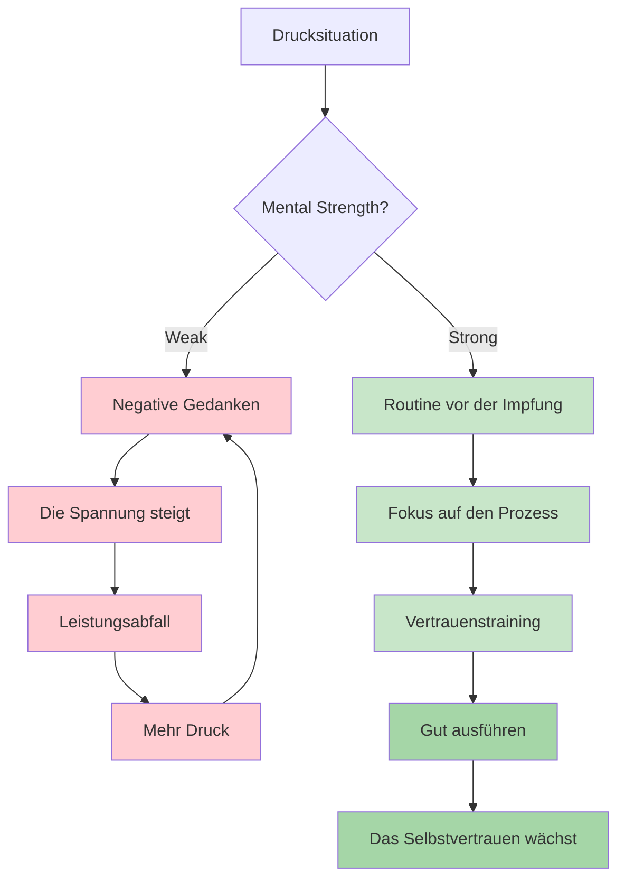
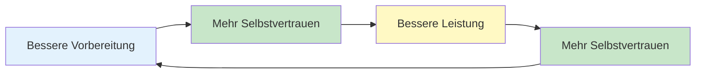

# Mentale Stärke

Mentale Stärke ist das, was Spieler, die im Training gut abschneiden, von denen unterscheidet, die in entscheidenden Momenten ihr Bestes geben. Es ist die Fähigkeit, mit Druck umzugehen, Rückschläge zu verkraften und die Konzentration während langer Wettkämpfe aufrechtzuerhalten.

::: tip Das Kernprinzip
Mentale Stärke bedeutet nicht, Nervosität zu überwinden oder nie Fehler zu machen. Es geht darum, trotz Fehlern gute Leistungen zu erbringen. Du kannst nicht kontrollieren, was passiert. Du kannst kontrollieren, wie du reagierst.
:::

## Was ist mentale Stärke?

Mentale Stärke umfasst:
- **Selbstvertrauen:** An die eigenen Fähigkeiten glauben.
- **Fokus:** Die Aufmerksamkeit auf das Wesentliche richten.
- **Resilienz:** Sich von Fehlern erholen.
- **Gelassenheit:** Auch unter Druck ruhig bleiben
- **Motivation:** Aufrechterhaltung der Anstrengung über einen längeren Zeitraum

Das sind keine festen Eigenschaften – es sind Fähigkeiten, die man entwickeln kann.

## Die mentalen Anforderungen beim Boule

Pétanque hat einzigartige mentale Herausforderungen:

| Herausforderung | Warum es schwierig ist |
|-----------|--------------|
| Zeit zwischen den Würfen | Gelegenheit für negative Gedanken |
| Sichtbare Ergebnisse | Jeder sieht deine Fehler |
| Teamformat | Druck, die Partner nicht zu enttäuschen |
| Lange Wettbewerbe | Geistige Erschöpfung über viele Stunden |
| Knappe Spiele | Hohe Einsätze bei einzelnen Würfen |
| Momentumschwünge | Emotionale Achterbahnfahrt |

## Mentale Stärke aufbauen

### 1. Selbstvertrauen entwickeln

Selbstvertrauen entsteht durch:
- **Vorbereitung:** Zu wissen, dass man die Arbeit erledigt hat.
- **Vergangene Erfolge:** Sich an Zeiten erinnern, in denen man gute Leistungen erbracht hat
- **Positives Selbstgespräch:** Wie du mit dir selbst sprichst
- **Körpersprache:** Aufrechte Haltung, zielgerichtete Bewegungen.

**Selbstvertrauensfördernde Maßnahmen:**
- Führe ein Erfolgstagebuch
- Erfolgreiche Leistungen visualisieren
- Bereiten Sie sich gründlich auf Wettkämpfe vor.
- Setzen Sie eine selbstbewusste Körpersprache ein (sie beeinflusst Ihre Psyche).

### 2. Meistere deine Selbstgespräche

Die Stimme in deinem Kopf ist von enormer Bedeutung.

**Destruktives Selbstgespräch:**
- &quot;Ich verpasse die immer.&quot;
- &quot;Ich werde ersticken.&quot;
- „Meine Teamkollegen zählen auf mich“ (Druck).
- &quot;Das war furchtbar.&quot;

**Konstruktives Selbstgespräch:**
- „Diesen Wurf habe ich schon einmal gemacht.“
- &quot;Vertraue meinem Training&quot;
- &quot;Ein Wurf nach dem anderen&quot;
- &quot;Nächster Wurf, neuer Anfang&quot;

**Ihre innere Dialogweise verändern:**
1. Achte darauf, was du zu dir selbst sagst
2. Hinterfragen Sie negative Aussagen
3. Durch realistische, hilfreiche Alternativen ersetzen
4. Üben Sie so lange, bis es automatisch abläuft.

### 3. Resilienz aufbauen

Resilienz ist die Fähigkeit, sich von Rückschlägen zu erholen.

**Die resiliente Denkweise:**
- Fehler sind Informationen, kein Versagen.
- Ein schlechter Wurf definiert dich nicht
- Rückschläge sind vorübergehend
- Man kann immer gut auf das reagieren, was passiert.

**Stärkung der Resilienz:**
- Üben Sie, sich im Training von Fehlern zu erholen.
- Wenden Sie die SOAS-Methode an (Stoppen, Beobachten, Akzeptieren, Aussetzen).
- Konzentriere dich auf die Reaktion, nicht auf das Ereignis.
- Entwickle ein kurzes Gedächtnis für schlechte Würfe

### 4. Gehen Sie sparsam mit Ihrer Energie um

Mentale Stärke erfordert Energiemanagement:

**Physikalische Energie:**
- Schlaf gut vor Wettkämpfen.
- Richtig essen (stabiler Blutzuckerspiegel)
- Bleiben Sie hydratisiert
- Wechseln Sie zwischen den Spielen (bleiben Sie nicht zu lange sitzen).

**Mentale Energie:**
- Machen Sie Pausen, wann immer möglich
- Analysiere die Würfe nicht übermäßig.
- Konzentriere dich intensiv auf den Moment, in dem du es brauchst.
- Pflegen Sie Erholungsroutinen.

## Der Vertrauens-Kompetenz-Kreislauf

::: info Der positive Kreislauf

**Bauen Sie es auf durch:**
1. Qualitätspraxis (Kompetenzaufbau)
2. Fortschrittskontrolle (stärkt das Selbstvertrauen)
3. Erfolgreiche Auftritte (verstärkt beides)
:::

## In diesem Abschnitt

- **[Umgang mit Druck](/en/education/mental-strength/handling-pressure)** – Techniken für Situationen mit hohem Einsatz
- **[Routine vor dem Wurf](/en/education/mental-strength/pre-shot-routine)** – Den Leistungsauslöser aufbauen

## Zusammenfassung: Regeln für mentale Stärke

::: tip Regel Nr. 1: Die Routineregel
**Konsequente Vorbereitungsroutinen führen zu Höchstleistungen.**
Immer die gleiche Routine = zuverlässiger Auslöser für den Flow-Zustand
:::

::: tip Regel Nr. 2: Die Reset-Regel
**Entwickle eine 10-Sekunden-Routine zum Zurücksetzen nach Fehlern.**
Körperliche Erholung (tief durchatmen, Schulterkreisen) + mentale Erholung (SOAS-Methode)
:::

::: tip Regel Nr. 3: Die Vertrauensschleifenregel
**Bessere Vorbereitung → Mehr Selbstvertrauen → Bessere Leistung.**
Der Kreislauf funktioniert in beide Richtungen. Man baut ihn durch qualitativ hochwertiges Üben und die Verfolgung des Fortschritts auf.
:::

::: tip Regel Nr. 4: Die Selbstgesprächsregel
**Sprich mit dir selbst so, wie du mit einem Teamkollegen sprechen würdest.**
Unterstützend, konstruktiv, fokussiert auf das, was zu tun ist (und nicht auf das, was schiefgelaufen ist).
:::

::: tip Regel Nr. 5: Die Energiemanagementregel
**Heben Sie sich Ihre volle Konzentration für den Fall auf, dass Sie sie brauchen.**
Analysiere die Würfe nicht übermäßig. Spare deine mentale Energie für die Ausführung.
:::

## Wichtigste Erkenntnis

> Mentale Stärke bedeutet nicht, Nervosität zu unterdrücken oder nie Fehler zu machen. Es geht darum, trotz Fehlern gute Leistungen zu erbringen.

Du kannst nicht kontrollieren, was passiert. Du kannst aber kontrollieren, wie du reagierst.

