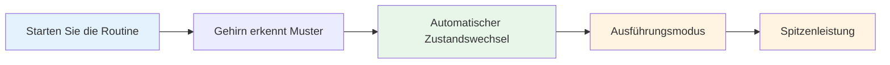

# Erstellen Sie Ihre Pre-Shot-Routine

Ihre Pre-Shot-Routine ist eines der mächtigsten Werkzeuge in Ihrem mentalen Spiel. Es ist eine konsistente Abfolge von Aktionen, die Sie auf jeden Wurf vorbereitet und Ihren besten Leistungszustand auslöst.

::: Tipp Die große Idee
**Ihre Routine ist Ihr Tor zur Zone.** Eine konsistente Routine vor dem Schlag signalisiert Ihrem Gehirn: „Es ist Zeit zum Ausführen.“ Mit der Wiederholung wird es zum automatischen Auslöser für Höchstleistungen.
:::

## Warum Routinen funktionieren

### Beständigkeit schafft Vertrauen
Wenn Sie jedes Mal das Gleiche tun, entfernen Sie Variablen. Ihr Körper weiß, was auf Sie zukommt. Dadurch entsteht ein Gefühl der Kontrolle und Vertrautheit, auch in ungewohnten Situationen.

### Routinen lösen Zustände aus
Durch die Wiederholung wird Ihre Routine mit Ihrem Leistungszustand verknüpft. Mit dem Starten der Routine beginnt automatisch der mentale Wechsel in den Ausführungsmodus.

### Routinen blockieren Ablenkungen
Eine Routine gibt Ihrem Geist etwas, auf das er sich konzentrieren kann. Es besteht kein Grund zur Sorge um die Partitur, das Publikum oder das, was passieren könnte.

### Routinen verwalten die Erregung
Eine gut durchdachte Routine hilft dabei, Ihr Energieniveau zu regulieren – sie beruhigt Sie, wenn Sie zu überfordert sind, und konzentriert Sie, wenn Sie flach sind.

## Elemente einer effektiven Routine

### Phase 1: Beurteilung (außerhalb des Kreises)

Sammeln Sie Informationen, bevor Sie eingreifen:
- Lesen Sie das Gelände (Steigungen, Hindernisse, Untergrund)
- Bewerten Sie die Situation (Ergebnis, Boule-Positionen)
- Wählen Sie Ihr Ziel und Ihren Landeplatz
- Entscheiden Sie sich für die Wurfart (Punkt, Schuss, Schlag, Rolle).

**Hier geschieht das Denken.** Nehmen Sie sich hier Zeit.

### Phase 2: Übergang (Eintritt in den Kreis)

Der Wandel vom Denken zum Handeln:
- Körperliche Aktion (konsequent in den Kreis treten)
- Mentaler Hinweis (ein Wort oder eine Phrase, die den „Ausführungsmodus“ signalisiert)
- Atem (ein bewusster Atemzug, um dich zu zentrieren)

**Das ist der Schalter.** Die Analyse endet hier.

### Phase 3: Aufbau (im Kreis)

Bereiten Sie Ihren Körper vor:
- Konsistente Haltung (jedes Mal die gleiche)
- Griffkontrolle (die Kugel spüren)
- Ausrichtung auf das Ziel
- Physischer Auslöser (eine kleine Bewegung, die Ihnen gehört)

### Phase 4: Visualisierung (kurz)

Sehen Sie sich den Wurf an, bevor Sie ihn schaffen:
- Stellen Sie sich die Flugbahn des Balls vor (maximal 2-3 Sekunden)
- Spüren Sie den gelungenen Wurf
- Verbinden Sie sich visuell mit Ihrem Ziel

### Phase 5: Ausführung

Machen Sie den Wurf:
- Externer Fokus (nur Ziel)
- Vertraue deinem Körper
- Ohne zu zögern loslassen
- Gehen Sie auf natürliche Weise vor

## Bauen Sie Ihre persönliche Routine auf

### Schritt 1: Beobachten Sie, was Sie bereits tun

Wahrscheinlich haben Sie bereits eine gewisse Routine. Beachten:
- Was macht man vor guten Würfen?
- Was fühlt sich für Sie natürlich an?
- Was hilft Ihnen, sich zu konzentrieren?

### Schritt 2: Entwerfen Sie Ihre Routine

Erstellen Sie eine Sequenz, die Folgendes umfasst:
- [ ] Bewertungsphase
- [ ] Klarer Übergangsmoment
- [ ] Konsistenter physischer Aufbau
- [ ] Kurze Visualisierung
- [ ] Ausführungsauslöser

### Schritt 3: Schreiben Sie es auf

Seien Sie konkret. Beispiel:

1. **Bewerten:** Gelände ablesen, Landeplatz auswählen
2. **Übergang:** Treten Sie mit dem linken Fuß zuerst in den Kreis und sagen Sie „Vertrauen“.
3. **Aufbau:** Füße schulterbreit, Griff prüfen, Schultern ausrichten
4. **Visualisieren:** Sehen Sie den Weg, spüren Sie die Befreiung
5. **Ausführen:** Ziel im Auge behalten, werfen

### Schritt 4: Religiös praktizieren

Nutzen Sie Ihre Routine bei JEDEM Wurf in der Praxis:
- Einfache Würfe
- Schwierige Würfe
- Wenn du müde bist
- Wenn du frisch bist

Die Routine muss automatisch werden.

### Schritt 5: Im Laufe der Zeit verfeinern

Ihre Routine wird sich weiterentwickeln. Beachten Sie, was funktioniert, und passen Sie es an. Aber ändern Sie es nicht während des Wettkampfs, sondern nur zwischen den Wettkämpfen.

## Routinemäßiges Timing

Ihre Routine sollte eine konstante Zeitspanne in Anspruch nehmen:
- Zu schnell: Sie sind in Eile und nicht richtig vorbereitet
- Zu langsam: Sie denken zu viel nach und verlieren den Fluss
- Genau richtig: Genug Zeit für die Vorbereitung, nicht so viel, dass man zu viel nachdenkt

**Typischer Zeitpunkt:**
- Bewertung: 5-10 Sekunden
- Übergang + Einrichtung: 3–5 Sekunden
- Visualisierung + Ausführung: 3-5 Sekunden
- **Gesamt: 10-20 Sekunden**

## Häufige Routinefehler

|  | Fehler | Problem | Lösung |  |
|---------|---------|----------|
|  | Überspringen in der Praxis | Routine ist kein Automatismus | Benutze es bei jedem einzelnen Wurf |  |
|  | Zu kompliziert | Unter Druck ist es schwer, sich daran zu erinnern | Vereinfachen Sie sich auf das Wesentliche |  |
|  | Denken während der Ausführung | Unterbricht die automatische Leistung | Klarer Übergangspunkt |  |
|  | Inkonsistentes Timing | Schafft Unsicherheit | Üben Sie mit gleichmäßigem Tempo |  |
|  | Wechsel mitten im Wettbewerb | Führt Zweifel ein | Bleiben Sie bei dem, was Sie wissen |  |

## Routinemäßige Fehlerbehebung

**Wenn Sie es eilig haben:**
- Fügen Sie beim Übergang einen Atemzug hinzu
- Verlangsamen Sie Ihre Setup-Bewegungen
- Pause vor der Visualisierung

**Wenn Sie zu viel nachdenken:**
- Verkürzen Sie die Routine
- Verwenden Sie einen stärkeren Übergangshinweis
- Konzentrieren Sie sich mehr nach außen

**Wenn Sie inkonsistent sind:**
- Machen Sie selbst ein Video, um es zu überprüfen
- Üben Sie die Routine, ohne zu werfen
- Holen Sie sich Feedback von einem Partner

## Beispielroutinen

### Einfache Routine
1. Ziel auswählen
2. Treten Sie ein, atmen Sie ein
3. Greifen, ausrichten
4. Sehen Sie es, werfen Sie es

### Detaillierte Routine
1. Lesen Sie das Gelände ab und wählen Sie den Landeplatz aus
2. Treten Sie zuerst mit dem linken Fuß auf
3. Sagen Sie intern „glatt“.
4. Ein Atemzug, Schultern fallen
5. Füße einstellen, Griff prüfen
6. Richten Sie die Schultern auf das Ziel aus
7. Sehen Sie sich den Pfad an (2 Sekunden)
8. Der Blick richtet sich auf das Ziel
9. Werfen

## Schlüssel zum Mitnehmen

> Ihre Routine ist Ihr Anker. Im Chaos ist es deine Konstante.

Bauen Sie es sorgfältig auf. Übe es immer. Vertraue ihm voll und ganz.

