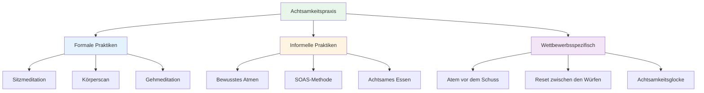

# Achtsamkeitstechniken
<AdBanner />

Hier sind praktische Techniken, mit denen Sie Achtsamkeit entwickeln können. Beginnen Sie mit ein oder zwei und bauen Sie darauf auf.

::: tip Die große Idee
Achtsamkeit ist eine Fähigkeit, kein Talent. Wie Zielen oder Schießen verbessert sie sich durch Übung. Fangen Sie klein an, bleiben Sie dran, und die positiven Effekte verstärken sich mit der Zeit.
:::

## Formale Praktiken

Hierbei handelt es sich um spezielle Achtsamkeitsübungen – Zeit, die eigens für diese Übung reserviert ist.

### Sitzmeditation

Die Grundlage der Achtsamkeitspraxis.

**So geht&#39;s:**
1. Setzen Sie sich bequem hin (auf einen Stuhl oder auf den Boden).
2. Schließe deine Augen oder wende deinen Blick ab.
3. Konzentriere dich auf deinen Atem – das Gefühl, wie die Luft ein- und ausströmt.
4. Wenn Gedanken auftauchen, nimm sie ohne Wertung wahr.
5. Richte deine Aufmerksamkeit sanft wieder auf deinen Atem.
6. Beginnen Sie mit 5 Minuten und steigern Sie auf 15-20 Minuten.

**Tipps:**
- Gedanken werden kommen – das ist normal
- Jedes Mal, wenn du merkst, dass du dich verirrt hast und zurückkehrst, verbesserst du diese Fähigkeit.
- Verurteile dich nicht selbst, wenn du umherwanderst.
- Beständigkeit ist wichtiger als Dauer.

### Körperscan

Entwickelt das Bewusstsein für körperliche Empfindungen.

**So geht&#39;s:**
1. Legen Sie sich hin oder setzen Sie sich bequem hin.
2. Beginnen Sie bei Ihren Füßen – nehmen Sie alle Empfindungen wahr.
3. Lenken Sie Ihre Aufmerksamkeit langsam nach oben: Knöchel, Waden, Knie...
4. Nehmen Sie es zur Kenntnis, ohne zu versuchen, irgendetwas zu ändern.
5. Wenn Sie Verspannungen spüren, atmen Sie in diesen Bereich hinein.
6. Fahren Sie bis zum Scheitelpunkt Ihres Kopfes fort.
7. Dauert 10-20 Minuten

**Für Pétanque:** Hilft Ihnen, Spannungen zu erkennen, bevor sie Ihren Wurf beeinträchtigen.

### Gehmeditation

Achtsamkeit in der Bewegung – eine hervorragende Vorbereitung auf die Piste.

**So geht&#39;s:**
1. Gehen Sie langsam und bedächtig.
2. Spüre jeden einzelnen Schritt: anheben, bewegen, platzieren.
3. Nehmen Sie die Empfindungen in Ihren Füßen und Beinen wahr.
4. Wenn deine Gedanken abschweifen, kehre zu den körperlichen Empfindungen zurück.
5. 5-10 Minuten genügen.

## Informelle Praktiken

<AdInArticle />

Diese integrieren Achtsamkeit in den Alltag.

### Bewusstes Atmen

Die einfachste Technik – jederzeit verfügbar.

**Die Praxis:**
- Atmen Sie dreimal langsam und bewusst ein.
- Konzentriere dich vollständig auf das Gefühl.
- Nutzen Sie es den ganzen Tag über als Reset-Knopf.

**Wann man es verwendet:**
- Bevor ich den Kreis betrete
- Wenn Sie merken, dass sich Stress aufbaut
- Zwischen den Spielen
- Jeder Übergangsmoment

### Die SOAS-Methode

Ihr Werkzeug für schwierige Momente.

| Schritt | Aktion | Beispiel |
|------|--------|---------|
| **Stoppen | Innehalten, nicht reagieren | Gib nach einem Fehlschuss nicht auf. |
| **Beobachten | Beobachten Sie, was passiert. | „Ich bin frustriert. Mein Kiefer ist verspannt.“ |
| **Akzeptieren | Anerkennen, ohne zu kämpfen | „So fühle ich mich im Moment.“ |
| **Beleg | Lass es los, mach weiter | Löse die Anspannung, kehre in die Gegenwart zurück |

**Üben Sie dies im Alltag,** damit es im Wettkampf automatisch abläuft.

### Achtsames Essen

Eine überraschend wirkungsvolle Methode.

**So geht&#39;s:**
- Nehmen Sie eine Mahlzeit ohne Ablenkungen ein (kein Telefon, kein Fernseher).
- Achten Sie auf die Farben, Gerüche und Texturen.
- Langsam kauen, voll auskosten
- Beachten Sie, wann Sie zufrieden sind.

**Warum es wichtig ist:** Es fördert die allgemeine Fähigkeit, Aufmerksamkeit zu schenken.

### Sinneswahrnehmung

Sich voll und ganz mit seiner Umgebung auseinandersetzen.

**Die 5-4-3-2-1-Technik:**
- Beachten Sie 5 Dinge, die Sie sehen können
- Beachten Sie 4 Dinge, die Sie hören können
- Beachte 3 Dinge, die du fühlen kannst
- Beachten Sie zwei Dinge, die Sie riechen können.
- Beachten Sie eine Sache, die Sie schmecken können.

**Nutzen Sie dies:** Wenn Ihre Gedanken vor einem wichtigen Spiel rasen.

## Wettkampfspezifische Techniken

### Der Atem vor dem Schuss

Integrieren Sie die Atmung in Ihren Alltag:

1. Bevor du den Kreis betrittst, atme einmal bewusst ein.
2. Spüre deine Füße auf dem Boden
3. Lassen Sie beim Ausatmen die Schultern sinken.
4. Dann beginne deine Routine.

### Reset zwischen den Würfen

Was man während des Wartens tun kann:

- Beobachte, wohin deine Aufmerksamkeit wandert.
- Wenn es zum Ergebnis kommt, bestätigen Sie dies und kehren Sie zur Gegenwart zurück.
- Konzentriere dich auf etwas Neutrales (deine Atmung, das Gefühl einer Boule-Kugel).
- Bleiben Sie körperlich entspannt

### Die &quot;Achtsamkeitsglocke&quot;

Nutzen Sie Auslöser, die Sie daran erinnern, präsent zu sein:

- Jedes Mal, wenn Sie eine Boule-Kugel aufheben
- Wenn du hörst, wie der Wagenheber geworfen wird
- Wenn du in den Kreis trittst
- Wenn ein Spiel endet

Jeder Auslöser entspricht einem bewussten Atemzug.

## Aufbau Ihrer Praxis

### Woche 1-2: Grundlagen
- Täglich 5 Minuten Sitzmeditation
- Drei bewusste Atemzüge vor jeder Mahlzeit
- Üben Sie SOAS einmal, wenn etwas Kleines schiefgeht

### Woche 3-4: Erweiterung
- Verlängern Sie die Meditation auf 10 Minuten.
- Fügen Sie zweimal pro Woche einen Ganzkörperscan hinzu.
- Nutzen Sie Achtsamkeitsglocken-Trigger in der Praxis

### Woche 5+: Integration
- 15-20 Minuten tägliches Üben
- Vollständige Integration in die Vorbereitungsroutine
- SOAS wird zur automatischen Reaktion auf Fehler

## Häufige Herausforderungen

| Herausforderung | Lösung |
|-----------|----------|
| &quot;Ich kann nicht aufhören zu denken&quot; | Das ist nicht vorgesehen. Einfach zur Kenntnis nehmen und zurückgeben. |
| &quot;Ich habe keine Zeit.&quot; | Beginnen wir mit 3 Minuten. Jeder hat 3 Minuten Zeit. |
| &quot;Ich schlafe ein&quot; | Versuchen Sie, sich hinzusetzen statt hinzulegen, oder üben Sie früher am Tag. |
| „Es fühlt sich sinnlos an.“ | Die Vorteile kommen mit der Beständigkeit. Vertrauen Sie dem Prozess. |
| &quot;Ich vergesse zu üben&quot; | Stelle eine tägliche Erinnerung ein. Verknüpfe sie mit einer bestehenden Gewohnheit. |

## Wichtigste Erkenntnis

> Achtsamkeit ist eine Fähigkeit. Wie jede Fähigkeit verbessert sie sich durch Übung.

Fang klein an. Bleib dran. Die Vorteile verstärken sich mit der Zeit.

<AdBanner />
