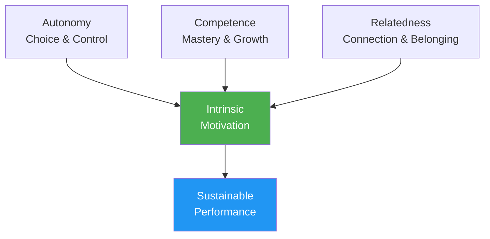

# Psychology of Motivation

Understanding WHY you're motivated—not just that you are—helps you build sustainable drive that doesn't depend on results.

---

## Intrinsic vs. Extrinsic Motivation

### Extrinsic Motivation

Motivation driven by external rewards or pressures:

| Source | Example |
|--------|---------|
| **Trophies/medals** | "I want to win the championship" |
| **Rankings** | "I want to be top 10 in my region" |
| **Recognition** | "I want others to see me as a good player" |
| **Avoid criticism** | "I don't want to disappoint my team" |
| **Financial** | "I want to win prize money" |

**Characteristics:**
- Can provide strong initial motivation
- Often diminishes over time
- Dependent on factors outside your control
- Can undermine enjoyment

### Intrinsic Motivation

Motivation from the activity itself:

| Source | Example |
|--------|---------|
| **Mastery** | "I love the feeling of improving" |
| **Flow** | "Time disappears when I'm playing" |
| **Challenge** | "I enjoy testing myself against problems" |
| **Expression** | "Pétanque allows me to express who I am" |
| **Joy** | "I simply love playing this game" |

**Characteristics:**
- More sustainable over time
- Independent of results
- Connected to deeper satisfaction
- Enhances performance naturally

::: tip The Research
Studies consistently show that **intrinsic motivation leads to better performance, more persistence, and greater well-being** than extrinsic motivation alone.
:::

---

## Self-Determination Theory (SDT)

Developed by Deci & Ryan, SDT identifies three fundamental psychological needs that drive intrinsic motivation:

### 1. Autonomy

**The need to feel in control of your choices**

| Supports Autonomy | Undermines Autonomy |
|-------------------|---------------------|
| Choosing your training focus | Being told exactly what to do |
| Setting your own goals | External pressure to perform |
| Deciding how to practice | Forced participation |
| Having input on team decisions | Controlling coaches/teammates |

**For pétanque:**
- Choose what aspects to work on
- Set your own development path
- Make tactical decisions yourself
- Own your training schedule

### 2. Competence

**The need to feel effective and capable**

| Supports Competence | Undermines Competence |
|---------------------|----------------------|
| Appropriate challenges | Tasks too easy or too hard |
| Clear feedback on progress | No feedback or only negative |
| Visible improvement | Stagnation without explanation |
| Skill-appropriate competition | Constant over-matching |

**For pétanque:**
- Track your improvement metrics
- Seek appropriate competition levels
- Celebrate small wins
- Get specific feedback (not just results)

### 3. Relatedness

**The need for connection with others**

| Supports Relatedness | Undermines Relatedness |
|----------------------|------------------------|
| Positive team relationships | Isolation |
| Shared goals with teammates | Purely individual focus |
| Community belonging | Exclusion or conflict |
| Mentorship (giving/receiving) | Competitive-only relationships |

**For pétanque:**
- Build genuine team connections
- Find training partners
- Join club community activities
- Share knowledge with others

---

## The SDT Formula

```
Autonomy + Competence + Relatedness = Intrinsic Motivation
```

When all three needs are met, intrinsic motivation flourishes naturally.



---

## Motivation Types Spectrum

SDT describes motivation on a spectrum from external to internal:

| Type | Description | Example | Quality |
|------|-------------|---------|---------|
| **Amotivation** | No motivation | "Why bother?" | ❌ |
| **External** | For rewards/avoid punishment | "I'll get a trophy" | ⭐ |
| **Introjected** | Internal pressure, guilt | "I should practice" | ⭐⭐ |
| **Identified** | Valued outcome | "This helps me improve" | ⭐⭐⭐ |
| **Integrated** | Aligned with values | "This is who I am" | ⭐⭐⭐⭐ |
| **Intrinsic** | Pure enjoyment | "I love this" | ⭐⭐⭐⭐⭐ |

**Goal:** Move your motivation toward the intrinsic end of the spectrum.

---

## Self-Assessment: Your Motivation Profile

Rate each statement (1 = Not at all, 5 = Completely):

**Extrinsic Indicators:**
| Statement | Score |
|-----------|-------|
| I mainly play to win tournaments | /5 |
| Recognition from others matters a lot to me | /5 |
| I'd lose interest without competitive success | /5 |
| **Extrinsic Total** | /15 |

**Intrinsic Indicators:**
| Statement | Score |
|-----------|-------|
| I'd play even if there were no competitions | /5 |
| The feeling of improvement excites me | /5 |
| I lose track of time when playing | /5 |
| **Intrinsic Total** | /15 |

**Interpretation:**
- Higher intrinsic total = more sustainable motivation
- Balance is fine, but ensure intrinsic ≥ extrinsic
- If extrinsic >> intrinsic, reconnect with your love of the game

---

## Shifting Toward Intrinsic Motivation

### Reconnect with Joy

- **Remember why you started** — What attracted you initially?
- **Play without stakes** — Occasional "just for fun" sessions
- **Appreciate moments** — Notice when you're enjoying the game

### Focus on Mastery

- **Set learning goals** not just outcome goals
- **Celebrate improvement** regardless of results
- **Embrace challenges** as growth opportunities

### Build Autonomy

- **Make your own choices** about training
- **Own your development** path
- **Resist external pressure** to train certain ways

### Cultivate Connection

- **Invest in relationships** beyond competition
- **Share knowledge** with developing players
- **Find your community** within the sport

---

## Related Content

- [Goal Setting](/de/education/motivation/) — Setting effective goals
- [Maintaining Motivation](/de/education/motivation/maintaining) — Long-term sustainability
- [The Zone](/de/education/mental-game/the-zone/) — Intrinsic motivation and flow
- [Team Dynamics](/de/education/team-dynamics/) — Relatedness in team context

