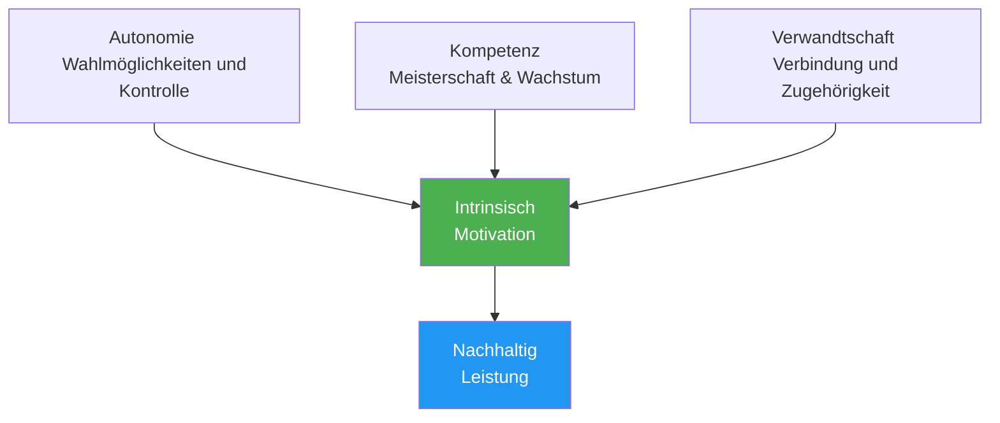

# Psychologie der Motivation

Zu verstehen, WARUM man motiviert ist – und nicht nur, dass man es ist – hilft dabei, eine nachhaltige Motivation aufzubauen, die nicht von Ergebnissen abhängt.

---

## Intrinsische vs. extrinsische Motivation

### Extrinsische Motivation

Motivation, die durch äußere Belohnungen oder Zwänge ausgelöst wird:

| Quelle | Beispiel |
|--------|---------|
| **Pokale/Medaillen** | &quot;Ich will die Meisterschaft gewinnen.&quot; |
| **Rangliste** | „Ich möchte in meiner Region zu den Top 10 gehören.“ |
| **Erkennung** | „Ich möchte, dass andere mich als guten Spieler sehen.“ |
| **Kritik vermeiden** | „Ich möchte mein Team nicht enttäuschen.“ |
| **Finanziell** | &quot;Ich möchte Preisgeld gewinnen.&quot; |

**Eigenschaften:**
- Kann eine starke anfängliche Motivation bieten.
- Nimmt oft mit der Zeit ab
- Abhängig von Faktoren, die außerhalb Ihrer Kontrolle liegen.
- Kann den Genuss beeinträchtigen

### Intrinsische Motivation

Motivation ergibt sich aus der Tätigkeit selbst:

| Quelle | Beispiel |
|--------|---------|
| **Meisterschaft** | „Ich liebe das Gefühl, mich zu verbessern.“ |
| **Fließen** | „Beim Spielen vergeht die Zeit.“ |
| **Herausforderung** | „Ich stelle mich gerne Herausforderungen.“ |
| **Ausdruck** | „Pétanque erlaubt es mir, auszudrücken, wer ich bin.“ |
| **Freude** | &quot;Ich spiele dieses Spiel einfach unheimlich gerne.&quot; |

**Eigenschaften:**
- Langfristig nachhaltiger
- Unabhängig von den Ergebnissen
- Verbunden mit tieferer Zufriedenheit
- Steigert die Leistung auf natürliche Weise

::: tip Die Forschung
Studien zeigen übereinstimmend, dass **intrinsische Motivation zu besseren Leistungen, mehr Ausdauer und größerem Wohlbefinden führt** als extrinsische Motivation allein.
:::

---

## Selbstbestimmungstheorie (SDT)

Die von Deci und Ryan entwickelte SDT identifiziert drei grundlegende psychologische Bedürfnisse, die die intrinsische Motivation antreiben:

### 1. Autonomie

**Das Bedürfnis, die Kontrolle über die eigenen Entscheidungen zu haben**

| Unterstützt Autonomie | Untergräbt die Autonomie |
|-------------------|---------------------|
| Wahl Ihres Trainingsschwerpunkts | Mir wird genau gesagt, was ich tun soll |
| Sich eigene Ziele setzen | Äußerer Druck zur Durchführung |
| Entscheidung über die Übungsmethode | Zwangsteilnahme |
| Mitspracherecht bei Teamentscheidungen haben | Kontrollierende Trainer/Teamkollegen |

**Für Boule:**
- Wähle die Aspekte aus, an denen du arbeiten möchtest.
- Bestimme deinen eigenen Entwicklungsweg
- Treffen Sie selbst taktische Entscheidungen.
- Gestalte deinen Trainingsplan selbst

### 2. Kompetenz

**Das Bedürfnis, sich effektiv und kompetent zu fühlen**

| Unterstützt Kompetenz | Untergräbt die Kompetenz |
|---------------------|----------------------|
| Angemessene Herausforderungen | Aufgaben zu einfach oder zu schwer |
| Klares Feedback zum Fortschritt | Kein Feedback oder nur negatives |
| Sichtbare Verbesserung | Stagnation ohne Erklärung |
| Wettbewerb, der dem Können angemessen ist | Konstante Überanpassung |

**Für Boule:**
- Verfolgen Sie Ihre Verbesserungskennzahlen
- Angemessene Wettbewerbsniveaus anstreben
- Feiere kleine Erfolge
- Erhalten Sie konkretes Feedback (nicht nur Ergebnisse).

### 3. Verwandtschaft

**Das Bedürfnis nach Verbindung mit anderen**

| Unterstützt Verwandtschaft | Untergräbt die Verwandtschaft |
|----------------------|------------------------|
| Positive Teambeziehungen | Isolierung |
| Gemeinsame Ziele mit den Teamkollegen | Rein individueller Fokus |
| Zugehörigkeit zur Gemeinschaft | Ausschluss oder Konflikt |
| Mentoring (Geben/Nehmen) | ausschließlich auf Wettbewerb basierende Beziehungen |

**Für Boule:**
- Echte Teamverbindungen aufbauen
- Trainingspartner finden
- Nehmen Sie an den Aktivitäten der Vereinsgemeinschaft teil.
- Teile dein Wissen mit anderen

---

## Die SDT-Formel

```
Autonomy + Competence + Relatedness = Intrinsic Motivation
```

Sind alle drei Bedürfnisse befriedigt, entwickelt sich die intrinsische Motivation ganz natürlich.



---

## Spektrum der Motivationstypen

Die Selbstbestimmungstheorie (SDT) beschreibt Motivation auf einem Spektrum von extern bis intern:

| Typ | Beschreibung | Beispiel | Qualität |
|------|-------------|---------|---------|
| **Amotivation** | Keine Motivation | &quot;Wozu der Aufwand?&quot; | ❌ |
| **Extern** | Zur Belohnung/Vermeidung von Bestrafung | &quot;Ich werde einen Pokal bekommen.&quot; | ⭐ |
| **Introjeziert** | Innerer Druck, Schuldgefühle | &quot;Ich sollte üben.&quot; | ⭐⭐ |
| **Identifiziert** | Wertvolles Ergebnis | „Das hilft mir, mich zu verbessern.“ | ⭐⭐⭐ |
| **Integriert** | An Werten ausgerichtet | „Das bin ich.“ | ⭐⭐⭐⭐ |
| **Intrinsisch** | Purer Genuss | &quot;Ich liebe es&quot; | ⭐⭐⭐⭐⭐ |

**Ziel:** Ihre Motivation in Richtung intrinsischer Motivation lenken.

---

## Selbsteinschätzung: Ihr Motivationsprofil

Bewerten Sie jede Aussage (1 = Überhaupt nicht, 5 = Vollkommen):

**Extrinsische Indikatoren:**
| Stellungnahme | Punktzahl |
|-----------|-------|
| Ich spiele hauptsächlich, um Turniere zu gewinnen. | /5 |
| Die Anerkennung durch andere bedeutet mir sehr viel. | /5 |
| Ohne Wettbewerbserfolge würde ich das Interesse verlieren. | /5 |
| **Extrinsischer Gesamtbetrag** | /15 |

**Intrinsische Indikatoren:**
| Stellungnahme | Punktzahl |
|-----------|-------|
| Ich würde auch ohne Wettbewerbe spielen. | /5 |
| Das Gefühl der Verbesserung begeistert mich. | /5 |
| Beim Spielen verliere ich das Zeitgefühl. | /5 |
| **Intrinsischer Gesamtwert** | /15 |

**Interpretation:**
- Höhere intrinsische Gesamtmotivation = nachhaltigere Motivation
- Ausgewogenheit ist gut, aber stellen Sie sicher, dass intrinsisch ≥ extrinsisch
- Wenn äußere Faktoren wichtiger sind als innere, dann besinne dich wieder auf deine Liebe zum Spiel.

---

## Hinwendung zu intrinsischer Motivation

### Finde zurück zur Freude

- **Erinnere dich daran, warum du angefangen hast** – Was hat dich ursprünglich daran gereizt?
- **Spielen ohne Einsatz** – Gelegentliche „einfach nur zum Spaß“-Runden
- **Genieße die Momente** – Achte darauf, wann du das Spiel genießt.

### Fokus auf Meisterschaft

- **Setzen Sie Lernziele**, nicht nur Ergebnisziele.
- **Feiere Fortschritte** unabhängig von den Ergebnissen
- **Betrachte Herausforderungen als** Wachstumschancen

### Autonomie aufbauen

- **Treffen Sie Ihre eigenen Entscheidungen** bezüglich Ihres Trainings
- **Gestalte deinen eigenen Entwicklungsweg**
- **Widerstehen Sie dem äußeren Druck**, bestimmte Trainingsmethoden anzuwenden

### Pflegen Sie die Verbindung

- **Investieren Sie in Beziehungen** jenseits des Wettbewerbs.
- **Wissen teilen** Sie mit Nachwuchsspielern
- **Finde deine Community** im Sport

---

## Verwandte Inhalte

- [Zielsetzung](/de/education/motivation/) — Effektive Ziele setzen
- Motivation aufrechterhalten – Langfristige Nachhaltigkeit
- [Die Zone](/de/education/mental-game/the-zone/) — Intrinsische Motivation und Flow
- [Teamdynamik](/de/education/team-dynamics/) — Verwandtschaft im Teamkontext

