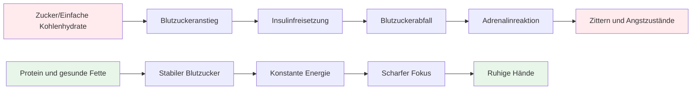

# Ernährung für präzise Leistungen

Pétanque ist ein Präzisionssport, kein Ausdauersport. Ihre Ernährungsbedürfnisse unterscheiden sich von denen eines Marathonläufers oder Fußballspielers. Am wichtigsten ist eine **stabile Energieversorgung des Gehirns** – damit Sie den ganzen Wettkampftag über konzentriert und ruhig bleiben.

::: tip Die große Idee
**Ihr Gehirn ist Ihr wichtigstes Werkzeug beim Boule. Versorgen Sie es mit stabiler Energie, nicht mit Achterbahnfahrten.** Achten Sie auf Eiweiß, gesunde Fette und ausreichend Flüssigkeitszufuhr. Vermeiden Sie Blutzuckerspitzen.
:::

## Die Herausforderung für Präzisionsathleten

Im Gegensatz zu Hochleistungssportarten benötigt Pétanque keine großen Glykogenspeicher oder eine schnelle Energiezufuhr. Was es erfordert, ist Folgendes:

- **Stabiler Blutzucker** – keine Spitzen oder Abfälle
- **Konstante geistige Klarheit** – Konzentration, die den ganzen Tag anhält.
- **Ruhige Hände** – kein Zittern oder Beben
- **Beruhigte Nerven** – geringe Angst- und Stressreaktion

Ihre Ernährungsstrategie sollte diese Faktoren optimieren, nicht die reine Energieausbeute.

## Das Problem mit Zucker und einfachen Kohlenhydraten

Viele Sportler greifen standardmäßig auf kohlenhydratreiche Ernährung zurück. Für Boule-Spieler kann dies die Leistung sogar beeinträchtigen.

### Die Blutzucker-Achterbahn

Wenn Sie Zucker oder einfache Kohlenhydrate essen:
1. Der Blutzuckerspiegel steigt rapide an
2. Insulin wird freigesetzt, um den Spiegel zu senken.
3. Blutzuckerabfall (Hypoglykämie)
4. Ihr Körper schüttet Adrenalin aus, um dies auszugleichen.
5. Sie leiden unter Zittern, Angstzuständen und Konzentrationsschwierigkeiten.

Das ist genau das Gegenteil von dem, was Sie für Präzision benötigen.

### Symptome einer Blutzuckerinstabilität

| Symptom | Auswirkungen auf die Leistung |
|---------|----------------------|
| Zitternde Hände | Uneinheitliche Veröffentlichung |
| Konzentrationsschwierigkeiten | Schlechte Entscheidungsfindung |
| Reizbarkeit | Teamkonflikte, mangelnde Gelassenheit |
| Müdigkeit nach dem Essen | Nachmittagstief |
| Angst | Druckempfindlichkeit |
| Gehirnnebel | Langsames taktisches Denken |

## Ein besserer Ansatz: Stabile Energie

Das Ziel ist es, Ihrem Gehirn gleichmäßig Energie zuzuführen, ohne die üblichen Schwankungen.

### Grundprinzipien

1. **Eiweiß und gesunde Fette sollten Vorrang haben** – sie liefern langsame, gleichmäßige Energie.
2. **Wählen Sie komplexe Kohlenhydrate statt einfacher Kohlenhydrate** – Wenn Sie Kohlenhydrate essen, wählen Sie solche, die langsam verdaut werden.
3. **Vermeiden Sie Blutzuckerspitzen** – insbesondere vor und während des Wettkampfs
4. **Achten Sie auf ausreichende Flüssigkeitszufuhr** – Flüssigkeitsmangel beeinträchtigt die Konzentration erheblich.
5. **Essen Sie regelmäßig** – Lassen Sie es nicht zu, dass Sie zu hungrig werden.

### Lebensmittel, die helfen

| Lebensmittelart | Beispiele | Warum es funktioniert |
|-----------|----------|--------------|
| Protein | Eier, Nüsse, Käse, Fleisch | Langsame Verdauung, stabile Energie |
| Gesunde Fette | Avocado, Olivenöl, Nüsse | Langlebiger Kraftstoff |
| Komplexe Kohlenhydrate | Gemüse, Hülsenfrüchte | Ballaststoffe verlangsamen die Absorption |
| zuckerarme Früchte | Beeren, Äpfel | Nährstoffe ohne Spitzenwerte |

### Lebensmittel, die man einschränken sollte

| Lebensmittelart | Beispiele | Warum das problematisch ist |
|-----------|----------|---------------------|
| Zucker | Süßigkeiten, Limonade, Gebäck | Rasanter Anstieg und Absturz |
| Weißbrot/Nudeln | Sandwiches, Pastagerichte | Schnelle Umwandlung in Zucker |
| Fruchtsaft | Orangensaft, Smoothies | Konzentrierter Zucker |
| Energy-Drinks | Die meisten Handelsmarken | Zucker- und Koffein-Crash |

## Ernährung am Wettkampftag

### Vor dem Wettbewerb

**2-3 Stunden vorher:**
- Ausgewogene Mahlzeit mit Eiweiß, Fett und Gemüse
- Vermeiden Sie kohlenhydratreiche Lebensmittel, die Schläfrigkeit verursachen könnten.
- Beispiel: Eier mit Gemüse oder Salat mit Hähnchen

**1 Stunde vorher:**
- Bei Bedarf einen kleinen Snack.
- Nüsse, Käse oder eine kleine Portion Eiweiß
- Vermeiden Sie alles Zuckerische

### Während des Wettbewerbs

**Zwischen den Spielen:**
- Wasser (am wichtigsten)
- Kleine proteinreiche Snacks (Nüsse, Käse, Fleisch)
- Vermeiden Sie zuckerhaltige Snacks und Getränke.

**Anzeichen dafür, dass Sie etwas essen müssen:**
- Konzentrationsschwierigkeiten
- Reizbarkeit
- Ich fühle mich zittrig
- Kopfschmerzen

### Nach dem Wettbewerb

- Stärken Sie Ihre Energiespeicher mit einer ausgewogenen Mahlzeit.
- Vollständig rehydrieren
- Belohnen Sie sich nicht mit Zucker – das beeinträchtigt Ihre Genesung.

## Flüssigkeitszufuhr

Dehydrierung beeinträchtigt die kognitive Funktion, bevor man Durst verspürt.

### Richtlinien

- **Gut hydriert in den Wettkampf starten** - Trinken Sie den ganzen Tag über vor dem Wettkampf Wasser.
- **Während des Spielens** – Trinken Sie regelmäßig kleine Schlucke Wasser, warten Sie nicht, bis Sie durstig sind.
- **Übermäßigen Koffeinkonsum vermeiden** – Koffein wirkt harntreibend.
- **Achten Sie auf folgende Anzeichen:** – Kopfschmerzen, dunkler Urin, Müdigkeit

### Wie viel?

Als allgemeine Richtlinie gilt: Der Urin sollte hellgelb sein. Ist er dunkel, benötigen Sie mehr Wasser.

## Die kohlenhydratarme Option

Manche Präzisionssportler setzen auf kohlenhydratarme oder ketogene Diäten. Die Theorie:

**Mögliche Vorteile:**
- Sehr stabiler Blutzucker (keine Blutzuckerspitzen möglich)
- Konstante geistige Klarheit
- Verringerte Angstzustände und Zittern
- Kein Energietief am Nachmittag

**Zu berücksichtigen:**
- Erfordert eine Eingewöhnungszeit (1-2 Wochen).
- Nicht für jeden geeignet
- Erfordert Planung und Engagement
- Konsultieren Sie zuerst einen Arzt oder eine andere medizinische Fachkraft.

Dies ist eine fortgeschrittene Strategie – nicht für jeden notwendig, aber eine Überlegung wert, wenn die Blutzuckerstabilität für Sie ein wichtiges Thema ist.

## Praktische Tipps

### Einfache Snacks für Wettbewerbe
- Gemischte Nüsse (ungesalzen)
- Hartgekochte Eier
- Käsewürfel
- Trockenfleisch vom Rind oder Truthahn
- Gemüse mit Hummus
- Oliven

### Was man vermeiden sollte
- Snacks aus dem Verkaufsautomaten
- Zuckerhaltige Sportgetränke
- Gebäck und Backwaren
- Süßigkeiten und Schokoriegel
- Die meisten „Energieriegel“ (Zuckergehalt prüfen)

## Wichtigste Erkenntnis

> Beim Boule ist dein Gehirn dein wichtigstes Werkzeug. Gib ihm beständige Energie, keine Achterbahnfahrt der Gefühle.

Setzen Sie auf Eiweiß, gesunde Fette und ausreichend Flüssigkeit. Vermeiden Sie Blutzuckerspitzen. Ihre Konzentration, Ihre Gelassenheit und Ihre ruhige Hand werden es Ihnen danken.

