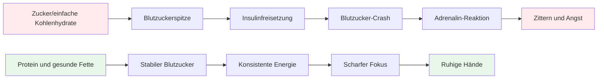

# Ernährung für präzise Leistung

Pétanque ist ein Präzisionssport, kein Ausdauersport. Ihre Ernährungsbedürfnisse unterscheiden sich von denen eines Marathonläufers oder eines Fußballspielers. Am wichtigsten ist die **Stabilität des Gehirns** – Sie müssen Ihren Geist scharf halten und Ihre Hände während eines langen Wettkampftages ruhig halten.

::: Tipp Die große Idee
**Ihr Gehirn ist Ihr wichtigstes Werkzeug beim Pétanque. Füttern Sie es mit stabilem Kraftstoff, nicht mit Achterbahn-Energie.** Konzentrieren Sie sich auf Proteine, gesunde Fette und eine ausreichende Flüssigkeitszufuhr. Vermeiden Sie Zuckerspitzen.
:::

## Die Herausforderung für Präzisionssportler

Im Gegensatz zu hochintensiven Sportarten erfordert Pétanque keine großen Glykogenspeicher oder eine schnelle Energieauffüllung. Was es erfordert, ist:

- **Stabiler Blutzucker** – keine Spitzen oder Abstürze
- **Beständige geistige Klarheit** – Konzentration, die den ganzen Tag anhält
- **Ruhige Hände** – kein Zittern oder Zittern
- **Ruhige Nerven** – geringe Angst- und Stressreaktion

Ihre Ernährungsstrategie sollte diese Faktoren berücksichtigen und nicht die Rohenergieausbeute.

## Das Problem mit Zucker und einfachen Kohlenhydraten

Viele Sportler ernähren sich standardmäßig kohlenhydratreich. Für Pétanque-Spieler kann dies tatsächlich die Leistung beeinträchtigen.

### Die Blutzucker-Achterbahn

Wenn Sie Zucker oder einfache Kohlenhydrate essen:
1. Der Blutzuckerspiegel steigt schnell an
2. Zur Senkung wird Insulin freigesetzt
3. Blutzuckerabstürze (Hypoglykämie)
4. Ihr Körper schüttet zum Ausgleich Adrenalin aus
5. Sie leiden unter Zittern, Angstzuständen und schlechter Konzentration

**Dies ist das Gegenteil von dem, was Sie für Präzision benötigen.**

### Symptome einer Blutzuckerinstabilität

|  | Symptom | Auswirkungen auf die Leistung |  |
|---------|--------|
|  | Zitternde Hände | Inkonsistente Veröffentlichung |  |
|  | Konzentrationsschwierigkeiten | Schlechte Entscheidungsfindung |  |
|  | Reizbarkeit | Teamkonflikt, mangelnde Gelassenheit |  |
|  | Müdigkeit nach dem Essen | Nachmittagsflaute |  |
|  | Angst | Druckempfindlichkeit |  |
|  | Gehirnnebel | Langsames taktisches Denken |  |

## Ein besserer Ansatz: Stabile Energie

Das Ziel besteht darin, Ihr Gehirn ohne Achterbahnfahrt gleichmäßig mit Treibstoff zu versorgen.

### Grundprinzipien

1. **Priorisieren Sie Proteine ​​und gesunde Fette** – Sie liefern langsame, gleichmäßige Energie
2. **Wählen Sie komplexe Kohlenhydrate statt einfacher** – Wenn Sie Kohlenhydrate essen, wählen Sie solche, die langsam verdaut werden
3. **Zuckerspitzen vermeiden** – Besonders vor und während des Wettkampfs
4. **Bleiben Sie hydriert** – Dehydrierung beeinträchtigt die Konzentration erheblich
5. **Essen Sie regelmäßig** – Lassen Sie nicht zu, dass Sie zu hungrig werden

### Lebensmittel, die helfen

|  | Lebensmitteltyp | Beispiele | Warum es funktioniert |  |
|-----------|----------|--------------|
|  | Protein | Eier, Nüsse, Käse, Fleisch | Langsame Verdauung, stabile Energie |  |
|  | Gesunde Fette | Avocado, Olivenöl, Nüsse | Langlebiger Kraftstoff |  |
|  | Komplexe Kohlenhydrate | Gemüse, Hülsenfrüchte | Ballaststoffe verlangsamen die Absorption |  |
|  | Zuckerarme Früchte | Beeren, Äpfel | Nährstoffe ohne Spike |  |

### Lebensmittel, die es zu begrenzen gilt

|  | Lebensmitteltyp | Beispiele | Warum es problematisch ist |  |
|-----------|----------|---------------------|
|  | Zucker | Süßigkeiten, Limonade, Gebäck | Schneller Anstieg und Absturz |  |
|  | Weißbrot/Nudeln | Sandwiches, Nudelgerichte | Schnelle Umstellung auf Zucker |  |
|  | Fruchtsaft | Orangensaft, Smoothies | Konzentrierter Zucker |  |
|  | Energy-Drinks | Die meisten kommerziellen Marken | Zucker- und Koffein-Crash |  |

## Ernährung am Wettkampftag

### Vor dem Wettbewerb

**2-3 Stunden vorher:**
- Ausgewogene Mahlzeit mit Eiweiß, Fett und Gemüse
- Vermeiden Sie schwere Kohlenhydrate, die Schläfrigkeit verursachen könnten
- Beispiel: Eier mit Gemüse oder Salat mit Hühnchen

**1 Stunde vorher:**
- Bei Bedarf leichter Snack
- Nüsse, Käse oder eine kleine Portion Protein
- Vermeiden Sie alles Zuckerhaltige

### Während des Wettbewerbs

**Zwischen den Spielen:**
- Wasser (am wichtigsten)
- Kleine Proteinsnacks (Nüsse, Käse, Fleisch)
- Vermeiden Sie zuckerhaltige Snacks und Getränke

**Anzeichen dafür, dass Sie essen müssen:**
- Konzentrationsschwierigkeiten
- Reizbarkeit
- Fühle mich zittrig
- Kopfschmerzen

### Nach dem Wettkampf

- Füllen Sie Ihren Bedarf mit einer ausgewogenen Mahlzeit auf
- Vollständig rehydrieren
- „Belohnen“ Sie sich nicht mit Zucker – das beeinträchtigt Ihre Genesung

## Flüssigkeitszufuhr

Dehydrierung beeinträchtigt die kognitiven Funktionen, bevor Sie Durst verspüren.

### Richtlinien

- **Beginnen Sie mit Flüssigkeitszufuhr** – Trinken Sie vor dem Wettkampf den ganzen Tag über Wasser
- **Während des Spiels** – Trinken Sie regelmäßig Wasser und warten Sie nicht, bis Sie durstig sind
- **Vermeiden Sie überschüssiges Koffein** – Es ist ein Diuretikum
- **Achten Sie auf Anzeichen** – Kopfschmerzen, dunkler Urin, Müdigkeit

### Wie viel?

Eine allgemeine Richtlinie: Streben Sie nach hellgelbem Urin. Wenn es dunkel ist, brauchen Sie mehr Wasser.

## Die Low-Carb-Option

Einige Präzisionssportler ernähren sich kohlenhydratarm oder ketogen. Die Theorie:

**Potenzielle Vorteile:**
- Sehr stabiler Blutzucker (keine Spitzen möglich)
- Kontinuierliche geistige Klarheit
- Reduzierte Ängste und Zittern
- Keine Energieausfälle am Nachmittag

**Überlegungen:**
- Erfordert eine Eingewöhnungsphase (1-2 Wochen)
- Nicht für jeden geeignet
- Erfordert Planung und Engagement
- Konsultieren Sie zunächst einen Gesundheitsdienstleister

Dies ist eine fortgeschrittene Strategie – nicht für jeden notwendig, aber eine Überlegung wert, wenn die Blutzuckerstabilität für Sie ein wichtiges Problem darstellt.

## Praktische Tipps

### Einfache Wettbewerbssnacks
- Gemischte Nüsse (ungesalzen)
- Hartgekochte Eier
- Käsewürfel
- Trockenfleisch vom Rind oder Truthahn
- Gemüse mit Hummus
- Oliven

### Was Sie vermeiden sollten
- Snacks am Automaten
- Zuckerhaltige Sportgetränke
- Gebäck und Backwaren
- Süßigkeiten und Schokoriegel
- Die meisten Energieriegel (Zuckergehalt prüfen)

## Schlüssel zum Mitnehmen

> Ihr Gehirn ist Ihr wichtigstes Werkzeug beim Pétanque. Versorgen Sie es mit stabilem Treibstoff, nicht mit Achterbahn-Energie.

Konzentrieren Sie sich auf Eiweiß, gesunde Fette und eine ausreichende Flüssigkeitszufuhr. Vermeiden Sie Zuckerspitzen. Ihre Konzentration, Gelassenheit und ruhige Hände werden es Ihnen danken.

