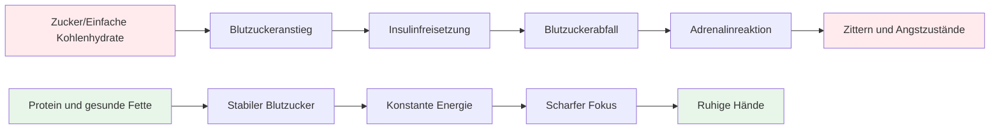
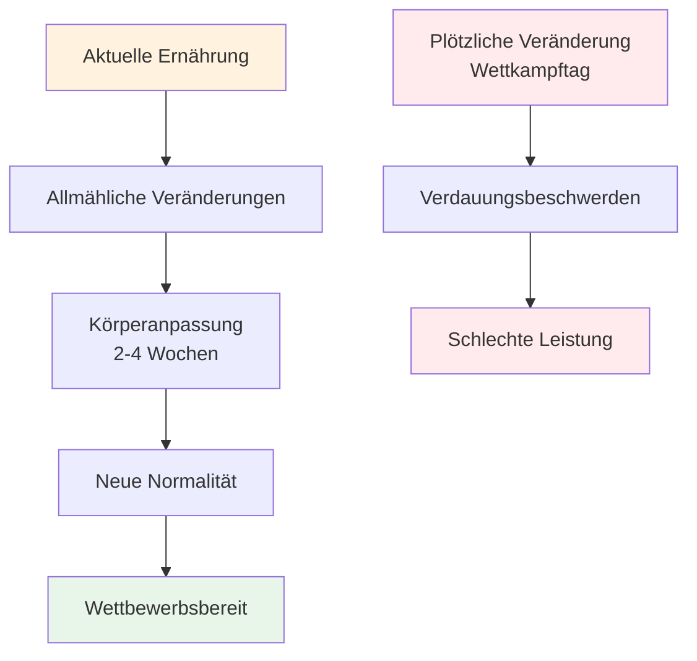

# Ernährung für präzise Leistungen
<AdBanner />


Pétanque ist ein Präzisionssport, kein Ausdauersport. Ihre Ernährungsbedürfnisse unterscheiden sich von denen eines Marathonläufers oder Fußballspielers. Am wichtigsten ist eine **stabile Energieversorgung des Gehirns** – damit Sie den ganzen Wettkampftag über konzentriert und ruhig bleiben.

::: tip Die große Idee
**Your brain is your most important tool in pétanque. Feed it stable fuel, not roller coaster energy.** Focus on protein, healthy fats, and staying hydrated. Avoid sugar spikes.
:::



## Die Herausforderung für Präzisionsathleten

Im Gegensatz zu Hochleistungssportarten benötigt Pétanque keine großen Glykogenspeicher oder eine schnelle Energiezufuhr. Was es erfordert, ist Folgendes:

- **Stabiler Blutzucker – keine Spitzen oder Abfälle**
- **Konstante geistige Klarheit – Konzentration, die den ganzen Tag anhält**
- **Ruhige Hände – kein Zittern oder Beben**
- **Beruhigte Nerven – geringe Angst- und Stressreaktion**

Ihre Ernährungsstrategie sollte diese Faktoren optimieren, nicht die reine Energieausbeute.

## Das Problem mit Zucker und einfachen Kohlenhydraten

Viele Sportler greifen standardmäßig auf kohlenhydratreiche Ernährung zurück. Für Boule-Spieler kann dies die Leistung sogar beeinträchtigen.

### Die Blutzucker-Achterbahn

Wenn Sie Zucker oder einfache Kohlenhydrate essen:
1. Der Blutzuckerspiegel steigt rapide an
2. Insulin wird freigesetzt, um den Spiegel zu senken.
3. Blutzuckerabfall (Hypoglykämie)
4. Ihr Körper schüttet Adrenalin aus, um dies auszugleichen.
5. Sie leiden unter Zittern, Angstzuständen und Konzentrationsschwierigkeiten.

**This is the opposite of what you need for precision.**

### Symptome einer Blutzuckerinstabilität

| Symptom | Auswirkungen auf die Leistung |
|---------|----------------------|
| Zitternde Hände | Uneinheitliche Veröffentlichung |
| Konzentrationsschwierigkeiten | Schlechte Entscheidungsfindung |
| Reizbarkeit | Teamkonflikte, mangelnde Gelassenheit |
| Müdigkeit nach dem Essen | Nachmittagstief |
| Angst | Druckempfindlichkeit |
| Gehirnnebel | Langsames taktisches Denken |

## Ein besserer Ansatz: Stabile Energie

Das Ziel ist es, Ihrem Gehirn gleichmäßig Energie zuzuführen, ohne die üblichen Schwankungen.

### Grundprinzipien

1. **Eiweiß und gesunde Fette sollten Vorrang haben** – sie liefern langsame, gleichmäßige Energie.
2. **Bevorzugen Sie komplexe Kohlenhydrate gegenüber einfachen** – Wenn Sie Kohlenhydrate essen, wählen Sie solche, die langsam verdaut werden.
3. **Vermeiden Sie Blutzuckerspitzen** – insbesondere vor und während des Wettkampfs
4. **Achten Sie auf ausreichende Flüssigkeitszufuhr** – Flüssigkeitsmangel beeinträchtigt die Konzentration erheblich.
5. **Essen Sie regelmäßig** – Lassen Sie es nicht zu, dass Sie zu hungrig werden.

### Lebensmittel, die helfen

| Lebensmittelart | Beispiele | Warum es funktioniert |
|-----------|----------|--------------|
| Protein | Eier, Nüsse, Käse, Fleisch | Langsame Verdauung, stabile Energie |
| Gesunde Fette | Avocado, Olivenöl, Nüsse | Langlebiger Kraftstoff |
| Komplexe Kohlenhydrate | Gemüse, Hülsenfrüchte | Ballaststoffe verlangsamen die Absorption |
| zuckerarme Früchte | Beeren, Äpfel | Nährstoffe ohne Spitzenwerte |

### Lebensmittel, die man einschränken sollte

| Lebensmittelart | Beispiele | Warum das problematisch ist |
|-----------|----------|---------------------|
| Zucker | Süßigkeiten, Limonade, Gebäck | Rasanter Anstieg und Absturz |
| Weißbrot/Nudeln | Sandwiches, Pastagerichte | Schnelle Umwandlung in Zucker |
| Fruchtsaft | Orangensaft, Smoothies | Konzentrierter Zucker |
| Energy-Drinks | Die meisten Handelsmarken | Zucker- und Koffein-Crash |

## Ernährung am Wettkampftag

### Vor dem Wettbewerb

**2-3 hours before:**
- Ausgewogene Mahlzeit mit Eiweiß, Fett und Gemüse
- Vermeiden Sie kohlenhydratreiche Lebensmittel, die Schläfrigkeit verursachen könnten.
- Beispiel: Eier mit Gemüse oder Salat mit Hähnchen

**1 hour before:**
- Bei Bedarf einen kleinen Snack.
- Nüsse, Käse oder eine kleine Portion Eiweiß
- Vermeiden Sie alles Zuckerische

### Während des Wettbewerbs

**Between games:**
- Wasser (am wichtigsten)
- Kleine proteinreiche Snacks (Nüsse, Käse, Fleisch)
- Vermeiden Sie zuckerhaltige Snacks und Getränke.

**Signs you need to eat:**
- Konzentrationsschwierigkeiten
- Reizbarkeit
- Ich fühle mich zittrig
- Kopfschmerzen

### Nach dem Wettbewerb

- Stärken Sie Ihre Energiespeicher mit einer ausgewogenen Mahlzeit.
- Vollständig rehydrieren
- Belohnen Sie sich nicht mit Zucker – das beeinträchtigt Ihre Genesung.

## Flüssigkeitszufuhr

Dehydrierung beeinträchtigt die kognitive Funktion, bevor man Durst verspürt.

### Richtlinien

- **Gut hydriert in den Wettkampf starten – Trinken Sie den ganzen Tag über Wasser, bevor es losgeht.**
- **Während des Spielens – Trinken Sie regelmäßig kleine Schlucke Wasser, warten Sie nicht, bis Sie durstig sind.**
- **Vermeiden Sie übermäßigen Koffeinkonsum – es wirkt harntreibend.**
- **Achten Sie auf folgende Anzeichen: Kopfschmerzen, dunkler Urin, Müdigkeit**

### Wie viel?

Als allgemeine Richtlinie gilt: Der Urin sollte hellgelb sein. Ist er dunkel, benötigen Sie mehr Wasser.

## Die kohlenhydratarme Option

Manche Präzisionssportler setzen auf kohlenhydratarme oder ketogene Diäten. Die Theorie:

**Potential benefits:**
- Sehr stabiler Blutzucker (keine Blutzuckerspitzen möglich)
- Konstante geistige Klarheit
- Verringerte Angstzustände und Zittern
- Kein Nachmittagstief

**Considerations:**
- Erfordert eine Eingewöhnungszeit (1-2 Wochen).
- Nicht für jeden geeignet
- Erfordert Planung und Engagement
- Konsultieren Sie zuerst einen Arzt oder eine andere medizinische Fachkraft.

<AdInArticle />

Dies ist eine fortgeschrittene Strategie – nicht für jeden notwendig, aber eine Überlegung wert, wenn die Blutzuckerstabilität für Sie ein wichtiges Thema ist.

## Essen als Training: Trainiere deinen Körper

::: warning Kritisches Konzept
**Food is not just fuel - it's something you practice with.** Just like you practice your throw, you must practice your nutrition to get your body comfortable with competition-day eating.
:::

### Warum Ernährungsgewohnheiten wichtig sind

Dein Verdauungssystem ist trainierbar. Was du regelmäßig isst, wird zu dem, was dein Körper erwartet und am besten verarbeitet. Wenn du an Wettkampftagen nur Eiweiß und Gemüse zu dir nimmst, gewöhnt sich dein Körper nicht daran.

**The problem:**
- Der Verzehr ungewohnter Speisen am Wettkampftag kann Verdauungsbeschwerden verursachen.
- Ihr Körper braucht Zeit, sich an neue Ernährungsmuster anzupassen.
- Stress + ungewohntes Essen = mögliche Magenprobleme
- Leistungsangst ist schon schlimm genug, ohne dass noch Verdauungsangst hinzukommt.

**The solution:**
- Setze deine Wettkampfernährung während des Trainings um.
- Integriere die Speisen, die du am Wettkampftag zu dir nimmst, in deine normale Ernährung.
- Trainieren Sie Ihren Körper, sich an Nahrungsmittel mit gleichmäßiger Energiezufuhr zu gewöhnen.

### Der Anpassungsprozess



Wenn Sie Ihre Ernährung umstellen:
1. **Woche 1-2:** Ihr Körper gewöhnt sich an neue Nahrungsmittel, Sie fühlen sich möglicherweise anders.
2. **Woche 3-4:** Die Anpassung erfolgt, neue Lebensmittel werden als normal empfunden.
3. **Woche 5+:** Ihr Körper hat sich an diese Lebensmittel gewöhnt und verträgt sie gut.

**This is why you can't just "eat healthy" on competition day and expect optimal results.**

### Wie Sie Ihre Ernährung in die Praxis umsetzen

#### 1. Beginnen Sie während des Trainings

**Practice your competition-day eating during training sessions:**
- Iss vor dem Training die gleiche Mahlzeit wie vor dem Wettkampf.
- Bring die gleichen Snacks mit, die du auch zu einem Turnier mitbringen würdest.
- Beobachte, wie dein Körper reagiert.
- Passen Sie die Einstellungen an das an, was funktioniert.

**Example training day:**
```
2-3 hours before: Eggs with vegetables (same as competition)
During training: Water + nuts (same as competition)
After training: Balanced meal with protein
```

#### 2. Mach es zu deiner Normalität

**Don't have a "competition diet" and a "regular diet"** - this creates two problems:
- Ihr Körper passt sich an beides nie vollständig an
- Das Essen im Wettkampf fühlt sich ungewohnt und stressig an.

**Instead:**
- Machen Sie Lebensmittel mit stabiler Energiezufuhr zu Ihrer täglichen Norm
- Ihr Körper lernt, Proteine und Fette effizienter zu verwerten.
- Der Wettkampftag fühlt sich normal an, nicht anders.
- Keine Verdauungsüberraschungen

#### 3. Testen und Optimieren

**Use training to experiment:**

| Prüfen | Worauf man achten sollte | Anpassen |
|------|----------------|--------|
| Mahlzeiten vor dem Training | Energieniveau, Konzentration | Finden Sie Ihr optimales Fenster |
| Verschiedene Proteinquellen | Verdauung, Wohlbefinden | Ermitteln Sie, was am besten funktioniert |
| Snackarten | Anhaltende Energie | Finde deine Lieblingssnacks |
| Hydratationsmengen | Konzentration, Toilettenpausen | Ausgewogene Zufuhr |

**Keep a simple log:**
- Was du gegessen hast und wann
- Wie Sie sich während des Trainings gefühlt haben
- Energieniveau und Konzentration
- Jegliche Verdauungsprobleme

#### 4. Wohlbefinden und Selbstvertrauen aufbauen

**The psychological benefit:**

Wenn du deine Ernährung im Training hunderte Male geübt hast:
- Du weißt genau, wie dein Körper reagieren wird.
- Keine Angst vor Lebensmittelauswahl
- Eine Sorge weniger am Wettkampftag
- Vertrauen in Ihre Vorbereitung

**This is the same principle as practicing your throw** - repetition builds comfort and reliability.

### Gemeinsame Anpassungsherausforderungen

::: details Übergang von einer kohlenhydratreichen zu einer energiestabilen Ernährung

**Challenge:** You're used to bread, pasta, and sugary snacks

**Adaptation period:** 2-4 weeks

**What to expect:**
- Woche 1: Möglicherweise fühlen Sie sich anders, Heißhunger auf alte Speisen
- Woche 2: Energieniveau stabilisiert sich, Heißhungerattacken nehmen ab
- Woche 3-4: Neue Normalität, der Körper verwertet Fette/Proteine effizienter.

**How to practice:**
- Beginnen Sie mit einer Mahlzeit nach der anderen.
- Ersetzen Sie zunächst einfache Kohlenhydrate durch komplexe Kohlenhydrate.
- Erhöhen Sie schrittweise die Zufuhr von Protein und gesunden Fetten.
- Üben Sie zunächst während eines Trainings mit geringem Druck.
:::

::: details Lebensmittel finden, die Ihnen guttun

**Challenge:** Not everyone digests the same foods well

**What to test:**
- Verschiedene Proteinquellen (Eier vs. Fleisch vs. Nüsse)
- Zeitpunkt der Mahlzeiten (2 Stunden vs. 3 Stunden vorher)
- Portionsgrößen (zu viel = träge, zu wenig = hungrig)
- Bestimmte Lebensmittel, die Beschwerden verursachen

**Practice approach:**
- Versuchen Sie jeweils nur eine Variable.
- Für jeden Test sollten 2-3 Trainingseinheiten vorgesehen werden.
- Notiere dir, was dir am besten gefällt.
- Stellen Sie Ihr persönliches &quot;Wettbewerbsmenü&quot; zusammen
:::

::: details Umgang mit der Verpflegung bei Turnieren

**Challenge:** Tournaments often have limited food options

**Practice solution:**
- Bringen Sie immer Ihre eigenen Snacks mit (üben Sie das).
- Erkunden Sie die Veranstaltungsorte nach Möglichkeit im Voraus.
- Halten Sie Backup-Optionen bereit, von denen Sie wissen, dass sie funktionieren.
- Üben Sie das Essen in verschiedenen Umgebungen

**Mental preparation:**
- Verlassen Sie sich nicht auf das Essen im Veranstaltungsort.
- Behandeln Sie Lebensmittel als Teil Ihrer Ausrüstung.
- Pack es so ein, wie du deine Boules einpackst.
:::

### Der 30-Tage-Ernährungsübungsplan

**Goal:** Make stable-energy eating your comfortable normal

**Week 1-2: Foundation**
- Ersetzen Sie eine Mahlzeit pro Tag durch eine wettkampfgerechte Ernährung.
- Üben Sie die Ernährung vor dem Training
- Fangt an, Snacks zum Training mitzubringen.
- Beobachte, wie dein Körper reagiert.

**Week 3-4: Expansion**
- Zwei Mahlzeiten pro Tag mit Fokus auf stabile Energiezufuhr.
- Übe an Trainingstagen die Ernährung wie am Wettkampftag.
- Verfeinern Sie Ihre Snackauswahl
- Stelle deine Lieblingslebensmittelliste zusammen

**Week 5+: Mastery**
- Eine Ernährung mit stabiler Energiezufuhr ist Ihre neue Normalität
- Der Körper ist vollständig angepasst
- Der Wettkampftag verläuft routinemäßig.
- Vertrauen in Ihre Ernährung

### Ihr Wettkampf-Verpflegungsset

**Practice packing this for every training session:**

**Pre-competition (2-3 hours before):**
- [ ] Proteinquelle (Eier, Fleisch oder Nüsse)
- [ ] Gemüse oder Salat
- [ ] Gesunde Fette (Avocado, Olivenöl, Käse)

**During competition:**
- [ ] Wasserflasche (wiederbefüllbar)
- [ ] Gemischte Nüsse (kleine Portionen)
- [ ] Hartgekochte Eier (wenn Sie sie kühl halten können)
- [ ] Käsewürfel oder Käsesticks
- [ ] Trockenfleisch oder Jerky
- [ ] Ersatzsnacks

**The more you practice with this kit, the more automatic it becomes.**

## Praktische Tipps

### Einfache Snacks für Wettbewerbe
- Gemischte Nüsse (ungesalzen)
- Hartgekochte Eier
- Käsewürfel
- Trockenfleisch vom Rind oder Truthahn
- Gemüse mit Hummus
- Oliven

### Was man vermeiden sollte
- Snacks aus dem Verkaufsautomaten
- Zuckerhaltige Sportgetränke
- Gebäck und Backwaren
- Süßigkeiten und Schokoriegel
- Die meisten „Energieriegel“ (Zuckergehalt prüfen)

## Wichtigste Erkenntnis

> Dein Gehirn ist dein wichtigstes Werkzeug beim Pétanque. Gib ihm konstante Energie, keine Achterbahnfahrt der Gefühle. Und trainiere deine Ernährung genauso wie deinen Wurf – Wiederholung schafft Sicherheit und Zuverlässigkeit.

Konzentriere dich auf Proteine, gesunde Fette und ausreichend Flüssigkeit. Vermeide Blutzuckerspitzen. **Am wichtigsten: Mach deine Wettkampfernährung zu deiner Alltagsernährung.** Dein Körper braucht Training, um Höchstleistungen zu erbringen.

**Remember:** You wouldn't show up to a tournament with a throwing technique you've never practiced. Don't show up with a nutrition strategy you've never practiced either.

<AdBanner />
