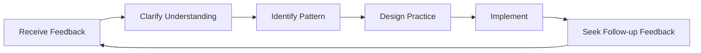

# Getting and Using Feedback

Feedback is one of the most powerful tools for development—and one of the most underused. This page teaches you how to actively seek feedback, receive it constructively, and turn it into actionable improvement.

---

## Why We Resist Feedback

Before learning to seek feedback, understand why it's hard:

### Ego Protection

Your brain treats criticism of your performance as a threat to your identity. This triggers defensive responses:
- Dismissing the feedback
- Finding reasons why the person is wrong
- Avoiding similar situations in the future

### Confirmation Bias

We naturally seek information that confirms what we already believe. If you think you're a good pointer, you'll notice your successful points and explain away the misses.

### The Growth Mindset Shift

::: tip Reframe Feedback
**Fixed mindset:** "Criticism means I'm flawed"
**Growth mindset:** "Feedback is information that helps me improve"

The difference isn't positivity—it's accuracy. Feedback is data, not judgment.
:::

---

## Sources of Objective Feedback

### 1. Quantitative Data

Numbers don't lie or soften the truth:

| Metric | What It Reveals |
|--------|-----------------|
| **Pointing accuracy %** | Technical baseline and trends |
| **First vs. late game accuracy** | Fatigue/pressure effects |
| **Shooting success rate** | By distance, target type, match situation |
| **Carreau percentage** | Risk-taking effectiveness |

### 2. Teammates

Your teammates see you in competition—when your self-perception is least accurate:

**What to ask:**
- "How do I seem to you when we're behind?"
- "What do you notice about my approach in close games?"
- "What's one thing I could do to be a better teammate?"

### 3. Opponents

Post-match conversations with trusted opponents can be revealing:

**What to ask:**
- "What were you trying to exploit in my game?"
- "Was there anything that surprised you about how I played?"

### 4. Coaches/Experienced Players

External expertise provides perspective you can't generate yourself:

**What to ask:**
- "What's the biggest gap between my potential and my current performance?"
- "What pattern do you see in my misses?"
- "What would you prioritize if you were coaching me?"

### 5. Video Analysis

The most objective mirror available. See [Video Analysis](/de/education/self-awareness/video) for detailed protocols.

---

## How to Ask for Feedback Effectively

### The SEEK Framework

**S - Specific**
Don't ask: "How did I play?"
Ask: "How did my pointing accuracy look in the third end when we were behind?"

**E - Examples**
Ask: "Can you give me a specific example?"
This forces concrete feedback instead of generalizations.

**E - Exploratory**
Approach with curiosity, not defense.
"I'm trying to understand my blind spots. What might I be missing?"

**K - Kind (to yourself)**
Remember: Seeking feedback is brave. You're doing hard work.

### Timing Matters

| When | Best For | Avoid |
|------|----------|-------|
| **Immediately after** | Specific technical observations | Emotional processing |
| **Next day** | Balanced perspective, patterns | If details have faded |
| **Video review** | Objective analysis | If it delays action too long |

---

## Receiving Feedback Without Defensiveness

When feedback arrives, your brain will want to defend. Here's how to override that:

### The 3-Second Rule

When you receive feedback, **wait 3 seconds before responding**. This gives your rational brain time to engage before your emotional brain reacts.

### The "Tell Me More" Technique

Instead of defending, say: "Tell me more about that."

This:
- Buys processing time
- Shows you value the input
- Often reveals the root insight

### Separate Reception from Evaluation

**Step 1:** Receive (just listen)
**Step 2:** Clarify (make sure you understand)
**Step 3:** Thank (acknowledge the gift)
**Step 4:** Evaluate (later, privately decide what to act on)

You don't have to agree with feedback immediately. You just have to receive it with openness.

---

## The Feedback Response Protocol

Use this when receiving feedback:

1. **"Thank you for telling me that."**
   - Genuine appreciation, even if the feedback stings

2. **"Can you give me a specific example?"**
   - Moves from general to actionable

3. **"What would you suggest I try?"**
   - Invites partnership in improvement

4. **"I'm going to think about that."**
   - Honest commitment without immediate agreement

---

## Turning Feedback into Action

Feedback without action is just uncomfortable conversation.

### The Feedback-to-Action Process

### Action Template

For each piece of actionable feedback:

| Element | Your Response |
|---------|---------------|
| **The Feedback** | (What was said) |
| **The Pattern** | (What recurring issue does this reveal?) |
| **The Action** | (What specific thing will you practice?) |
| **The Measure** | (How will you know if you've improved?) |
| **The Timeline** | (When will you reassess?) |

---

## Creating a Feedback Culture

### With Your Team

- **Normalize it:** Regular feedback becomes expected, not exceptional
- **Two-way street:** Give feedback to receive it comfortably
- **Timing agreements:** "Let's debrief after matches" vs. unsolicited criticism
- **Focus on specifics:** "I noticed X" is better than "You always Y"

### With Yourself

- **Weekly self-review:** Dedicated time to assess your week
- **Written reflection:** Writing creates clarity
- **Pattern tracking:** Look for recurring themes across multiple sources

---

## The Feedback-Resistant Player

If you recognize yourself in any of these, prioritize this work:

::: warning Signs of Feedback Resistance
- You can always explain why the feedback doesn't apply
- You seek feedback only from people who agree with you
- You feel attacked when receiving constructive input
- You avoid people who challenge your self-perception
- You rationalize poor results as external factors
:::

Breaking these patterns requires conscious effort—but the payoff is accelerated improvement.

---

## Related Content

- [The Self-Awareness Advantage](/de/education/self-awareness/) — Why self-knowledge matters
- [Video Analysis](/de/education/self-awareness/video) — Objective self-observation
- [Team Dynamics](/de/education/team-dynamics/) — Communication with teammates
- [Mental Strength](/de/education/mental-game/mental-strength/) — Handling difficult truths

