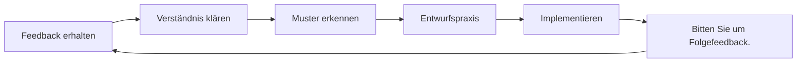

# Feedback erhalten und nutzen

Feedback ist eines der wirkungsvollsten Instrumente zur Weiterentwicklung – und gleichzeitig eines der am meisten unterschätzten. Diese Seite zeigt Ihnen, wie Sie aktiv Feedback einholen, konstruktiv annehmen und in konkrete Verbesserungen umsetzen können.

---

## Warum wir uns gegen Feedback wehren

Bevor man lernt, Feedback einzuholen, sollte man verstehen, warum es so schwer ist:

### Egoschutz

Ihr Gehirn behandelt Kritik an Ihrer Leistung als Bedrohung Ihrer Identität. Dies löst Abwehrreaktionen aus:
- Das Feedback ignorieren
- Gründe dafür finden, warum die Person falsch liegt
- Ähnliche Situationen in Zukunft vermeiden

### Bestätigungsfehler

Wir suchen naturgemäß nach Informationen, die unsere bestehenden Überzeugungen bestätigen. Wer sich für einen guten Indikator hält, achtet auf seine Treffer und erklärt die Fehlschläge einfach weg.

### Der Wandel hin zu einer Wachstumsmentalität

::: tip Feedback neu formulieren
**Starres Denken:** „Kritik bedeutet, dass ich fehlerhaft bin.“
**Wachstumsorientiertes Denken:** „Feedback ist Information, die mir hilft, mich zu verbessern.“

Der Unterschied liegt nicht in der Positivität, sondern in der Genauigkeit. Feedback sind Daten, keine Werturteile.
:::

---

## Quellen für objektives Feedback

### 1. Quantitative Daten

Zahlen lügen nicht und beschönigen die Wahrheit nicht:

| Metrisch | Was es offenbart |
|--------|-----------------|
| **Zielgenauigkeit in %** | Technische Grundlagen und Trends |
| **Genauigkeit im ersten Spielabschnitt vs. im späteren Spielverlauf** | Ermüdungs-/Druckeffekte |
| **Trefferquote beim Schießen** | Nach Entfernung, Zieltyp und Spielsituation |
| **Carreau-Prozentsatz** | Effektivität der Risikobereitschaft |

### 2. Teamkollegen

Deine Teamkollegen sehen dich im Wettkampf – wenn deine Selbstwahrnehmung am wenigsten zutrifft:

**Was Sie fragen sollten:**
- „Wie wirke ich auf dich, wenn wir zurückliegen?“
- „Was fällt Ihnen an meiner Herangehensweise in knappen Spielen auf?“
- &quot;Was könnte ich tun, um ein besserer Teamkollege zu sein?&quot;

### 3. Gegner

Gespräche nach dem Spiel mit vertrauten Gegnern können aufschlussreich sein:

**Was Sie fragen sollten:**
- „Was wollten Sie in meinem Spiel ausnutzen?“
- Gab es irgendetwas, das Sie an meiner Spielweise überrascht hat?

### 4. Trainer/Erfahrene Spieler

Externe Expertise bietet eine Perspektive, die man selbst nicht erzeugen kann:

**Was Sie fragen sollten:**
- „Wo liegt die größte Diskrepanz zwischen meinem Potenzial und meiner aktuellen Leistung?“
- „Welches Muster erkennen Sie bei meinen Fehlschüssen?“
- &quot;Was würdest du priorisieren, wenn du mich trainieren würdest?&quot;

### 5. Videoanalyse

Der objektivste Spiegel, der zur Verfügung steht. Ausführliche Protokolle finden Sie unter [Videoanalyse](/en/education/self-awareness/video).

---

## Wie man effektiv um Feedback bittet

### Das SEEK-Framework

**S - Spezifisch**
Frag nicht: „Wie habe ich gespielt?“
Frage: „Wie sah meine Treffsicherheit beim Zeigen im dritten Drittel aus, als wir zurücklagen?“

**E - Beispiele**
Fragen Sie: „Können Sie mir ein konkretes Beispiel nennen?“
Dies erzwingt konkretes Feedback anstelle von Verallgemeinerungen.

**E - Erkundungskurs**
Mit Neugierde herangehen, nicht mit Abwehr.
„Ich versuche, meine blinden Flecken zu erkennen. Was könnte mir entgehen?“

**K – Freundlich (zu sich selbst)**
Denk daran: Feedback einzuholen erfordert Mut. Du leistest harte Arbeit.

### Timing ist wichtig

| Wann | Am besten geeignet für | Vermeiden |
|------|----------|-------|
| **Unmittelbar danach** | Spezifische technische Beobachtungen | Emotionale Verarbeitung |
| **Nächster Tag** | Ausgewogene Perspektive, Muster | Wenn Details verblasst sind |
| **Videorezension** | Objektive Analyse | Wenn es das Handeln zu lange verzögert |

---

## Feedback annehmen, ohne sich zu verteidigen

Wenn Feedback eintrifft, versucht Ihr Gehirn, sich zu verteidigen. So können Sie das unterdrücken:

### Die 3-Sekunden-Regel

Wenn Sie Feedback erhalten, **warten Sie 3 Sekunden, bevor Sie antworten**. So hat Ihr rationales Denken Zeit, sich zu engagieren, bevor Ihr emotionales Denken reagiert.

### Die &quot;Erzähl mir mehr&quot;-Technik

Anstatt sich zu verteidigen, sagen Sie: „Erzählen Sie mir mehr darüber.“

Das:
- Bearbeitungszeit für Käufe
- Zeigt, dass Sie die Eingabe wertschätzen.
- Oft offenbart es die grundlegende Erkenntnis

### Getrennte Rezeption und Bewertung

**Schritt 1:** Empfangen (einfach zuhören)
**Schritt 2:** Klären (sicherstellen, dass Sie es verstanden haben)
**Schritt 3:** Bedanken Sie sich (würdigen Sie das Geschenk)
**Schritt 4:** Evaluieren (später privat entscheiden, welche Maßnahmen ergriffen werden sollen)

Man muss Feedback nicht sofort zustimmen. Man muss es nur offen annehmen.

---

## Das Feedback-Reaktionsprotokoll

Verwenden Sie dies, wenn Sie Feedback erhalten:

1. **„Vielen Dank, dass Sie mir das gesagt haben.“**
   - Aufrichtige Wertschätzung, auch wenn das Feedback schmerzt.

2. **Können Sie mir ein konkretes Beispiel nennen?**
   - Vom Allgemeinen zum Umsetzbaren

3. **Was würden Sie mir vorschlagen, auszuprobieren?**
   - Lädt zur Partnerschaft bei Verbesserungen ein

4. „Ich werde darüber nachdenken.“
   - Ehrliche Zusage ohne sofortige Vereinbarung

---

## Feedback in die Tat umsetzen

Feedback ohne Konsequenzen ist nichts weiter als ein unangenehmes Gespräch.

### Der Feedback-zu-Aktionsprozess

### Aktionsvorlage

Für jedes umsetzbare Feedback:

| Element | Ihre Antwort |
|---------|---------------|
| **Das Feedback** | (Was gesagt wurde) |
| **Das Muster** | (Welches wiederkehrende Problem offenbart dies?) |
| **Die Handlung** | (Was genau werden Sie üben?) |
| **Die Maßnahme** | (Woran werden Sie erkennen, ob Sie sich verbessert haben?) |
| **Die Zeitleiste** | (Wann werden Sie eine Neubewertung vornehmen?) |

---

## Schaffung einer Feedbackkultur

### Mit Ihrem Team

- **Normalisieren Sie es:** Regelmäßiges Feedback wird erwartet, nicht die Ausnahme.
- **Eine Straße mit Gegenseitigkeit:** Geben Sie Feedback, um es bequem zu erhalten.
- **Zeitliche Vereinbarungen:** „Lasst uns nach den Spielen eine Nachbesprechung durchführen“ vs. unaufgeforderte Kritik
- **Konzentriere dich auf Details:** „Mir ist X aufgefallen“ ist besser als „Du tust immer Y“.

### Mit sich selbst

- **Wöchentliche Selbstreflexion:** Nehmen Sie sich bewusst Zeit, um Ihre Woche zu reflektieren.
- **Schriftliche Reflexion:** Schreiben schafft Klarheit
- **Mustererkennung:** Suchen Sie in verschiedenen Quellen nach wiederkehrenden Themen.

---

## Der rückkopplungsresistente Spieler

Wenn Sie sich in einer dieser Beschreibungen wiedererkennen, sollten Sie dieser Arbeit Priorität einräumen:

::: warning Anzeichen für Feedback-Resistenz
- Sie können jederzeit erklären, warum das Feedback nicht zutrifft.
- Sie holen sich Feedback nur von Leuten, die Ihnen zustimmen.
- Sie fühlen sich angegriffen, wenn Sie konstruktives Feedback erhalten.
- Du meidest Menschen, die deine Selbstwahrnehmung in Frage stellen.
- Sie erklären schlechte Ergebnisse mit externen Faktoren.
:::

Das Durchbrechen dieser Muster erfordert bewusste Anstrengung – doch der Lohn dafür ist eine beschleunigte Verbesserung.

---

## Verwandte Inhalte

- [Der Vorteil der Selbstwahrnehmung](/en/education/self-awareness/) — Warum Selbsterkenntnis wichtig ist
- [Videoanalyse](/en/education/self-awareness/video) — Objektive Selbstbeobachtung
- [Teamdynamik](/en/education/team-dynamics/) — Kommunikation mit Teammitgliedern
- Mentale Stärke – Umgang mit schwierigen Wahrheiten

